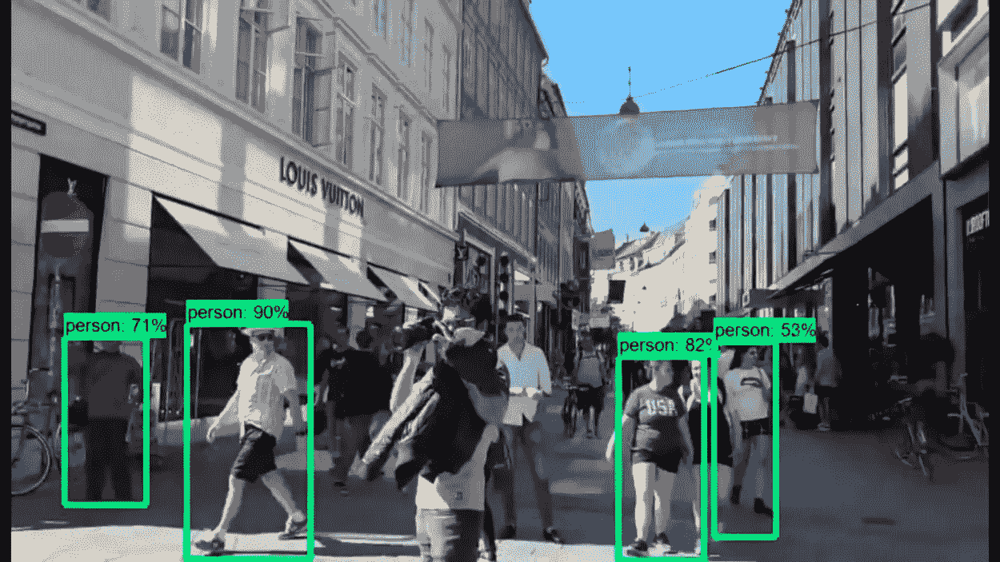

# 转储 Keras-ImageDataGenerator。开始使用 TensorFlow-tf.data(第 2 部分)

> 原文：<https://towardsdatascience.com/dump-keras-imagedatagenerator-start-using-tensorflow-tf-data-part-2-fba7cda81203?source=collection_archive---------39----------------------->

## 停止使用 Keras-ImageDataGenerator，因为…

本文是第 1 部分的后续。这里，我将使用`mobilenet`模型比较`tf.data`和`Keras.ImageDataGenerator`的实际训练时间。

 [## 转储 Keras-ImageDataGenerator。开始使用 TensorFlow-tf.data(第 1 部分)

### 停止使用 Keras-ImageDataGenerator，因为…

medium.com](https://medium.com/swlh/dump-keras-imagedatagenerator-start-using-tensorflow-tf-data-part-1-a30330bdbca9) 

作者照片。来自 [YouTube 视频](https://www.youtube.com/watch?v=uevE88wDWzg&t=92s)

在第 1 部分中，我展示了使用`tf.data`加载图像比使用`Keras.ImageDataGenerator`大约快 5 倍。考虑的数据集是[Kaggle-dogs _ and _ cats](https://www.kaggle.com/chetankv/dogs-cats-images)**(217 MB)**，具有分布在 **2 个不同类中的 **10000 张图像**。**

在第 2 部分中，我考虑了一个更大的数据集，它通常用于图像分类问题。所选择的数据集是[coco 2017](http://images.cocodataset.org/zips/train2017.zip)**(18gb)**，具有分布在 **80 个不同类别中的 **117266 张图像**。**COCO 数据集的各种版本都可以在[这个链接](https://cocodataset.org/#download)免费试用和测试。选择更大的 18 GB 数据集的原因是为了获得更好的比较结果。对于实际的图像分类问题，数据集甚至可以更大，从 100 GB(千兆字节)到几 TB(兆兆字节)。在我们的例子中，18 GB 的数据足以理解比较，因为在 TB 中使用数据集将显著增加训练时间和计算资源。

# 训练次数结果(提前)

以上结果是在使用 TensorFlow 2.x 的 GPU 版本的具有 16 GB RAM、2.80 GHz with Core i7 的工作站上进行比较的。考虑的数据集是[coco 2017](http://images.cocodataset.org/zips/train2017.zip)**(18 GB)**，具有分布在 **80 个不同类中的 **117266 个图像**。**

*   当使用`Keras.ImageDataGenerator`时，在使用 COCO2017 数据集的每个历元的训练期间，花费了大约 **58 分钟**。
*   将`tf.data`与变量`cache=True`一起使用时，程序崩溃。这个崩溃背后的原因是所考虑的数据集(**大小** **18 GB)比工作站的 RAM** 大。使用`cache=True`，程序开始将图像存储在 ram 中以便快速访问，当图像超过 RAM 时(在我们的例子中是 **16 GB)，程序就会崩溃。我在一个更小的数据集 [Kaggle- dogs_and_cats](https://www.kaggle.com/chetankv/dogs-cats-images) 上测试了相同的选项，效果很好。这表明，当考虑的数据集的大小大于 RAM 时，我们不应该使用`cache=True`选项。**
*   当使用带变量`cache=False`的`tf.data`时，程序需要大约 **23 分钟，**比`Keras.ImageDataGenerator`快 **2.5 倍。**
*   当使用`cache='some_path.tfcache'`时，在第一个时期`tf.data`将**在您的计算机目录中进行数据集/图像的转储**。这就是为什么它在第一个时期比较慢，大约需要 42 分钟。在连续的历元中，它不必在计算机上再次存储图像，而是在第一个历元中使用已经创建的转储，这最终加快了训练时间。在连续的历元期间，每个历元仅花费 **14 分钟。创建转储只有一次过程。对于超参数调谐，大约需要 **14 分钟，相比之下**需要`Keras`58 分钟，大约快 **4.14 倍。****

> 注意:使用`cache='some_path.tfcache'`时在内存中创建的转储大约为 90 GB，这实际上远远大于数据集的原始大小(18 GB)。我不能确切地理解这一点的原因，因为没有来自 TensorFlow 的关于这一点的明确文档。希望这是以后整理出来的 glich。
> 
> 对于像 [Kaggle- dogs_and_cats](https://www.kaggle.com/chetankv/dogs-cats-images) 这样只有 217 MB 的较小数据集，在速度或训练时间上与`tf.data`和`Keras`不会有明显的差异，因为 RAM 足够大，可以一次存储所有图像。

# 培训模型代码

这里显示了创建和训练模型的初始代码。预训练模型`mobilenet`用于执行迁移学习，预训练模型的基础层被冻结。

# 所有代码放在一起

在这里，我将第 1 部分和第 2 部分的代码结合起来。函数的注释和文档字符串将有助于理解代码。

# 结论

这篇文章表明，对于任何实际的图像分类问题，`tf.data`比`Keras.ImageDataGenerator`快倍 **2.5** `(when using cache=False)` **到 4.14** `(when using cache=**`**some_path.tfcache`)` **。我认为值得一试`tf.data`。**