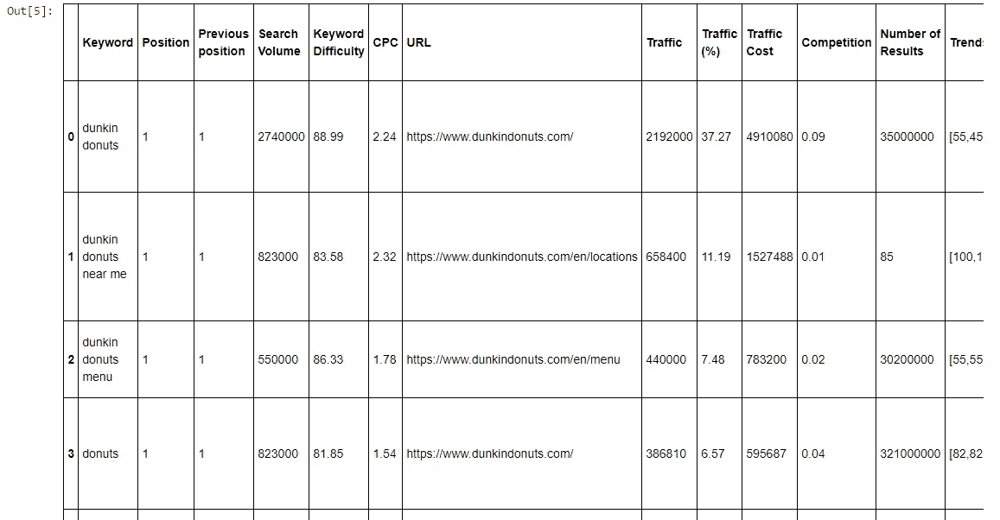
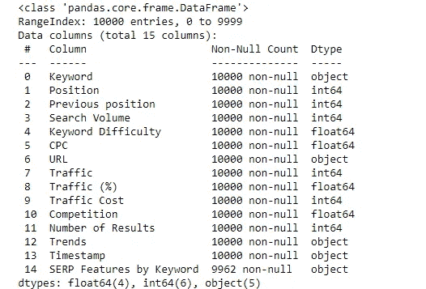
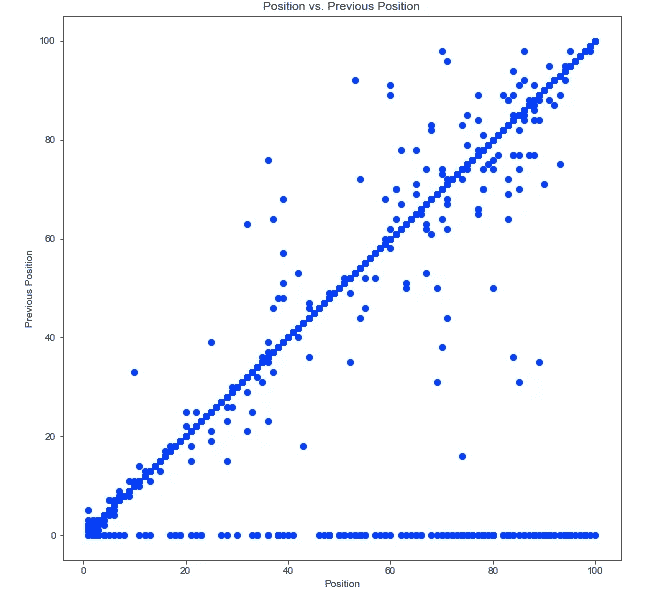
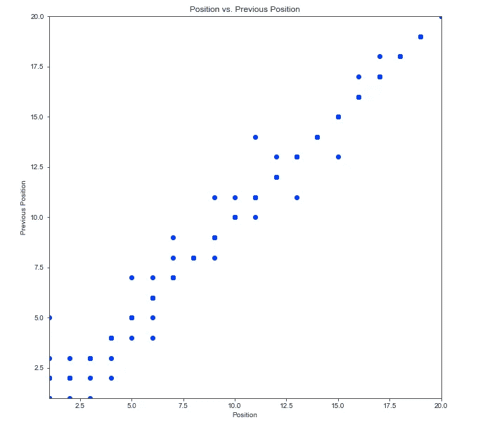
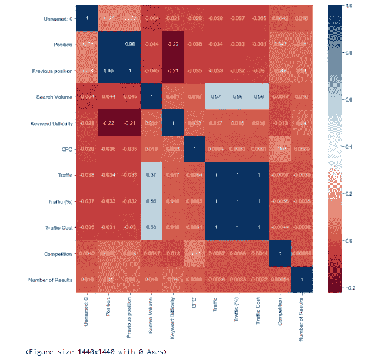
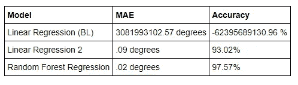

# 搜索引擎优化和营销的预测分析

> 原文：<https://towardsdatascience.com/dunkin-donuts-seo-project-in-python-967b6ce18de5?source=collection_archive---------29----------------------->

## 使用 Python 进行关键字研究


布雷特·乔丹在 [Unsplash](https://unsplash.com/s/photos/words?utm_source=unsplash&utm_medium=referral&utm_content=creditCopyText) 上的照片

# 概观

Dunkin donuts 的市场部(MD)注意到，在过去的 6 个月中，他们的一些关键词排名下降了。因此，他们正在进行一个新的 SEO 项目，专注于在谷歌上排名第二的关键词。为此，将使用训练数据来开发预测模型，以预测有可能为网站带来最大流量的关键词。这些关键词将在接下来的六个月里成为一个全面的 SEO 项目的重点。

通过将预测模型应用于训练数据，将利用数据科学方法来解决这一业务问题，训练数据将包括除第 2 页排名之外的所有关键词。然后，结果将被应用到第 2 页的排名，以确定最好的关键字集中。成功将取决于在一年内将关键字排名提高到谷歌的第一页。

# 数据

总经理可以从塞姆拉什获取邓金的 10000 条关键词记录。这些数据包括:

关键词

位置

以前的职位

搜索量

关键词难度

CPC

URL

交通

流量(%)

交通成本

竞争

# 方法

1.从 SEMRush 导出关键字数据

2.从数据中提取第二页排名作为应用程序。

3.将数据分成 80/20 个训练测试集。

4.执行 EDA 以了解数据

5.创建 Tableau 仪表板以显示 EDA

6.基于训练数据的训练预测模型。

7.评估测试数据的性能

8.应用于第二页等级数据

9.确定第二页的关键词，集中搜索引擎优化的努力

# 可交付成果

数据清理和 EDA 代码

模型拟合代码

EDA 的 Tableau 仪表板

描述建议的报告

# 数据争论

数据争论过程将包括以下步骤:

1.  加载必要的包
2.  加载数据
3.  查看数据和元数据
4.  删除不必要的列

```
**import** **pandas** **as** **pd**
**import** **matplotlib.pyplot** **as** **plt**
**import** **seaborn** **as** **sns**
**import** **datetime**
**import** **numpy** **as** **np***# setup* 
*#sns.set_style(style="whitegrid")*
sns.set_style('ticks')

*# display charts inline*
%matplotlib inline

*# to display all columns*
pd.set_option('display.max_columns', **None**)
*# setup* 
*#sns.set_style(style="whitegrid")*
sns.set_style('ticks')

*# display charts inline*
%matplotlib inline

*# to display all columns*
pd.set_optdf.head()
ion('display.max_columns', **None**)Data is available here: [https://github.com/meagvo/DunkinDonutsSEOproject/blob/master/dunkin.csv](https://github.com/meagvo/DunkinDonutsSEOproject/blob/master/dunkin.csv)*#load the data*
df=pd.read_csv('dunkin.csv')
*#look at the column names*
df.columns
```



```
*#metadata 15 columns 10000 records*

df.info()
*#missing data for SERP Features by Keyword, but this column will be dropped because it isn't relevant for the analysis*
```



# 删除不必要的列

我们对大多数列值感兴趣，但是有几个对当前的分析没有帮助。因此，我们将删除以下两列:

*   趋势
*   按关键字排序的 SERP 特征

```
*#drop two columns*
df.drop(df[['Trends', 'SERP Features by Keyword']], inplace=**True**, axis=1) 
```

**探索性数据分析**

df.describe()。T


# 可视化数据:散点图

```
plt.scatter(df['Position'], df['Previous position'])
plt.title("Position vs. Previous Position")
plt.xlabel('Position')
plt.ylabel("Previous Position")
plt.show()
```



从散点图可以清楚地看出，大多数位置与先前的位置相关，这意味着它们是稳定的。不过有一些看起来是排在 0 的，没什么意义。那一定意味着他们排不进前 100 位。因此，我们希望将重点放在前两个 SERPs 上。

# 让我们想象一下排在谷歌前 2 页的关键词/页面。

这些都是密切相关的。

```
plt.scatter(df['Position'], df['Previous position'])
plt.title("Position vs. Previous Position")
plt.xlabel('Position')
plt.ylabel("Previous Position")
plt.xlim(1, 20,)
plt.ylim(1, 20)
plt.show()
```



corr matrix = df . corr()SNS . heat map(corr matrix，annot= **True** ，cmap = ' RdBu ')PLT . fig(figsize =(20，20)) plt.show()



看起来流量、流量百分比和流量成本是共线的。因此，在分析中最好只包括其中一种方法。我们将分析流量原始指标。所以现在，我们将降低流量百分比和流量成本。

df.drop(columns=['Traffic (%)'，' Traffic Cost']，inplace= **True** )

# 基线模型

作为该预测模型的简单模型，我们选择了多元线性回归。这是一个概念上的基本模型，与其他预测模型相比，解释相对简单。此外，随着研究问题的发展，我们可以将该模型应用于其他感兴趣的目标变量。'

在这个多元回归模型中，我们必须对数据进行预处理。对于连续变量，这意味着分别通过平均值和标准偏差对数据进行居中和缩放，但对于分类数据，这包括创建虚拟变量。

然后我们去掉包含任意日期的变量，比如时间戳。这在回归环境中很难处理。

关键字列将被分隔，因为它是标签列。这将从预处理数据中删除，因为它不会输入到回归模型中。

```
df1=df.drop(columns=’Keyword’) keyword=df[‘Keyword’] df1.head() df1.drop(columns=’Unnamed: 0') 
df1.columns
continuous_var=df1.drop(columns='URL')

continuous_var.drop(columns='Unnamed: 0', inplace=**True**)
continuous_var.head()

cat_var=['URL']
```

# 预处理

连续变量将被缩放和居中，因为当所有变量具有相似的平均值和方差时，许多预测模型表现更好。此外，我们确保没有丢失的行或列，这是我们已经确定的。接下来，自变量被放入数组(x)中，目标变量(位置)被放入第二个数组(y)中。

```
scaler = StandardScaler()
df_scaled = pd.DataFrame(scaler.fit_transform(continuous_var))
df_scaled.columns
df_scaled.head()
df_scaled.columns=[ 'Position', 'Previous position', 'Search Volume',
       'Keyword Difficulty', 'CPC', 'Traffic', 'Competition',
       'Number of Results']
df_scaled['URL'] = df1[cat_var]

df_scaled.head() df_new = pd.get_dummies(df_scaled,dummy_na=**True**) X=df_new.drop(columns='Position') y=df_new['Position']
```

# 训练和测试模型

接下来，我们将数据分为训练集和测试集。训练集将用于交叉验证模型的超参数，测试集将用于验证模型。

首先，我将使用默认参数创建一个模型。

```
*#Split into test/train*
X_train, X_test, y_train, y_test= train_test_split(X, y, test_size=0.33, random_state=42)
*# with sklearn*
regr = LinearRegression()
regr.fit(X_train, y_train)
y_pred=regr.predict(X_test)
explained_variance_score(y_test, y_pred) 
```

看起来 URL 列扭曲了模型。现在让我们尝试删除 URL 列并再次运行模型。

```
df_scaled.drop(columns='URL', inplace=**True**)

X2=df_scaled.drop(columns='Position')
 y2=df_scaled['Position']
*#Split into test/train*
X_train2, X_test2, y_train2, y_test2= train_test_split(X2, y2, test_size=0.2, random_state=42)
*# with sklearn*
regr2 = LinearRegression()
regr2.fit(X_train2, y_train2)

print('Intercept: **\n**', regr2.intercept_)
print('Coefficients: **\n**', regr2.coef_)
y_pred2=regr2.predict(X_test2)
explained_variance_score(y_test2, y_pred2)*# Calculate the absolute errors*
errors = abs(y_pred2 - y_test2)
*# Print out the mean absolute error (mae)*
print('Mean Absolute Error:', round(np.mean(errors), 2), 'degrees.')
*# Calculate mean absolute percentage error (MAPE)*
mape = 100 * (errors / y_test2)
*# Calculate and display accuracy*
accuracy = 100 - np.mean(mape)
print('Accuracy:', round(accuracy, 2), '%.')
```

这大大改进了模型。但是我们有可能做得更好。让我们试试随机森林回归。

```
*# Import the model we are using* 
**from** **sklearn.ensemble** **import** RandomForestRegressor 
*# Instantiate model with 1000 decision trees* rf = RandomForestRegressor(n_estimators = 1000, random_state = 42) *# Train the model on training data* rf.fit(X_train2, y_train2); *# Use the forest's predict method on the test data*
predictions = rf.predict(X_test2)
*# Calculate the absolute errors*
errors = abs(predictions - y_test2)
*# Print out the mean absolute error (mae)*
print('Mean Absolute Error:', round(np.mean(errors), 2), 'degrees.')
*# Calculate mean absolute percentage error (MAPE)*
mape = 100 * (errors / y_test2)
*# Calculate and display accuracy*
accuracy = 100 - np.mean(mape)
print('Accuracy:', round(accuracy, 2), '%.')
```



# 分析

获胜的模型是随机森林回归，因为它具有最低的 MAE 和最高的准确性。它还删除了 URL 列，该列似乎扭曲了第一次回归的结果。这将允许我们预测 Dunkin Donuts 的新关键字的位置。下一步是继续 Answerthepublic 和 Google Keyword Planner，提取相关的关键词，然后将信息插入这个模型，以确定哪个有可能在 Dunkin 中排名最高。然后，MD 可以通过全面的 SEO 活动来重点推广该关键词。