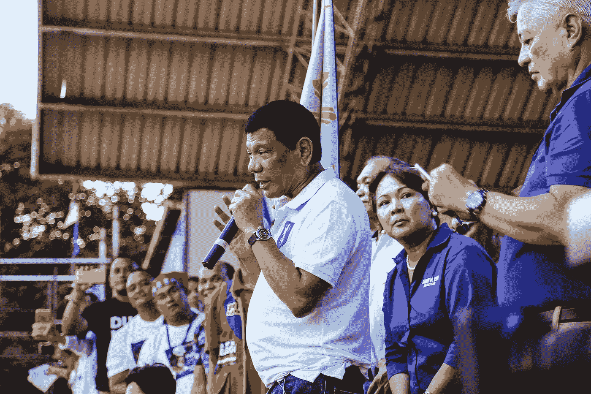
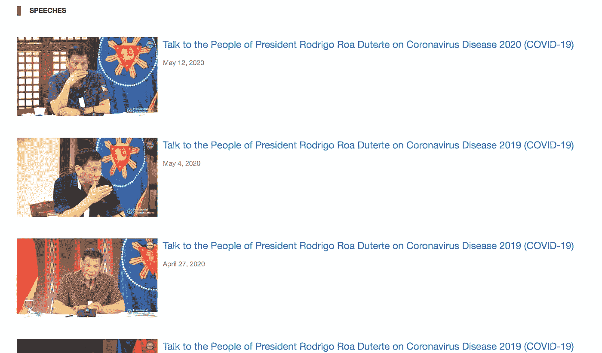

# 杜特尔特演讲的自然语言处理分析

> 原文：<https://towardsdatascience.com/duterte-speech-analysis-f9e13f695558?source=collection_archive---------47----------------------->

## 第一部分:搜集杜特尔特总统的演讲



罗德里戈·杜特尔特总统。照片由[丹尼兹·福塔兰](https://www.pexels.com/@denniz-futalan-339724)在[像素](https://www.pexels.com/photo/rodrigo-duterte-on-stage-1394506/)上拍摄

鉴于不同国家新冠肺炎的现状，各国政府加紧解决疫情问题的紧迫性进一步提高。菲律宾的情况也没有什么不同，因为罗德里戈·杜特尔特总统向菲律宾人民发表新闻发布会的频率已经上升。这启发了我去做一个个人项目，用自然语言处理(NLP)来分析他多年来的演讲。

当然，在我分析他的演讲之前，我需要先实际收集它们。这是杜特尔特演讲分析的 **Part 1** ，将重点刮杜特尔特的演讲。本系列的后续文章将集中使用 NLP 来分析它们。对于我编写的代码，请查看我的 [GitHub 库](https://github.com/daniddelrio/duterte-speech-analysis)——尽管我承认我的代码在这里有点乱——如果你有任何意见或建议，请留下。最后，我还将更新我的自述文件，说明如何运行 Python 程序。

对我来说幸运的是，该国的总统通信运营办公室(PCOO)在他们的网站上发布了他的演讲[，至少到某一点为止(页面显示它有 31 页，但如果你浏览超过某一页码，它会返回一个“找不到页面”的错误)。因此，我收集的演讲仅从 2020 年到 2018 年。](https://pcoo.gov.ph/presidential-speech/)

对于演讲的抓取，我主要使用了`BeautifulSoup4`和`requests` Python 库，同时还使用了`pandas`来构建数据集，`python-dotenv`用于环境变量，以及一些用于从 pdf 中提取文本的库。


好喝的汤。由[美食因素](https://www.pexels.com/@foodie-factor-162291)在[像素](https://www.pexels.com/photo/appetizer-bowl-bread-breakfast-539451/)上拍摄的照片

## 抓取 PCOO 网站

最初，当我试图使用`requests`库向 PCOO 网站发出 GET 请求时，由于某种原因，我一直收到一个连接错误。经过进一步的研究，我发现这是因为一些网站，包括 PCOO 的，普遍*不喜欢*机器人爬满它们。你可以通过访问他们的 [robots.txt](http://www.gov.ph/robots.txt) 看到这一点，显示了以下针对*禁用*机器人的设置。

```
User-Agent: *
Disallow:
```

因此，我不得不执行几个额外的步骤，作为克服针对*机器人*的设置的措施，以及为了[防止我的 IP 地址被列入黑名单](https://www.scrapehero.com/how-to-prevent-getting-blacklisted-while-scraping/)的预防措施。首先，我必须将我的*机器人程序*伪装成人类，方法是**为我的每个请求附加一个** [**用户代理**](https://developer.mozilla.org/en-US/docs/Web/HTTP/Headers/User-Agent) ，我将它存储在我的`.env`文件中(因此我安装了`python-dotenv`)。其次，如果一个 IP 地址以极快的速度向一个网站发出 GET 请求，那就太明显了，所以我使用`time.sleep`将每个请求分散 15 秒，让它看起来更人性化。不可否认，这增加了刮擦时间，但是稍后我会解释我是如何大大加速这个过程的。

Python 刮刀的主程序。这个主程序以每页的速度进行抓取。

上面的片段显示了在`01_scraper.py`文件中找到的主程序的一部分，它抓取了网站每页的演讲。每页包含 20 篇演讲，在我的程序中，我将其中的每一篇都称为`row`。每篇演讲都会将你带到演讲详情页面([示例](https://pcoo.gov.ph/presidential-speech/talk-to-the-people-of-president-rodrigo-roa-duterte-on-coronavirus-disease-2020-covid-19/))，其中包含音频、完整的文字记录，可能还有新闻发布会的视频。完整的文稿会将您重定向到一个 PDF 格式的演讲文稿([示例](https://pcoo.gov.ph/presidential-speech/talk-to-the-people-of-president-rodrigo-roa-duterte-on-coronavirus-disease-2020-covid-19/))。



[PCOO 网站](https://pcoo.gov.ph/presidential-speech/)发言截图

我在我的`scraper_functions.py`中创建了一个名为`extract_page`的函数，它使用上述过程处理每一行，并返回一个包含标题、演讲日期和提取文本的字典。

下一个问题是，我如何从 pdf 中提取文本？

## PDF 提取:使用哪个库？

如果我想尝试更多的 PDF 库，为了减少抓取时间，我将 PDF 保存在我的存储库中。这样，我就不用再费力地浏览 PCOO 网站了。之后，我找到了四个用于从 pdf 中提取文本的 Python 库:

1.  [PyPDF2](https://pythonhosted.org/PyPDF2/)
2.  [slate3k](https://github.com/TakesxiSximada/slate3k)
3.  [蒂卡](https://github.com/chrismattmann/tika-python)
4.  [pdf 木材](https://github.com/jsvine/pdfplumber)

最初，我用的是`PyPDF2`，但对于一些演讲，它只能提取空的新行，所以它会以类似`\n\n\n\n\n\n\n\n`的东西结束。因此，我使用 regex 为创建了一个函数来检查提取的文本是否返回一个没有单词的字符串。如果函数返回了`True`，那么我使用`slate3k`来提取该语音。尽管如此，这个图书馆有时还是会有错误的结果，比如完全遗漏了演讲的某些部分，并且奇怪地将一些演讲的文本中的每个字母隔开。尽管如此，我还是使用`PyPDF2`和`slate3k`将所有结果编译成一个`csv`。

接下来，我试用了`tika`，因为我在试图分析时，对之前的结果太失望了，它的效果*非常好*。事实上太漂亮了，以至于我没有机会试用`PDFPlumber`(所以如果你以前用过它，一定要让我知道它是否有同样的功能！).在提取所有内容时没有发现错误，所以使用这个库的过程非常顺利。我已经决定在我的分析中使用`tika`结果，而不是其他三个包。

从 pdf 中提取文本的功能

## 多重处理

我在上面提到过，每个演讲有两个抓取阶段:演讲详情页面和 PDF 文稿页面，总计每个演讲超过 30 秒的抓取。鉴于每页有 20 篇演讲稿，我们要花 10 多分钟(加上另外 15 秒来抓取页面本身)才能提取一页中的所有演讲稿。大约有 21 个有效页面，所以理论上总共需要 210 分钟或者大约 3.5 小时来提取它们。然而，实际上我花了大约一周的时间来完成刮擦，因为在使用`PyPDF2`和`slate3k`时出现了许多错误。

这让我探索[多重处理](https://docs.python.org/3/library/multiprocessing.html)来加速整个过程，而不是使用`tika`作为我的 PDF 提取器，并且它工作*奇迹*。

多重处理程序

由于我在第一次试运行时无法在本地保存 pdf，我不得不重新开始整个抓取过程。但是有了多重处理，我可以让多个工作人员同时处理同一组数据(在这种情况下，每页 20 篇演讲)，而不是必须依次处理每篇演讲。

使用代表工作进程池的`Pool`对象，我能够将数据(每页 20 行数据)映射到工作进程，工作进程同时运行`extract_page`功能。在所有的工作完成之后，由函数返回的 20 个字典的列表被附加到正在工作的`pandas`数据帧中。我还包含了一个文本文件，用于记录我处理的每个演讲(我在第一次试运行时也是这样做的)。

我用我的`scrape_logs.txt`比较了第一次和第二次试运行时抓取一整页所用的总时间，差异**明显**。对于第一次试运行，完成一个完整的页面需要 13-20 分钟，而我的第二次涉及多处理的试运行只需要 4-5 分钟。这也要感谢`tika`库的顺利运行，我在提取文本时没有遇到任何错误(尽管我确实遇到了这个与多重处理相关的奇怪的递归限制错误，我通过添加`sys.recursionlimit(10000)`纠正了这个错误)。总的来说，多重处理试运行只持续了大约 1.5 小时！

我对 PDF 提取本身也很满意，看到使用`tika`获得的文本中只有微不足道的错误。因此，我选择不再继续进行`PDFPlumber`了。


工人的效率！由[山](https://www.pexels.com/@fauxels)在[山](https://www.pexels.com/photo/photo-of-people-leaning-on-wooden-table-3183183/)拍摄的照片

总的来说，我成功地抓取了 PCOO 网站，以便收集杜特尔特的演讲，并将它们汇编成一个`csv`文件，通过整合多重处理进一步加快了整个过程。

对于第 2 部分(可能还有第 3 部分)，我将尝试分析我使用 NLTK 和 TF-IDF/N-gram 等 NLP 工具收集的数据。同样，请随意浏览我的 [Github 库](https://github.com/daniddelrio/duterte-speech-analysis)，如果您有任何意见或建议，请在下面留下！我将非常感激。