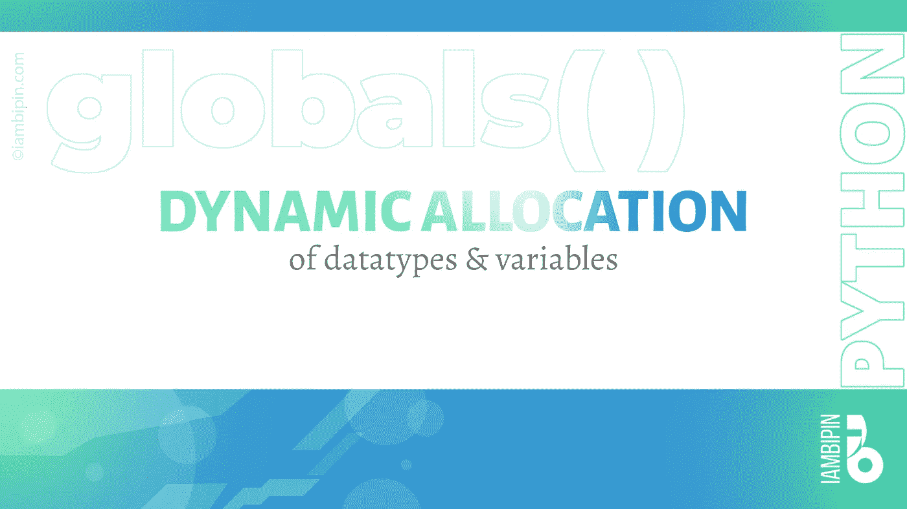
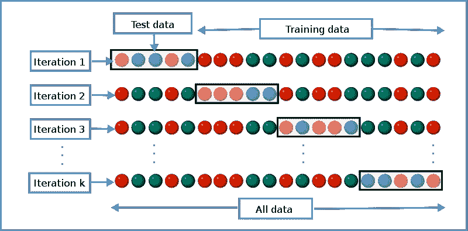
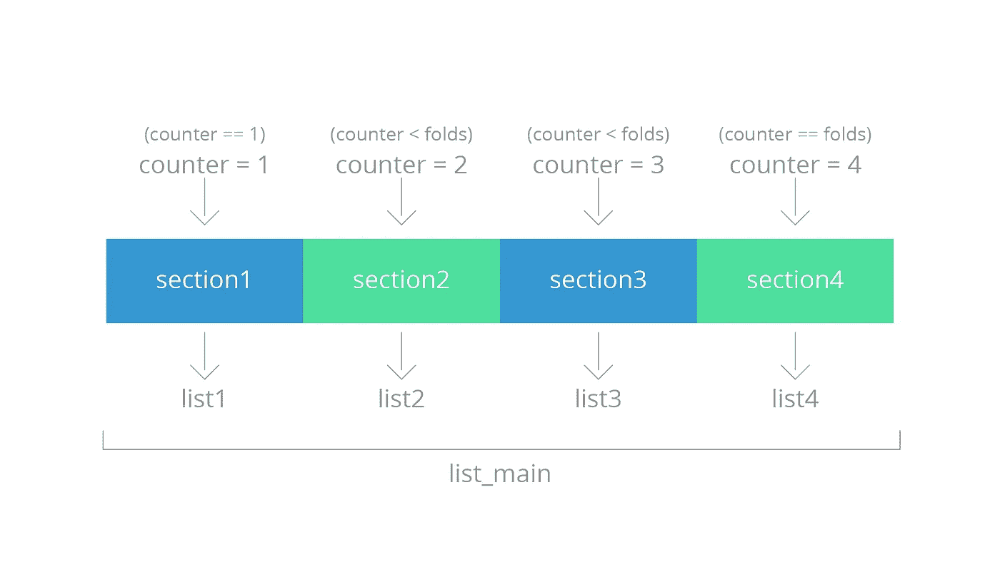

# Python 中数据类型和变量的动态分配

> 原文：<https://towardsdatascience.com/dynamic-allocation-of-data-types-and-variables-in-python-1e9d259149d2?source=collection_archive---------42----------------------->

## 数据科学/ Python 编程语言

## 让我们看看如何在 Python 中动态分配数据类型和变量，同时遍历一个循环。



假设你有一个包含 10 个元素的列表(list_main)。你必须把它分成三部分。第一部分分配给 list1，第二部分分配给 list2，第三部分分配给 list3。列表的这种划分或分割类似于 K 重交叉验证。对于外行来说，交叉验证是一个重新采样的过程，用来评估预测模型在实践中的准确性。在 K-fold 交叉验证中，数据集被分为训练数据(通常为 80%)和测试数据(通常为 20%，并将保持不可见的数据)。训练数据再次被分成 k 倍或分区，这又被认为是训练数据和验证数据。该模型将在训练数据上被训练，并且该模型的验证将使用验证数据来完成。



[古佛索瓦](https://commons.wikimedia.org/wiki/User:Gufosowa)

下面的代码将列表分成 3 个分区或部分，并将每个部分的元素分配给一个列表。

```
list_main = [1, 2, 3, 4, 5, 6, 7, 8, 9, 10]
folds = 3
section = int(len(list_main)/folds)
start_index = 0
end_index = 0
counter = 1for i in range(folds):
    if counter == 1:
        end_index += section
        list1 = list_main[start_index:end_index]
        counter += 1
    elif counter == folds:
        list3 = list_main[end_index: ]
        counter += 1
    elif counter < folds:
        start_index = end_index
        end_index += section
        list2 = list_main[start_index:end_index]
        counter += 1
print(f'List1: {list1}')
print(f'List2: {list2}')
print(f'List3: {list3}')list1 = [1, 2, 3]
list2 = [4, 5, 6]
list3 = [7, 8, 9, 10]
```

输出:

```
List1: [1, 2, 3]
List2: [4, 5, 6]
List3: [7, 8, 9, 10]
```

但是，代码不是通用的，更像是硬编码类型。例如，如果 list_main 的划分(折叠)数量增加到 4，则需要另一个列表(list4)来存储列表元素。如果增加到 6 个，则总共需要 6 个列表。为了适应基于分区数量的变化，需要更改代码。具体来说，需要分配新的列表。然而，这导致了更多的复杂性和混乱。例如，如果 folds=4，那么第二个分区和第三个分区在上面的代码中具有相同的条件(计数器< folds).



©iambipin

It would have been better if we write a generic code that can allocate lists as the number of folds increases or decreases. The globals() function in Python made the seemingly impossible job possible. It returns the global symbol table as a dictionary.

```
print(globals()){'__name__': '__main__', '__doc__': None, '__package__': None, '__loader__': <_frozen_importlib_external.SourceFileLoader object at 0x02A8C2D0>, '__spec__': None, '__annotations__': {}, '__builtins__': <module 'builtins' (built-in)>, '__file__': 'demo_ref_globals.py', '__cached__': None, 'x'_ {...}}
```

The modified code:

The output:

```
Enter the no. of folds: 5
List 0: [1, 2]
List 1: [3, 4]
List 2: [5, 6]
List 3: [7, 8]
List 4: [9, 10]
```

You can do this dynamic allocation(frankly speaking, I don’t know the appropriate term for the allotment of data types)with other data types like variables, tuple, set, etc. You can find the codes [这里是](https://github.com/pbipin/dynamic_allocation_lists.git))。

我们都在经历艰难时期。不确定性笼罩着未来。然而，每片乌云都有一线光明。疫情对地球的治愈程度超过了环保主义者的任何其他任务。所以我忍不住分享了我在 WhatsApp 上收到的朋友转发的这个很棒的迷因。我真的想感谢这个迷因的未知创造者，感谢他的创造力和对我们生活的世界的残酷现实的描绘。


来源:互联网(来源不明)

当世界正一瘸一拐地走过一个流行病已经达到巨大规模的前所未有的时代时，我们人类别无选择，只能求助于社交距离(每当我们冒险外出寻找必需品时)并呆在家里。当你处于自我隔离状态时，提升你的技能，学习新的东西。希望你能学到新的东西。编码快乐！！！