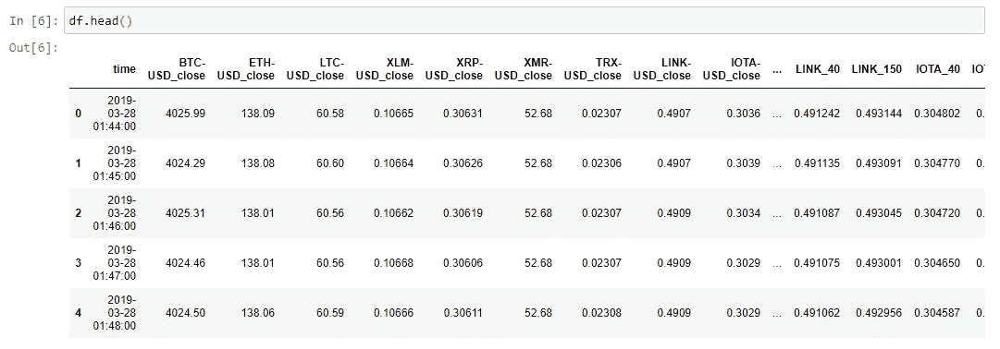

# 动态加密货币交易回溯测试平台——Python

> 原文：<https://towardsdatascience.com/dynamic-cryptocurrency-trading-backtesting-platform-python-219dfcd7421e?source=collection_archive---------18----------------------->

## 你的交易策略盈利了吗？观看 YouTube 系列:[https://www.youtube.com/watch?v=PZDFXGIAm2g&t = 953s](https://www.youtube.com/playlist?list=PLkYhK7LiOk0MPp44WMJMnQ4pBknK0Khli)


allthestock.com

我最近对加密货币日交易非常感兴趣。而在网上快速搜索会返回一系列不同的指标和交易策略，比如均线/均线交叉，RSI 策略，成交量平衡等等。我发现自己从来没有找到一个资源来回答这个问题:“嗯，这真的有用吗？”。坦率地说，不经过数百次甚至数千次迭代测试策略，光看图表是不可能知道这个问题的答案的；对一个人来说，这是一项繁重的任务。我看过其他人的视频和文章，他们试图用手进行回溯测试，点击，输入，计算他们预定的策略所决定的买卖。在某些情况下，只是为了在数小时的回溯测试后找到问题的答案:“不，这个策略行不通。到下一个。”其他更具编程性的回溯测试方法可以加速这个过程，比如 TradingView pine 编辑器，或者一个基本的 python 脚本；但是，如果你想动态地改变止损/止盈水平、你选择交易的加密货币或策略本身的细节，该怎么办呢？回答这些问题需要对简单的回溯测试脚本进行耗时的修改。由于对加密货币交易的最初兴趣，我决定需要一个更好的平台，这个平台在网上任何地方都找不到(我可以免费找到)，它将允许我动态迭代任何策略中激起我好奇心的任何更改。我决定学习更多关于动态 python 编程和币安 API 的知识，最终创建一个工具，帮助我这个初学 python 程序员和交易员回答互联网上每个“加密货币交易策略”帖子最前沿的这些问题。

下面是一个交易环境，在这个环境中，所有可能的交易策略都可以以非常动态的方式进行测试，即使是初级 python 程序员也可以创建和回测他们自己的交易想法，并最终给出他们问题的答案。利用该环境并实现您自己的想法的唯一先决知识是:对 python 结构(如 for 循环和 if 语句)的基本理解，对 pandas 的足够了解，以便从数据帧的正确列/索引位置获取适当的价格数据，以及对面向对象编程的潜在低级理解，这取决于您的策略的复杂性。

# **收集数据**

首先，读入数据。在这个脚本中，我们利用了币安 API，该 API 允许从交易所上市的大量加密货币中收集数据。给出的示例是一个单独的脚本，它读取从 2019 年 3 月 28 日到 2020 年 6 月 1 日 12 种不同加密货币的每分钟价格变化，总共有 618，290 个 12 种加密货币的价格实例，结果是一个 211 MB 的数据帧(这可以扩展，但需要一点耐心)。在我的机器上，从币安 API 读取这个数据大约需要。5 个小时完成，但只要简单地写入 csv，就可以在将来使用该脚本时几乎立即检索到。

关于数据读取的一些值得注意的事情:

1.  要访问币安 API，只需从命令行安装币安客户端。其他依赖项安装在它们各自的导入行上进行注释。
2.  币安客户要求 API 密钥，这些只是实时向币安交易所发送交易订单所必需的，而不是读取数据所必需的。我保留了原来的格式，以防这是任何读者都想要的用例。
3.  在收集了每个硬币的数据后，我们让脚本休眠 60 秒。这是为了防止币安 API 因为我们要求太多太快的数据而把我们踢出去。我没有遇到过这种格式的问题，但如果遇到错误，这个时间可能要增加。
4.  此处包含一个简单的移动平均函数，以展示如何从价格数据中设计功能并添加到数据框架中。这可以是您选择的自定义函数，也可以是可以在网上找到的普通指示器的函数，如下所示。
5.  体积数据也是可用的，但在本例中没有使用。如果感兴趣，请将其添加到第 32 行。
6.  csv 文件的自定义命名可以在第 72 行的引号中进行编辑。



从币安 API 读取的示例数据

太好了，现在我们有了一个大型加密货币价格数据集。在我们进入交易环境之前，让我们创建一个简单的内存类，它允许我们存储每个回溯测试的信息。

# **内存**

这个类非常简单明了；一个简单的内存对象，允许我们添加买/卖动作，也可以在每集之后清除内存。

现在我们有了数据和内存对象，让我们进入交易环境。

我们的环境接受两个参数:我们刚刚创建的数据框架以及您希望包含在回溯测试过程中的货币比率(例如“BTC”、“LTC”等。).

我们的环境也有两个方法:reset()和 step()。

# **Env.reset()方法**

这是另一个几乎不需要解释的项目:它只是将交易环境重置为默认状态。这样做的目的是在运行多集回溯测试时，我们将在每集之后调用 env.reset()来重置所有局部变量，如硬币余额、该集数据帧的索引位置、跟踪特定策略可能需要的任何变量，以及可能对日志记录有用的任何其他信息。环境的默认状态是美元余额为 1.0，每种加密货币的余额为 0.0。关于 reset()方法的一些重要注意事项:

1.  请注意，每次重置都会抓取主数据帧的一小部分，并将其称为“episode_df”，而不是在回测期间遍历全部 600，000 多个数据实例。这是每集对策略进行回溯测试的时间间隔。本集数据帧的持续时间可使用常量分钟/集或天/集来指定。在这个例子中，我们使用 1 天或 1440 分钟的剧集长度。
2.  在初始化环境时调用 reset()方法(在 __init__)方法。这将在第一次调用 Env 对象时设置所有环境变量。

# **Env.step()方法**

阶梯方法是神奇的地方。我将把这个方法分为两部分:实施交易策略和计算业绩指标。

**战略**

在这个例子中，我没有使用你在深入的技术分析讨论中可能遇到的更复杂的交易策略，而是揭穿了我们在网上其他地方看到的一个常见策略的功效:移动平均线交叉策略。如果你不熟悉，这个思路的大意是，当一条短窗口均线穿越到一条长窗口均线上方→买入；而当短窗口均线穿越回长窗口均线下方→卖出。

现在，我不确定是否有人相信这个策略真的有效(在某些情况下可能有效)，但是为了演示回溯测试环境，让我们考虑一下这个策略(并且因为实现更复杂的策略会消除一些修补自己想法的乐趣)。如下面的代码所示，我们有两个关键的 if 语句，它们检查移动平均线的变化，并决定是记录买入还是卖出(或者都不记录)。需要熟悉两个局部变量: *money_in* 和 *to_buy。*这些是字符串变量，记录你的资金目前存放在哪里，以及当开始买入时，资金将流向哪里。一旦进入买卖 *if* 语句，这些变量就会相应地更新；因此，你的余额字典会根据你所持股票的当前价格进行更新。请注意，在每次买入/卖出时，各自的余额会乘以交易费用乘数，在本例中为 0.99925。当使用 BNB 代币(币安交易所提供的最便宜的选项)支付费用时，该值基于 0.075%的币安交易费，但可以根据您的特定交易所的交易费而改变。

**性能指标**

我们将使用两个指标来评估回溯测试期间的策略表现:回溯测试期间之后的资产净值和回溯测试期间的平均市场变化。您的余额净值是通过根据您持有的货币的现价和您持有的货币数量将您的持有量转换为美元来计算的。区间的平均市场变化是通过在一集的开始和结束时取所有选定货币的价格的平均值，并相应地除以这些值来计算的。根据这些指标，最终目标是以比你持有市场平均股份时更高的净值结束这一集(显然，比你开始时有更高的净值)。

# **执行环境**

在这里，我们一次一分钟地遍历环境，按照策略的指示进行购买和销售，并跟踪沿途的性能指标，以输出到日志中。

# **我们表现如何？**

嗯，正如之前由于策略的简单性所预示的，不是很好。如图所示，在一个平均每天增长 0.2%的市场中，我们预计这一策略的实施将导致平均每天 4%的净值下降(哎哟)。但是，除了这一点之外，日志中还显示，我们现在有一个快速、动态、易于阅读的策略输出，该策略在 2019 年 3 月至 2020 年 6 月之间经过 100 多个随机选择的 1 天时间间隔的回溯测试，以及每次交易的买入/卖出信息。现在，你的问题有了一些答案！

```
episode: 96
['Buy BTC: 5255.99', 'Sell BTC: 5227.76', 'Buy ETH: 155.86', 'Sell ETH: 155.41', 'Buy LTC: 67.46', 'Sell LTC: 67.45', 'Buy IOTA: 0.3167', 'Sell IOTA: 0.3176', 'Buy IOTA: 0.3167', 'Sell IOTA: 0.3151', 'Buy LTC: 67.67', 'Sell LTC: 67.42', 'Buy XMR: 61.38', 'Sell XMR: 61.59', 'Buy EOS: 4.5225', 'Sell EOS: 4.5076', 'Buy ZRX: 0.2743', 'Sell ZRX: 0.2723', 'Buy ETH: 155.2', 'Sell ETH: 156.98', 'Buy XLM: 0.09605', 'Sell XLM: 0.09597', 'Buy LINK: 0.439', 'Sell LINK: 0.439', 'Buy LINK: 0.4418', 'Sell LINK: 0.4672', 'Buy BTC: 5308.08', 'Sell BTC: 5304.94', 'Buy XLM: 0.09966', 'Sell XLM: 0.09965', 'Buy XMR: 62.29', 'Sell XMR: 62.22', 'Buy TRX: 0.02312', 'Sell TRX: 0.02307', 'Buy LTC: 72.82']

interval: 2019-04-29 12:25:00 - 2019-04-30 12:26:00
net worth after 1 day(s): 1.0221672847272814
average market change: 0.988959335567251

episode: 99
['Buy XRP: 0.30917', 'Sell XRP: 0.31171', 'Buy BTC: 9641.57', 'Sell BTC: 9635.6', 'Buy TRX: 0.02252', 'Sell TRX: 0.02238', 'Buy XLM: 0.08462', 'Sell XLM: 0.08457', 'Buy LINK: 2.2158', 'Sell LINK: 2.211', 'Buy EOS: 4.2811', 'Sell EOS: 4.2527', 'Buy ETH: 212.07', 'Sell ETH: 211.26', 'Buy IOTA: 0.2835', 'Sell IOTA: 0.2833', 'Buy XLM: 0.08375', 'Sell XLM: 0.08317999999999999', 'Buy LTC: 89.2', 'Sell LTC: 89.34', 'Buy XMR: 79.39', 'Sell XMR: 79.15', 'Buy BTC: 9570.01', 'Sell BTC: 9548.48', 'Buy LINK: 2.1819', 'Sell LINK: 2.1595', 'Buy LTC: 89.33', 'Sell LTC: 89.4', 'Buy EOS: 4.1803', 'Sell EOS: 4.1903', 'Buy BTC: 9540.07', 'Sell BTC: 9559.46', 'Buy ETH: 210.83', 'Sell ETH: 208.78', 'Buy LTC: 90.68', 'Sell LTC: 90.39', 'Buy LTC: 90.76', 'Sell LTC: 90.44', 'Buy XRP: 0.31008', 'Sell XRP: 0.30991', 'Buy BTC: 9504.64', 'Sell BTC: 9490.15', 'Buy ETH: 209.7', 'Sell ETH: 209.77', 'Buy IOTA: 0.2853']

interval: 2019-07-28 16:39:00 - 2019-07-29 16:40:00
net worth after 1 day(s): 0.9218801235080804
average market change: 0.9984598063740531

net worth average after 100 backtest episodes: 0.9656146271760888
average, average market change over 100 episodes: 1.0021440510159623
```

显示的是 100 集里的两集的输出。为了简洁起见，我选择了一个盈利的剧集(96)和一个非盈利的剧集(99)来显示，而实际输出显示了所有 100 集的结果。然而，我们真正关心的不是单个事件的结果，而是这个问题:“我的策略平均表现如何？”。这显示在最终平均发作日志中。

对于运行许多不同策略并在单独的文件中记录以比较结果的人来说，python 日志包可能很有用。

最终，日内交易是一个危险的领域。我希望阅读这篇文章的人会发现这个工具在探索他们的交易想法时很有用，让他们在把策略带到市场之前就能了解他们的决定。对编程和算法交易知识有限的人来说，似乎缺乏做出明智交易决定的资源；我希望这能部分填补这个空白。

# **一些额外的想法**

在我看来，使用本例中的环境是向对面向对象编程了解有限的人介绍动态算法交易的好方法。就我个人而言，我已经用这个工具对许多不同的策略进行了回溯测试，这些策略包含了更多的价格数据特性，并且允许一些额外的功能；即，将加密货币交易到加密货币的能力(例如 BTC/LTC 对等。)，而不仅仅是加密货币兑换美元，反之亦然。这种更强大的功能并不是一件非常困难的事情；不过，如果有兴趣的话，一个更复杂的例子的概要可能是未来文章的一个想法。

***来自《走向数据科学》编辑的提示:*** *虽然我们允许独立作者根据我们的* [*规则和指导方针*](/questions-96667b06af5) *发表文章，但我们不认可每个作者的贡献。你不应该在没有寻求专业建议的情况下依赖一个作者的作品。详见我们的* [*读者术语*](/readers-terms-b5d780a700a4) *。*