# 动态客户分析

> 原文：<https://towardsdatascience.com/dynamic-customer-analytics-i-9135b2a8854b?source=collection_archive---------21----------------------->

## 在数据世界里争吵

## 制作和测试一个动态的最近频率货币(RFM)模型

卡罗尔·约翰逊，“五金店绘画”，[堪萨斯历史博物馆](https://www.kshs.org/museum)

T he 2012 年新闻[故事](https://www.forbes.com/sites/kashmirhill/2012/02/16/how-target-figured-out-a-teen-girl-was-pregnant-before-her-father-did/#2e0421776668)Target 可以预测其客户的怀孕，这可以说是机器学习上升到大众意识的分水岭时刻。不管是不是虚构的，这个故事像病毒一样传播开来，笼罩在那些体现了人工智能流行观点的惊奇和焦虑之中。大多数企业不需要如此深入地了解客户行为，但数据科学已经彻底改变了客户分析。

**最近频率货币(RFM)客户细分模型**是基本的客户分析框架之一。该模型的三个方面是:
*:最近一次交易有多近(通常以天为单位)？
***频率*** :交易的频率(在指定的时间段内)？
***货币*** :花了多少钱(在特定时期)？*

*RFM 模型通常以静态方式实现，即在感兴趣的期末，比如季度或年度，对客户进行分类。此外，奇怪的是，在众多“如何”研究 RFM 模式的论文中，很少有人对其进行统计检验。我认为我们可以利用**纵向数据或**面板数据来改善这些缺点。*

*在本文中，我使用 Python 实现了一个**动态 RFM 模型**，该模型使用 90 天滚动窗口得出每月的 RFM 分数。这个练习的目标是构建一个**动态 RFM 模型**，它可以响应**不断变化的客户行为。***

*然后，个人 R-F-M 分数被混合到**综合 RFM 指标**中，这些指标是根据特定的客户选择指标进行调整的。这些模型依次接受**假设检验**，以确定该模型是否具有任何商业或金融效用。*

# *资料组*

*RFM 框架在网上被广泛讨论。所以为了简洁起见，我在这里就不再赘述了。这项工作的数据来自流行的在线零售数据集，涵盖了 2010 年 12 月至 2011 年 12 月期间英国在线批发商的交易。该数据集可从 UCI 机器学习库获得。*

*数据集中只有**的交易数据**，没有**的客户人口统计**信息，除了原产国。这种情况下的客户可能是企业。然而，人口统计信息，如客户公司的规模和他们相对于卖家的地理位置，可能是决定他们购买多少和多久购买一次的重要因素。这是数据的关键限制，但我们可以通过面板数据模型部分克服这个问题。*

*每个客户交易(购买/退货)都用唯一的发票号记录在数据集中，但是每个交易可以涵盖多个产品类别和每个类别中的多个项目。数据集前几行的快照如下所示。这些变量是:*

**InvoiceNo* :每笔交易(采购/退货)的唯一发票号；
*【invoice Date】*:交易的日期和时间；
*【存货编码】*:采购的每个产品类别的唯一存货编码；
*描述*:产品类别的文字描述；
*数量*:产品类别中采购的项目数；
*单价*:项目的单价；
*CustomerID* :每个客户的唯一 id；
*国家*:客户所在国家。*

**

*最初有超过 54 万行的日内交易。为了更好地完善分析，我只关注英国客户。我还删除了那些“CustomerID”值为空的观察结果，因为我需要这些信息用于稍后的面板数据建模。这些将观测值缩减到 362k 左右。然后，我通过将每行的“数量”乘以其“单价”，创建了一个“总收入”(或客户总支出)变量。*

# *数据清理*

*乍一看，数据集似乎相对干净，以 Excel 文件的形式出现，但它实际上是错误百出。因此，人们常说的数据科学家 80%的工作是数据清理的说法再次得到了证实！例如，数据集中“数量”的最大值(正值)和最小值(负值)是针对同一客户在同一天 12 分钟内输入的抵消金额！这是一个明显的“胖手指”错误。*

**

*下一个错误紧随上一个错误而来。第二大和最小的“数量”值也是用于仅相隔几分钟的抵销金额(见下文)。又一个“胖手指”！在整个数据集中有相当多的这些**正/负抵消条目**，加上其他明显的错误，例如客户只有一次负交易。*

**

*这些抵消条目，其中一些涉及巨大的**异常值**，如上面的例子所示，意味着采取删除所有负面交易的权宜之计会将**偏差**引入数据集和结果分析。此外，很明显，产品退货在交易数据中被记录为负面交易，这是我们不应该简单地删除所有负面交易的另一个原因。*

*在数据清理之后，我进行了一些探索性的客户和销售分析，强调了客户细分的重要性。例如，前四分之一的客户占总收入的 77.2%，而前十分之一的客户贡献了 57.8%(392 万英镑对 678 万英镑)。因此，客户群的明确分类对于有针对性的营销和保留策略至关重要。*

*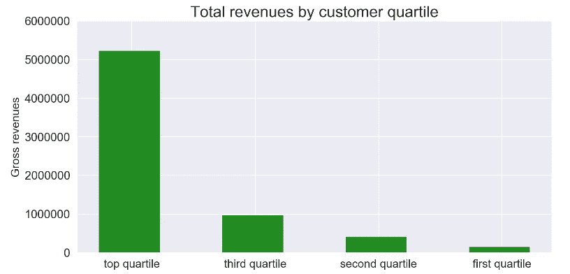*

# *数据工程和时间序列聚合*

*我求助于 Pandas 的 Python 时间序列工具箱，对从**日内到日频率**的数据集进行必要的聚合。我重命名了聚合后的变量:id、日期、发票号、类别、数量、单价、总额。除了“categories”是原始“StockCode”变量的一个*计数*之外，新名称只是原始名称的表面变化。*

**

***然后使用各种时间序列工具从每日数据中伪造出 RFM 模型**每个方面的原变量。例如，下面是“days_since_last”变量的代码，该变量稍后将用于构建最近得分。*

**

*类似地，生成“trans_90d”和“revenue_90d”变量来分别捕获每个客户在 90 天滚动窗口期内的**交易数量**和**总收入**。考虑到滚动窗口的起点，这自然会导致数据集的前三个月被从后续分析中删除。*

*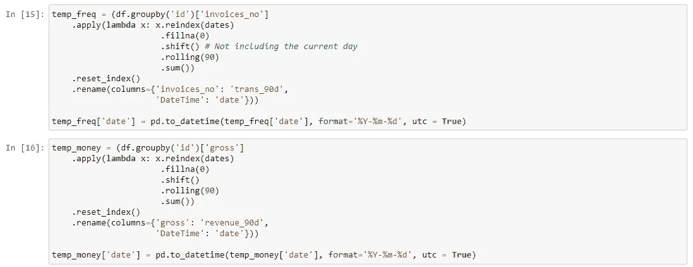*

*这些特征工程测量筛选出许多单个客户，如唯一的“id”变量值，这些客户仅在数据集的前三个月被记录和/或在数据集的剩余部分有一次观察，因此上面的原型 RFM 变量将具有空值。具体来说，最初的每日数据有 3，947 个唯一的“id”值，但在每月汇总之前缩减到 2，638 个。如果数据集覆盖了更长的时间段，可能会减少对独特客户记录的筛选，但这是我必须处理的。*

*此外，我设计了一个**替代原始货币变量**，即每个客户每月的**平均总收入**。“trans_90d”和“revenue_90d”之间可能有很强的正相关性，因为从逻辑上讲，越多的交易应该从客户那里获得越多的收入。当我们开始使用回归来估计权重以构建复合 RFM 分数时，高度的线性相关性是不期望的。因此，一些人主张在货币层面使用平均收入。无论如何，我生成了这个替代变量(“avg_revenue_90d”)，看看它以后是否有用。*

**

*数据集最终**汇总成月度频率**。**为什么有人会问每月一次？**日频次数据中“days_since_last”和“trans_90d”变量的平均值分别为 42.64 和 4.61。这些数据表明，典型的客户每月进行约**笔半交易**。因此，在这种情况下，每月一次是客户分析的最佳时间间隔。*

**

*在每月汇总之后，我进一步删除了一些关键变量“总额”和“发票数量”的异常值**。有 163 个观察值超出了两个变量平均值以上的 3 个标准差。没有低于平均值的观察值。这 2%的观察值作为异常值被丢弃，最终得到 7，892 行的月度数据集。***

*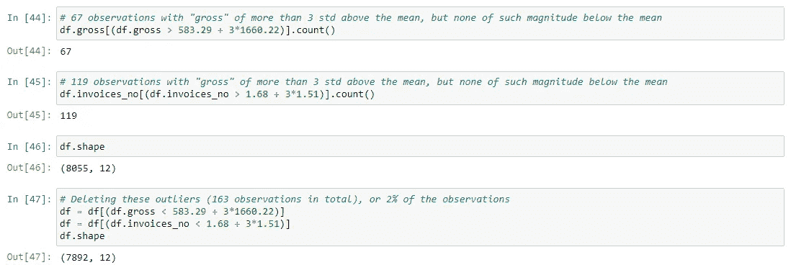*

# *客户聚类*

*根据 RFM 的每个方面，有两种广泛的方法可以用来划分客户。第一种是对客户列表进行排序，将相等的数字放入不同的桶中，通常是四分位数或五分位数，并相应地对它们进行评分。另一种是**聚类不同的客户群**，K-means 聚类算法广泛用于此目的。*

*重要的是要注意每个步骤中的主要假设。第一个步骤是把相同数量的顾客塞进每个细分市场。相比之下，K-means 聚类是一种无监督的学习算法，因此当用于社会经济数据时，它可能会导致**不平衡段**，这些数据通常是倾斜的。*

*没有对错之分，但我更喜欢让数据自己表达。尽管如此，我还是意识到了长尾分布的**问题**，当偏差相当大时，它会导致大部分观测值集中在一个或两个片段中。过度聚类也是不可取的，因为它会降低后续 RFM 分数的粒度。*

*为了处理长尾问题，我通过采用“days_since_last”的**自然对数**(因为它只有非零的正值)，以及“trans_90d”、“revenue_90d”和“avg_revenue_90d”的**立方根**来转换 RFM 原始变量。我挑选了一个 5 个集群的 **K 均值，随后的集群按照**序数升序标度**进行评分(即 0 为最低分，4 为最高分)。***

*这种方法减少了一些偏斜，但它仍然反映了**不平衡的客户群**，这在我看来是很自然的。在所有三个 RFM 变量中，得分最高的客户群规模最小，但如前所述，前 10%的客户占总收入的一半以上。*

********

# *每月 RFM 分数*

*按照这些步骤，我们得出了每个客户不同的**月度** **近期、频率和货币分数**。由此产生的月度数据框架的三个快照如下所示。第一个是排序的数据帧，第二个和第三个描述了两个特定客户的记录(" id"==17611 & 13881 ")。*

*****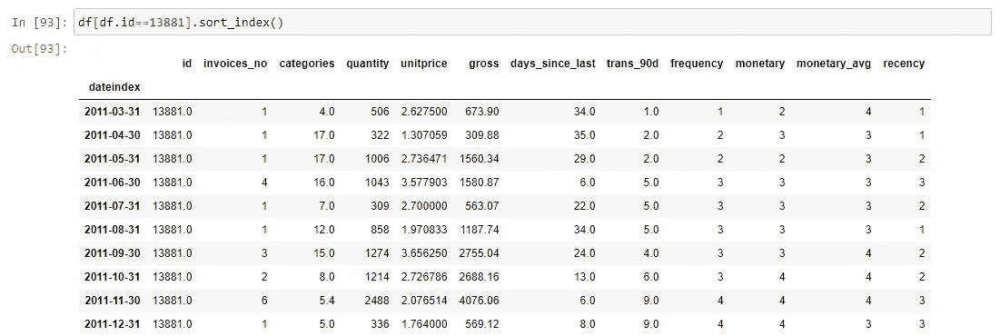*

*正如可以观察到的，每月的个人 RFM 分数根据演变的客户行为而变化。从这里有两条可能的路。这些单个的 RFM 分数可以被合并，以进一步将单个客户归类到更具体的子群中，例如归类到“频繁但低消费”组或“不频繁但高消费”组。*

*或者，我们可以用这些分数来制作一个**综合 RFM 指标**。鉴于我的目标是在下一篇文章中对 RFM 模型进行统计测试，我决定走第二条路。*

# ***RFM 综合指数***

*值得花些心思思考一下**如何以及为什么**我们可能想要设计一个综合 RFM 指标。事实上,“如何”和“为什么”是不可分割地交织在一起的，因为我们如何衡量个人得分以汇总成一个综合指标，将对其最终显示的内容产生决定性影响。*

*这就是为什么复合权重模型需要变得**清晰和透明**。一些常用的常用加权方法有:
*等权；*
*主成分分析；*
*回归分析；*
*理论上的考虑；和*
*专家意见。不幸的是，对于我们应该如何进行，既没有强有力的理论，也没有专家的一致意见。**

*作为一个例子，让我们考虑一下，如果我们采取权宜之计，简单地将每个月的三个 R-F-M 分数相加，那么采用**等权重**方法(这是普遍的做法)会发生什么。我构建了这样一个月度“rfm_equal”变量，其相关矩阵(月度数据)如下所示。*

**

*显而易见的是,“rfm_equal”与“invoices_no ”(每月的交易/购买次数)的正相关关系比“gross ”(每月的总支出)强得多，分别为+0.56 和+0.34。主要原因是 RFM 模型本质上强调常规的客户活动，体现在新近性和频率方面，这三个方面的同等权重会让这种趋势自由发展。*

*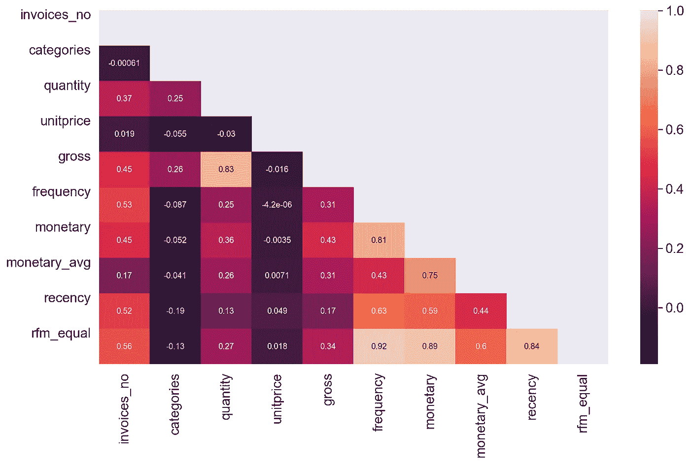*

*尽管 RFM 模型最初可能是为了对客户活动的规律性进行评分而设计的，但一种替代的复合构造方法可能会改进它，使它更加灵活。关注客户活动当然没有错，但我想说明的是，为备选客户指标设计一个复合 RFM 指标是可能的。如果我们确实可以将相同的数据用于不同的目的，那么这将**减少额外数据收集的需求**，或者将允许现有数据的**新用途**。*

*此外，请注意“monetary”和“monetary_avg”分数的相关系数的差异。最初关于“货币”与“频率”高度相关的怀疑得到了证实。事实上，“monetary_avg”与“recency”和“frequency”的相关性低于原始的“monetary”变量。因此，从现在开始，我将使用“monetary_avg”作为我的动态 RFM 模型的**默认货币方面**。*

# *面板数据建模*

*我转向**面板数据回归**建模来构建综合 RFM 指标的选择。面板数据分析有许多名称和伪装。也称为纵向、聚类或分层数据，面板数据通过横截面数据(在一个时间点从许多不相关的对象获取的数据)**和时间序列**(在几个时间点从同一对象获取的数据)的**组合来区分。面板数据通常不同于时间序列，因为它的观察对象比时间段要多得多。***

*面板数据的一个主要优势是它允许一个**使用受试者作为他们自己的对照**。当你在随时间变化的条件下观察同一个对象时，你可以更好地估计这些变化是如何影响它的行为的。更好的是，你可以将这种观察维度添加到不同对象的(典型)横截面分析中。*

*换句话说，面板数据分析可以用来估计受试者内部的变化(在我们的案例中，随着时间的推移，在每个客户中)和受试者之间的变化(在不同的客户中)，这导致了额外的术语“内部”和“之间”的估计。这些优势允许对数据中的因果关系进行更强有力的推断，这就是为什么面板数据技术被广泛用于生物医学研究。*

*在本文中，我只使用了“在”估计量面板数据模型。该模型基本上**固定受试者的时不变属性**，同时估计**时变解释变量**如何影响因变量。这就是计量经济学中广为人知的 ***固定效应模型*** 。这种模型的系数捕捉了时间序列变化对每个受试者的影响，同时控制了所有不随时间变化的属性，而不必明确列出它们。*

*这个案例中的客户是其他公司。数据集的主要限制是**缺乏客户人口统计信息**。很容易认为，客户公司规模、客户商业模式和与卖方的物理距离等因素在决定购买量和购买频率时非常重要。未能在回归中包含这些潜在的重要因素可能会导致系数估计值因 ***遗漏变量偏差*** 而失真。*

*在这种情况下，固定效果模型的好处是每个客户的这些**“固定”属性都将在模型中针对**进行控制！运行回归时，模型中考虑了客户的所有不变人口统计因素(在分析的时间段内)。因此，我可以安全地进行统计推断，因为我知道这些时不变因素不会对参数估计产生偏差。*

# *瞄准“毛”*

*我构建的第一个综合 RFM 指标将**每月客户支出作为其目标指标**。创造销售无疑是企业存在的*理由。为此，每月“毛”收入被用作回归分析的目标变量。**

*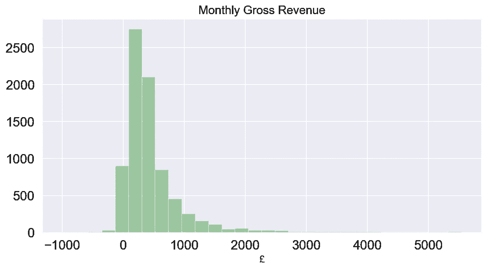*

*目标月度“总量”变量严重右偏**。它的平均值为 459，但最大值为 5540。它也有负值，请记住，产品退货是在交易数据中捕获的。因此，我通过取它的**立方根**来转换它，这与对数转换不同，它可以用于零和负值。转换后的分布“gross_cubic”确实更加对称，尽管双峰现象非常轻微。***

***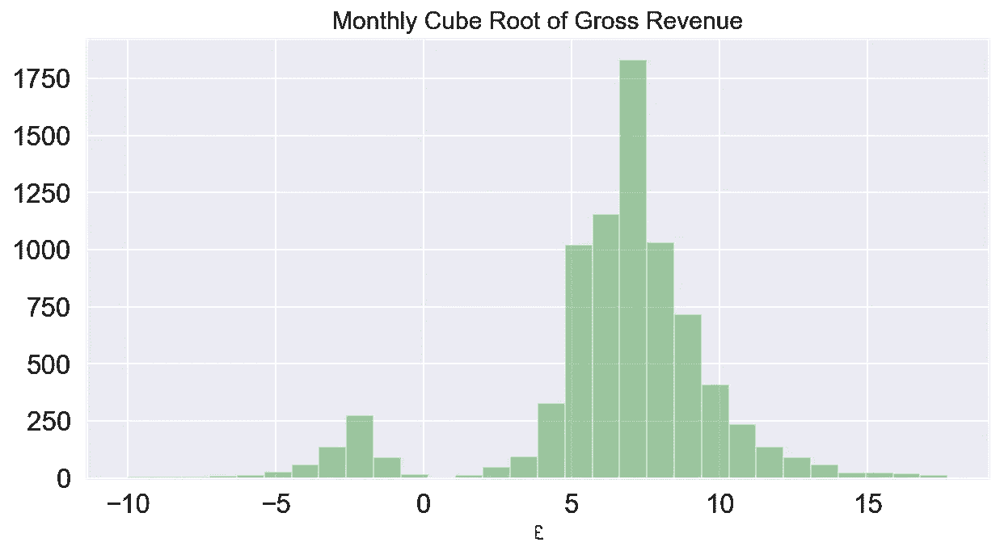***

# ***构建和测试综合指标***

***复合 RFM 评分是在一个程序中建立和测试的。我首先**按照时间段从最早(2011 年 3 月开始)到最晚(2011 年 12 月结束)对数据集进行排序**，然后**将它分成两半**。分割前的排序确保了数据的时间顺序得到尊重。从样本的上半部分**估算单个 RFM 系数加回归截距。这些估计数随后被用来计算综合 RFM 指数。*****

***只有数据集的**下半部分**用于综合指标的假设检验。以这种方式，我将测试从数据集的前一半“训练”中获得的复合权重是否可推广到后一半数据的“测试”中。这是训练测试与假设测试的混合，传统上倾向于对全部数据进行测试。***

******

***固定效应面板数据回归是通过对每个客户(在汇总结果中被称为“实体”)进行最少两次**观察**(随着时间的推移)来完成的。只有客户效应是固定的，回归中没有时间效应，所以这是一个 ***单向固定效应模型*** 。***

***为了保持简洁，我只显示了部分汇总结果，特别是参数估计及其各自的标准误差和 t 统计量。所有三个 RFM 变量**在统计上是显著的**。完整的总结结果，包括对*可池性*的 F 测试，可以在我的 GitHub 页面上找到，链接在文章底部。***

***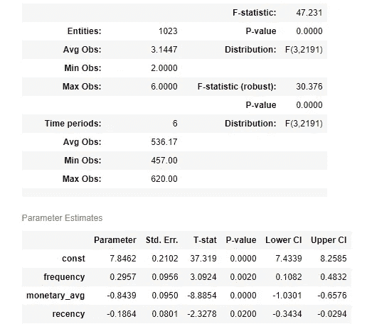***

***我根据上面的截距和系数构建了“rfm_gross”变量。然后取数据集的下半部分，对其运行**两个回归模型**。第一个模型只有“rfm_gross”作为感兴趣的回归变量，而第二个模型包括“invoices_no”、“quantity”和“categories”作为额外的控制变量。毕竟，人们会期望交易的数量、购买物品的数量和购买产品类别的数量对“总”支出产生一些影响。因此，“rfm_gross”与其他回归变量一起进行测试是合适的。***

***第一个模型的“rfm_gross”系数是令人满意的+0.8830，或接近 1，这意味着它与因变量“gross_cubic”几乎是一对一的关系，并且在统计上也是显著的。在其他回归因素存在的情况下，第二个模型的“rfm_gross”系数下降到+0.6543，但仍具有统计显著性。*可集合性*的零假设，即不需要固定效应，也在两个模型中被拒绝。***

***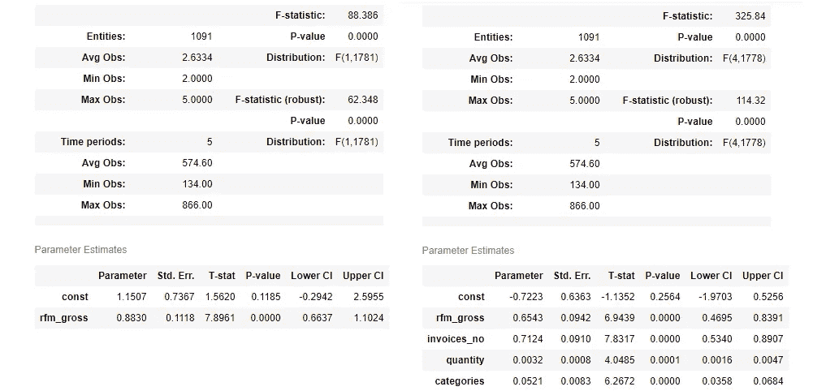***

***结果表明:
1)“RFM _ gross”是测试集中“gross _ cubic”的一个良好的(系数接近 1 且具有统计显著性)二元(内)**预测因子；和
2)“RFM _ gross”仍然是“gross_cubic”的稳健(内部)预测值，尽管增加了其他控制变量。*****

# ***改进“rfm-equal”指标***

***随后，我开始考虑是否可以改进 RFM 模型的初衷，即追踪客户活动的规律性。除了用同等权重来构建一个综合 RFM 指标，我们还能做得更好吗？为了回答这个问题，我在很大程度上重复了上面的步骤，但是使用了**“invoices _ no”作为目标变量**。***

***因此，首先将数据集分成两半，前半部分数据用于运行具有**单向固定效应**的面板数据回归。所有三个 RFM 变量再次**具有统计学意义**。截距和系数随后用于计算复合 RFM 指标“rfm_invoices”，并在数据集的后半部分进行了测试。***

******

***我再次运行了两个模型:一个只使用“rfm_invoices”作为感兴趣的回归变量，另一个使用“categories”和“quantity”作为额外的回归变量。我假设“invoices_no”，即交易的数量，会受到客户购买了多少产品和多少物品的影响。这一次“总额”没有包括在内，因为我假设因果箭头是从“发票 _ 无”指向“总额”，而不是反过来。***

***两个模型中“rfm_invoices”的系数**接近于 1**，分别为+0.9734 和+0.8838，并且**具有统计显著性**。在这方面，在存在其他回归因素的情况下，综合指标“rfm_invoices”比“rfm_gross”更稳健，这证实了 rfm 模型最适合跟踪客户活动。***

***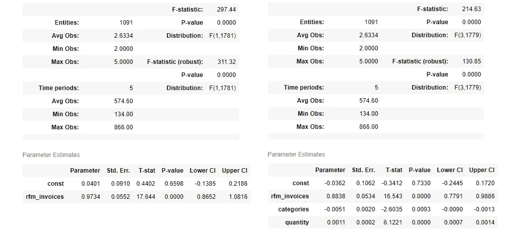***

***然而，这个“rfm_invoices”比最初的等权“rfm_equal”指标更好吗？对此进行测试的一种方法是对“rfm-equal”进行与上述相同的测试程序。结果如下。***

***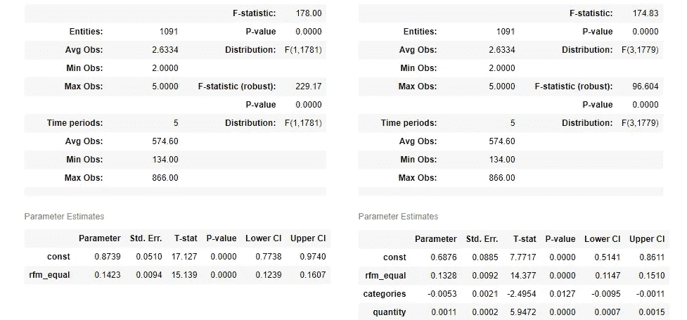***

***我们看到,“rfm_equal”在+0.1423 和+0.1328 处的两个系数都是**统计显著的**。虽然它们的份额小于“rfm_invoices”的系数，但在面对额外的回归变量时，它们同样**稳健**。这表明“rfm_equal”综合指标并不比“rfm_invoices”差多少。***

***“rfm_equal”和“rfm_invoices”之间的**强正相关关系**通过下面的配对图得到了证实。考虑到其构造的简单性，在确定客户交易数量时，我们最好使用“rfm_equal”。***

***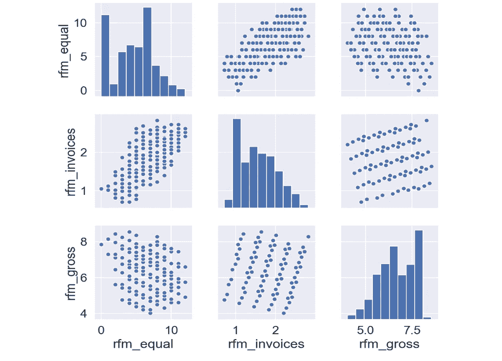***

# ***结论***

***该项目从努力构建一个动态 RFM 模型开始，该模型将提供每月的客户行为演变的近期、频率和货币分数。为了做到这一点，我首先将原始的日内数据汇总成日频率，然后再汇总成月频率。**在这种情况下，每月周期**被确定为客户分析的最佳频率。***

***在此之后，我使用面板数据计量经济学来构建 RFM 综合指数，目标首先是客户支出，其次是客户交易的发生率。然后，我对 RFM 模型进行了**假设检验**，这证实了它在同时测量客户选择指标方面的有效性。测试进一步证实了简单等权 RFM 综合得分是客户交易的有效预测指标。***

***进一步的工作可能包括建立一个替代模型，可以更有效地跟踪客户的支出，也许是通过用购买物品的数量来代替新近性。替代面板数据模型，特别是贝叶斯分层模型，也可能有助于改善 RFM 模型。***

***(这个练习的完整 Python 代码可以在我的 *GitHub* [资源库](https://github.com/at-tan/Dynamic_Customer_Analytics)中找到。如果直接渲染 GitHub 笔记本文件有问题，使用 [nbviewer](https://nbviewer.org/) 。)***

***如果你看到了阅读这样的文章的价值，你可以在这里订阅 Medium**来阅读我和无数其他作家的其他文章。谢谢你。*****

**** [## 多元时间序列的堆积机器学习模型

### PM 2.5 空气污染数据集的个例研究

towardsdatascience.com](/stacking-machine-learning-models-for-multivariate-time-series-28a082f881)  [## 用预测概率处理不平衡数据

### 葡萄牙银行营销数据集的案例研究

towardsdatascience.com](/tackling-imbalanced-data-with-predicted-probabilities-3293602f0f2)  [## 面向金融的顶级 Python 黑客

### 用比特币时间序列数据

medium.datadriveninvestor.com](https://medium.datadriveninvestor.com/top-python-hacks-for-finance-f9ea900a686c)****