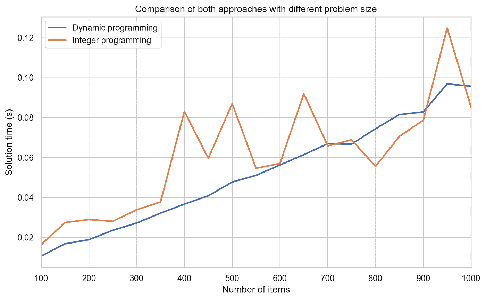

# 动态规划与整数规划:哪个更适合背包问题？

> 原文：<https://towardsdatascience.com/dynamic-program-vs-integer-program-which-one-is-better-for-the-knapsack-problem-759f41b9755d?source=collection_archive---------10----------------------->


最优化领域包括许多不同领域的模型和算法。你可以根据许多不同的标准对领域进行分类:线性对非线性，凸对非凸，连续对离散，等等。通常，一个问题可以用多种不同的方法来解决，这是不同的底层解决方案哲学相遇的地方，我觉得这很有趣。在本文中，我们将通过背包问题这一有趣且被充分研究的问题来深入探讨动态规划和整数规划之间的差异。

# 什么是背包问题

背包问题可能是众所周知的中级问题之一。但是，即使在 Leetcode 之前，由于它的递归性质和简单的问题设置，背包已经包含在整数编程课程和更高级的计算机科学课程的介绍中。作为一个优化人，背包问题是你在整数规划课上最先学习的问题之一。更何况背包问题实际上是一个 NP 难问题！然而，这是一个 NP 难题，我们可以非常有效地解决。我们就越有理由从它开始！

让我们回顾一下背包问题是什么。假设你要去旅行，你有一张清单，上面有 *n* 件你想放在背包(或者背包，如果你愿意的话)里随身携带的物品。每个项目都有一个权重和效用分数。您希望找到项目的子集，其总权重低于阈值 *W* ，并且其总效用分数最大化。

从描述来看，这个问题听起来足够简单。有一点需要注意的是，每一项都可以选择也可以不选择，但不能半选或分数选。这是 0–1 背包问题和分数背包问题之间的一个很好的区别，在 0–1 背包问题中，每个物品是一个整体，在分数背包问题中，可以选择一个物品的分数部分。在现实生活中，0–1 背包问题可以被视为决定是否应该选择手电筒，而分数问题可能是考虑应该选择 1 加仑水中的多少。

# 简单启发式

背包问题的主要权衡是在满足重量限制的同时获得尽可能多的效用分数。一个自然的想法是计算每个项目的效用/重量比，然后尝试适应每单位重量具有较高效用分数的项目，直到达到重量阈值。该算法是一种贪婪算法，实际上是分数背包问题的解决方案。然而，这并不能保证 0–1 背包问题的最优解，如下面的反例所示。

假设下表中给出了这些产品的规格:


体重阈值是 50。使用贪婪试探法，我们将选择项目 1 和 2，总效用为 160，总权重为 30。显然，这不是最佳解决方案，即选择第 2 项和第 3 项，其中总效用为 220，总重量正好为 50。其观点是，用相对比率排名是好的，但它没有考虑绝对权重值，并且不能以分数的方式选择项目。

事实上，人们可以利用这一弱点来创建背包问题的实例，这使得贪婪启发式算法的解决方案变得任意糟糕。

考虑以下重量阈值为 *X* 的背包问题


贪婪算法解只会选择总效用为 1 的项目 1，而不是选择效用得分为 *X-1* 的项目 2 的最优解。当我们使 *X* 任意大时，与最优解相比，贪婪算法的表现会任意差。

# 动态规划方法

动态规划基于这样的思想，即在最优解中，给定的项目 *i* 要么在所选择的子集中，要么不在。此属性定义算法的递归性质。设 *I* 为项目集合， *u* ᵢ， *wᵢ* 分别为项目 *i* 的效用和权重， *W* 为权重阈值，背包( *I* ， *W* )为项目集合为 *I* 且权重阈值为 *W* 的背包问题的最优解。用数学术语来说，递归可以定义为


其中 *I\{i}* 表示没有项目 *i* 的项目 *I* 的集合。

*   *max* 语句中的第一项是最优解中第*I*项不是项的情况，因此该最优解与除第 *i* 项之外的具有相同权重阈值和相同项的背包问题的最优解相同。
*   第二项是最优解中项目*I*t42】为的情况，要选择最优解中剩余的项目，需要求解一个新的背包问题，其中项目集合为 *I\{i}* ，权重阈值为 *W-wᵢ* 。

有了这个递归定义，我们可以建立一个表来跟踪每个背包问题的最优解，从 *0* 项和权重阈值 *0* 开始到集合 *I* 和权重阈值 *W* 中的所有项。那么每当我们在计算背包( *I\{i}，W-wᵢ* )的解时，我们就可以在表中查找解。

下面是动态编程算法的 python 实现:

```
def knapSack(weight_threshold, weight_list, util_list): 
    """ 
    A Dynamic Programming algorithm that solves the 0-1 Knapsack problem. Args:
        weight_threshold: Weight threshold
        weight_list: List of weights for each item in item set I
        util_list: utility score of each item i Returns:
        The optimal utility score of the knapsack problem
    """
    n = len(util_list)
    lookup_table = [[0 for x in range(weight_threshold+1)] 
                    for x in range(n+1)] 

    # Build table K[][] in bottom up manner 
    for i in range(n+1): 
        for w in range(weight_threshold+1): 
            if i==0 or w==0: 
                lookup_table[i][w] = 0
            elif weight_list[i-1] <= w:
                lookup_table[i][w] = (
                    max(util_list[i-1] 
                        + lookup_table[i-1][w-weight_list[i-1]], 
                        lookup_table[i-1][w]))
            else: 
                lookup_table[i][w] = (
                    lookup_table[i-1][weight_threshold])

    return lookup_table[n][weight_threshold]
```

请注意，这里的 *i* 代表集合 *I* 中可供考虑的项目数量。例如， *i = 2* 表示我们只能从项目 *1* 和 *2* 的集合中进行选择。As *w* 遍历所有可能的权重， *K[i][w]* 表示带权重阈值 *j* 的背包问题的最优效用得分，并有项 *1，2，…，i* 。

让我们来看看 DP 算法在权重阈值为 *5* 的情况下的运行情况:


当算法以最优解终止时，表 *K* 看起来像下表:


在*处可以找到最优解，K[3][5] = 20* ，选择项目 *2* 和 *3* 。

# 整数规划

另一种方法是整数规划方法。整数规划是一个数学优化程序，其中一些或所有的变量被限制为整数。整数规划是 NP 完全的，因此可以作为整数规划问题提出的背包问题也是 NP 难的就不足为奇了。当使用整数规划方法时，人们通常将决策建模为离散的决策变量，可行的决策由一组约束来描述。所得到的模型可以通过特殊的整数规划算法来求解，以获得最优解。在这种情况下，离散的决策是是否应该选择一个项目。我们引入 *xᵢ* ，其中项目 *i* 来自集合 *I* 来表示项目 *i* 是否被选中的决定。如果 *xᵢ = 1* ，则选择项目 *i* ，否则 *xᵢ = 0* 且项目 *i* 不选择。

整数规划模型可以用公式表示如下:


该术语


是我们想要最大化的目标函数。在这种情况下，目标是最大化所选项目子集的总效用分数。

不平等


是背包约束，强制所选物品的总重量不超过 *W* 。

该模型是经典的整数规划背包问题。为了求解上述模型，可以利用任何整数规划求解器。一个好的选择是 [Google 或 tools](https://developers.google.com/optimization) ，这是一个用于编写和求解优化模型的开源工具。

下面是使用 ORtools 和 CBC 整数规划求解器来建模和求解背包问题的 python 代码:

```
def mip(weight_threshold, weight_list, util_list):
    """ 
    A Integer Programming model that solves the 0-1 Knapsack problem. Args:
        weight_threshold: Weight threshold
        weight_list: List of weights for each item in item set I
        util_list: utility score of each item i Returns:
        The optimal utility score of the knapsack problem
    """
    n = len(weight_list)

    # initialize the integer programming model with the open source CBC solver
    solver = pywraplp.Solver('simple_mip_program',                  pywraplp.Solver.CBC_MIXED_INTEGER_PROGRAMMING)

    # Declare binary variable x for each item from 1 to n
    x_dict = {}
    for i in range(n):
        x_dict[i] = solver.IntVar(0, 1, f'x_{i}') # Add constraint on total weight of items selected cannot exceed   weight threshold
    solver.Add(solver.Sum([weight_list[i]*x_dict[i] for i in range(n)]) <= weight_threshold) # Maximize total utility score
    solver.Maximize(solver.Sum([util_list[i]*x_dict[i] for i in range(n)])) # Solve!
    status = solver.Solve()

    # Uncomment the section below to print solution details
    # if status == pywraplp.Solver.OPTIMAL:
    #     print('Solution:')
    #     print('Objective value =', solver.Objective().Value())
    #     print('Problem solved in %f milliseconds' % solver.wall_time())
    #     for i in x_dict:
    #         print(f'{x_dict[i]} = {x_dict[i].solution_value()}') return solver.Objective().Value()
```

求解整数规划的标准方法叫做[分支定界](https://en.wikipedia.org/wiki/Branch_and_bound)。这是一种分而治之的方法，它重复划分解决方案空间，直到找到并证明一个解决方案是最优的。

顾名思义，分支定界法由两个主要动作组成:

*   界限:给定一个解集，得到在解集中可以找到的最佳解的上/下界估计。例如，可以通过求解相应的分数背包问题来找到 0–1 背包问题的上界。由于分数背包问题允许选择项目的一部分，而 0–1 背包问题不允许，所以分数背包问题将总是产生相等或更好的目标值，这可以被视为 0–1 背包问题的目标的上界。
*   分支:当计算解集上的界限时，我们遇到满足问题的所有约束的解，但是由于解的值不是整数而不可行。在这种情况下，我们可以在一个小数值变量上分支，将当前的解空间分成两个:(在二元变量的情况下)一个强制小数值变量为 0，另一个强制小数值变量为 1。例如，求解分数背包问题可能会产生一个占第 2 项 50%的解。然后，可以通过将解空间分割为包含第 2 项或不包含第 2 项来对第 2 项的变量进行分支。

让我们来解决我们在动态编程中使用的示例问题，希望这样可以把事情搞清楚。

我们从背包的原始问题( *I，W* )开始，这个问题在分枝定界中被称为“主问题”。我们首先解决一个放松的主问题。在整数编程中，松弛通常指的是线性松弛，其中不是要求每个二进制变量 *xᵢ* 都是二进制的，而是放松这种约束，并强制每个 *xᵢ* 在[ *0，1* 之间。这导致了一个线性规划，因此命名为“线性松弛”。有趣的是，在背包问题的情况下，线性松弛只是分数背包问题。所以我们可以用启发式算法来求解，得到最优解。对于更一般的整数规划松弛，解决一个线性规划是必要的。

求解背包的松弛( *I，W* )后得到 *(x_1，x_2，x_3) = (1，1，0.67)* 和一个 *22.67* 的目标。这个解决方案为我们提供了两条信息:

*   目标上的一个全局上界 *22.67* ，由于 0–1 背包问题的解空间是分式背包问题的子集，0–1 背包的最佳目标不可能比 *22.67* 做得更好。事实上，它不可能比 *22* 更好，因为 0–1 背包问题中的所有系数都是整数。

唯一的分数变量是 *x₃* ，非常适合分支。

接下来，我们通过添加约束条件对变量 *x₃* 进行分支，并且我们获得两个子问题:

a)具有约束 *x₃ = 0* 的背包( *I，W*

b)具有约束 *x₃ = 1* 的背包( *I，W*

其中每个子问题是一个新的背包问题，我们重复相同的步骤，并解决每个子问题的松弛。

对于子问题 a)，求解它的松弛得到 *(x₁，x₂，x₃) = (1，1，0)* 的解和 *16* 的目标。这是一个可行的方案，可以作为下界。换句话说，现在我们已经找到了目标为 *16* 的候选解决方案，我们只寻找目标比 16 更好的解决方案。任何其他目标更差的解决方案都可以放弃。

对于子问题 b)，其松弛的解给出了 *(x₁，x₂，x₃) = (1，0.5，1)* 的解，以及一个 *21* 的目标。由于子问题 a)已经达到了一个最佳目标 *16* ，全局上界可以从 *22* 更新到 *21* ，因为找到更好解的唯一机会是在子问题 b 的解空间上，并且它能得到的最佳值是 *21* 。但是由于 *x₂* 现在是分数，我们在 *x₂* 上进一步分支，形成问题 b1)和 b2)。

b1)背包( *I，W* )，约束 *x₂ = 0，x₃ = 1*

b2)背包( *I，W* )，约束 *x₂ = 1，x₃ = 1*

求解子问题 b1)，我们得到目标为 *16* 的解 *(x₁，x₂，x₃) = (1，0，1)* 。我们可以安全地丢弃这个分支，因为它可以达到的最佳目标是 *16* ，这已经在子问题 a)中找到了。在这种情况下，由于该解决方案也是积分的，我们将停止，因为没有其他解决方案可以对问题 b1)进行研究，从而可能产生更好的目标。

求解子问题 b2)，我们得到 *(x₁，x₂，x₃) = (0，1，1)* ，目标 *20* 。由于解是积分的，并且大于先前的下界 *16* ，这是新的下界。由于这是我们需要探索的最后一个分支，我们可以说这是原问题的最优解。显示解的最优性的另一个证明是，全局上界是 *21* ，并且不存在将产生总效用分数 *21* 的项目组合，因此目标 *20* 的解是最优的。

下面是总结上述步骤的流程图:


# 比较

让我们回头来看看这两种方法。这两种方法都使用某种递归方案:动态编程利用问题结构并从较小的问题递归地构建最优解，而整数编程递归地将问题空间划分为较小的主干，并使用估计的界限来丢弃不感兴趣的解分区以加速搜索。动态编程就像一个超级智能的枚举，它通过总是建立在简单问题的最优解上来避免不必要的计算。整数规划不一定只在解集内工作。相反，它使用从求解松弛中获得的信息来细化下限和上限，并努力缩小两个界限之间的差距。界限可以帮助消除不包含更好的解决方案的部分解决方案空间，这就是为什么分支界限可以非常有效。当问题结构很好，解集适中时，动态规划是很棒的。如果您有有效的方法来计算解决方案的质量下限和上限，那么整数规划会非常有效。

# 背包问题哪个好？

背包问题到底该用哪一个？为了回答这个问题，我们进行了两组实验:

1.  在不同规模的随机生成的背包问题上运行这两种算法，看看规模对性能的影响
2.  对随机生成的背包问题运行这两种算法，这些问题具有不同的背包约束紧度，以查看约束紧度对性能的影响。

# 问题大小对性能的影响

问题的大小是一个通常要考虑的因素，因为较大的问题通常需要较长的时间来解决。我们用 100 到 1000 个项目生成背包问题的实例。权重和效用分数是 0 到 100 之间随机生成的整数。权重阈值是固定的 100。我们在每个实例上运行两种算法 7 次，并以秒为单位记录平均求解时间。结果可以总结在下面的图中:



从上面的图中可以看出，对于小规模到中等规模的问题，动态规划方法比整数规划方法更有竞争力。随着问题规模的增大，两种算法的求解时间都在增加。在实验设置中，似乎一种算法相对于另一种算法没有明显的优势。

# 背包约束紧密度对性能的影响

我们考虑的另一个因素是背包约束的紧密性。严格的约束意味着大多数项目不会被选中，而宽松的约束意味着大多数项目最终会被选中。这直接影响动态编程的查找表大小。我们用 100 个项目生成背包问题的随机实例，这些项目的随机权重和效用分数在 0 到 100 的范围内。我们在每个不同的权重阈值(范围从 50 到 950)上运行每个算法 7 次，并以秒为单位记录平均求解时间。从下表可以看出结果:


从图中可以看出，随着权重阈值的增加，求解时间随着动态规划方法的增加而增加，而整数规划似乎不受太大影响。这是因为动态规划的表大小和迭代次数与权重阈值成正比，而整数规划更直接地受到整数变量和约束的数量的影响，所以在这种情况下约束紧密度不会对整数规划的求解时间产生巨大影响。

# 结论

从实验中我们可以看出，对于严格约束的背包问题，动态规划可以是一个可靠的选择，因为它的效率与整数规划相比是有竞争力的，但不需要建立模型和调用外部求解器。此外，动态规划还有查找表的好处，它包含了不同参数的背包问题的最优解。

另一方面，如果问题规模很大并且背包约束不是很紧，整数规划方法会更好。当背包约束的紧密度改变时，整数规划不会受到太大影响。动态编程的缺点是不能保持比例不变，这意味着如果我们将权重和权重阈值都乘以相同的因子，那么求解时间也会增加，因为查找表的大小是`weight threshold` * `number of items`。顺便提一下，整数规划求解器也有更多的武器，可以更快地找到可行的解决方案，更有效地优化边界。一个例子是，许多求解器内置了搜索可行解的试探法，以及收紧边界的内置截集。

希望这回答了我们何时应该使用哪种方法的问题。如果您熟悉优化领域中的列生成方法，您就会知道背包问题通常是我们需要高效解决的子问题。在文献中，背包问题总是用动态规划来解决，这一直让我很好奇。通过所有的分析，我认为这个选择是由于背包问题通常规模较小并且约束严格。希望这能吸引更多对优化感兴趣的人，并为每个算法如何找到最优解提供很好的见解。

对于对背包问题感兴趣的读者来说，Google ORtools 在这里有更多的讨论[，也有同样主题的](https://developers.google.com/optimization/bin/knapsack)[巨著](https://www.amazon.com/Knapsack-Problems-Hans-Kellerer/dp/3642073115)。