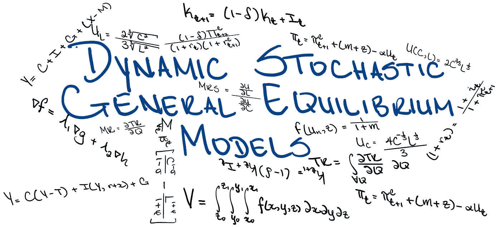
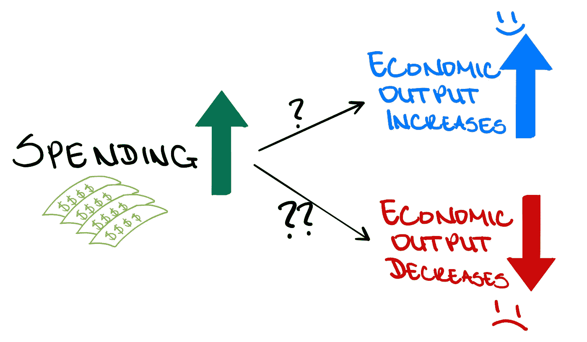
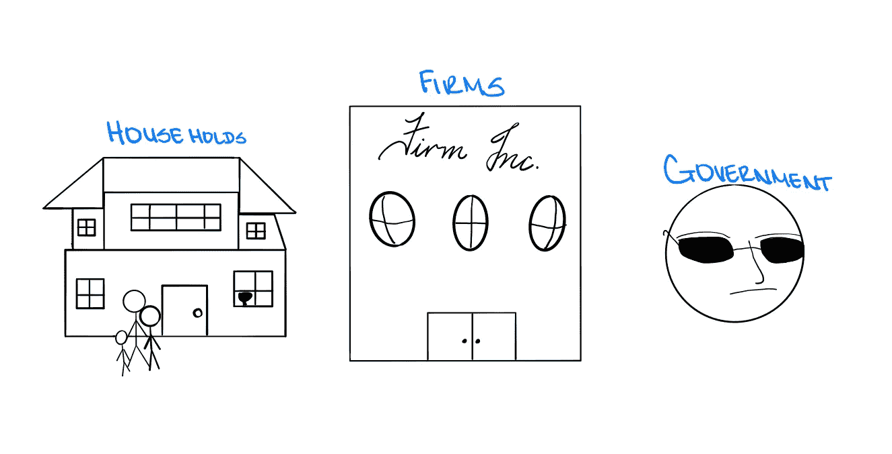
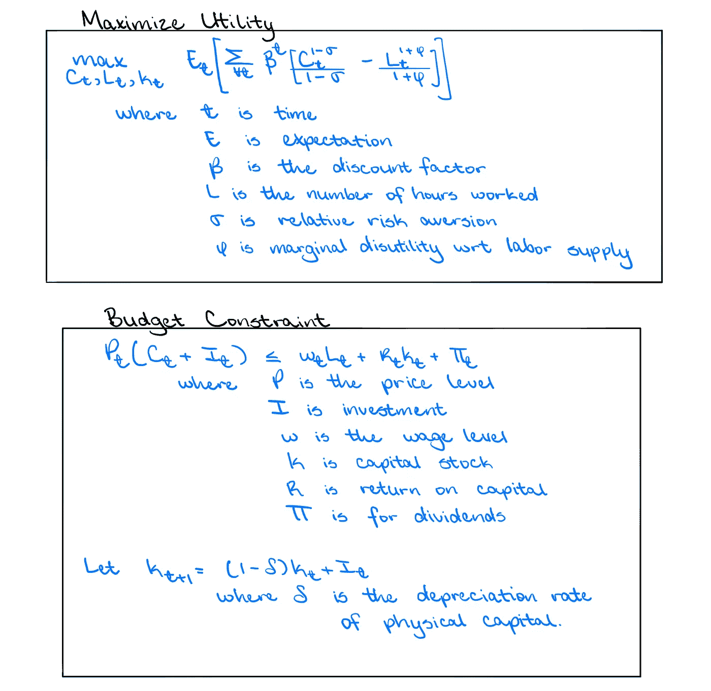

# 动态随机一般均衡模型

> 原文：<https://towardsdatascience.com/dynamic-stochastic-general-equilibrium-models-4f30659abec6?source=collection_archive---------26----------------------->

## DSGE 模型的理论和数学，以及为什么 DSGE 模型应该用于商业

图片作者:特里斯特·约瑟夫

经济学通常被定义为一门社会科学，它从个人和社会在面临稀缺时所做选择的角度来研究人们的行为。这里的稀缺性指的是这样一种情况，即拥有有限的资源，但社会中的代理人却有无限的需求。由于这种差距，所有社会都面临着回答三个基本问题的任务:生产什么？如何产生？这应该为谁制作？

这些问题可以分成两大类来研究:微观经济学和宏观经济学。微观经济学关注经济中的细分部门。更具体地说，它研究企业、个人消费者和家庭的决策。另一方面，宏观经济学关注的是经济中的综合部门。经济学的这一分支关注政策建议，并评估诸如一般价格水平、就业和经济产出等方面。

图片作者:特里斯特·约瑟夫

有了这些定义，我们可以看到，宏观经济学家考虑经济的表现，同时也试图找出经济中可能阻碍宏观经济目标的领域。

现在，宏观经济政策问题通常涉及经济内部各方面的权衡。实施成功政策的一个关键因素是理解手头政策问题的竞争性方面的力量。评估这些优势的一种方法是进行实验。理想情况下，应该对一个经济体进行真正的实验，以理解和评估结果。然而，由于成本、时间和伦理的原因，这通常是不可能的。因此，唯一可以进行实验的地方是为理解经济而开发的模型。

为了更好地理解这一点，让我们考虑一个具有竞争性方面的政策问题。政府支出的增加会对经济产生什么影响？这个理论表明，政府支出的增加会刺激总需求和总产出。然而，对财政偿付能力的担忧可能会导致私人支出减少，从而降低产出。鉴于它们的相对优势，哪种结果更有可能出现？

图片作者:特里斯特·约瑟夫

通常情况下，模型构建会结合理论的某些方面。这是因为模型应该代表“真实生活”的某个方面。这种方法的问题是，我们不知道理论的效果是否强于某些外部因素的效果。为了评估这一点，应该利用动态随机一般均衡(DSGE)模型。

在宏观经济学(和宏观经济研究)中，DSGE 模型被认为是市场经济如何运作的相当好的代表。它为传统的、静态的经济表现提供了一种替代方法，并且它们可以适用于各种目的。对于经济政策分析，DSGE 模型是围绕三个相互关联的方面建立的:需求、供给和货币政策。

图片作者:特里斯特·约瑟夫

构建 DSGE 模型的方程是从关于经济中主要主体(家庭、企业和政府)行为的关键假设中推导出来的。随着时间的推移，这些代理人在市场上相互作用，直到他们达到某种“一般均衡”点。对于这个经济体，我们假设只有两种商品:中间商品和最终商品。中间产品是作为生产成品的投入，而最终产品是作为最终产品消费以满足当前需求的产品。

在这个模型中，家庭消费由不同公司生产的最终产品。既然有两种商品，就有两种公司。中间产品生产公司生产一种特殊的产品，然后将这种产品传递给最终产品生产公司。这家公司然后包装差异化的商品，然后在竞争市场上销售。

在所有这些相互关联的方面，DSGE 模型的最后一个组成部分是它们的随机性。这意味着模型的某些部分是随机确定的。随机事件是不可预测的，没有稳定的模式或顺序。因此，这增加了经济的不确定性，并造成经济波动。这是该模型的一个关键方面，因为如果没有它，经济将永远沿着一条已知的路径增长。

图片作者:特里斯特·约瑟夫

现在理解了代理之间的关系，对每个代理进行假设，然后开发单独的方程组。

家庭的问题是最大化效用，假设更多的消费会增加效用，更长的工作时间会减少效用。但是家庭不能消费无限多的商品。相反，它们受到预算约束，预算约束规定所有收入来源必须等同于所有收入用途。

当最大化问题被解决时，人们会发现(在其他条件不变的情况下)，消费的增加只能通过延长工作时间来实现。因此，在消费和休闲之间有一个权衡。进一步的评估还将揭示，家庭必须在今天消费额外商品和未来消费之间做出选择。这些效应中哪一个会更强？

图片作者:特里斯特·约瑟夫

公司的目标是在一个完全竞争的市场中最大化利润。现在，完全竞争的假设并不总是成立的，但它是假设的，因为它代表了理想的情况和有效运作的市场。然而，完全竞争也意味着企业从长远来看不会获得经济利润。这是因为随着时间的推移，新公司的进入(因为没有进入壁垒)，这压低了市场价格。

为了生产商品，企业使用资本和劳动力等投入。理想情况下，生产函数应该表现出稳定的规模收益。这意味着公司的产出将与所有投入的增加成正比，这表明没有投入被浪费。一旦实现了最大化，就会发现实际工资的下降会导致更高的劳动力需求量。这是意料之中的，因为这意味着以更低的成本雇佣工人，公司会愿意雇佣更多的劳动力。

图片作者:特里斯特·约瑟夫

现在这个过程可以对模型中的每个代理执行，我将附上继续这个过程的论文，但概念保持不变。一旦进行了所有的优化，当模型的一系列内生变量满足定义均衡的条件时，市场将清算(或实现“一般均衡”)。对于前面的例子，这意味着:一个家庭将决定消费、投资和工作的数量，以效用最大化为目标，假定价格是给定的。此外，企业将通过选择劳动力和资本的最优数量来决定生产多少，将投入价格视为给定并受制于技术。

虽然上述情景指的是经济活动和评估经济政策，但我认为 DSGE 模型适用于更多的情景。考虑一个试图让用户发布更多内容并增加平台整体参与度的内容创建平台。添加一个新功能(比如高级用户)会有什么影响？这个想法是，高级用户将可以访问平台上的独家群组和功能，而普通用户将无法访问。

嗯，理论可能表明，这将鼓励用户更加活跃，加入专属用户组，从而增加参与度。然而，对排斥的担忧可能会导致一些创作者对平台持负面看法，并降低整体使用率。鉴于它们的相对优势，哪种结果更有可能出现？为了评估这一点，应该利用 DSGE 模型。

**参考资料和其他有用的材料:**

奥利维尔·布兰查德的宏观经济学

N .格雷戈里·曼昆的宏观经济学

aeaweb.org/articles?id=10.1257/jep.32.3.113

[sciencedirect.com/science/article/pii/S1517758017300930](https://www.sciencedirect.com/science/article/pii/S1517758017300930)

[new York fed . org/media library/media/research/EPR/10 v16 N2/1010 sbor . pdf](https://www.newyorkfed.org/medialibrary/media/research/epr/10v16n2/1010sbor.pdf)