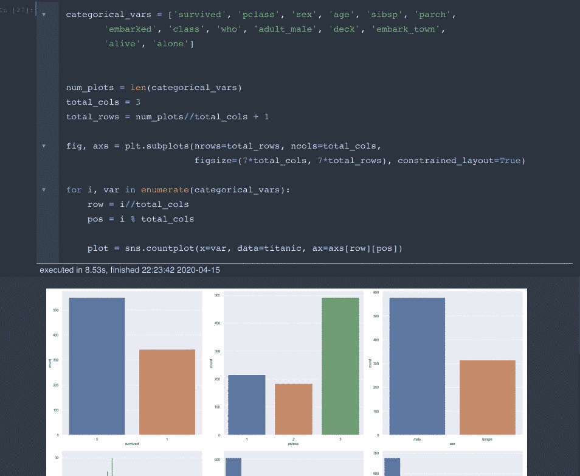
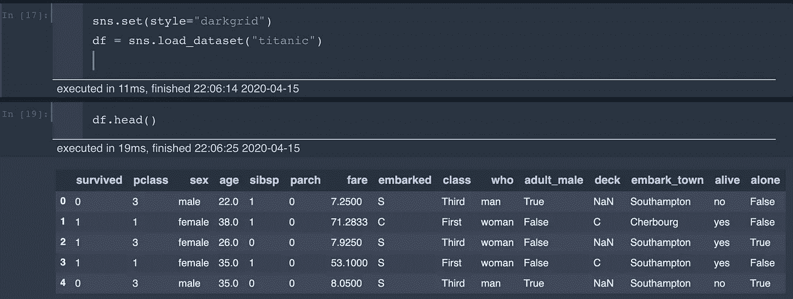
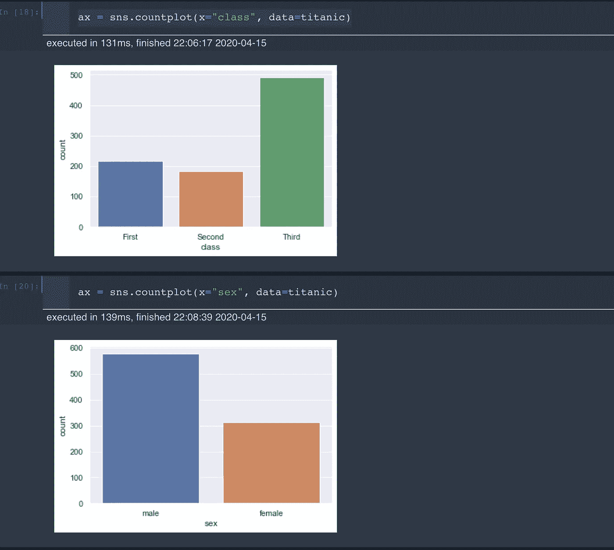
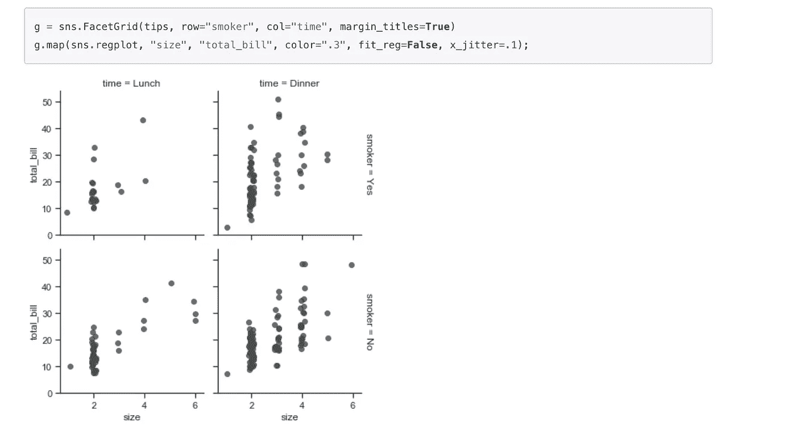
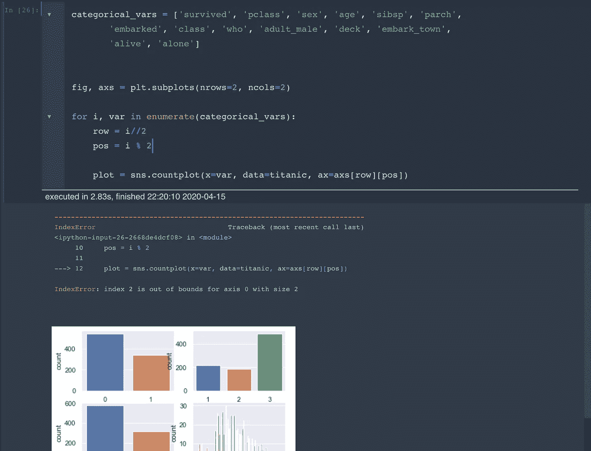
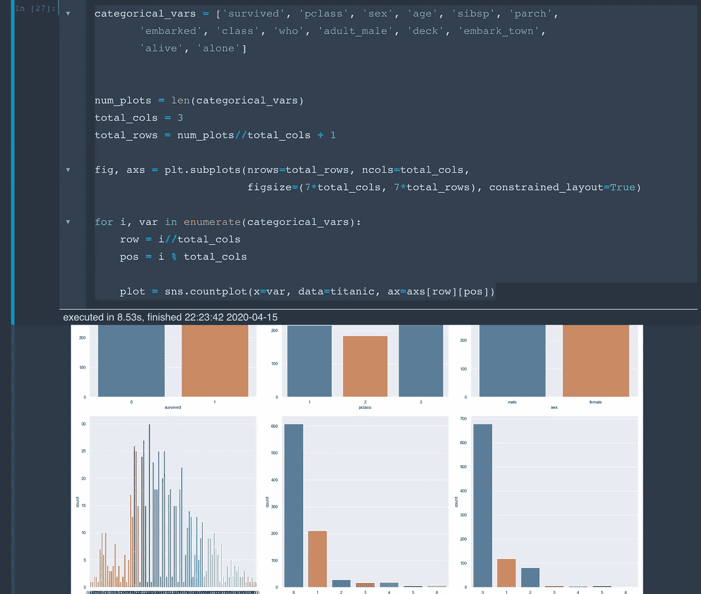
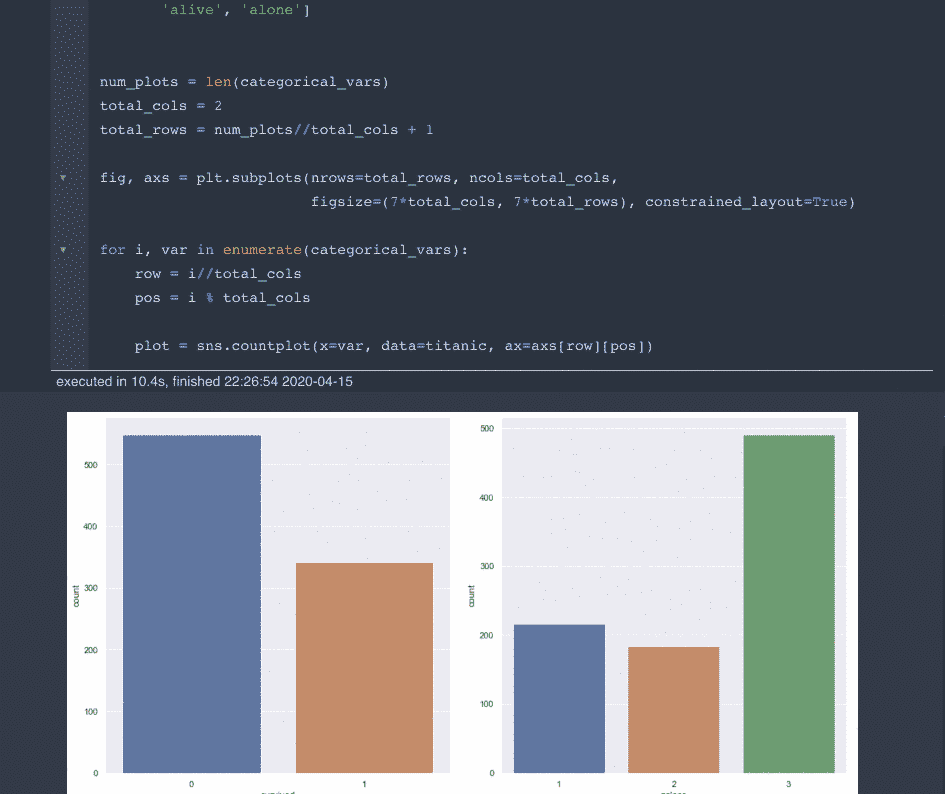
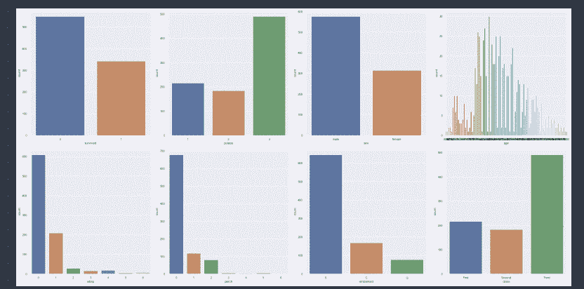

# Seaborn 中的动态子情节布局

> 原文：<https://towardsdatascience.com/dynamic-subplot-layout-in-seaborn-e777500c7386?source=collection_archive---------20----------------------->



# 在一个网格中可视化支线剧情

Seaborn 是最常用的可视化库之一，我喜欢使用它。在我最近的项目中，我想以一种动态的方式可视化多个支线剧情。令我惊讶的是，我没有在网上任何地方找到直接的解决方案，所以我想分享我的方法。它在任何数据分析工作中都非常有用。

# 目录

*   [问题](https://github.com/Createdd/Writing/blob/master/2020/articles/plottingDynamic.md#the-problem)
*   [走近](https://github.com/Createdd/Writing/blob/master/2020/articles/plottingDynamic.md#the-approach)
*   [解决方案](https://github.com/Createdd/Writing/blob/master/2020/articles/plottingDynamic.md#the-solution)
*   [将其更改为 2 列，看起来像这样](https://github.com/Createdd/Writing/blob/master/2020/articles/plottingDynamic.md#changing-it-to-2-columns-it-will-look-like-this)
*   [将其更改为 4 列，如下图所示](https://github.com/Createdd/Writing/blob/master/2020/articles/plottingDynamic.md#changing-it-to-4-columns-it-will-look-like-this)
*   [关于](https://github.com/Createdd/Writing/blob/master/2020/articles/plottingDynamic.md#about)

# 问题是

让我们看看泰坦尼克号的数据集:



有多个分类变量，我们可能希望用计数图来形象化。通过在每个新单元格中复制代码来实现这一点并不是最佳选择:



seaborn 有一个 FacetGrid 选项:



然而，我想有不同的支线剧情，我可以为自己设置每个情节。

# 方法

谢天谢地，还有支线剧情功能:

```
categorical_vars = ['survived', 'pclass', 'sex', 'age', 'sibsp', 'parch',
       'embarked', 'class', 'who', 'adult_male', 'deck', 'embark_town',
       'alive', 'alone'] fig, axs = plt.subplots(nrows=2, ncols=2)for i, var in enumerate(categorical_vars):
    row = i//2
    pos = i % 2 plot = sns.countplot(x=var, data=titanic, ax=axs[row][pos])
```

这导致:



这说明了我经常遇到的问题。对于多个变量，我总是需要手动设置行数和列数。(`fig, axs = plt.subplots(nrows=2, ncols=2)`)

# 解决方案

为了解决这个我，把它改成了:

```
categorical_vars = ['survived', 'pclass', 'sex', 'age', 'sibsp', 'parch',
       'embarked', 'class', 'who', 'adult_male', 'deck', 'embark_town',
       'alive', 'alone'] num_plots = len(categorical_vars)
total_cols = 3
total_rows = num_plots//total_cols + 1fig, axs = plt.subplots(nrows=total_rows, ncols=total_cols,
                        figsize=(7*total_cols, 7*total_rows), constrained_layout=True)for i, var in enumerate(categorical_vars):
    row = i//total_cols
    pos = i % total_cols plot = sns.countplot(x=var, data=titanic, ax=axs[row][pos])
```

这就导致了:



# 将其更改为两列，如下所示



# 将其更改为 4 列，如下所示



现在，我可以根据自己的意愿定义地块的布局，也可以决定要绘制什么。即使看起来挺容易的，网上也没找到相关的。所以也许这对你们有些人有帮助。)

# 关于

丹尼尔是一名企业家、软件开发人员和商业法毕业生。他曾在各种 IT 公司、税务咨询、管理咨询和奥地利法院工作。

他的知识和兴趣目前围绕着编程机器学习应用程序及其所有相关方面。从本质上说，他认为自己是复杂环境的问题解决者，这在他的各种项目中都有所体现。

如果您有想法、项目或问题，请不要犹豫与我们联系。


你可以在 https://www.buymeacoffee.com/createdd 支持我


连接到:

*   [领英](https://www.linkedin.com/in/createdd)
*   [Github](https://github.com/Createdd)
*   [中等](https://medium.com/@createdd)
*   [推特](https://twitter.com/_createdd)
*   [Instagram](https://www.instagram.com/create.dd/)
*   [createdd.com](https://www.createdd.com/)