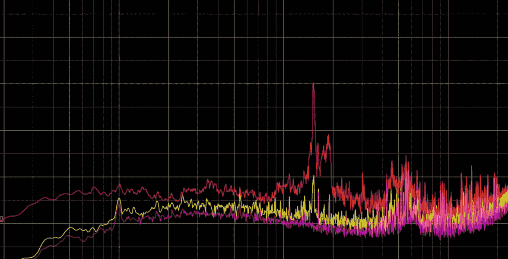
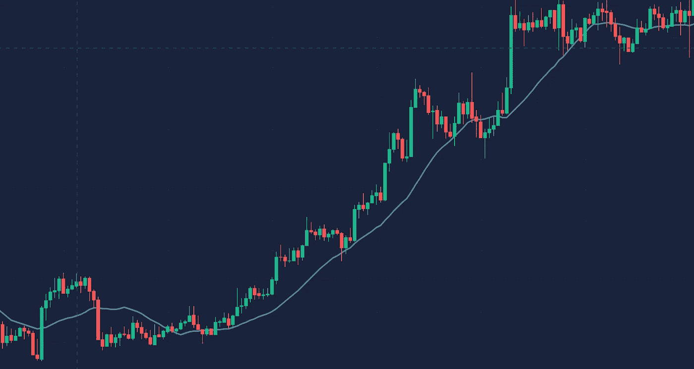
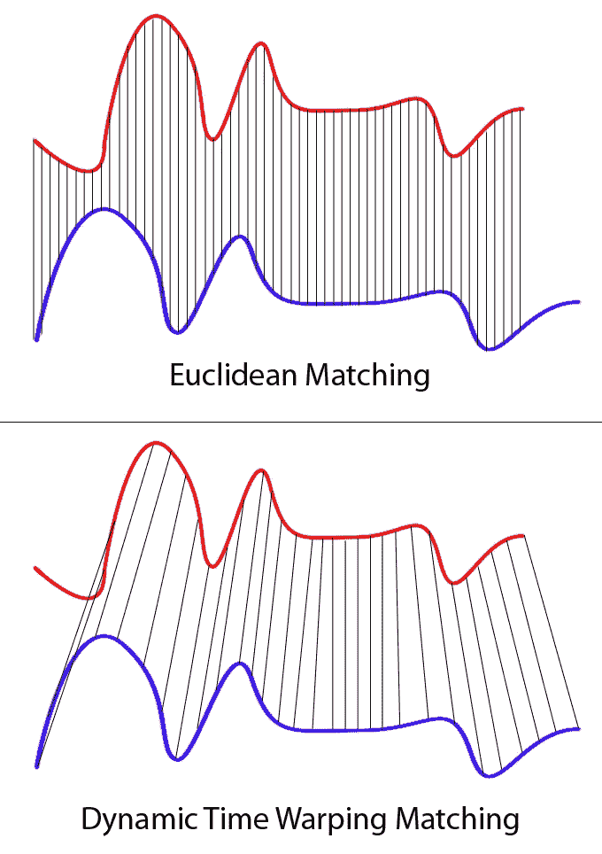
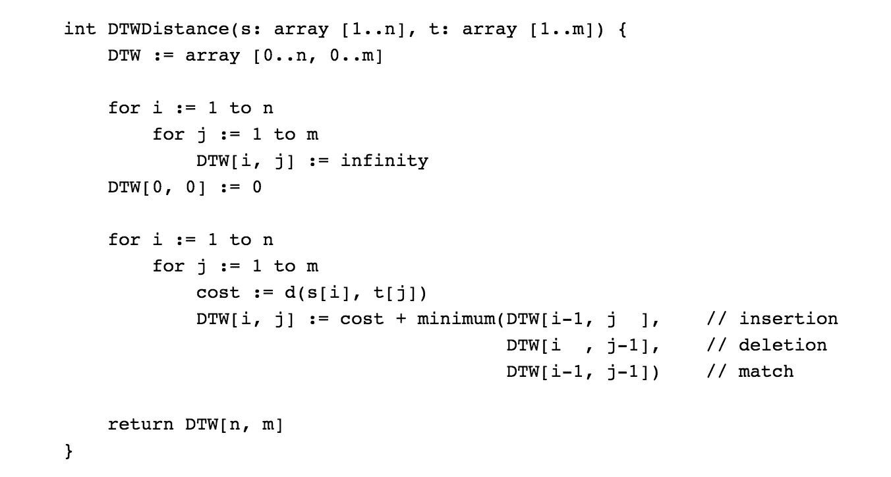
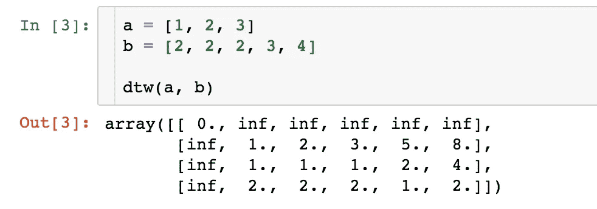
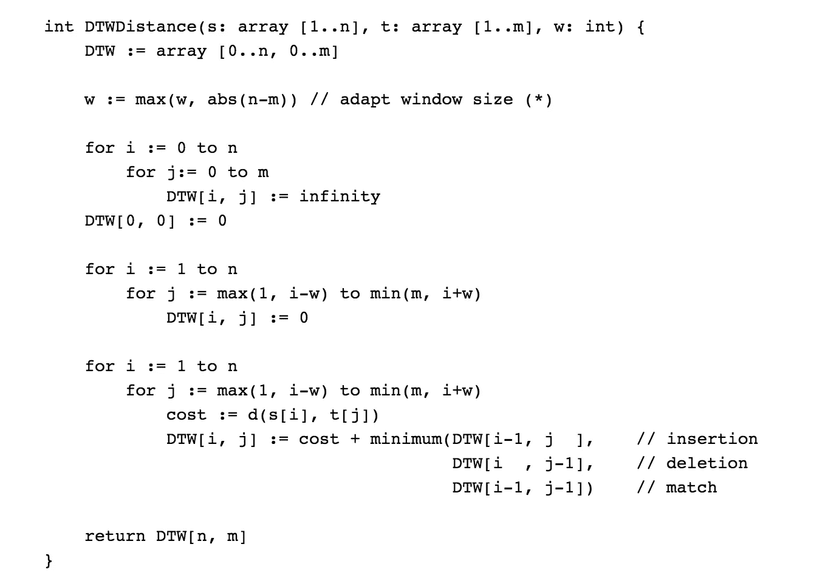
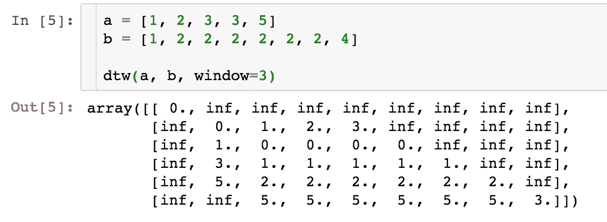

# 动态时间扭曲

> 原文：<https://towardsdatascience.com/dynamic-time-warping-3933f25fcdd?source=collection_archive---------0----------------------->

## 解释和代码实现

听起来像时间旅行或某种未来技术，然而，它不是。动态时间弯曲用于比较两个不同长度的数组或时间序列之间的相似性或计算它们之间的距离。

假设我们想计算两个等长数组的距离:

```
a = [1, 2, 3]
b = [3, 2, 2]
```

怎么做呢？一个显而易见的方法是以一对一的方式匹配`a`和`b`，并对每个分量的总距离求和。这听起来很容易，但是如果`a`和`b`的长度不同呢？

```
a = [1, 2, 3]
b = [2, 2, 2, 3, 4]
```

如何将它们搭配起来？哪个应该映射到哪个？为了解决这个问题，出现了动态时间扭曲。正如它的名字所表明的，扭曲系列，使他们能够匹配。

# 用例

在深入研究这个算法之前，你可能会问它有用吗？我们真的需要比较两个不等长时间序列之间的距离吗？

是的，在很多情况下，DTW 都扮演着关键角色。

## 声音模式识别

一个用例是检测同类的声音模式。假设我们想通过分析一个人的声音轨迹来识别他的声音，在一个场景中，我们能够收集他说`Hello`的声音轨迹。然而，人们以不同的方式说同一个词，如果他像`Heeeeeeelloooooo`一样以慢得多的速度说你好，我们将需要一种算法来匹配不同长度的声音轨道，并能够识别它们来自同一个人。



## 股票市场

在股票市场中，人们总是希望能够预测未来，然而使用通用机器学习算法可能是穷尽的，因为大多数预测任务需要测试和训练集具有相同维度的特征。然而，如果你曾经在股票市场投机，你会知道，即使是同一种股票形态，在价格线和指标上也会有非常不同的长度反映。



# 定义和理念

维基上对 DTW 的简明解释，

> 在时间序列分析中，动态时间弯曲(DTW)是用于测量两个时间序列之间相似性的算法之一，这两个时间序列的速度可能不同。DTW 已被应用于视频、音频和图形数据的时间序列——事实上，任何可以转化为线性序列的数据都可以用 DTW 进行分析。

*比较不同长度的数组的想法是建立一对多和多对一的匹配，从而使两者之间的总距离最小化。*

假设我们有两个不同长度的数组红色和蓝色:



显然，这两个系列遵循相同的模式，但蓝色曲线比红色曲线长。如果我们应用一对一的匹配，显示在顶部，映射没有完全同步，蓝色曲线的尾部被遗漏了。

DTW 通过开发一对多匹配克服了这个问题，这样具有相同模式的波谷和波峰就完美匹配，两条曲线都没有遗漏(如底部顶部所示)。

# 规则

一般来说，DTW 是一种计算两个给定序列(如时间序列)之间最佳匹配的方法，具有一定的限制和规则(来自 wiki):

*   第一个序列的每个索引必须与另一个序列的一个或多个索引匹配，反之亦然
*   第一个序列的第一个索引必须与另一个序列的第一个索引匹配(但不必是唯一的匹配)
*   第一个序列的最后一个索引必须与另一个序列的最后一个索引相匹配(但它不必是唯一的匹配)
*   来自第一序列的索引到来自另一序列的索引的映射必须是单调递增的，反之亦然，即如果`j > i`是来自第一序列的索引，则在另一序列中不能有两个索引`l > k`，使得索引`i`与索引`l`匹配，索引`j`与索引`k`匹配，反之亦然

最佳匹配由满足所有限制和规则并且具有最小成本的匹配来表示，其中成本被计算为每个匹配的索引对的值之间的绝对差的和。

总结起来就是*头尾一定要位置匹配，不能交叉匹配，不能遗漏。*

# 履行

该算法的实现看起来非常简洁:



其中`DTW[i, j]`是具有最佳对准的`s[1:i]`和`t[1:j]`之间的距离。

关键在于:

```
DTW[i, j] := cost + minimum(DTW[i-1, j  ],
                            DTW[i  , j-1],
                            DTW[i-1, j-1])
```

也就是说，长度为`i and j`的两个数组之间的成本等于*尾部之间的距离+长度为* `*i-1, j*` *、* `*i, j-1*` *和* `*i-1, j-1*` *的数组中的最小成本。*

用 python 来说就是:

示例:



`a and b`之间的距离将是矩阵的最后一个元素，即 2。

## 添加窗口约束

上述算法的一个问题是，我们允许一个数组中的一个元素匹配另一个数组中无限数量的元素(只要尾部最终能够匹配)，这将导致映射过度，例如，下面的数组:

```
a = [1, 2, 3]
b = [1, 2, 2, 2, 2, 2, 2, 2, ..., 5]
```

为了最小化距离，数组`a`中的元素 2 将匹配数组`b`中的所有元素 2，这导致数组`b`严重弯曲。为了避免这种情况，我们可以添加一个窗口约束来限制可以匹配的元素数量:



关键的区别在于，现在每个元素都被限制为匹配范围`i — w`和`i + w`中的元素。`w := max(w, abs(n-m))`保证所有指标能够匹配。

实现和示例如下:



# 应用包

Pypi 上还有一些贡献包可以直接使用。这里我用 [fastdtw](https://pypi.org/project/fastdtw/) 演示一个例子:

它给出了两个列表的距离和索引映射(这个例子可以扩展到一个多维数组)。

最后，您可以在这里查看实现。

**参考**:

[1][https://databricks . com/blog/2019/04/30/understanding-dynamic-time-warping . html](https://databricks.com/blog/2019/04/30/understanding-dynamic-time-warping.html)

[https://en.wikipedia.org/wiki/Dynamic_time_warping](https://en.wikipedia.org/wiki/Dynamic_time_warping)