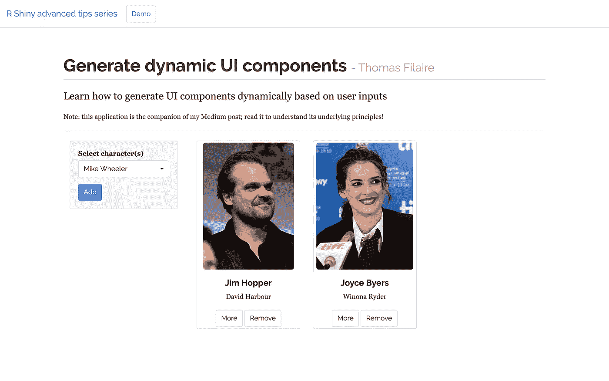
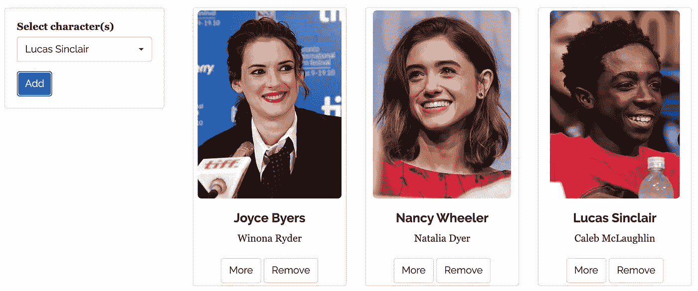
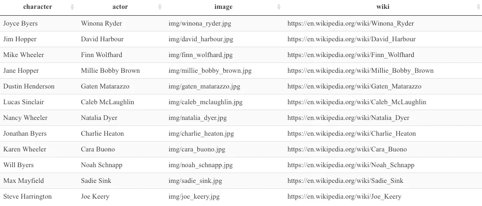
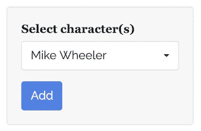
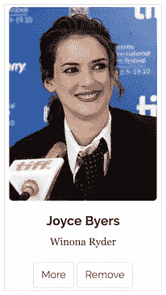
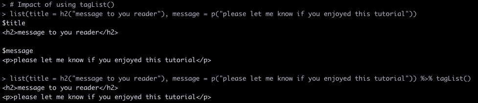

# 闪亮的动态用户界面(包括演示应用)

> 原文：<https://towardsdatascience.com/dynamic-ui-in-shiny-incl-demo-app-a6fb791be4c6?source=collection_archive---------31----------------------->

## 高级 R 闪亮吸头系列

## 为您的公司创建专业的 web 应用程序



用 R Shiny 构建企业级应用！—此处提供演示

## 序文

[闪亮的](https://shiny.rstudio.com/)已经成为一个非常流行的解决方案，直接从 [R](https://www.r-project.org/) 构建交互式网络应用。如此受欢迎，以至于公司中的大多数数据分析团队都将该框架作为其工具包的一部分。

然而，R Shiny 经常被认为是快速原型开发的好框架，但是对于工业化的、可扩展的解决方案来说不够健壮。

在本系列中，我将分享一些高级技巧，旨在克服这些异议，并帮助您**构建健壮/可持续/可扩展的应用程序，为生产中的业务使用做好准备**！

生产定义如下:

> 真实用户使用和依赖的软件环境，如果出现问题，会产生真实的后果——首席技术官郑中

**注**:为了从本教程中获得最大收益，感兴趣的读者应该已经熟悉基本的 Shiny 原则(例如反应性)、R 编程(例如函数定义、tidyverse、 ***purrr::map()*** )、web 开发(例如 html 标签和 css)以及 [RStudio 项目](https://support.rstudio.com/hc/en-us/articles/200526207-Using-Projects)。

## 目标和动机

在本教程中，我将重点描述一种基于用户输入动态生成 UI 组件的**可再现方式**。

这个特性在很多情况下都非常有用，因为你的应用程序的用户很可能会在他们的仪表板上显示一个先验未知数量的信息。仅举几个例子:

*   **在用户投资组合管理应用程序中添加/删除股票**
*   **在时间序列预测应用中考虑/忽略特定事件**
*   **在零售商业绩分析应用程序中包含/排除商店**
*   …

此外，我还将描述**如何定义观察器来触发动态生成的按钮**的动作，这不是一个简单的任务(因为它需要一点 JavaScript)。

## 闪亮的应用伴侣

本教程附带一个 R Shiny 演示应用程序，你可以在这里访问。

在这个特殊的教育示例中， **you** (用户)**可以根据需要选择尽可能多的陌生事物角色，并通过我称之为 ***的信息卡*** 显示每个角色的基本信息**。



这里用户显示了 3 个陌生事物角色的信息卡

每个角色的信息卡提供了额外的功能:

*   **访问** **到演员的**详细**维基百科页面**(点击“更多”按钮)
*   **删除信息卡** 的可能性(点击“删除”按钮)

**我的建议**:为了从本教程中获得最大收益，我建议尝试通过组合整篇文章中提供的各种代码来重建应用程序。主块以逻辑方式编号，这样你就不会在途中迷路。如果有必要的话，我的 bitbucket 账户[上的全部代码也可以在这里](https://bitbucket.org/cho7tom/dynamic-ui/src/master/)找到。请看看在项目结构中哪里存储图像。

## 0 —分析顺序

我指导您完成代码的方法如下:

1.  **设置场景**:描述需要的 R 包、底层数据集、应用主干
2.  **定义用户输入**:应用程序中用于捕获用户输入的 HTML 小部件的描述
3.  **定义 infocard 函数**:生成 HTML 代码的函数，结合 ***purrr::map()*** 函数，将非常有助于“即时”生成 infocard
4.  **服务器端定义**:创建反应值和观察器，使应用程序“闪亮”

## 1 —设置场景

要为本教程构建 R Shiny companion 应用程序:

我使用了以下 4 个**包** : [闪亮](https://shiny.rstudio.com/)、[闪亮主题](https://rstudio.github.io/shinythemes/)、[闪亮主题](https://dreamrs.github.io/shinyWidgets/index.html)和[无光泽](https://www.tidyverse.org/)

```
**# PART 1 - SETTING THE SCENE****# section 1.0 - load required packages**library(shiny)          # web app framework for R
library(shinythemes)    # themes for shiny
library(shinyWidgets)   # custom input widgets for shiny
library(tidyverse)      # collection of R packages for data science
```

我建立了一个小型的**数据集**，里面有关于主要陌生事物角色的基本信息(来源:[维基百科](https://fr.wikipedia.org/wiki/Stranger_Things#Acteurs_principaux)):

```
**# section 1.1 - build dataset**crm_tbl <- **tibble**(
    character = c("Joyce Byers", "Jim Hopper", 
                  "Mike Wheeler", "Jane Hopper",
                  "Dustin Henderson", "Lucas Sinclair",
                  "Nancy Wheeler", "Jonathan Byers",
                  "Karen Wheeler", "Will Byers",
                  "Max Mayfield", "Steve Harrington"),
    actor = c("Winona Ryder", "David Harbour", 
              "Finn Wolfhard", "Millie Bobby Brown",
              "Gaten Matarazzo", "Caleb McLaughlin",
              "Natalia Dyer", "Charlie Heaton",
              "Cara Buono", "Noah Schnapp",
              "Sadie Sink", "Joe Keery"),
    image = c("img/winona_ryder.jpg", "img/david_harbour.jpg", 
              "img/finn_wolfhard.jpg", "img/millie_bobby_brown.jpg",
              "img/gaten_matarazzo.jpg", "img/caleb_mclaughlin.jpg",
              "img/natalia_dyer.jpg", "img/charlie_heaton.jpg",
              "img/cara_buono.jpg", "img/noah_schnapp.jpg",
              "img/sadie_sink.jpg", "img/joe_keery.jpg"),
    wiki = c("[https://en.wikipedia.org/wiki/Winona_Ryder](https://en.wikipedia.org/wiki/Winona_Ryder)",
             "[https://en.wikipedia.org/wiki/David_Harbour](https://en.wikipedia.org/wiki/David_Harbour)",
             "[https://en.wikipedia.org/wiki/Finn_Wolfhard](https://en.wikipedia.org/wiki/Finn_Wolfhard)",
             "[https://en.wikipedia.org/wiki/Millie_Bobby_Brown](https://en.wikipedia.org/wiki/Millie_Bobby_Brown)",
             "[https://en.wikipedia.org/wiki/Gaten_Matarazzo](https://en.wikipedia.org/wiki/Gaten_Matarazzo)",
             "[https://en.wikipedia.org/wiki/Caleb_McLaughlin](https://en.wikipedia.org/wiki/Caleb_McLaughlin)",
             "[https://en.wikipedia.org/wiki/Natalia_Dyer](https://en.wikipedia.org/wiki/Natalia_Dyer)",
             "[https://en.wikipedia.org/wiki/Charlie_Heaton](https://en.wikipedia.org/wiki/Charlie_Heaton)",
             "[https://en.wikipedia.org/wiki/Cara_Buono](https://en.wikipedia.org/wiki/Cara_Buono)",
             "[https://en.wikipedia.org/wiki/Noah_Schnapp](https://en.wikipedia.org/wiki/Noah_Schnapp)",
             "[https://en.wikipedia.org/wiki/Sadie_Sink](https://en.wikipedia.org/wiki/Sadie_Sink)",
             "[https://en.wikipedia.org/wiki/Joe_Keery](https://en.wikipedia.org/wiki/Joe_Keery)")
)
```



应用中使用的输入存储为[tible](https://tibble.tidyverse.org/)

我选择用 2 个活跃的角色初始化应用程序，这意味着当应用程序启动时，将显示 2 个信息卡:

```
**# section 1.2 - set initial selection** current_user_selection <- c("Jim Hopper", "Joyce Byers")
```

最后，我为应用程序构建了一个基本的**主干**，由以下部分组成:

*   一个[导航条页面](https://www.rdocumentation.org/packages/shiny/versions/1.5.0/topics/navbarPage)(空白[引导 3](https://getbootstrap.com/docs/3.3/) 带有顶级导航条的页面)
*   一个左侧栏(我用了[***shiny::well panel()***](https://www.rdocumentation.org/packages/shiny/versions/1.5.0/topics/wellPanel)函数)
*   信息卡区域

```
**# PART 2 - UI PART****# app backbone**ui <- **navbarPage**(
    title = "R Shiny advanced tips series",
    collapsible = TRUE,
    windowTitle = "R Shiny tips",    

    **tabPanel**(
        title = "Demo",

        **# section 2.1 - header** 

 **# section 2.2 - sidebar panel**
        div(
            class = "container",
            column(
                width = 3,
                **wellPanel**(
                    **p("PLACEHOLDER - USER INPUTS")**
                )
            ),
            column(
                width = 9,
                div(
                    # render thumbnails dynamically (ui)
                    **p("PLACEHOLDER - INFOCARDS")**
                )
            )
        )
    )
)**# PART 3 - SERVER PART**
server <- function(input, output, session) {

}**# PART 4 - RUN APPLICATION**
shinyApp(ui = ui, server = server)
```

header (backbone 的 2.1 节)是一个简单的容器，我在其中显示了应用程序的基本信息。我利用现有的引导类使文本引人注目(见*页眉*和 *lead* 类)

```
# >> insert in section 2.1div(
    class = "**container**", 
    h1(class = "**page-header**", 
       "Generate dynamic UI components", 
       tags$small("- Thomas Filaire")),

     p(class = "**lead**", 
       "Learn how to generate UI components dynamically based on user inputs"),

     p("Note: this application is the companion of my Medium post; read it to understand its underlying principles!")
)
```

**2 —定义用户输入**



添加新信息卡的选择器+按钮

为了说明动态 UI 功能，我构建了一个非常简单的**选择器**，供用户选择她/他最喜欢的陌生事物角色。选中后，只需点击“添加”**按钮**即可显示相应的信息卡。

虽然 shiny 包中的基本的[***selectin put()***](https://shiny.rstudio.com/gallery/widget-gallery.html)很棒，而且我大部分时间都在使用它，但我还是选择了[***shinyWidget::pickerInput()***](https://www.rdocumentation.org/packages/shinyWidgets/versions/0.5.3/topics/pickerInput)替代，它提供了许多好处，特别是 **live search 功能**。测试它，我相信你会采纳它！

```
# >> insert inside wellPaneldiv(
    shinyWidgets::**pickerInput**(
         inputId  = "pi_character_selector", 
         label    = "Select character(s)",
         choices  = crm_tbl %>% pull(character),
         multiple = FALSE,
         selected = "Mike Wheeler",
         options = **pickerOptions**(
                         actionsBox = FALSE,
                         **liveSearch = TRUE**,
                         size       = 10
                         )
     )
),
div(
    **actionButton**(
          class = "btn-primary",
          inputId = "ab_show_character", 
          label = "Add"
          )
    )
)
```

## 3-定义信息卡功能



我构建了一个**函数来生成 infocard** (因此是一段 HTML 代码)，稍后我将在一个 ***purrr::map()*** 函数中从服务器端调用它，以将其应用于一个陌生事物字符列表。

作为一名优秀的程序员，你应该拥抱[函数式编程](https://adv-r.hadley.nz/fp.html)，因为它迫使你创建易于独立分析的函数，并避免不必要的代码重复，提高可读性。

该函数将一个角色的名字作为输入，并返回 infocard (HTML 对象)。需要注意的 3 件重要事情:

1.  请注意**呈现 HTML 代码是如何像生成数字、列表、图表等一样简单。**，我们平时用函数做的。
2.  注意 bootstrap 3 的预先存在的类 (img-rounded，caption，btn-default)的**用法，加上分配给‘remove button’的 rm_btn 类，我将在本教程的第 4 部分进一步阐述。**
3.  注意非常有用的 *stringr::str_glue()* 函数的用法，我用它给每个按钮分配唯一的 id。**这是一个关键部分，因为 id 必须是唯一的，并且需要在点击相应按钮时触发动作**。

[***【str _ glue()***](https://www.rdocumentation.org/packages/stringr/versions/1.4.0/topics/str_glue)使得在字符串内插入变量值变得容易。为了使每个按钮的 id 都是唯一的，我采用了以下模式:

*   对于“更多”按钮:**ab _ more _ character _ name**(ab 代表 actionbutton)。
*   对于“移除”按钮:**ab _ remove _ character _ name**。

如 ab_more_joyce_byers、ab_remove_joyce_byers 等。

我还使用了 [stringr](https://stringr.tidyverse.org/) 包中的函数来小写/大写所选角色的名字，并添加/删除“_”，从而使 string 成为一个有效的 id。

```
# >> insert infocard definition as section 1.3 in PART 1 - SETTING THE SCENE of your app.R file**# section 1.3 - define custom infocard**my_infocard <- **function**(selected_character) {

    # selected_character == value from user pickerInput
    # e.g. "Mike Wheeler"

    selected_image <- crm_tbl %>% 
        filter(character == selected_character) %>% 
        pull(image)  # get image url from dataset

    selected_actor <- crm_tbl %>% 
        filter(character == selected_character) %>% 
        pull(actor)  # get actor's name from dataset

    selected_wiki <- crm_tbl %>% 
        filter(character == selected_character) %>% 
        pull(wiki)   # get wikipedia's link from dataset

    # piece of UI to render dynamically
    column(
        width = 4,
        div(
            class = "**thumbnail text-center**",

            # picture
            img(
                class = "**img-rounded**",
                style = "height: 300px;",
                src = selected_image
            ),

            # main information
            div(
                class = "**caption**",
                h4(selected_character),
                p(selected_actor)
            ),

            # link to wikipedia's page
            **actionButton**(
                class = "**btn-default**",
                inputId = **str_glue("ab_more_{selected_character %>%
                          tolower() %>% 
                          str_replace_all(' ', '_')}")**,
                label = "More",
                onclick = **str_glue("window.open('{selected_wiki}', '_blank')")**
            ), # remove button
            **actionButton**(
                class = "**btn-default** rm_btn",
                inputId = **str_glue("ab_remove_{selected_character %>%
                           tolower() %>% 
                           str_replace_all(' ', '_')}")**,
                label = "Remove"
            )
        )
    )
}
```

## 4 —服务器端定义

一旦我们定义了应用程序的主干，并构建了生成定制信息卡的函数，让我们跳到服务器端。

首先，我使用了一个***event reactive()***函数来捕获用户通过 pickerInput 小部件选择的任何新字符。***event reactive()***仅当用户点击“添加”按钮(其 id 为 input$ab_show_character)确认其选择时，才允许更新电抗组件。

```
# >> insert in server part # get user's selected character when 'Add' button is clicked
current_character <- eventReactive(
        eventExpr = input$ab_show_character, {
            input$pi_character_selector
        })
```

每当用户选择一个新字符时，必须捕获信息并将其添加到先前选择的字符列表中。我使用了一个***reactive values()***来存储选择的字符，用第 1 部分定义的 current_user_selection 初始化。

每当单击“添加”按钮时，observeEvent 都会更新 reactive_values。我在管道中插入了一个 ***unique()*** ，以确保*信息卡*被多次创建，因此只显示一次。

```
# >> insert in server part# store user's selection
reactive_values <- reactiveValues()
reactive_values$character_list <- current_user_selection# add character when relevant
observeEvent(input$ab_show_character, {
    reactive_values$character_list <- 
        c(reactive_values$character_list, 
          current_character()) %>% 
        **unique**()
})
```

基于 reactive_values$character_list(用户选择的字符列表)，我在 renderUI 块中根据需要生成尽可能多的*信息卡*，然后通过相应的 uiOutput 在 UI 中“渲染”:

```
# >> insert in the main area of ui section**uiOutput**(outputId = "infocards")
```

为了构建 UI 部分，我在 ***函数中传递了字符列表，以便根据需要多次调用自定义的 ***my_infocard()*** 函数。当 ***purrr::map()*** 返回一个列表时，我用 ***tagList()*** 函数将结果管道化，以将输出绑定在一起，并生成一个唯一的(可能很大的)HTML 部分。***

请看下面截图中关于 ***tagList()*** 如何工作的直观解释:



tagList()将几段 HTML 代码组合成一个块，然后可以通过经典的“renderUI x uiOutput”组合来呈现

在开发的这个阶段，应用程序应该几乎按照预期工作。

> **最后的触碰**

最后添加的功能是通过点击“删除”按钮来删除信息卡。

我在这里使用了一点 JavaScript。我不会详细讨论 JavaScript(我远不是这一领域的专家)，但请注意:

*   JavaScript 通过**标签** (head 和 Script)插入到 R Shiny 应用程序的 HTML 代码中
*   每当点击带有 rm_btn 类的按钮**时，代码只是存储按钮 id (rm_btn_id)**

```
# >> insert in the tabPanel, below title# JS function to identify button id when clicked
tags$**head**(
    tags$**script**(
        HTML("$(document).on('click', '**.rm_btn**', function () {
                        Shiny.onInputChange('**rm_btn_id**', this.id);
                    });"
        )
    )
),
```

因为“移除”按钮有 rm_btn 类(见 1.3 节中的定义)，所以每当它们被点击时，Shiny 将访问它们各自的 id。最后，我利用这一点，通过一个***observe event()***，从字符列表中删除相应的字符。

```
# >> insert in server part# remove infocard
**observeEvent**(input$**rm_btn_id**, {
    reactive_values$character_list <- 
       reactive_values$character_list %>% 
       .[reactive_values$character_list %>% 
            toupper() **!=** input$rm_btn_id %>% 
            str_remove("ab_remove_") %>% 
            toupper() %>% 
            str_replace("_", " ")]
})
```

我们完事了。如果你能坚持到现在，恭喜你！。

## 关键要点

*   shinythemes 是一个非常棒的软件包，可以非常容易地让你的应用程序看起来很专业
*   顺序是:用户输入列表+ map("生成 HTML 代码的函数")+ tagList()非常强大，并且在我看来是可读的。
*   创建函数来生成 HTML 片段，以避免代码重复，并轻松使用上述序列

## 结论

我希望这篇文章对您有用，并能帮助您构建更好的应用程序。**你可以在我的 bitbucket repo** [**这里**](https://bitbucket.org/cho7tom/dynamic-ui/src/master/) 找到完整的代码。

请不要犹豫发送任何反馈或问题！

**来源**

*   [R 闪亮的备忘单](https://shiny.rstudio.com/articles/cheatsheet.html)
*   [通过 JavaScript 与 Shiny 通信](https://shiny.rstudio.com/articles/communicating-with-js.html)
*   [商业科学 202A —使用 R 构建可扩展的应用](https://university.business-science.io/p/expert-shiny-developer-with-aws-course-ds4b-202a-r/)