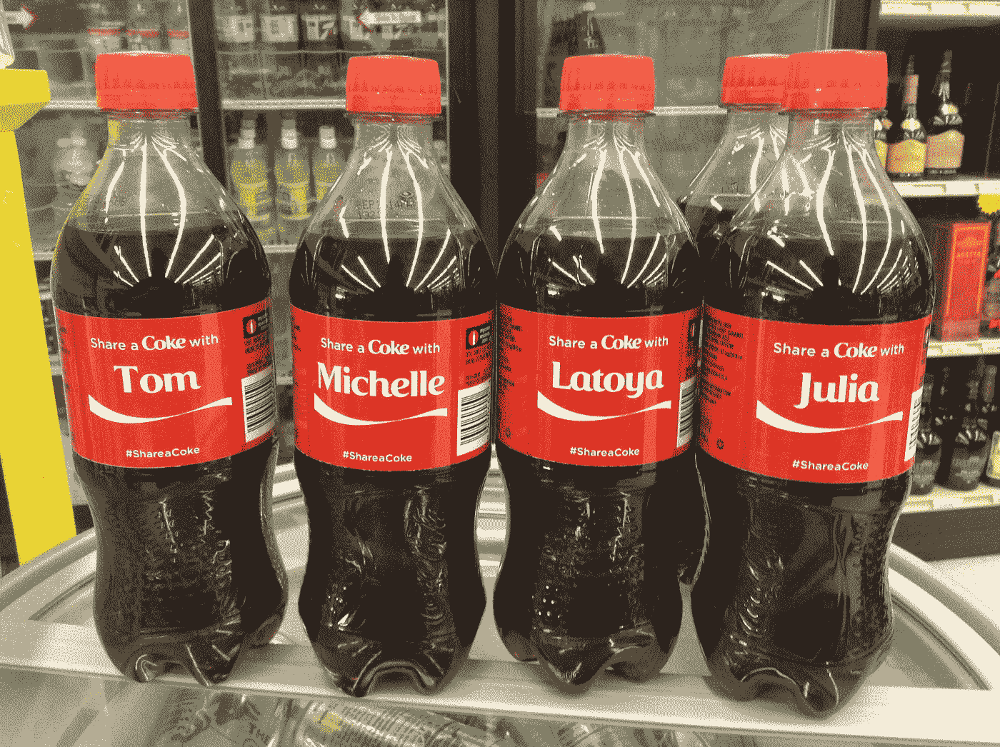
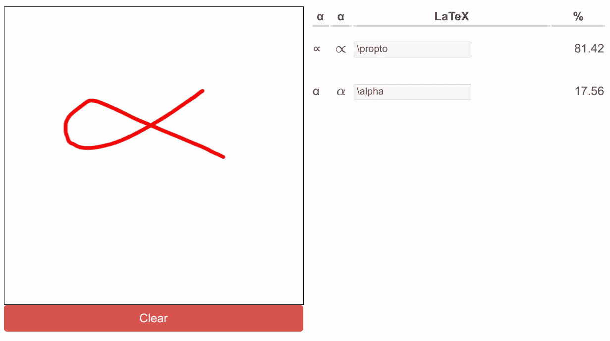

# 动态与个性化

> 原文：<https://towardsdatascience.com/dynamic-vs-personalized-4689bb9e4648?source=collection_archive---------54----------------------->

## 你需要知道的区别，以改善你的沟通

约翰·施诺布里奇在 [Unsplash](https://unsplash.com?utm_source=medium&utm_medium=referral) 上的照片

今天，人们希望网站和服务能够适应他们的具体情况。在特定时刻根据我们的需求定制的服务对我们更有用——让它成为谷歌的网络搜索，用地图规划下一个假期，在亚马逊上查找产品，或者在网飞上搜索下一个要疯狂观看的剧集。我们喜欢能在 Zazzle 上买到的定制商品和印有我们名字的可乐。

作为一名数据科学家，我思考了 web 服务定制的不同种类，并意识到有一些重要的类型需要区分。最重要的是:服务**是动态的**还是**个性化的**——或者两者都是？

> 动态服务会随着一天中的时间、一周中的日期或季节而变化。个性化服务因用户而异。

想想谷歌地图上的度假计划。当你什么都不输入的时候，什么部分显示给你？当然是离你现在位置尽可能近的东西。这完全取决于你。谷歌地图是个性化的。如果您搜索“餐馆”，如果您在下午或晚上搜索，结果可能会有所不同。下午的搜索可能会显示咖啡馆，而晚上的搜索可能会显示酒吧。我希望每个用户都有这种行为。所以是**动态**。

还有一些不太清楚的信号:设备类型(智能手机对平板电脑对台式机)，互联网连接速度，如果你在一个有容量限制的计量网络上，例如移动互联网，我会想到。虽然这些可能会导致网络应用程序的变化，但本质上更具技术性。有些更多的是关于[响应式网页设计](https://en.wikipedia.org/wiki/Responsive_web_design)。

> 如果仅仅是关于如何呈现而不是呈现什么，这就是一个响应性的网页设计主题。

典型的例子是为适应小屏幕而改变布局，以及为慢速或计量网络而改变图像大小/裁剪。

# 定制与个性化

定制和个性化都是产品对用户的适应。区别在于谁在推动适应:

> 定制是用户根据用户的需求调整产品。个性化是由销售者根据用户调整产品。

我故意不写个性化是对用户需求的调整，因为有时它实际上可能会伤害用户。想一想国外的一家商店，他们看到你是游客后会提高价格。

个性化可乐瓶。迈克·莫扎特的图片([来源](https://commons.wikimedia.org/wiki/File:Share_a_Coke_Name_Promotional_Coca_Cola_Bottles_(14483573386).jpg))

# 给我看例子！

*   **服装店**有动态价格:当新一季开始时，旧衣服需要处理掉。价格在季末会降低。
*   **可乐**在瓶子上印名字。这是一个定制的例子。用户选择他们想要的瓶子，因此他们是推动产品“变化”的人。Nutella 做了类似的东西。
*   像宝马[的**汽车配置器**就是配置定制的一个例子。日产计划扩展这种能力，并将其称为“超个性化”(](https://www.bmw.com.sg/en/ssl/configurator.html#/)[来源](https://phys.org/news/2016-11-nissan-banks-after-sales-hyper-personalization-revenue.html))——当客户驾驶它时，它仍然是定制。
*   **营销信函**在这些信函中，你会收到一条信息，上面有你的完整地址、你的名字，可能还会对文本进行一些轻微的调整**个性化**。是的，很琐碎。是的，它只是简单地使用模板和规则。没人说个性化总是要硬的吧？
*   [**Zazzle**](https://www.zazzle.com/) 提供许多可以定制的产品，例如印有你名字的 t 恤。

当然，有一些明显的候选软件，您也可以在其中看到这些主题:

*   **动态定价**被亚马逊([来源](https://www.fastcompany.com/3060803/algorithmic-pricing-is-creating-an-arms-race-on-amazons-marketplace))、酒店([来源](https://www.sciencedirect.com/science/article/abs/pii/S144767701930083X))、火车和汽车票(日期越近，车票越贵)广为人知地使用。这里的想法是通过算法根据需求调整价格。当供给不能改变时，这在理论上导致更好的资源利用。
*   大多数人真的不喜欢个性化定价，但这可能会发生在飞机票上([来源](https://www.washingtonpost.com/lifestyle/travel/could-dynamic-pricing-be-influencing-how-much-you-pay-for-your-plane-ticket/2020/08/19/7e77e182-e17d-11ea-8181-606e603bb1c4_story.html))。有传言称，一些公司提高了 iPhone 用户的价格，因为他们有更多的钱，更愿意支付，但我没有找到证据证明这一点。
*   **网飞**非常个性化，甚至将此作为他们业务的核心部分。我也以非常相似的方式想到了 Spotify。
*   搜索气泡是个性化的另一个例子。无论是谷歌搜索还是 Facebooks 的新闻订阅:影响你看到的内容都会产生巨大的影响。因为这是你无法控制的，所以这是个性化。

# 个性化的含义是什么？

P 个性化服务更难甚至不可能**缓存在服务器端**。你需要考虑隐私。您可能需要向用户传达这种个性化。可能会有**法规**强迫你公开正在使用的部分算法([例子](https://techcrunch.com/2019/01/15/how-do-you-fight-an-algorithm-you-cannot-see/))，以确保没有针对少数族裔的偏见。

尤其是如果你应用机器学习，沟通决策过程是很困难的。这对于内部对准以及外部透明度来说都是一个问题。人们倾向于说机器学习算法不可解释，甚至说我们不理解模型如何做出决策。我强烈反对这种说法，但这是另一回事。如果你感兴趣，我推荐你阅读扎克·蔡斯·利普顿的《模型可解释性的神话》。

解释决策的需要可能会迫使你存储个人信息。万一有数据泄露， [GDPR](https://en.wikipedia.org/wiki/General_Data_Protection_Regulation) 强迫你通知受影响的人。这不仅是一场公关噩梦，而且为这个案子做准备会让事情变得更加复杂。总结一下:

> 只有在收益证明努力是合理的情况下，才个性化产品。

# 动态服务也有同样的问题吗？

D 动态服务不像个性化服务那样有隐私相关的问题。动态服务的信号也可能比个性化服务少。这使得沟通决策过程变得更加容易。影响因素较少意味着缓存可能更容易。这也可能意味着人们可以**预先计算**服务的结果！预计算很棒，因为它使确保服务的可用性变得更加简单。还能让服务快如闪电！

# 它是完全动态的还是个性化的？

N o！肯定不是！举个例子，以我的小服务 write-math.com 为例，它允许你画一个符号(希腊或拉丁字母，数字，箭头，其他一些)并告诉你你画了什么。它既不是动态的，也不是可定制或个性化的。

write-math.com 的截图。画出了希腊字母α，并认出了两个非常相似的符号。图片作者。

我可以通过让你选择想要识别的符号组来使它**可定制**。字母和数字很无聊吗？把它们关掉。

我也可以通过查看在一天中的哪个时间典型地查找哪些符号来使其动态化。我可以告诉你，很多人画阴茎，我猜想这可能与当地时间有关。

我也可以通过创建个人资料来个性化它。如果单个用户输入了足够多的符号，我会比显示“未知”符号更多地显示该用户已经输入的符号。

照片由[Alperen yazg](https://unsplash.com/@armato?utm_source=medium&utm_medium=referral)在 [Unsplash](https://unsplash.com?utm_source=medium&utm_medium=referral) 上拍摄

# 胜利的随机性！

想清楚你的目标。优选地从用户的角度来看。如果你有一个新闻聚合网站，用户不会从更动态的页面中受益。但是用户可能受益于探索更多内容的可能性。拥有更动态的页面是实现这一目标的一种方式。你可以在这里做各种有趣的事情，但是有一个简单的入门技巧:随机选择。不一定是每一个电话，但只要你想得到你认为好的动态。这给了你一个机会去观察用户的反应，理解技术上的困难，并收集更聪明的方法。