# 在 Power BI 中动态显示任务

> 原文：<https://towardsdatascience.com/dynamically-display-tasks-in-power-bi-cd19425acc4b?source=collection_archive---------47----------------------->

## 棘手的任务有时可以比你想象的更容易解决，用一点 DAX 魔法！


尼克·费因斯在 Unsplash.com 拍摄的照片

几周前，我正在处理客户支持部门的一个请求。从本质上来说，业务请求是为了让主管能够[动态地过滤](/dynamic-filtering-in-power-bi-5a3e2d2c1856)需要执行的任务。

由于主管也有他们自己的任务，他们应该能够在他们自己的任务和来自所有代表的任务之间动态地切换视图。

## USERNAME() & USERPRINCIPALNAME()函数

像往常一样，DAX 为您的挑战提供了便捷的解决方案。这一次，我将使用其中一个信息函数…或者更准确地说，不是一个，而是两个，它们非常相似，但在不同的环境下仍然会产生不同的结果。

让我们从 *USERNAME()* 函数开始。这个函数将返回当前连接的域名和用户名。所以，如果我创建这样的度量:

```
My User = USERNAME()
My User Principal = USERPRINCIPALNAME()
```

把它放在一个简单的卡片上，这是我得到的结果:

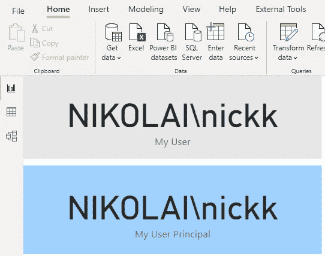

*USERPRINCIPALNAME()* 将返回 UPN(用户主体名)。根据您的设置，在 Power BI Desktop 中，结果可以与 *USERNAME()* 函数完全相同(就像我的例子一样)，或者它可以返回登录到 Power BI Desktop 的用户的电子邮件地址。

但是，一旦您将报告发布到 Power BI Service，这两个函数将表现相同，并将电子邮件地址作为一个值返回:

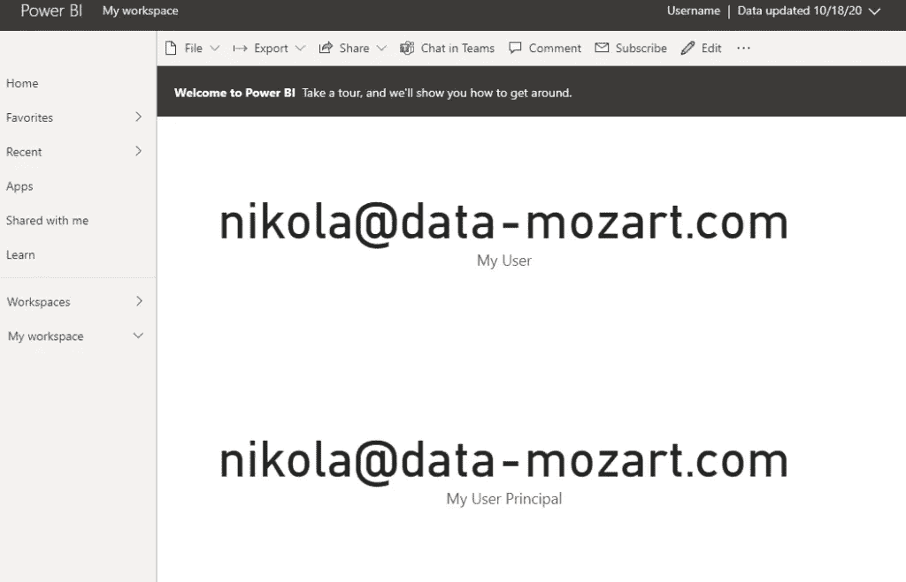

## 解决原始问题

现在，回到我最初的问题，这里是我们如何利用这些函数找到一个优雅的解决方案。

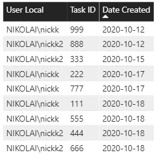

这是一个包含与任务相关的数据的表格。如您所见，我有一个任务被分配到的用户、任务 ID 和任务创建的日期。

另一个表包含关于用户的数据(我创建了一个虚拟的第二个用户，只是为了模拟真实的场景):

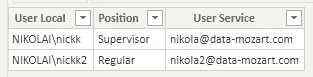

两个表通过用户本地列连接，如下图所示:

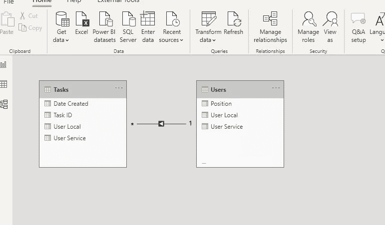

最重要的一步是定义一个计算“我的”任务的方法——当我说“我的”时，我指的是浏览报表的用户的任务。

以下措施将有助于我们实现这一目标:

```
My Tasks = CALCULATE(
                    COUNTROWS(Tasks), 
                    KEEPFILTERS(Users[User Local] = USERNAME()
                    )
                    )
```

使用 *KEEPFILTERS()* 函数，我们正在修改 *CALCULATE* 函数的默认行为，因为在 *CALCULATE* 函数中定义的过滤器参数将替换指定列上的所有现有过滤器。

应用 *KEEPFILTERS* ，如果*计算*过滤器替换当前上下文， *KEEPFILTERS* 会将过滤器添加到当前上下文。

也就是说，如果我将这种方法用于卡片视觉，我会得到以下结果:

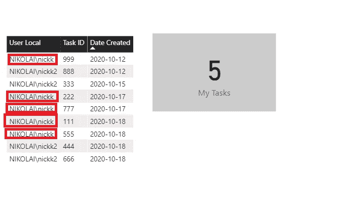

由于我以 NIKOLAI\nickk 的身份登录，我看到有 5 项任务分配给了我，这是正确的。

## 最终抛光以获得更好的体验

现在，我希望我的主管用户能够选择他希望在报告中看到的内容:所有任务或仅分配给她/他的那些任务。为此，我将使用[书签](/build-pro-slicer-pane-in-power-bi-911248b39348)并在我的报告页面中做一些调整。

第一步是创建现有表的副本，并对其应用筛选器，以便只显示我的任务度量值大于 0 的行:

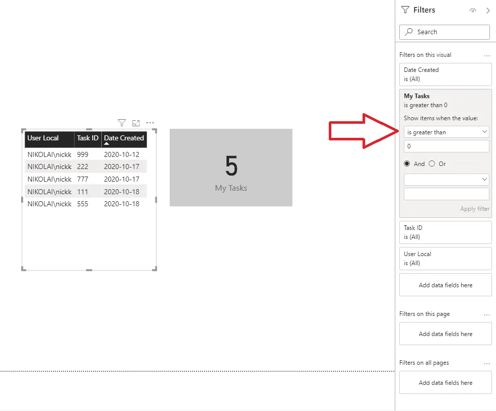

我将这个新表放在旧表的正上方，旧表显示所有任务。我将切换标题的背景颜色，这样用户也可以根据颜色来区分表格。

接下来是我的解决方案的最后润色:我将在报告画布上放置一个[按钮，使我的用户能够在两个不同的视图之间动态切换。或者，更好的是，我将把两个按钮一个放在另一个上面，以节省报告页面的空间，同时保留书签操作的全部功能。](/drillthrough-like-a-pro-in-power-bi-ed92effcfe72)

最后一步是创建书签，并为每个书签定义适当的操作:

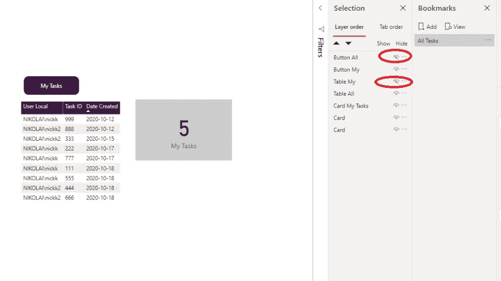

“所有任务”书签将隐藏两个视觉效果(请参见上图)，而“我的任务”书签将应用类似的逻辑，但方向相反:

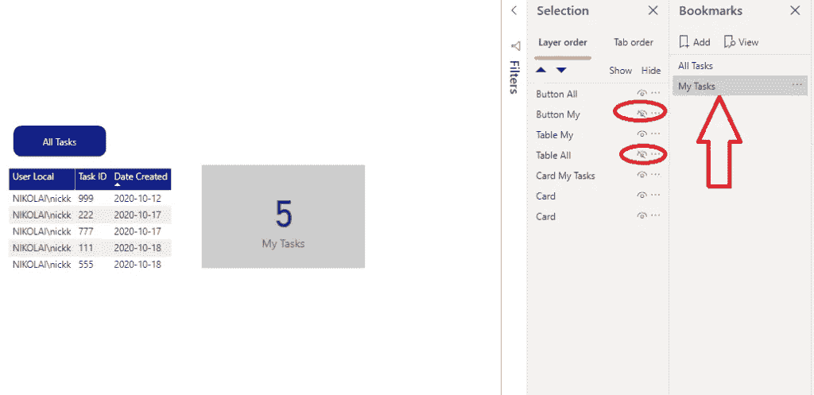

最后，让我们为按钮定义操作，以便能够在刚刚创建的两个书签之间导航:

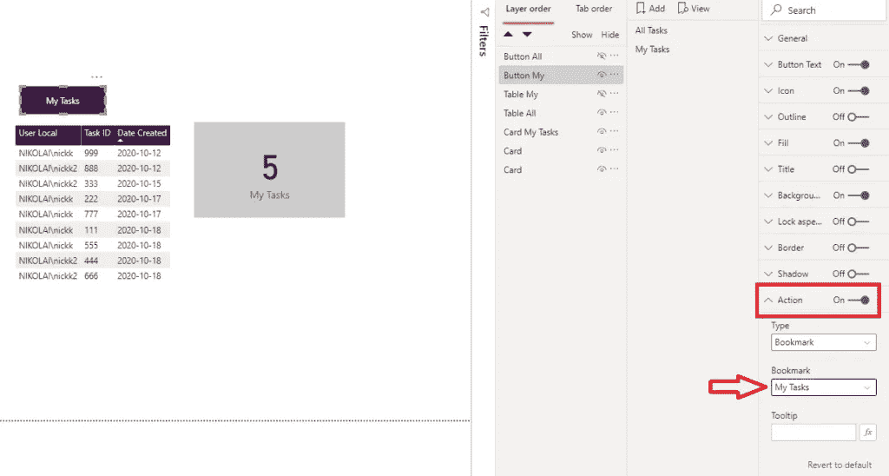

完成后，我们的最终解决方案是这样的:

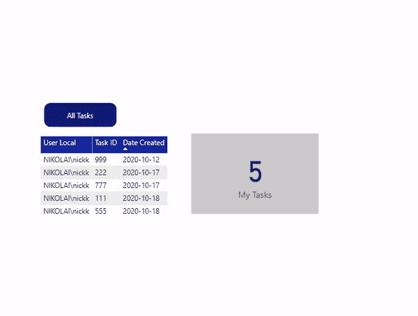

在我们结束之前， ***一个重要的备注*** :为了让这个技巧在 Power BI 服务中工作，您需要切换我的任务度量中的函数，使用*用户服务*而不是*用户本地*:

```
My Tasks = CALCULATE(
                    COUNTROWS(Tasks), 
                    KEEPFILTERS(Users[User Service] = USERNAME()
                    )
                    )
```

## 结论

乍一看，最初的请求似乎很棘手，很有挑战性。然而，通过应用一些基本但有用的 DAX 函数，并使用书签稍作调整，我们能够为我们的用户提供一个优雅而有效的解决方案。

感谢阅读！

[成为会员，阅读 Medium 上的每一个故事！](https://datamozart.medium.com/membership)

订阅[此处](http://eepurl.com/gOH8iP)获取更多有见地的数据文章！