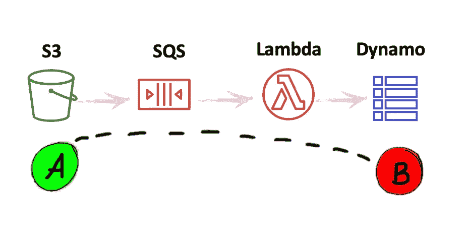

# 在 30 分钟内将 1 亿多条记录导入 DynamoDB

> 原文：<https://towardsdatascience.com/dynamo-exports-may-get-your-data-out-but-this-is-still-the-fastest-way-to-move-data-in-5bcd9748cc00?source=collection_archive---------2----------------------->

## AWS 上周发布了一个新功能，只需点击几下就可以导出一个完整的 Dynamo 表，但了解如何用任何规模的数据来水合一个表也是值得的。


杰瑞米·毕晓普在 [Unsplash](https://unsplash.com/s/photos/background?utm_source=unsplash&utm_medium=referral&utm_content=creditCopyText) 拍摄的照片

在设置将 DynamoDB 表[完全导出](https://aws.amazon.com/about-aws/whats-new/2020/11/now-you-can-export-your-amazon-dynamodb-table-data-to-your-data-lake-in-amazon-s3-to-perform-analytics-at-any-scale/)到 S3 的过程中，任何人都不会受到影响。

然而，对于希望将数据导入 Dynamo 表的人来说，情况就不一样了。尤其是数据量大且速度快。

当表中的记录损坏时，可能需要快速大容量导入，修复它们的最简单方法是删除并重新创建整个表。或者在将数据流式传输到表中时，运行夜间批处理“校正”作业来纠正可能已经发生的任何日间异常是很有用的。

将这些类型作业的完成时间从一个多小时缩短到不到一分钟，让您对任何给定时间点的数据状态更有信心。它为在您的数据上构建低潜在应用程序提供了更稳定的基础。

# 简单的写作方式

假设我们在 A 点的 S3 存储桶中有数据，我们想把它移到 B 点的发电机表中…我们如何做呢？


将数据从 S3 转移到迪纳摩就像从 A 点转移到 B 点一样简单！|作者图片

最简单的方法是编写一个小脚本，将文件读入 DataFrame 对象，遍历该对象的行，然后执行一个`dynamo.Table().batch_writer().put_item()`操作将项目插入到表中。

在 500k 行数据帧上运行此脚本会产生以下写入性能:


单线程发电机写进程的性能。|作者图片

如您所见，每秒对表的写入次数(w/s)的上限约为 650 w/s。Amazon 指出，对 Dynamo 的单个进程写入的真正限制是 1，000 w/s，但是由于网络和其他开销，观察到的值更低(从我的笔记本电脑本地运行)。

对于 500，000 条记录，将所有记录插入表中大约需要 15 分钟。根据您的使用情况，这可能是可以接受的。但是对于大型数据集的大容量插入—比如 1 亿行(！)—很明显，提高写吞吐率会有所帮助。

我们能做得更好吗？

# 达到发电机的速度极限


由[卡梅什·维杜拉](https://unsplash.com/@kvedula?utm_source=unsplash&utm_medium=referral&utm_content=creditCopyText)在 [Unsplash](https://unsplash.com/s/photos/black-hole?utm_source=unsplash&utm_medium=referral&utm_content=creditCopyText) 拍摄的照片

为了提高写性能，显然需要不止一个进程向表中写入数据。那么，我们如何让多个进程并行写入呢？

我发现实现这个的最优雅的方法是同时调用多个 Lambda 函数编写器实例**。每一个都拾取数据集的一部分，并将其并行写入 Dynamo 表。**

**其工作方式是通过设置一个 Lambda 函数来触发 SQS 队列。这意味着如果一条消息被放入队列，Lambda 函数将调用并执行它的代码——将 SQS 消息值作为函数输入参数。**

**更进一步——如果这样一个 Lambda 包含类似上面的`simple_dynamo_write.py` 片段中的代码，并且放在队列中的消息是指向我们想要写入的数据的 S3 文件路径指针，那么应该清楚这些数据将如何进入 Dynamo！**

**每个 Lambda 实例将以 750 到 1000 w/s 的速度写入表，因此一旦我们同时执行多个实例，我们就可以实现更高的写入速度！**

****

**更新了 A 到 B 架构。|作者图片**

**诀窍是以一种 Lambda 可以高效无误地处理数据的方式来拆分和组织数据。AWS 对可以同时调用多少个 Lambda(1000)、单个 Lambda 调用在关闭前可以运行多长时间(15 分钟)以及单个 Dynamo 表每秒可以处理多少个[写操作(40000)都有限制](https://docs.aws.amazon.com/amazondynamodb/latest/developerguide/Limits.html)[。](https://docs.aws.amazon.com/lambda/latest/dg/gettingstarted-limits.html)**

***在使用服务时，知道相关的配额总是明智的，通常 AWS 在记录和提供这些信息方面做得很好。***

**考虑到这些限制，应该清楚的是，在完全并行化的情况下，我们不能将数据集分布到超过 1000 个 SQS 消息中，否则我们将达到 1000 个并发 Lambda 调用的限制。**

**每个文件也不能太大，否则 Lambda 将需要超过 15 分钟才能把它写到表中(提醒一下，之前写一个 500，000 行的文件需要将近 15 分钟)。Lambda 关闭中间文件并不好，因为如果不重新处理整个文件，就无法保证所有行都被写入。**

****控制所有这些因素的方法是创建最多 40 条 SQS 消息，由数据的 S3 文件路径的逗号分隔字符串组成。****

**例如，如果我们在 S3 有 3 个文件要写入 Dynamo，我们可以创建一个 SQS 消息，如下所示:**

```
's3://bucket/file1.csv,s3://bucket/file2.csv,s3://bucket/file3.csv'
```

**将此消息作为输入，Lambda 所做的是:**

1.  **从输入字符串中弹出最后一个文件路径。**
2.  **将文件数据写入 Dynamo 表。**
3.  **在 SQS 队列上创建一个新消息，该消息在只剩下未处理的文件的情况下触发自身。**

**所以在编写完一个文件后，创建的新 SQS 消息将如下所示，关键是 Lambda 函数的一个新实例将几乎立即调用以开始处理`file2`。**

```
's3://bucket/file1.csv,s3://bucket/file2.csv'
```

**一旦`file2`得到处理，一个新的 SQS 消息将被放入队列:**

```
's3://bucket/file1.csv'
```

**在写入`file1`之后，不再生成队列消息，不再调用 Lambdas，也不再有数据不在 Dynamo 表中！**

**为了更形象地展示这种递归策略，下面是一个 Lambda 函数代码示例:**

**现在，您将看到更多令人兴奋的视觉效果，而不是有限的写容量指标图！**

****

**达到每秒 75，000 次写入！|作者图片**

# **包扎**

**使用这种架构，我们可以实现每秒向 Dynamo 写入高达 40k 的速度，因为最多可以并行运行 40 个进程，每个进程每秒写入 1k 行。**

**以前，100M 行的数据集在 1，000 w/s 的速度下需要 40 个小时，而在提高的速度下，我们只需 40 分钟就可以导入完整的数据集！(*顺便说一句，Dynamo 表上的 40k 最大写入速度限制只是 AWS 的默认设置，可以根据要求增加*)。**

**在使用 Dynamo 作为几个数据密集型应用程序的后端时，我发现以这种方式快速刷新整个数据集的能力非常有用。在特定行可能已损坏或被错误处理的情况下，修复数据的更多外科手术方法可能容易出错且耗时，因此不推荐使用。**

**最后，还有几个其他因素我没有机会在本文中涉及，比如对 Dynamo Capacity 模式的理想处理，以及 Dynamo 流等相关流程是如何受到影响的。**

**如果你对这些感到好奇，可以在下面的评论中提问或者在 [Twitter](https://twitter.com/home) 上联系。**

**感谢莱恩·凯利和迈克尔·彼得雷辛为本文提供灵感。**

## **更多来自保罗·辛格曼**

**[](https://medium.com/whispering-data/transcribe-your-zoom-meetings-for-free-with-aws-963f39a2aa3f) [## 使用 AWS 免费转录您的 Zoom 会议！

### 如果你同意“最模糊的墨迹比最强的记忆更强大”，那么你应该知道如何便宜地…

medium.com](https://medium.com/whispering-data/transcribe-your-zoom-meetings-for-free-with-aws-963f39a2aa3f) [](https://medium.com/whispering-data/tackling-fragmentation-in-serverless-data-pipelines-b4027f506ee5) [## 解决无服务器数据管道中的碎片问题

### 如何在管理数十到数百个 lambda 支持的存储库时保持理智…

medium.com](https://medium.com/whispering-data/tackling-fragmentation-in-serverless-data-pipelines-b4027f506ee5)**