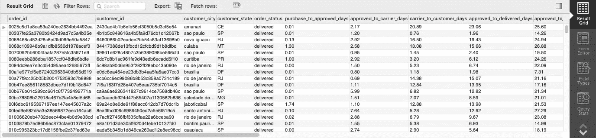

# 电子商务销售报告:错误图表、SQL 处理和 Data Studio 仪表板

> 原文：<https://towardsdatascience.com/e-commerce-sales-reporting-err-diagram-sql-processing-and-data-studio-dashboard-2500e8f79af?source=collection_archive---------17----------------------->

## 这个项目旨在向您介绍如何利用 SQL 进行多数据集的关系映射和数据处理，并在 Data Studio 的帮助下创建一个自动化的报告仪表板

布莱克·维斯兹在 [Unsplash](https://unsplash.com?utm_source=medium&utm_medium=referral) 上的照片

**SQL** 是每个数据分析师都应该熟悉的基本语言之一，以便在关系数据库中存储、操作和检索数据。事实上，有许多不同的关系数据库管理系统(RDMS)使用 SQL 作为它们的标准语言，即 MySQL、Oracle、SQL Server 等。

也就是说，这个项目旨在最大限度地提高我使用 SQL 的能力，以**探索和操作一家电子商务公司的多个数据集。**不仅仅局限于数据处理；我决定扩展这个项目的范围，通过插入 Data Studio 构建一个报告仪表板来扩展结构化数据对可视化的适用性。

如果你感兴趣，可以在 Kaggle 查看公开提供的数据集。以下是该项目的主要亮点的快速总结:

1.  用错误图映射数据集关系
2.  将数据存储在中央数据库中的 SQL 处理
3.  带有 Data Studio 的报告仪表板

# 1.数据集关系映射

*我们应该如何处理彼此共享关系的多个数据集？*

如果参考 Kaggle 提供的数据库，有 7 到 8 个独立的数据集代表一个电商销售报表:订单、客户、order_items、付款、发货等。在数据处理之前，我们需要确定所有数据集之间的关系，以避免可能导致数据丢失的错误映射。

以“order”和“customer”数据集为例，一个客户可以有 0 个或多个订单(一个 customer_id 对应不同的 order_id)，但是一个订单只与一个客户绑定(一个 order_id 对应一个 customer_id)。

订单数据集

客户数据集

MySQL 自带构建 ERR 图的内置功能，允许我们可视化地映射和绘制数据集之间的关系。那么什么是 ERR 图呢？

> **实体关系图** (ER)显示数据库中存储的实体集的关系。换句话说，我们可以说 er 图帮助你解释了数据库的逻辑结构——Guru99.com
> 
> **增强实体关系** **图** (EER)基本上是 ER 图的扩展版本。EER 模型是用高级模型设计数据库的有用工具。有了它们的增强功能，您可以通过更精确地钻研属性和约束来更彻底地规划数据库—[Cacoo.com](https://cacoo.com/blog/er-diagrams-vs-eer-diagrams-whats-the-difference/)

为了提供更直观的例子，

图片鸣谢:[https://www . visual-paradigm . com/guide/data-modeling/what-is-entity-relationship-diagram/](https://www.visual-paradigm.com/guide/data-modeling/what-is-entity-relationship-diagram/)

数据集之间的关系由一个称为乌鸦食物符号的符号系统表示，如下所示:

图片来源:[https://cacoo . com/blog/er-diagrams-vs-eer-diagrams-what-the-difference/](https://cacoo.com/blog/er-diagrams-vs-eer-diagrams-whats-the-difference/)

从本质上讲，ERR 图有助于我们更好地理解数据集之间的关系，以便我们能够更有效地进行数据处理。

对于这个项目，为了简单起见，我只选择了 5 个数据集，它们之间的关系可以很容易理解，如下图所示:

*   (1)客户和订单:1 个客户可以有多个订单，所以批注样式应该是“一个或多个”。
*   (2) orders 和 order_items: 1 个订单可以有多个 order_items，又是“一个或多个”。
*   (3)订单和付款:1 个订单只能有 1 次付款，“有且只有一个”的造型。
*   (4) order_items 和 products:类似地，1 个订单项目仅与 1 个产品相关联，这意味着“一个且只有一个”样式。

# 2.SQL 处理

*什么是 SQL 处理，SQL 如何帮助将原始数据转换成更结构化、更可用的格式？*

对于 SQL 处理的正式定义，

> **SQL 处理**是 SQL 语句的解析、优化、行源生成和执行。根据语句的不同，数据库可能会省略其中的一些阶段— [Oracle](https://docs.oracle.com/database/121/TGSQL/tgsql_sqlproc.htm#TGSQL176)

本质上，我们导入原始数据库并操纵跨表数据，将其转换为一个(或多个)结构化数据库，该数据库易于消化、理解和扩展。

如果您回头参考上面的 ERR 图，我们能够将所有数据集连接到一个数据库中，作为进行进一步操作之前的参考中心。你可以从一个集中的中心加入和操作，但我建议将这些步骤分开，因为在与现有数据一起处理之前，用中心将未来数据导入工作流更容易**。**

转到连接过程，正如关系所表明的，可以使用**连接**(也称为内部连接)或**左连接**，这取决于您希望您的结构化数据库是什么样子。对于连接语法，它只映射存在于两个数据集之间的值，并删除只出现在其中一个数据集的值。对于左连接，除了映射连接的值之外，它还包括“左”数据集中不存在于另一个数据集中的值。

在我的数据集中，我对(1)使用了 **JOIN** 来只获取存在于两个数据集(客户和订单)中的值，而对(2)、(3)和(4)使用了 **LEFT JOIN** 来返回那些没有出现在其他数据集中的值。在这种情况下使用左连接的原因是为了识别从输入数据中推断缺失信息的“空”值。

MySQL 中的 SQL 查询

SQL 语句的一些重要亮点:

*   创建表:这是为了创建一个集中的数据库作为一个枢纽，我以前分享的是未来的数据输入所必需的。
*   TIMESTAMPDIFF:这是将时间戳格式的值转换成我们更喜欢的时间指示器(例如小时、分钟)。在本例中，我将原始值转换为“分钟”，然后除以 60 除以 24，得到天数。

在创建了一个集中的原始数据库后，我开始将数据转换成一种更加结构化和可用的格式，即:

*   时间戳列(例如，order_approved_at、order_delivered_carrier):例如，我想计算从批准订单到将订单交付给承运人的天数。
*   价格列(如单价、运费):我想计算每个订单的总价

该 SQL 语句的关键亮点是按分组的**。选择文本和聚合时(例如，求和、相减、相乘等。)，我们需要使用 GROUP BY 将相同的数据分组。例如，我们可能有多个具有相同值的 order _ id，因此按 order _ id 分组以将多个 order _ id 的总价格合并为一个。**

我们可以进一步深入数据库，以生成与我们的业务目标一致的列和值。

# 3.Data Studio 仪表板

*什么是 Data Studio，它如何帮助构建视觉上引人入胜的报告仪表板？*

处理完数据库后，我们可能希望直观地解释数据，以进行分析和报告。事实上，有多种平台提供与关系数据库系统集成的可视化服务，即 Tableau、Datorama 和 Data Studio。在这种情况下，我使用 Data Studio，因为它可以选择与 MySQL 集成，并且易于使用，可以在仪表板中进行进一步的处理，仪表板也使用 SQL 作为标准语言。

我不会详细介绍如何使用这个平台，因为它非常简单，你应该根据自己的需要来玩:[https://datastudio.google.com/](https://datastudio.google.com/)。

我的报告控制面板和关键分析亮点的快速快照:

*   总收入(包括总收入和净收入)约为 1200 万至 1400 万美元，但“tracked_gross_revenue”仅为 50 万美元，这意味着输入数据中没有正确跟踪大量缺失的收入。
*   交付流程:虽然平均预计交付日为 23 天，但实际交付日只需 12 天。这就解释了为什么交货延迟(预计交货天数和实际交货天数之差)是负数。
*   批准到交付持续时间:批准订单不到 1 天，将订单发送给承运人不到 3 天，订单到达客户手中大约需要 9 天。
*   产品信息:平均产品名称长度为 6 个字符，描述长度为 103，e-com 网站中的照片总量为 27k。
*   随时间变化的收入:2016 年至 2018 年，收入从 2017 年 3 月开始上升，此后持续稳定。
*   地理表现:大部分收入来自南美城市，但随着电子商务网站在全球范围内的广泛使用，我们看到了积极的趋势。
*   产品性能:在十大产品类别中，健康和美容产品是购买最多的。
*   支付类型:信用卡占所有支付类型的 74%，表明这是主要的支付方式。

瞧啊。这就是这个项目的结尾——电子商务销售报告。我希望这篇文章对你有用并且容易理解。

在不久的将来，请留意我在**即将开展的数据科学和机器学习项目**！与此同时，您可以在这里查看我的 Github 以获得完整的资源库:

github:【https://github.com/andrewnguyen07
www.linkedin.com/in/andrewnguyen07[领英:](http://www.linkedin.com/in/andrewnguyen07)

谢谢！