# 使用 Python 和 Microsoft Azure 进行电子邮件情感分析—第 1 部分

> 原文：<https://towardsdatascience.com/e-mail-sentiment-analysis-using-python-and-microsoft-azure-part-1-6212f4cb6ee3?source=collection_archive---------20----------------------->

我们的“已发送邮件”文件夹说明了我们的行为举止？我们能利用这些和其他补充数据来确定工作中快乐或悲伤的趋势吗？


塞巴斯蒂安·赫尔曼在 [Unsplash](https://unsplash.com?utm_source=medium&utm_medium=referral) 上的照片

> 这是由多个部分组成的文章的第 1 部分。

# **简介**

坦白地说，在大多数与数据相关的事情上，我认为自己是个“菜鸟”。我在传统数据中心和云基础架构方面有相当丰富的经验，但在处理数据方面还是新手。在过去的 12 个月里，卡格尔几乎是我最好的朋友。

也就是说，我一直在尽可能多的研究我缺乏的技能——微积分、统计学、编码、数据工程概念等等。我认为最好的学习方法之一就是去做，但也要记录下我所经历的过程。此外，确保保持它的乐趣！

我还加入了一个链接，链接到我写这篇文章时创建的笔记本。随意使用和修改你认为合适的！

# **概念背景**

对于我们这些经常使用电子邮件的人来说，我们都发送过几次，或者多次，或者可能每天都发。

*   “根据我的最后一封电子邮件…”
*   “展望未来，我建议……”
*   “这完全是胡说八道！”

这些看起来有点眼熟吗？对许多人来说，很容易通过电子邮件有意或无意地显示你当前的情绪状态。你可能厌倦了多次解释同样的情况，也许你的电子邮件反映了你越来越疲惫，或者也许你的车今天早上坏了，你只是今天过得不好。

不管原因是什么，我们的电子邮件历史实际上可以提供一个有用的视角，让我们了解我们在一个组织中的态度。

本文的剩余部分将集中在利用 Jupyter 笔记本、Microsoft Azure 文本分析 API 来提供动力，以及使用 Python 来探索、清理和呈现情感分析结果。

当然，我也会模糊或消毒某些数据，只是为了确保在这之后我还有一份工作。:)

# **开发环境**

核心环境将包括以下内容:

*   **Outlook 已发送邮件 CSV 导出**
*   **Azure 文本分析 API**
*   **Azure 笔记本(** Jupyter 笔记本 **)**

具体到 Python，我们将使用以下包:

*   **Numpy**
*   **熊猫**
*   **MatPlotLib**
*   **Azure AI 文本分析**

现在我们已经了解了将要使用的工具的基础，让我们开始构建吧！

# 步骤 1 —部署 Azure 文本分析 API 实例


弗拉基米尔·阿尼奇耶夫在 [Unsplash](https://unsplash.com?utm_source=medium&utm_medium=referral) 上拍摄的照片

我们首先需要部署一个 API 实例，这是本文剩余部分的目标。导航到[https://portal.azure.com](https://portal.azure.com)并登录。如果您没有帐户，您可以通过使用以下方式之一创建订阅来访问免费试用/信用点数:

**天蓝色通行证:**[https://www.microsoftazurepass.com/](https://www.microsoftazurepass.com/)

**VS 开发要领:**[https://visualstudio.microsoft.com/dev-essentials/](https://visualstudio.microsoft.com/dev-essentials/)

登录后，我们需要搜索文本分析 API。

*   点击**创建资源。**
*   键入**文本分析**按回车键。
*   点击**创建。**

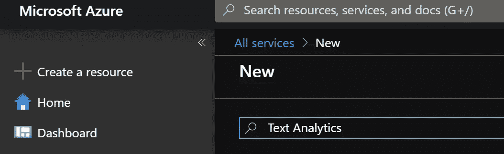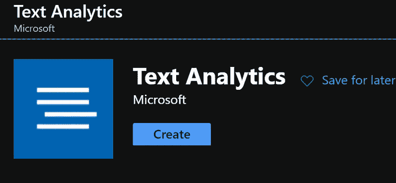

创建文本分析 API 实例

接下来，我们需要输入关于服务及其定价层的详细信息。键入一个**名称**、**订阅**(如果您有多个活动)、**位置**(建议选择离您最近的一个)、**定价层** (F0 是免费的，对此工作正常)，以及一个供它居住的**资源组**。如果没有，点击**创建新的**并给它命名。

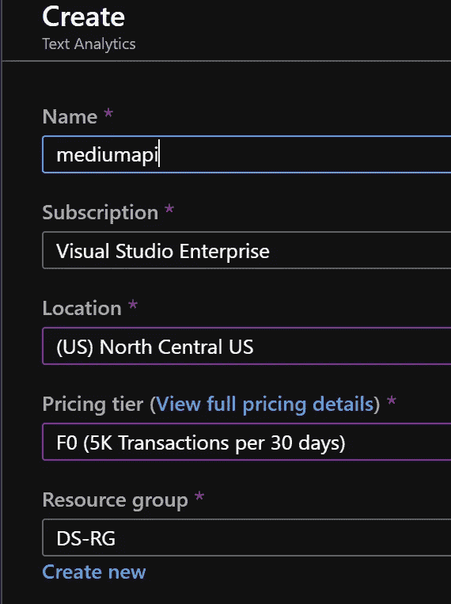

Azure 文本分析 API 信息

部署完成后，从左侧选择**所有资源**并点击您的 API 资源。然后，点击**键和端点**并将**端点**和**键 1** 复制到记事本或其他东西中以备后用。

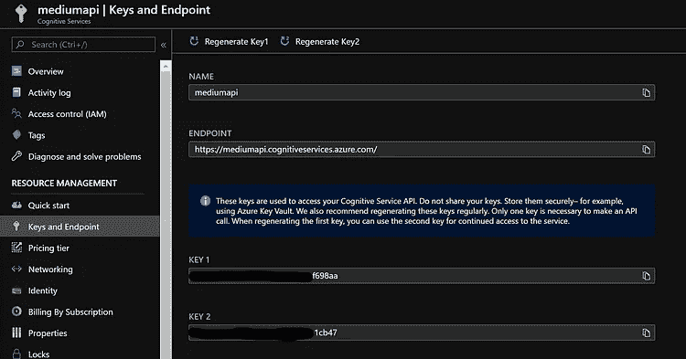

关键点和端点检索

# **步骤 2— Outlook CSV 导出**


照片由[米卡·鲍梅斯特](https://unsplash.com/@mbaumi?utm_source=medium&utm_medium=referral)在 [Unsplash](https://unsplash.com?utm_source=medium&utm_medium=referral) 上拍摄

下一步是获取您的电子邮件发送项目的 CSV 导出。考虑到我们正在寻找我们自己的*个人*情感分数，我们将只关心我们发送的物品。

*   **打开展望**
*   **文件→打开&导出→导入/导出**
*   **导出到文件**
*   **逗号分隔值(CSV)**
*   **选择您的已发送邮件文件夹**
*   **选择一个导出位置**
*   **完成导出**

# 步骤 3—设置和检查 CSV 数据


照片由 [Kirill Pershin](https://unsplash.com/@kirillpershin?utm_source=medium&utm_medium=referral) 在 [Unsplash](https://unsplash.com?utm_source=medium&utm_medium=referral) 上拍摄

现在我们已经有了 CSV，我们需要开始编写代码来探索和准备用于分析的数据。我强烈建议不要打开。csv 文件，因为我们中的许多人拒绝整理或保持我们的邮箱干净。相反，我们将坚持把它加载到熊猫数据帧中。

我们需要创建一个新的 [Jupyter](https://jupyter.org/) 笔记本来工作。我只是暂时把我的名字简单地叫做*email 情操. ipynb* 。如果你没有安装 Jupyter，也不想使用托管版本，我强烈建议你查看一下 Anaconda 获得一个全面的软件包。

现在我们有了笔记本，我们需要安装 Python 的 Azure 文本分析 API 包(如果你还没有的话)。

```
!pip install azure-ai-textanalytics
```

我们将假设我们的开发环境已经安装了 Pandas 和 Numpy(Anaconda 和 Azure 笔记本都提供了它们)。

然后我们可以继续导入必要的包。我们还将把我们的 Azure 文本分析 API 密钥和端点信息(来自步骤 1)分配到这个单元格中。

```
import pandas as pd
import numpy as np
import matplotlib.pyplot as plt
from matplotlib.pyplot import figure
from azure.ai.textanalytics import TextAnalyticsClient
from azure.core.credentials import AzureKeyCredential#Key and enpoint from Azure Text Analytics API service
key = "f7c7c91cd70e493ea38521d1cbf698aa"
endpoint = "[https://mediumapi.cognitiveservices.azure.com/](https://mediumapi.cognitiveservices.azure.com/)"
```

我们还需要定义一些我们稍后将在笔记本中使用的函数。为了便于组织，我只是将两者都添加到一个单元格中，这样它们就在笔记本中的相同位置了。

我们需要一个函数来为文本分析 API 提供认证，以及一个用于核心情感分析的函数。我们遵循微软文档中下面的[快速入门](https://docs.microsoft.com/en-us/azure/cognitive-services/text-analytics/quickstarts/text-analytics-sdk?tabs=version-3&pivots=programming-language-python)中的代码，但是会对核心函数做一些修改以满足我们的特定需求。

虽然 auth 函数很简单，但我们需要修改情感分析函数来迭代一系列列表(与单个硬编码字符串相比)，只检索总得分(我们将在下一篇文章中探索情感得分范围)，并递增我们稍后创建的频率表。

```
#Creating the Azure authentication function
def authenticate_client():
    ta_credential = AzureKeyCredential(key)
    text_analytics_client = TextAnalyticsClient(endpoint=endpoint, credential=ta_credential)
    return text_analytics_client#Core function for running sentiment analysis
#Modified to fit our specific needs
#Added global variables we'll use later in this notebook
def sentiment_analysis_example(client,list_name): 
    global senti_results 
    senti_results = {'Positive':0,'Neutral':0,'Negative':0,'Unknown':0}
    global senti_errors
    senti_errors = []
    documents = list_name
    for row in documents:
        response = client.analyze_sentiment(documents = row)[0]
        try:
            if response.sentiment == "positive":
                senti_results['Positive'] += 1
            elif response.sentiment == "neutral":
                senti_results['Neutral'] += 1
            elif response.sentiment == "negative":
                senti_results['Negative'] +=1
            else:
                senti_results['Unknown'] +=1
        except:
            senti_errors.append(row)
    return(senti_results,senti_errors)#Assigning authentication function to object
client = authenticate_client()
```

现在我们有了 Azure API 函数设置，我们准备开始探索和准备我们的数据集。

```
#Assign your filename to a variable
emailFile = ‘BenSent.CSV’#Display the first 5 rows of our CSV to inspect
#Notice encoding — this seemed to work for our CSV
email_data = pd.read_csv(emailFile,encoding=’ISO 8859–1')
email_data.head()
```

如果您运行上面的代码，您应该会看到类似下面的输出。

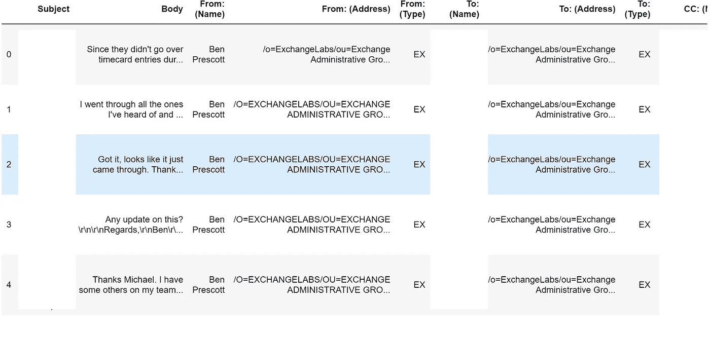

Outlook 导出提供了大量的列(有用或无用)，但是您会发现缺少一个关键的数据点—时间戳。

不幸的是，Outlook 不提供将日期/时间属性映射到 CSV 导出的功能。为了简单起见，我们将只分析我们的数据集作为一个完整的批处理。我们将看看如何在后续帖子中包含日期。

# 步骤 4—清理和准备数据集


由[马库斯·斯皮斯克](https://unsplash.com/@markusspiske?utm_source=medium&utm_medium=referral)在 [Unsplash](https://unsplash.com?utm_source=medium&utm_medium=referral) 拍摄的照片

根据这种情况下的可用数据，我们将重点关注我们在电子邮件中对他人说了什么，并确定总体上是积极、中立还是消极的情绪。我们需要创建一个单独的对象，只包含来自 **Body** 列的内容。我们将用熊猫来做这件事。

```
#Assign Body column to new object
email_body = email_data['Body']#Display top 5 rows and the overall length of the series
print(email_body.head())
print('\n')
print("Starting email count:",email_body.shape)
```

在这里，我使用按列标签选择，考虑到我们有这些可用的。您也可以使用列索引，或者您喜欢的任何东西。

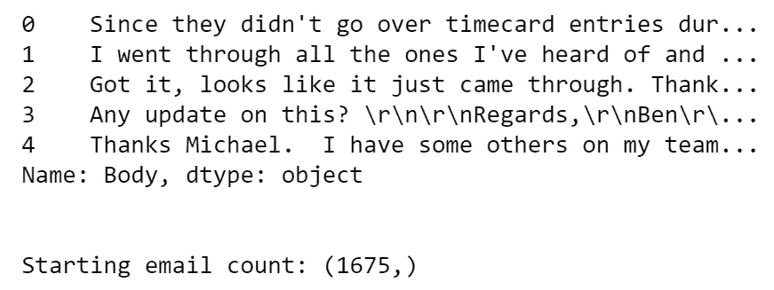

现在我们可以看到只有正文内容，这是我们将用来执行情感分析的内容。当我们继续清理这个的时候，我们将密切监视我们的系列的形状。我们目前从 1675 行开始。

接下来，我们会注意到前 5 行中有我们不想分析的奇怪字符，比如`\r`或`\n`等等。我们将使用一个简单的`str.replace`来删除这些。

```
#Removing \r and \n characters from strings
email_body = email_body.str.replace("\r","")
email_body = email_body.str.replace("\n","")#Display top 5 rows and the overall length of the series
print(email_body.head())
print('\n')
print("Current e-mail count:",email_body.shape)
```

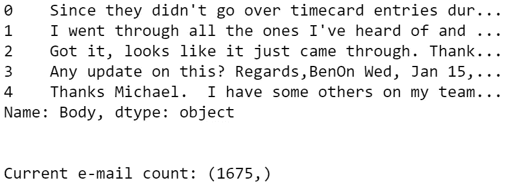

接下来，我们将删除不想分析完整电子邮件线程的转发或尾随电子邮件线程。一个例子是行索引 3，其中我们看到在电子邮件线程中我的回复后面有一个日期。

我将使用我知道会自动添加到每个已发送邮件中的东西——我的签名块——来清理这些尾随邮件。以此为目标，我们可以根据识别签名词和尾随消息将数据划分到不同的列中。

```
#Removing trailing email threads after start of my email signature
split_df = email_body.str.partition("Regards")
print(split_df[0:3])
print('\n')
print("Current e-mail count:",split_df.shape)
```

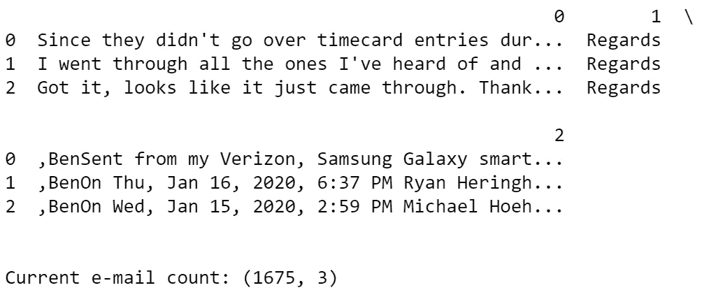

从形状和输出中，我们现在可以看到我们有 3 个不同的分区列——一个用于电子邮件正文内容，一个用于识别签名块单词(在我的例子中是“问候”),一个用于结尾消息。

我们现在需要删除这些额外的列，将注意力放回到正文上。我们还将删除被标识为没有信息的行。

```
#Removing extra fluff from partitioning
clean_col = split_df.drop(columns=[1,2]) #1 contains "Regards", 2 contains trailing text
#Removing rows with NaN - no data
clean_nan = clean_col.dropna()print("E-mail count before NaN removal:",clean_col.shape[0]) #Display before NaN removal
print("E-mail count after NaN removal:",clean_nan.shape[0]) #Display before NaN removal
```

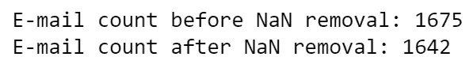

我们可以看到，在分区之前，我们有 **1，675** 行。我们删除了包含我签名前后的两栏内容。删除了 NaN 的行后，我们只剩下 **1，642** 封电子邮件。我们需要通过删除 PTO 邮件和转发邮件来继续清理。我们还将在正文列中添加一个列名。

```
#Updating the primary column with name EmailBody
clean_nan = clean_nan.rename(columns={0:"EmailBody"})#Remove emails with default out of office reply
clean_pto = clean_nan[~clean_nan.EmailBody.str.contains("Hello,I am currently")]#Remove emails with a forwarded message
cleaned_df = clean_pto[~clean_pto.EmailBody.str.contains("---------- Forwarded message ---------")]print("E-mail count before removals:",clean_nan.shape[0]) #Pre PTO count
print("E-mail count after removing PTO messages:",clean_pto.shape[0]) #Post PTO count
print("E-mail count after also removing forwarded messages:",cleaned_df.shape[0]) #Post fwd removal
```

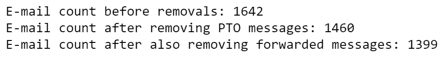

检查形状后，我们可以看到我们从**1642**行到**1460**行，最后到**1399**行。请记住，我们正在清理所有这些内容，以确保我们的情感分析返回尽可能准确的信息。

如果我们打印`cleaned_df`系列，我们会看到我们的行看起来是空的。我们需要确保我们删除这些，这样我们的分析就不会出错。我们将通过使用 Pandas 的`df.replace`来做到这一点，并用 NaN 替换空数据。

```
#Considering we know we still have rows with no data, we'll replace the empty space with NaN
#We can see all visible rows with nothing now show NaN
cleaned_df['EmailBody'].replace(" ",np.nan,inplace=True)
print(cleaned_df)
```

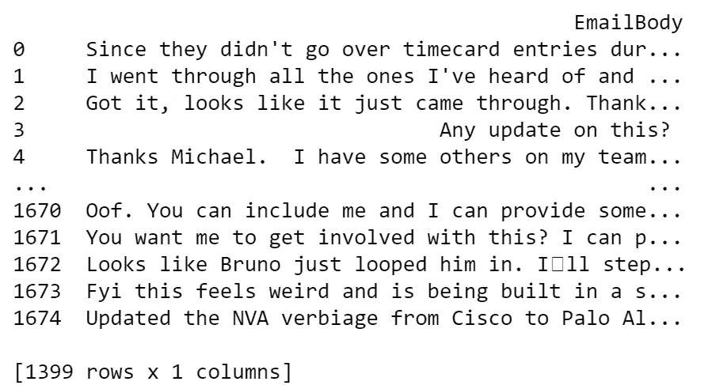

现在我们的空行将显示 NaN。我们现在可以使用`pd.dropna()`删除这些行。

```
#We can now find all rows with NaN and drop them using pd.dropna
cleaned_df = cleaned_df.dropna()
print(cleaned_df)
print('\n')
print("E-mail count after dropping empty rows/rows with NaN:",cleaned_df.shape)
```

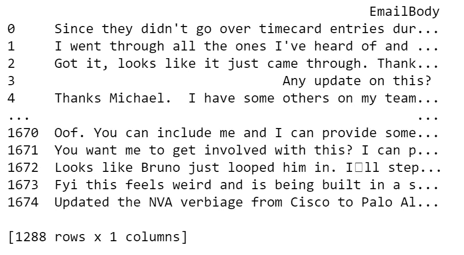

移除 NaN 后，行数减少到 **1，288** 行。请随意继续探索您的数据，以确保您没有应该删除的额外内容。虽然这并不完美，但我们确实希望结果尽可能合理。

至于最后一步，我们将把数据帧转换成包含字符串的列表。我们将用它发送给我们的 API 并返回我们的结果。

```
#Create an empty list to store values
#Iterate over each row in the dataframe and append it to the listsenti_list = []for row in range((cleaned_df.shape[0])):
    senti_list.append(list(cleaned_df.iloc[row,:]))

#Length of list matches length of old df 
print("E-mail count before error removal, ready for analysis:",len(senti_list))
```

我们可以打印列表的长度，以确保它与我们的 DataFrame 行数相匹配，事实也确实如此。

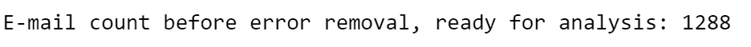

# 步骤 5—执行情感分析


照片由[蒂姆·莫斯霍尔德](https://unsplash.com/@timmossholder?utm_source=medium&utm_medium=referral)在 [Unsplash](https://unsplash.com?utm_source=medium&utm_medium=referral) 上拍摄

现在我们有了一个“嗯，我清理了”数据的列表，我们可以开始将数据发送到我们的 Azure API，检索结果，并可视化我们的数据。

我们将提供新创建的列表作为核心情感分析函数中的 list_name 参数。该函数的编写方式不仅提供了结果的频率表，还提供了包含行本身的列表，这些行在分析时可能包含错误。

下一部分可能需要一段时间，这取决于有多少行被发送到 API。您可能还会发现自己不得不扩展自己的 API 服务。如果是这样的话，我建议你为了练习的目的，把你的清单削减一下。

```
#Trigger the sentiment analysis function, passing in our list of lists
sentiment = sentiment_analysis_example(client,senti_list)
```

一旦完成，我们就可以回顾最初的结果。

```
print(senti_results)
print("\n")
print("Sentiment errors:",senti_errors)
print("Error count:",len(senti_errors))
```

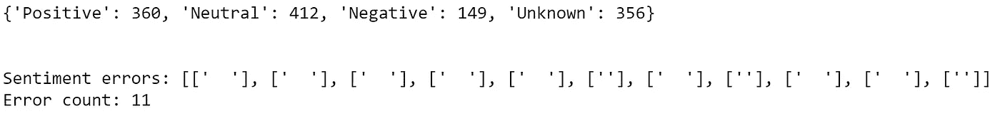

我们在这里可以看到两件主要的事情:我们的数据的总体情绪结果和在分析时出错的行。我们可以看到总共有 11 行没有被分析，这似乎是因为不同的空白。

我们需要遍历这个列表，遍历我们的原始数据集列表，并删除包含这些列表的所有列表。我们还将制作一份列表的副本，这样我们就有了历史版本，以备将来需要。

```
#Removing the errors from our list of lists
#Assigning to a new variable so we have the unmodified original
senti_cleaned = senti_listfor i in senti_errors:
    for row in senti_cleaned:
        if i == row:
            senti_cleaned.remove(row)

print("E-mail count after removing error rows. Final used for analysis:",len(senti_cleaned))
```

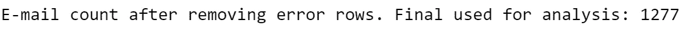

我们可以看到我们正好下降了 11 行，这与错误计数相匹配。我们现在可以对我们的数据副本重新运行分析，以确保没有其他错误。

```
#Triggering next run of analysis on the final dataset
sentiment = sentiment_analysis_example(client,senti_cleaned)#Displaying the sentiment analysis results
print(senti_results)
print("\n")
print("Sentiment errors:",senti_errors)
print("Error count:",len(senti_errors))
```

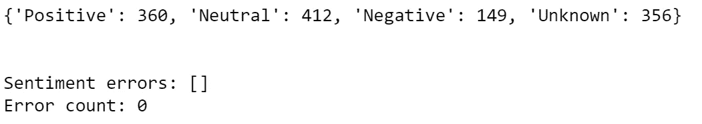

查看输出，我们可以验证我们没有更多的错误(您的里程可能会有所不同)，并准备好继续绘制我们的结果。

# 第六步——可视化


由[卢卡斯·布拉塞克](https://unsplash.com/@goumbik?utm_source=medium&utm_medium=referral)在 [Unsplash](https://unsplash.com?utm_source=medium&utm_medium=referral) 拍摄的照片

现在我们已经有了一个很好的字典，我们可以把它们绘制成很好的图表。对于本文，我们将关注两个视图:结果的总体情感百分比和每种情感类型的电子邮件数量。

为此，我们将使用`matplotlib.pyplot`库。我们将创建一个饼图(以显示百分比)和一个条形图(以按结果显示电子邮件数量)。在显示之前，我们还将对图进行一些格式更改，例如:颜色更改、字体更改、填充/间距、显示大小等。

```
#Setting our Key/Value pairs from our results
keys = senti_results.keys()
values = senti_results.values()#Establishing some format changes for our charts
figure(num=None, figsize=(8,8),dpi=80)
colors = ['seagreen','lightsteelblue','indianred','silver']
explode = (0.1, 0, 0, 0)
plt.rcParams.update({'font.size': 12})#Creating the first plot (pie chart)
plt.subplot(221)
plt.pie(values,labels=keys,colors=colors, explode=explode,autopct='%1.1f%%',shadow=True,startangle=90)
plt.title('Overall Sentiment Against 1,277 E-mails, by Percentage',bbox={'facecolor':'1','pad':8},y=1.10)#Creating the second plot (bar chart)
plt.subplot(222)
plt.title('E-mail Count by Sentiment Result',bbox={'facecolor':'1','pad':8},y=1.10)
plt.bar(keys,values,width=.8,color=colors)#Adjusting the spacing/padding between subplots
plt.subplots_adjust(left=0.125, bottom=0.1, right=1.8, top=1.3, wspace=0.2, hspace=0.2)#Displaying the plots
plt.show()
```

现在我们可以看到我们的数据有了一个很好的可视化表示！虽然我们仍然有一堆来自 API 的“未知”响应类型，但我们可以说，总体而言，我们的响应并不像我们想象的那样消极。

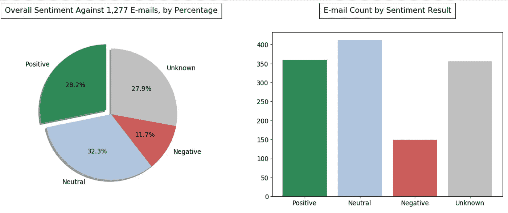

在接下来的一些帖子中，我们会对每封邮件进行分类，并对其进行分组。我们还希望引入一些其他数据，与我们目前发现的数据进行对比。

希望这篇文章是有用的或者有趣的，并且你在这个过程中学到了一些东西。请记住，我对此非常陌生，非常感谢您的反馈！