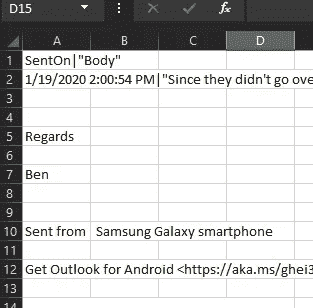
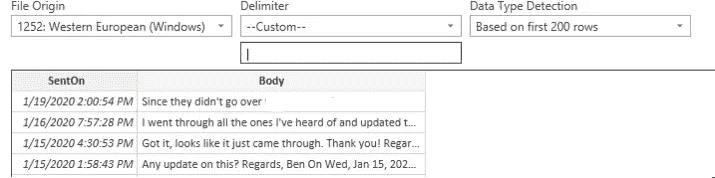
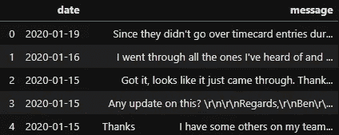
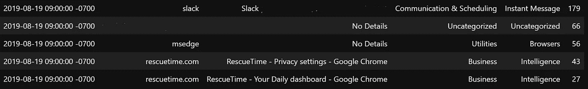
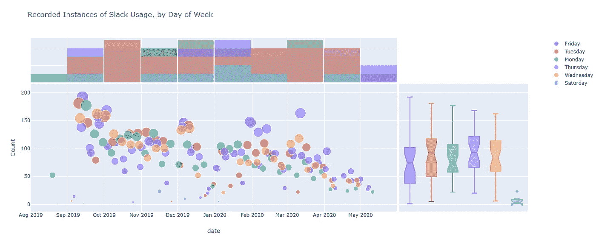
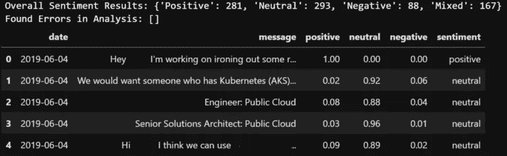
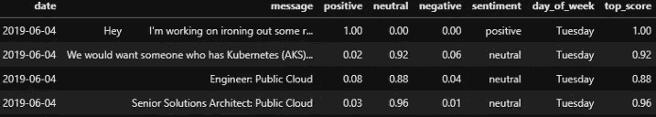
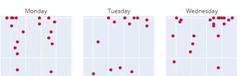
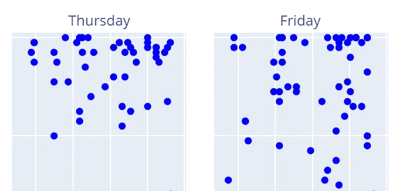

# 使用 Python 和 Microsoft Azure 进行电子邮件情感分析—第 2 部分

> 原文：<https://towardsdatascience.com/e-mail-sentiment-analysis-using-python-and-microsoft-azure-part-2-796e7db76bee?source=collection_archive---------46----------------------->

## 使用新的电子邮件数据更深入地进行情感分析，并开始探索关系应用程序使用数据。


斯蒂芬·菲利普斯-Hostreviews.co.uk 在 Unsplash 上拍摄的照片

> 这是由多个部分组成的文章的第 2 部分。

# **第一部分回顾**

简单回顾一下，本系列的第 1 部分着重于获取您的电子邮件发送项目的 CSV 导出，并使用 Microsoft Azure 的文本分析 API 返回每行的情感结果。

我们从用于增加频率表的 API 中获取的结果基本上向我们显示了正面、负面、中性或未知结果的总数。

我们还发现，完全理解时间线很困难，因为 Outlook 的任何导出功能都不包括日期时间数据，所以我们的分析只是针对“已发送邮件”文件夹中的大部分邮件。

# 第二部分导言

自从第 1 部分发表以来，我偶然发现了文本分析 API 的一个新版本(3.1 版)，它可以返回一个“混合”的情感结果。我们将探讨这一点，以及以下值得注意的变化:

*   从名为 [RescueTime](http://rescuetime.com/) 的工具中探索应用程序使用细节
*   查看情感分析结果的详细分数和输出
*   准备连接数据集并查找相关性
*   可视化数据

在第 1 部分中，我还提到了 Outlook 本身不允许您导出包含发送或接收日期/时间的电子邮件副本(CSV 或 PST 格式)。

打开 Outlook 应用程序并下载 CSV 的另一种方法是利用 PowerShell 来查询和保存信息。通过使用 PowerShell，我们能够操作 Outlook 应用程序中不可用的字段。

# 使用 PowerShell 检索带日期时间的电子邮件

下面的代码将提取您的已发送邮件文件夹的邮件正文和发送日期/时间，然后存储到一个 CSV 文件中。**确保将-path 开关更新为您想要的值。**

在 Excel 中查看文件时(假设您应用了默认设置)，您会注意到一些格式问题，如:



为了解决这个问题并提供一种更容易在 Python 中使用的格式，我们将打开一个新的空白 Excel 文件，单击“**数据**选项卡，并在*获取&转换数据*部分中单击 **From Test/CSV** 。选择您的 CSV 文件并使用以下设置:



你会注意到我们把分隔符改成了|字符，因为我们在大多数邮件文本中很少使用，尤其是在我发送的邮件中。

我们还可以看到一个预览，显示它是如何格式化我们想要的。我们将点击底部的 **Load** ，将其保存为我们的工作 CSV，现在您就可以将它加载到数据帧中了！

> 大声向 [**杰森·布鲁诺**](https://www.linkedin.com/in/jason-b-60194b35/) 求助 PowerShell 脚本和修改 Excel 格式！

# 下载更新时间数据


斯蒂芬·菲利普斯-Hostreviews.co.uk 在 [Unsplash](https://unsplash.com?utm_source=medium&utm_medium=referral) 上的照片

[改期](http://rescuetime.com/)从何而来？嗯，大约一年半以前，我下载了一个应用程序，它可以帮助跟踪应用程序中的活动时间，帮助你找到可以削减的地方，还可以大致了解你在哪里花了大部分时间。

我使用这个应用程序大约一个月左右，然后诚实地忘记我已经安装了它。哎呀！

对我有利的是，这个应用程序仍然在收集数据。RescueTime 提供了以 CSV 格式下载你所有数据的能力(在他们网站上你的个人资料中可以找到)，所以我知道我要努力把它纳入我确定快乐/悲伤趋势的目标中。

> 此外，我与 RescueTime 没有任何关联，它只是一个我不久前决定尝试的免费应用程序，它非常有趣，足以融入这个故事。:)

# 加载和检查数据集

在本节中，我们将跳过许多逐行代码，因为我们使用了第 1 部分中的许多现有代码。我还提供了一个 [GitHub 链接](https://github.com/bcprescott/datascience/tree/master/sentiment/Part2)到 Jupyter 笔记本，如果你想查看、复制或修改它的话。

当我们导入新的电子邮件发送项目导出时，我们会在需要清理的数据中看到许多相似之处；但是，还要注意我们现在可以使用日期时间数据。呜！这在第 3 部分中可视化和连接数据集时非常有用。

> 您将看到的代码片段按照第 1 部分中的许多步骤完成了一些常规的数据清理，并添加了一些内容，例如将列转换为 datetime 并稍微更改了一些格式。我也在不断地学习，所以一些代码会不断地变得更有效率。



在导入 RescueTime 数据集并对其进行一些初步清理之后，我们可以获得以下一些信息:



非常有趣的是，它有我们可以探索的特定级别的细节，但它也提供数据，如:

*   记录日期
*   应用程序名称
*   应用类别
*   录制时的使用情况(秒)

只是为了好玩，这里有一个我记录的活动 Slack 实例的可视化，我们将在第 3 部分中触及。趋势下降可能是我工作的公司推出微软团队并开始摆脱 Slack 的一个标志。此外，很高兴我的星期六用法并不可怕！



记录的松弛窗口在我的屏幕上处于活动状态的实例…

我们将在第 3 部分进一步探索和加入 RescueTime 数据集，但现在我们将把重点转移到根据新的电子邮件数据集来改变我们的情感分析结果。

# 情感分析调优


马特·阿特兹在 [Unsplash](https://unsplash.com?utm_source=medium&utm_medium=referral) 拍摄的照片

回到我们的电子邮件数据集，我已经使用第 1 部分中的大部分内容清理了数据，考虑到我们现在有一个日期时间列，还添加了一些内容。

为了便于查看，我对主要情感分析功能进行了更改，以从 API 返回我们需要的详细信息，并对清理后的电子邮件数据集进行了一些修改，以利用这些附加功能:

…以及对电子邮件数据集的小改动，以从情感分析输出中获取更多细节。我们使用 DataFrame 中的“message”系列进行发送分析(相比之下，我们将它转换为一个列表)并添加额外的列。

在将我们的消息发送到文本分析 API 之后，我们可以看到我们的结果提供了与第 1 部分中类似的输出(包括更新的“混合”结果)，以及我们的数据帧，该数据帧具有包含详细情感分数和总体情感结果的新列。

将这个结果输出到 csv 也是一个明智的选择，因为每次将结果发送到 API 时，都需要一段时间才能获得所有结果。:)



# 演示数据准备


[安德鲁·尼尔](https://unsplash.com/@andrewtneel?utm_source=medium&utm_medium=referral)在 [Unsplash](https://unsplash.com?utm_source=medium&utm_medium=referral) 上拍照

简单回顾一下，我们最新数据集的一些优势包括:

*   电子邮件发送日期
*   清理的邮件详细信息
*   详细的情感分析得分结果
*   总体情绪标签

也就是说，我们可以使用当前状态下的电子邮件数据来绘图，但也可以看看一周中哪一天更积极/消极等，这可能会很有趣..获取每一行的最高报告分数也可能有所帮助。

为了简洁起见，我们首先将 email_clean 数据帧复制到一个名为 email_plot 的数据帧中，我们将(很明显)使用它来绘图。我们还将为一周中的某一天添加一个新列，并从我们的`date` 列进行翻译。

```
email_plot['day_of_week'] = email_plot['date'].dt.day_name()
```

我们也将做同样的事情来获得我们的最高分，但是我们将只让它检查与我们的分数输出相关的列。

```
email_plot['top_score'] = email_plot[['positive','neutral','negative']].max(axis=1)
```

现在我们有了一些额外的有趣数据，可以在绘图时使用！



# 可视化新数据

现在，我们已经对消息列进行了适当的清理，添加了情绪得分、总体情绪结果、星期几和最高得分的列，我们准备好绘图了！

最近，我更关注 Plotly，因为我觉得修改布局、颜色地图等更容易。与 MatPlotLib 相比。MatPlotLib 无疑仍然是一个很棒的库，但是我也计划在我的个人网站上发布一些，所以一个交互式的库更有意义。

也就是说，Plotly 能够在生成图时使用`facet_col`轻松地将图分割成面板。在对情节细节做了一些调整后，我有一个有趣的散点图要看:

> 如果你是 Plotly 的新手，你可以点击右侧图例中的情绪结果来过滤上面的散点图。

如果我们先过滤，只显示积极的结果，我们实际上可以看到，随着我们从 2019 年 7 月转移到 2020 年 7 月，周四和周五有更多的电子邮件被自信地标记。

如果我们切换到负面结果，我们可以看到周一发送的带有负面标签的电子邮件数量大幅减少，上个季度的周一没有负面邮件！

然而，周二(温和增长)和周三的情况正好相反，因为随着我们进入 2020 年中期，我们可以看到更紧密的点群。



负面邮件(左)和正面邮件(右)

有趣的是，周末发送的电子邮件似乎大多是积极的，这可能有助于普遍的周末快乐在我的回复中发挥作用。

# 结论

虽然这并不意味着在情感结果和整体数据清洁度方面 100%准确，但它绝对是朝着更好的方向迈出的一步，并且能够开始查看我的电子邮件情感趋势。我认为同样值得一提的是，负面情绪并不意味着你是一个彻头彻尾的混蛋或骂人(我并不是一个那么糟糕的人……)，而是指在系列中使用的某些词可能会触发 API，导致负面反应得分增加。:)

像往常一样，请在下面的评论区留下任何评论/想法/反馈。我总是在寻找更有效的方法来做某事，寻找我在做某事的过程中可能出现的错误，或者寻找一般的反馈！

*请继续关注第 3 部分，我们将本故事中使用的数据与我们的 RescueTime 数据中的 datetime 数据相结合，以发现情感结果与大量应用程序使用之间的相关性！*


刘汉宁·奈巴霍在 [Unsplash](https://unsplash.com?utm_source=medium&utm_medium=referral) 上的照片