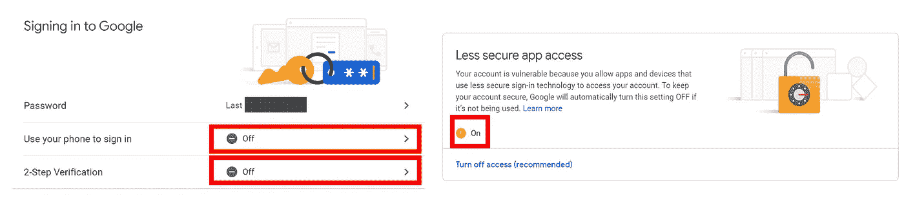
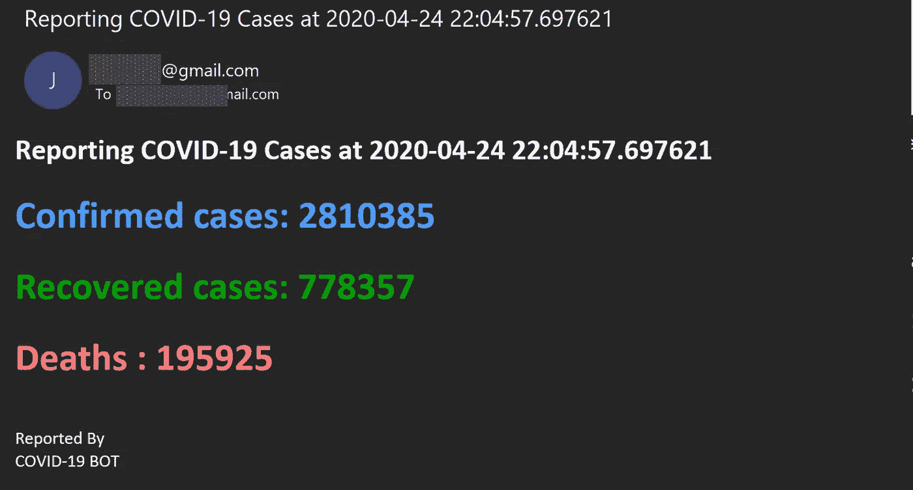

# 使用 Python 的电子邮件通知机器人

> 原文：<https://towardsdatascience.com/e-mails-notification-bot-with-python-4efa227278fb?source=collection_archive---------17----------------------->

## 一个重要的 PYTHON 技巧

## 教程—新冠肺炎案例的电子邮件通知示例


插图作者:金彩云

在数据科学中，项目的数据来源可能会随着时间而变化，分析结果也会随着时间快速变化。有时候结果的一点点变化可能不会让你感兴趣。但是自己一个人持续跟踪这种变化可能太累了…

本文展示了用 Python 编写电子邮件自动化机器人脚本的指南！

## 我们开始吧💥

# 📧准备电子邮件发件人

首先，让我们准备一个电子邮件发件人帐户。我推荐使用 G-mail，因为它易于注册，并且允许你手动调整安全选项。您可以使用您的个人电子邮件或您选择的其他电子邮件提供商。但是我建议为我们的电子邮件机器人创建一个新的电子邮件。🤖

在 G-mail 帐户准备就绪后，通过进入[帐户安全设置](https://myaccount.google.com/security)并进行如下调整，降低帐户安全性以允许 Python 访问您的 G-mail 帐户并发送电子邮件:

*   用手机取消*登录*
*   通过两步验证取消*登录*
*   打开*不太安全的应用访问*选项



在 G-mail 中进行设置以允许 Python 发送电子邮件。

# 使用 Python 的✍Sending 电子邮件

现在，我们开始一个有趣的部分，编写一个脚本来登录您的电子邮件帐户并发送电子邮件。我建议使用一个简单的模块`smtplib`来完成这项工作。首先，让我们创建一个`send_email.py`文件，开始导入模块，如下所示:

```
**import smtplib
from email.mime.multipart import MIMEMultipart
from email.mime.text import MIMEText**
```

然后，让我们为您的电子邮件发件人和收件人信息以及电子邮件内容准备所有变量，如下所示。您可以在`email_recipients`列表中输入几个电子邮件收件人。

```
#Email Account **email_sender_account = "**<Your Sender Account>**"
email_sender_username = "**<Your Sender Username>**"
email_sender_password = "**<Your Sender Password>**"
email_smtp_server = "**<SMTP, eg smtp.gmail.com for gmail>**"
email_smtp_port =** <SMTP Porf, eg 587 for gmail>#Email Content
**email_recepients =** [**"**<recepient1>**","**<recepient2>**",".."**] **email_subject = "**<Email Subject>**"
email_body** = "<html of your body here>"
```

之后，我们只需要登录电子邮件服务器。然后，我们将使用`for`循环来生成电子邮件并发送给所有收件人。

```
#login to email server **server = smtplib.SMTP(email_smtp_server,email_smtp_port)
server.starttls()
server.login(email_sender_username, email_sender_password)**#For loop, sending emails to all email recipients **for recipient in email_receivers:
    print(f"Sending email to {recipient}")
    message = MIMEMultipart('alternative')
    message['From'] = email_sender_account
    message['To'] = recipient
    message['Subject'] = email_subject
    message.attach(MIMEText(email_body, 'html'))
    text = message.as_string()
    server.sendmail(email_sender_account,recipient,text)**#All emails sent, log out. **server.quit()**
```

在此之前，您有一个 Python 脚本来向所有收件人发送电子邮件。现在，让我们将它应用到真实世界的用例中。

# 🌎真实世界的例子

## ⚠新冠肺炎—电子邮件通知机器人

在本例中，我将展示如何应用我们在上面创建的 Python 脚本向报告新新冠肺炎病例的收件人发送电子邮件。

首先，我们需要获得最新的新冠肺炎数据。通过使用带有几行 Python 代码的`BeautifulSoap4`和`request`模块，我们可以很容易地从 [Worldometers](https://www.worldometers.info/coronavirus/) 中抓取这个数据集，如下所示:

```
#import module **import requests, datetime
from bs4 import BeautifulSoup** #Set the endpoint: Worldometers **url = "https://www.worldometers.info/coronavirus/"
req = requests.get(url)
bsObj = BeautifulSoup(req.text, "html.parser")
data = bsObj.find_all("div",class_ = "maincounter-number")
num_confirmed = data[0].text.strip().replace(',', '')
num_deaths = data[1].text.strip().replace(',', '')
num_recovered = data[2].text.strip().replace(',', '')**
```

通过这个脚本，它找到了一个名为`maincounter-number`的类的位置，该类表示新冠肺炎数据的数量:确诊病例、死亡病例和恢复病例。这些数据分别存储在`num_confirmed, num_deaths, num_recovered`中。然后，我们也可以使用`datetime`模块获取当前时间，并传递这些变量来为电子邮件正文创建一个 HTML 结构，如下所示:

```
**TimeNow = datetime.datetime.now()
email_body = '<html><head></head><body>'
email_body += '<style type="text/css"></style>'
email_body += f'<h2>Reporting COVID-19 Cases at {time}</h2>'**
**email_body += f'<h1><b>Confirmed cases</b>:  {confirmed_cases}</h1>'
email_body += f'<h1><b>Recovered cases</b>:  {recovered_cases}</h1>'
email_body += f'<h1><b>Deaths </b>:  {deaths}</h1>'
email_body += '<br>Reported By'
email_body += '<br>COVID-19 BOT</body></html>'**
```

现在，让我们把所有的东西结合在一起，输入所有的电子邮件信息，然后运行`python <filename>.py`，试试看是否可行，是的，可行！运行完脚本后，我的收件箱里直接收到了一封电子邮件，里面有实时更新的新冠肺炎案例:



运行 Python 脚本后，我的 Outlook 收件箱中的屏幕截图。

您可以看看下面完全组合的 Python 脚本:

电子邮件通知

## 计划您的机器人

现在，是时候让你的机器人每隔 *xx* 分钟或 *yy* 小时或 *zz* 天定期运行一次了。另外，你应该添加一个发送消息的条件，因为你不需要在 10 分钟内收到 100 封举报邮件。所以你可以这样做:

*   设置阈值，以便仅在报告了新的 XXXX 病例时发送电子邮件通知。一个普通的`if..else..`算法运行良好。
*   使用`while true: .../ time.sleep()`安排您的机器人
*   在 Mac/Linux 上使用`CRON` 或者在 Windows 上使用 Windows 任务调度器来调度你的机器人。
*   如果你想要一个替代的方法来管理你的脚本定期运行，我推荐使用 PM2 来完成。

# 结论

本文以新冠肺炎电子邮件通知机器人为例，给出了构建用于自动和定期发送电子邮件的 Python 脚本的演练。本教程中使用的电子邮件发送者是 G-mail，但是可以用任何电子邮件提供商来代替。本文的主要 Python 模块包括`**smtplib, request, datetime, bs4**` ，我的主要概念是使用最简单的方法来完成工作。✌

# 作者消息

我希望你喜欢这篇文章，并发现它对你的日常工作或项目有用。如果你有任何问题，请随时联系我。

关于我&查看我所有的博客内容:[链接](https://joets.medium.com/about-me-table-of-content-bc775e4f9dde)

**平安健康！**
**感谢阅读。👋😄**