# 德国的电动汽车:电动汽车充电站分析

> 原文：<https://towardsdatascience.com/e-mobility-in-germany-analysis-of-electric-vehicle-charging-stations-58d797988738?source=collection_archive---------29----------------------->

## 慕尼黑是德国电动汽车的领导者💚

Jannes Glas 在 [Unsplash](https://unsplash.com/?utm_source=medium&utm_medium=referral) 上的照片

**电动汽车**在保证全球未来可持续发展方面发挥着重要作用。**电动汽车**的受欢迎程度正在持续增加，它们代表了内燃机的一种有吸引力的替代品。然而，为了确保电动汽车的成功，需要为电动汽车充电提供良好的基础设施。

在本文中，我们分析了位于德国各地的**充电站**。该数据可在以下网页上找到，其中包含向联邦政府报告的**德国** ( **和** **)可用的**公共充电点**！**)。在其他来源中，您可能会发现此数据集中没有的充电位置。

 [## 联邦铁路公司

### 卡丁车是德国最大的汽车制造商之一，是德国最大的汽车制造商之一…

www.bundesnetzagentur.de](https://www.bundesnetzagentur.de/DE/Sachgebiete/ElektrizitaetundGas/Unternehmen_Institutionen/HandelundVertrieb/Ladesaeulenkarte/Ladesaeulenkarte_node.html) 

文章分为四个部分:

*   德国电动汽车充电站数据集
*   数据帧翻译
*   探索性数据分析和数据清理
*   回答问题并得出结论

如果你只对得到的结果感兴趣，直接进入文章的最后部分！▶️

# 德国电动汽车充电站数据集

从[**bundesnetzagentur . de**](https://www.bundesnetzagentur.de/DE/Sachgebiete/ElektrizitaetundGas/Unternehmen_Institutionen/HandelundVertrieb/Ladesaeulenkarte/Ladesaeulenkarte_node.html)下载 CSV 文件后，我们可以使用[**Pandas . read _ CSV**](https://pandas.pydata.org/pandas-docs/stable/reference/api/pandas.read_csv.html)函数将其加载到 Pandas 数据框中，并使用 [**pandas 可视化前 5 行。data frame . head**](https://pandas.pydata.org/pandas-docs/stable/reference/api/pandas.DataFrame.head.html)**方法。**

**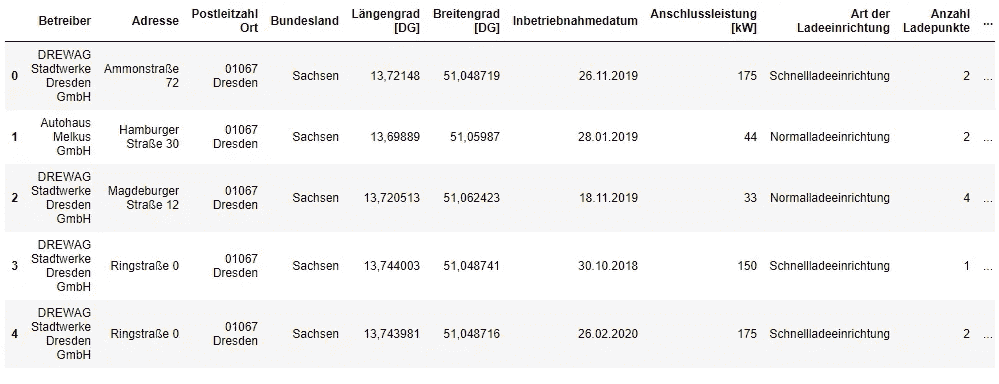**

**如上所示，我们跳过了文件开头的 5 行(**skip prows = 5**)，因为它们不包含有用的信息(只是关于正在显示的数据的注释)。**

# **数据帧翻译**

**Bundesnetzagentur 提供德语数据集。因此，在开始探索性数据分析之前，我们必须将数据集翻译成英语。首先，我们使用 [**熊猫来翻译列名。data frame . rename**T5 功能。](https://pandas.pydata.org/pandas-docs/stable/reference/api/pandas.DataFrame.rename.html)**

**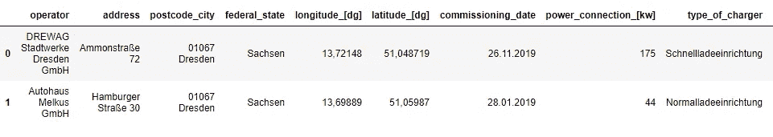**

**然后，我们使用**熊猫翻译列**的条目。Series.replace** 方法如下所示。****

**我们不打算翻译其余栏目的条目。但是，如果您想翻译它们，您可以使用 **googletrans** 库，因为这些列包含多个独特的元素。在这种情况下，硬编码翻译将非常耗时。**

** [## 使用 googletrans 库翻译熊猫数据框

### Googletrans 是一个使用 Google Translate API 的免费 python 库。在这篇文章中，我们解释了如何使用…

towardsdatascience.com](/translate-a-pandas-data-frame-using-googletrans-library-fb0aa7fca592) 

数据帧被翻译！现在，我们准备开始**探索性数据分析**。

# 探索性数据分析和数据清理

**探索性数据分析**包括分析数据集的主要特征，通常采用**可视化方法**和**汇总统计**。目标是理解数据，发现模式和异常，并在我们执行进一步评估之前检查假设。

在 EDA 之初，我们想知道尽可能多的关于数据的信息，这是当 [**熊猫的时候。data frame . info**方法就派上用场了。此方法打印数据框的简明摘要，包括列名及其数据类型、非空值的数量、数据框使用的内存量。](https://pandas.pydata.org/pandas-docs/stable/reference/api/pandas.DataFrame.info.html)

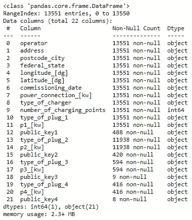

如上图所示，数据帧包含 13551 个**观测值**和 22 个**变量**。列 type_of_plug_2、p2[kw]、type_of_plug_3、p3[kw]、type_of_plug_4 和 p4[kw]包含**空值**，意味着第二、第三和第四充电点在充电站不可用(记住一个充电站可以有多个充电点)。我们使用 [**熊猫用**字符串‘0’**替换**空值**。series . fillna**](https://pandas.pydata.org/pandas-docs/stable/reference/api/pandas.Series.fillna.html)**功能，表示没有充电点。**

****公钥**是允许用户远程检查测量值的数字序列。由于它们不能为我们的分析提供有用的信息，我们将删除这些列。**

**正如我们在下面看到的，现在，数据帧不包含空值。**

**删除空值后，我们修改不正确的数据类型。我们可以使用 [**pandas 来检查列的数据类型。data frame . info**](https://pandas.pydata.org/pandas-docs/stable/reference/api/pandas.DataFrame.info.html)**方法(就像我们之前做的)或者用 [**熊猫。DataFrame.dtypes**](https://pandas.pydata.org/pandas-docs/stable/reference/api/pandas.DataFrame.dtypes.html) 属性。该属性返回包含每列数据类型的序列。****

****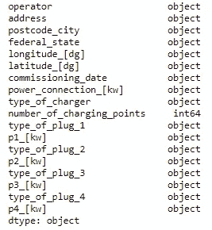****

****如上图所示，以下各列:(1)longitude _[DG]，(2) latitude_[dg]，(3) power_connection_[kw]，(4) p1_[kw]，(5) p2_[kw]，(6) p3_[kw]，(7) p4_[kw]为数据类型 **object** 而非 **float** 。我们可以用 [**熊猫。Series.astype**](https://pandas.pydata.org/pandas-docs/stable/reference/api/pandas.Series.astype.html) 方法将这些列的数据类型转换为 float，将之前的逗号替换为点。****

****此外，我们必须将列**调试日期**转换为日期时间。为了实现这一点，我们可以使用 **pandas.to_datetime** 方法，指定**格式**来匹配数据。****

****现在，我们可以运行 [**熊猫了。DataFrame.info**](https://pandas.pydata.org/pandas-docs/stable/reference/api/pandas.DataFrame.info.html) 方法再次检查**不适当的数据类型**和**空值**是否被正确修改。****

****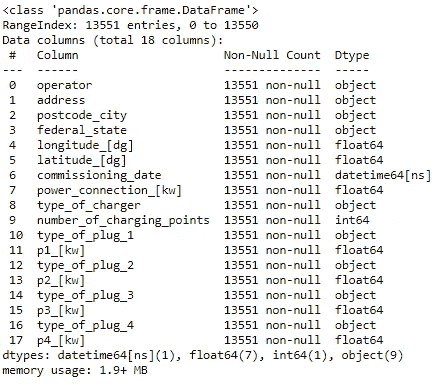****

****如上所示，数据集不包含空值，数据类型是预期的类型。****

******整齐数据集**具有以下结构:****

*   ****每个**变量**在一个**列**中。****
*   ****每个**观察值**位于不同的**行。******
*   ****每种**类型的观测单元**在不同的**表格**中。****

****正如您所看到的，列**邮政编码 _ 城市**包含两个变量:(1)邮政编码和(2)城市；因此，我们需要将该列拆分为两个不同的列。为此，我们可以用串法拆分( [**)熊猫。Series.str.split**](https://pandas.pydata.org/pandas-docs/stable/reference/api/pandas.Series.str.split.html) )，设置参数 **n=1** 和 **expand=True** 。****

****在 Pandas 中处理对象列时，前导空格和尾随空格是一个常见问题。我们必须确保列的条目在开头和结尾不包含空格，因为它们可能会在分析数据时导致错误的结论。****

****下面的代码显示了几个城市名称包含前导或尾随空格。****

****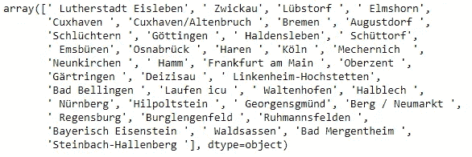****

****我们需要删除它们以避免数据分组时出现问题，因为如果我们不删除前导空格，例如“雷根斯堡”和“雷根斯堡”将被视为不同的城市。****

****如下所示，我们遍历对象数据类型的列，删除带有**熊猫的条目开头和结尾的所有空格。**方法。****

****最后，我们必须解决最后一个也是更具挑战性的清洁问题。在某些情况下，数据集中出现了同一城市的两个不同名称(如法兰克福和美因河畔法兰克福)。在其他时候，区名也与城市名一起被记录(例如斯图加特-慕尼黑)。****

****我们可以用 [**熊猫来识别错误的城市名称。Series.str.contains 的**和](https://pandas.pydata.org/pandas-docs/stable/reference/api/pandas.Series.str.contains.html)方法如下所示。****

****我们寻找德国最重要的城市，并创建了一本字典，将错误的名称映射到正确的名称上。然后，我们用这本字典来解释熊猫。Series.replace 函数修改错误的城市名。****

****数据集包含更多的错误名称，但至少我们已经纠正了稍后将出现在可视化中的城市名称。****

****最后，我想指出数据框包含多个重复的行，如下所示。****

****这些重复的观测值不应被删除，因为它们代表位于同一点的几个充电站。****

****数据清理完成💚。现在，我们准备回答问题，并利用数据得出结论。****

# ****回答问题并得出结论****

******探索性数据分析**和**数据清理**是让我们对数据有一个感觉并准备好轻松得出结论的步骤。现在！我们准备使用数据集回答以下问题。****

## ****联邦各州的充电站数量****

****下图显示**巴伐利亚州(3090)** 是电动汽车充电站数量最多的州，其次是**北莱茵-威斯特伐利亚州(2392)** 和**巴登-符腾堡州(1942)。**相反，****萨尔州**只有**91 个 EV 充电站。这是有道理的，因为萨尔州是一个人口稀少的州，没有大城市。********

******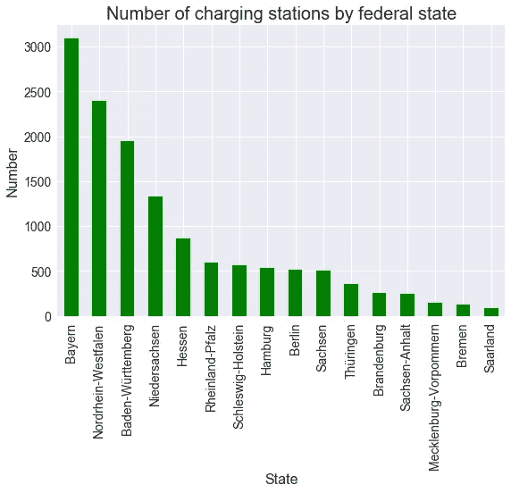********

## ******德国哪些城市拥有最多的 EV 充电站？******

******如下图，**慕尼黑(607)** 是**德国**电动汽车充电站最多的城市，其次是**汉堡(535)** 和**柏林(519)** 。科隆排名第四；但是它的充电站**【134】**要少得多。******

****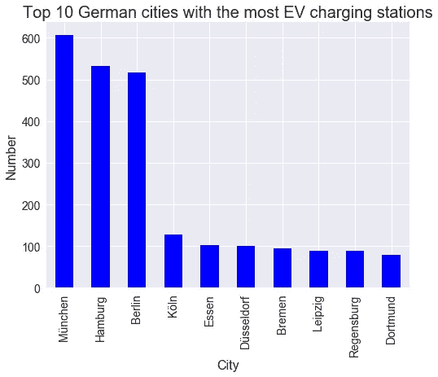****

****事实上，德国超过 **12%** 的充电站位于**慕尼黑**、**汉堡**，或者**柏林**如下图。****

## ****德国哪些城市的电动汽车充电站最多？****

****一个**充电站**可以有多个**充电点**。下面的饼图描绘了具有 1、2、3 和 4 个**充电点**的**充电站**的百分比。****

****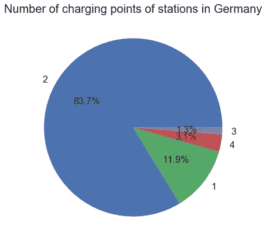****

****如上图，德国超过 80%的**充电站有 2 个充电点。相反，**只有 1.3%** 的站有 3 个负荷点。******

****下面的图显示**慕尼黑**、**汉堡**和**柏林**也是拥有最多电动汽车**充电点**的城市。****

****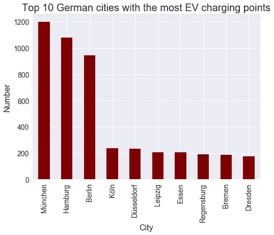****

## ****充电站是什么时候投入运营的？****

****下图显示了每年有多少**充电站**投入运行(调试日期)。正如您所观察到的，近年来安装的新**充电站**的数量呈增长趋势。****

****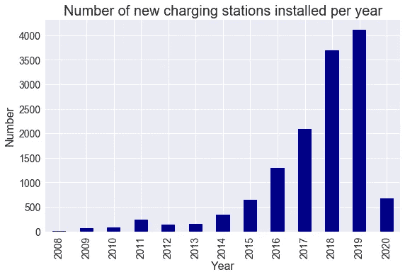****

****如上图所示，除了 **2012** 和 **2020** 之外，本年与上年的**变动百分比**始终为正。需要指出的是，数据集包含 2020 年 5 月 5 日之前的信息。****

****然而，由于冠状病毒危机，预计 2020 年**的新充电站数量将少于 2019 年**。********

## ******德国充电站的电力******

******电动汽车的**充电时间**取决于**充电点**的电量和车辆的**电池容量**。******

> ******充电时间[h] =电池容量[kwh] /充电功率[kw]******

****因此，充电点的**功率输出**是一个需要考虑的重要因素，因为它决定了**充电速度**。****

****下表显示了德国充电点最常见的**电源输出**。****

****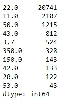****

****有**20741**22kW 的充电点，这是德国最常见的功率输出，其次是 **11kW** 。另一方面，**超快速****150 kw**和 **350kW** 的充电点较少见；然而，你可以在德国找到超过 450 个这样的人。****

****如下图，我们可以找到 62 种不同的**动力输出**用于德国的电动汽车充电。这些输出按升序排列如下，最常见的是 22.0、11.0、50.0、43.0、3.7、350.0、150.0、42.0、20.0、53.0 千瓦(见上表)。****

****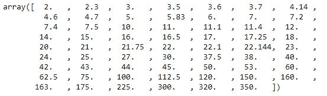****

****下面的饼图显示了根据功率输出的充电点百分比。****

****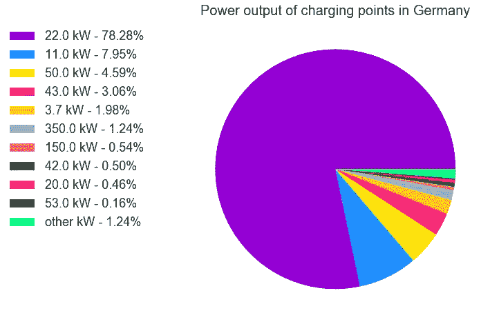****

****大家可以观察到，德国**充电点**中的 **78.28%** 的**充电功率**为 22kW。超快速充电器( **350kW** )仅占总充电点的 **1.24%** ，是德国安装的最大充电功率。****

## ****超快速充电器(> 300 kW)位于哪里？它们是什么时候安装的？****

******超快速充电点**是指充电功率大于或等于 **300 kW** 的点。正如我们在上面看到的，只有三种不同的功率输出符合这个要求: **300，320，350 kW** 。****

****下面这段代码显示，德国有 6 个 300 kW 的充电点、10 个 320 kW 的充电点、328 个 350 kW 的充电点在运行，总共有 **344 个超快速充电点**。****

****如前所述，一个**充电站**可以有多个**充电点**。在德国，我们可以找到多达 4 个充电点的充电站。****

****共有 341 个带**超快速充电点**的充电站，如下图所示。****

****350 kW 和 320 kW 的充电点位于只有一个充电点的充电站。相反，有 3 个充电站，2 个 300 kW 的充电点，如下图所示。****

****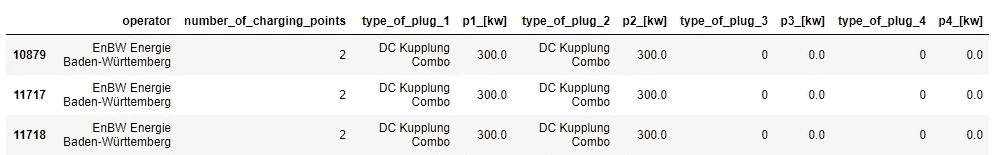****

****这些**站**主要位于**巴伐利亚**，在那里你可以找到超过 **80 个带超快速充电器的站**。****

****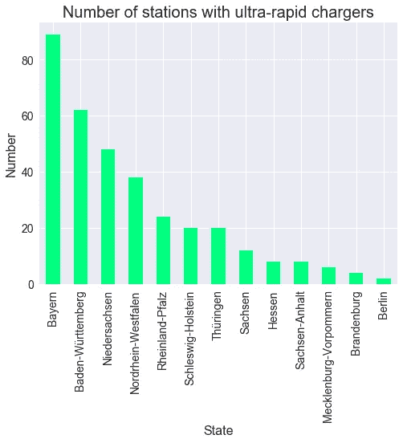****

****下图为**站带超快速充电器** ( > **300 kW** )于 **2018** 首次投入运行。此外，我们观察到大多数配备**超快速充电器**的站点安装在 **2019** 年。****

****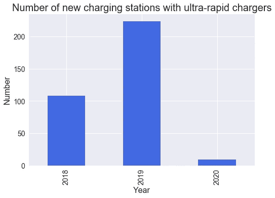****

****德国第一个 EV 充电站是在 2008 年 7 月安装的，直到 10 年后的 2018 年 3 月，才安装了第一个带有超快速充电器(> 300 kW)的站。****

## ****德国最大城市运营的电动汽车充电站总数****

****接下来我们要一步一步的说明如何获得德国最大城市按年的充电站总数:(1)柏林，(2)汉堡，(3)慕尼黑，(4)科隆，(5)美因河畔法兰克福，(6)斯图加特，(7)杜塞尔多夫，(8)多特蒙德，(9)埃森，(10)莱比锡。****

****首先，我们用 [**熊猫。data frame . group by**](https://pandas.pydata.org/pandas-docs/stable/reference/api/pandas.DataFrame.groupby.html)**函数。这个函数涉及到拆分对象、应用一个函数、组合结果的一些组合。******

****我们获得了一个多索引数据框，因为按两列分组将得到两个索引。我们选择一列(例如 operator)，因为所有列都提供相同的信息(计数)。然后，我们用 [**熊猫。data frame . un stack**](https://pandas.pydata.org/pandas-docs/stable/reference/api/pandas.DataFrame.unstack.html)**功能。该函数将最内层的索引级别透视到新的列级别。结果是一个数据帧( **date_cities** )，其中**列**表示**城市**，而**行**表示**试运行日期**，即在特定年份和城市投入运行的充电站数量**的值。因为我们只想分析德国最大的城市，所以我们在数据框中选择相应的列( **date_cities_10** )。********

**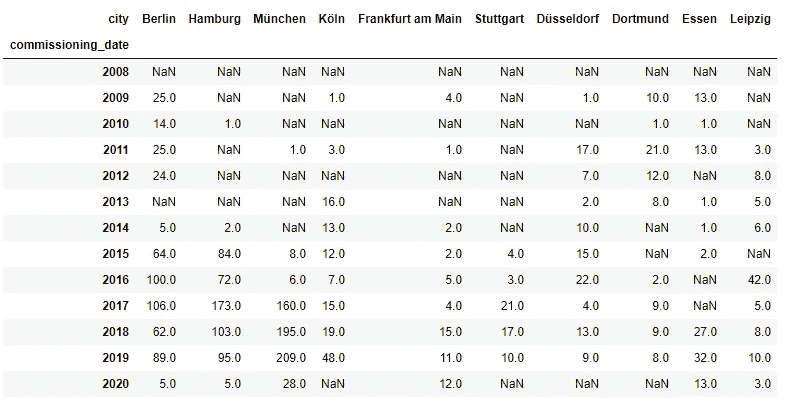**

**上面的数据框包含在特定的**年**和**城市投入运营的**充电站的**数量。**由于我们对多年来各个城市的充电站总数感兴趣，所以我们必须计算累计总数，用 0 替换之前的空值。然后，我们使用 plot 函数创建一个多线绘图，其中每条线代表一个城市。**

**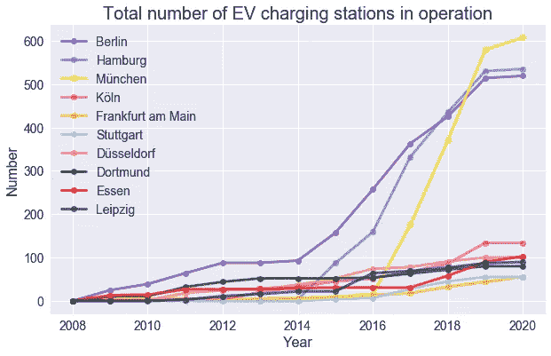**

**如上图所示，科隆、法兰克福、斯图加特、杜塞尔多夫、多特蒙德、埃森和莱比锡的充电站总数逐年缓慢增长。相反，自 2016 年以来，柏林、汉堡和慕尼黑的增长率要大得多。**

## **慕尼黑充电站分布**

**分析地理空间数据的最佳方式是使用地图。**leave**是一个**数据可视化**库，允许直接从你的 **Python** 代码生成**传单**网络地图。首先，我们需要安装它，因为**叶子**包不是 **Python 标准库**的一部分。为此，我们在 Windows 终端中运行以下命令:**

> ****pip 安装叶片****

**安装并导入**叶子**后，我们可以用**叶子.地图()**函数生成一个地图对象。**位置**参数允许我们在一个特定的位置将地图居中(在我们的例子中是**慕尼黑**)。我们还可以提供一个**初始缩放级别**来将地图缩放到中心。**

**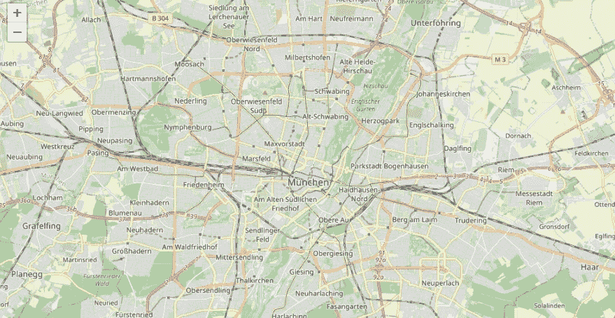**

**生成的地图是交互式的，这意味着您可以轻松地放大和缩小。**

**数据框包含充电站所在的纬度和经度。我们可以使用 **CircleMarker()** 函数在这些位置绘制圆形标记。**

**下图显示了充电站在慕尼黑的位置。正如你所观察到的，充电站相当均匀地分布在整个城市。然而，市中心的车站比郊区的多。**

**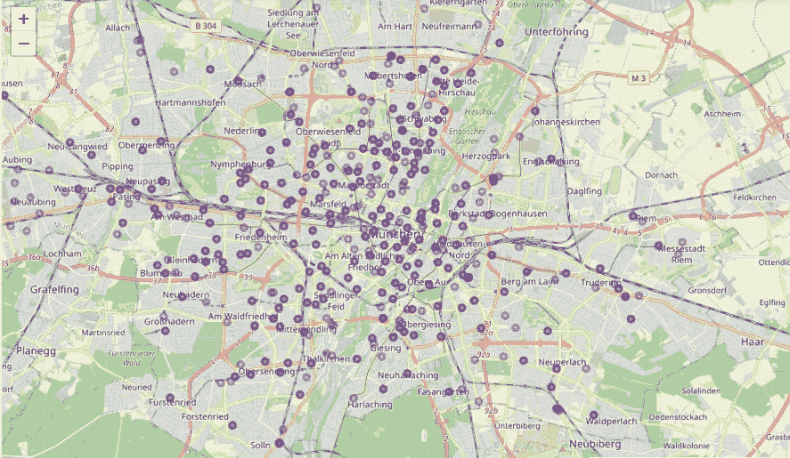**

**在上图中，您可以观察到一些标记比其他标记更不透明，这意味着多个桩号位于同一点(重叠的圆形标记)。**

**正如我们之前提到的，一个充电站可以有多个充电点。慕尼黑的充电站数量遵循以下分布:**

*   **1 个充电点:3.95%**
*   **2 个充电点:95.06%**
*   **3 个充电点:0.16%**
*   **4 个充电点:0.82%**

**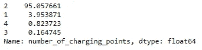**

**我们可以根据充电点的数量定制标记的半径和颜色，如下所示。**

**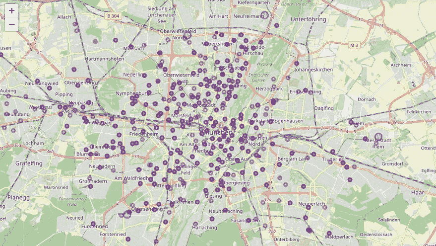**

**正如你所观察到的，大多数加油站都有两个充电点(紫色的点)。有 4 个充电点(蓝点)的车站位于慕尼黑郊区。**

**数据帧包含一列，指示充电站的类型:(1)普通，或(2)快速。如果一个充电站至少有一个输出功率大于 22kw 的充电点，则认为它是快速的，如下所示。**

**在下图中，**正常充电**站用**蓝色**标记表示。相反，**快充**站用**红色**表示。**

**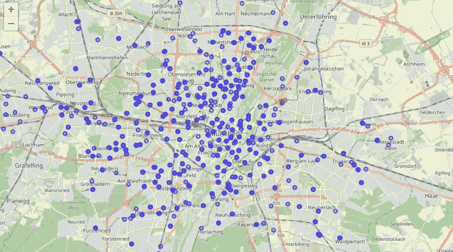**

**如上图所示，大部分站点**正常**，意味着所有充电点的功率输出都低于 **22kW** 。慕尼黑只有 **10 个快充**站。阿拉贝拉公园(及周边)是快速充电站较多的地方(总共 5 个)。**

**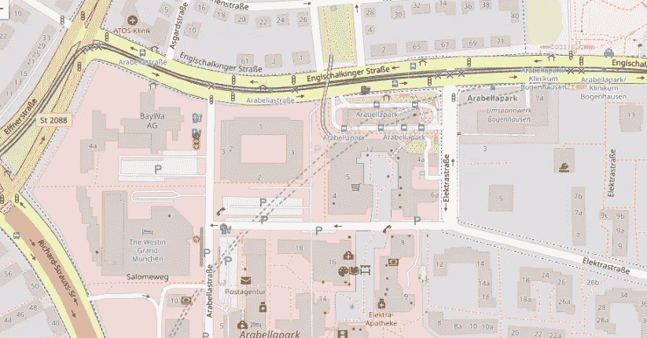**

**现在轮到你了！您可以生成其他城市的地图，并可视化充电站在这些城市中的分布情况🌐**

**我们的分析到此结束。然而，仍然有许多问题你可以用这些数据来回答。比如:有多少家公司在管充电站？德国有多少种不同的插头？德国最常见的插头是哪个？…还有更多！🙋**

# **关键要点**

*   ****巴伐利亚**是**联邦州**拥有更多电动汽车**充电站**(大约 3000 个)。**
*   ****慕尼黑**、**汉堡**、**柏林**是**德国**电动汽车充电站数量最多的城市。**
*   **一个**充电站**可以有多个**充电点** (1、2、3 或 4)。**德国超过 80%的电动汽车充电站拥有 2 个充电点。****
*   **这些年来，运营中的新充电站的数量在增加。**
*   ****德国**的**充电点**的 **78.3%** 充电功率为 **22kW** 。**超快速充电器** ( **350kW** )仅占总充电点数的 **1.24%** 。**
*   **第一台**超快速充电器(> 300kW)** 于 **2018 年投入运行。****
*   **科隆、法兰克福、斯图加特、杜塞尔多夫、多特蒙德、埃森和莱比锡的充电站总数逐年缓慢增长。相反，自 2016 年以来，柏林、汉堡和慕尼黑的增长率要大得多。**

**感谢阅读💜**

**阿曼达**