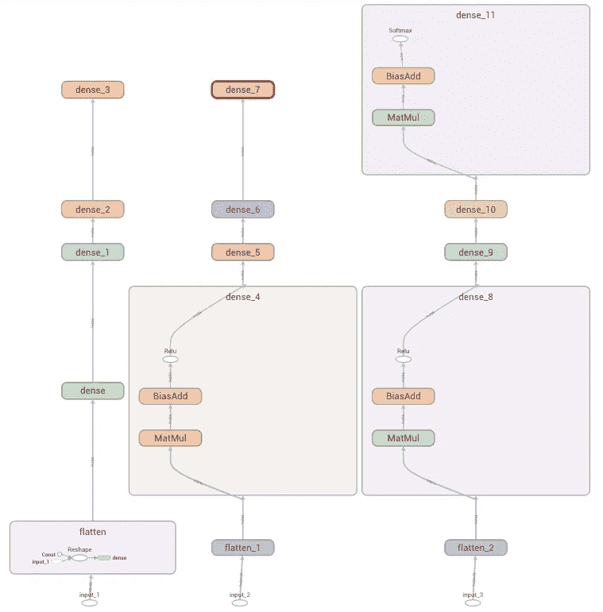
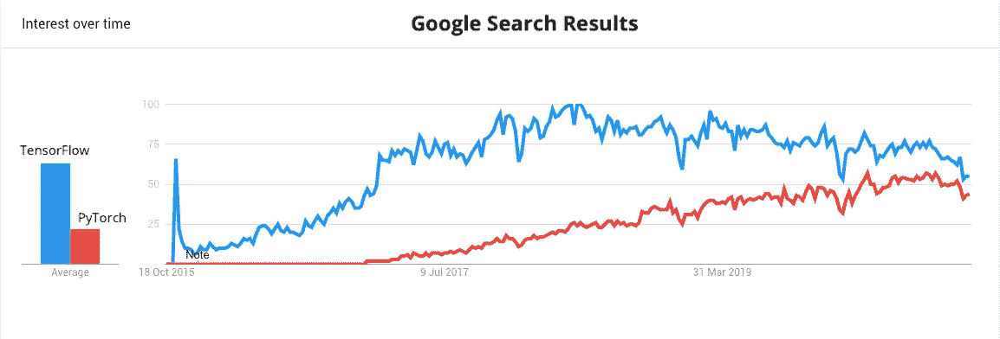

# TensorFlow 中的急切执行与图形执行:哪个更好？

> 原文：<https://towardsdatascience.com/eager-execution-vs-graph-execution-which-is-better-38162ea4dbf6?source=collection_archive---------3----------------------->

## [←Part 1](/beginners-guide-to-tensorflow-2-x-for-deep-learning-applications-c7ebd0dcfbee)|[←Part 2](/mastering-tensorflow-tensors-in-5-easy-steps-35f21998bb86)|[←Part 3](/mastering-tensorflow-variables-in-5-easy-step-5ba8062a1756)|深度学习用 TENSORFLOW 2。X —第 4 部分

## 使用代码示例比较急切执行和图形执行，了解何时使用两者以及 TensorFlow 为何切换到急切执行|使用 TensorFlow 2.x 进行深度学习


图一。急切执行与图形执行(图由作者提供)

T 这是 TensorFlow 2.x 系列深度学习的第 4 部分，我们将比较 TensorFlow 中可用的两个执行选项:

> 急切执行与图形执行

你可能没有注意到，你实际上可以在这两者中选择一个。原因是 TensorFlow 将急切执行设置为默认选项，除非您想找麻烦，否则它不会打扰您😀。但是，在 TensorFlow 1.x 版本中并非如此。让我们看看什么是急切执行，以及为什么 TensorFlow 在 TensorFlow 2.0 中从图形执行进行了重大转变。


图二。图形执行与急切执行的类比(由[詹姆斯·庞德](https://unsplash.com/@jamesponddotco)拍摄于 [Unsplash](https://unsplash.com/?utm_source=medium&utm_medium=referral) |由 [TVBEATS](https://unsplash.com/@tvbeats?utm_source=medium&utm_medium=referral) 拍摄于 [Unsplash](https://unsplash.com?utm_source=medium&utm_medium=referral)

# 急切的执行

渴望执行是一个强大的执行环境，它可以立即评估操作。它不构建图形，并且操作返回实际值，而不是稍后运行的计算图形。通过快速执行，TensorFlow 计算代码中出现的张量值。

急切执行简化了 TensorFlow 中的模型构建体验，您可以立即看到 TensorFlow 操作的结果。由于急切执行直观且易于测试，因此对于初学者来说是一个极好的选择。热切执行不仅使调试更容易，而且还减少了对重复样板代码的需求。急切执行也是研究和实验的一个灵活选项。它提供:

*   **具有自然 Python 代码和数据结构的直观界面**；
*   **调试更简单**，直接调用操作检查测试模型；
*   **自然控制流**用 Python，代替图形控制流；和
*   支持 **GPU & TPU 加速。**

在急切执行中，TensorFlow 操作由原生 Python 环境一个接一个地执行。这使得急切执行(I)易于调试，(ii)直观，(iii)易于原型化，以及(iv)对初学者友好。由于这些原因，TensorFlow 团队将急切执行作为 TensorFlow 2.0 的默认选项。*但是，在接下来的章节中会有更多相关内容……*

> 让我们来看看图形执行。

# 图形执行

我们在上一节中介绍了急切执行是多么有用和有益，但是有一个问题:

> 急切执行比图形执行慢！



图 3。在 [Tensorboard](https://www.tensorflow.org/tensorboard) 中的模型示例的图形可视化(图片由作者提供)

由于急切执行在 Python 中逐个运行所有操作，因此它不能利用潜在的加速机会。Graph execution 从 Python 中提取张量计算，并在评估之前构建一个高效的*图*。图形，或者说`tf.Graph`对象，是带有`tf.Operation`和`tf.Tensor`对象的特殊数据结构。`tf.Operation`对象代表计算单元，`tf.Tensor`对象代表数据单元。无需原始 Python 代码就可以保存、运行和恢复图形，这为跨平台应用程序提供了额外的灵活性。有了图，您可以在 Python 不可用的移动、嵌入式和后端环境中利用您的模型。在本系列的稍后阶段，我们将看到，无论您选择哪一个执行选项，经过训练的模型都被保存为图形。

图表很容易优化。它们允许编译器级别的转换，例如具有常数折叠的张量值的统计推断，在线程和设备之间分布操作的子部分(高级级别分布)，并简化算术运算。[抓钩](https://www.tensorflow.org/guide/graph_optimization)执行这些整体优化操作。在图形执行中，只有在我们完全调用了程序之后，才会对所有操作进行评估。因此，总而言之，图形执行是:

*   **非常快**；
*   **非常灵活**；
*   **与**并行运行，即使在子操作层面；和
*   **非常高效**，适用于多种设备
*   拥有 **GPU & TPU 加速**能力。

因此，尽管难以学习、难以测试且不直观，图形执行对于大型模型训练来说是理想的。对于小型模型培训、初学者和一般开发人员来说，急切执行更适合。

嗯，考虑到急切执行易于构建和测试，而图形执行高效而快速，您会希望用急切执行来构建，用图形执行来运行，对吗？好吧，我们会谈到那个…

> 寻找两全其美的世界？一个快速但易于构建的选项？继续读:)

在深入代码示例之前，我们先来讨论一下为什么 TensorFlow 在 TensorFlow 2.0 中从图形执行切换到急切执行。

# TensorFlow 为什么采用急切执行？

在 2.0 版本之前，TensorFlow 优先考虑图形执行，因为它快速、高效且灵活。对于经验丰富的程序员来说，实现的难度只是一种权衡。另一方面， [PyTorch](http://pytorch.org) 采用了一种不同的方法，并对动态计算图进行了优先级排序，这是一个类似于急切执行的概念。尽管动态计算图不如 TensorFlow 图执行效率高，但它们为新一波研究人员和人工智能程序员提供了一个简单而直观的界面。默认执行策略的这种差异使得 PyTorch 对新来者更有吸引力。很快，PyTorch 虽然是后来者，却开始追赶 TensorFlow。



图 4。TensorFlow vs. PyTorch 谷歌搜索结果由[谷歌趋势](https://trends.google.com/trends/explore?date=today%205-y&q=%2Fg%2F11bwp1s2k3,%2Fg%2F11gd3905v1)(图由作者提供)

在看到 PyTorch 越来越受欢迎后，TensorFlow 团队很快意识到他们必须优先考虑急切执行。因此，他们采用了急切执行作为默认的执行方式，而图形执行是可选的。这就好比，PyTorch 将动态计算图设置为默认的执行方法，你可以选择使用静态计算图来提高效率。

由于现在 TensorFlow 和 PyTorch 都采用了初学者友好的执行方法，PyTorch 失去了对初学者的竞争优势。目前，由于其成熟性，TensorFlow 占据上风。然而，毫无疑问，PyTorch 也是构建和训练深度学习模型的一个很好的替代方案。选择权在你…

# 用渴望编码，用图形执行

在这一节中，我们将使用基本代码示例比较急切执行和图形执行。为了简单起见，我们将有意避免构建复杂的模型。但是，在本系列接下来的部分中，我们还可以使用更复杂的模型来比较这些执行方法。

我们已经提到 TensorFlow 优先考虑急切执行。但这还不是全部。现在，您实际上可以像急切执行一样构建模型，然后用图形执行来运行它。TensorFlow 1.x 需要用户手动创建图表。然后通过将一组输出张量和输入张量传递给一个`session.run()`调用来手动编译这些图形。但是，在 TensorFlow 2.0 中，图形构建和会话调用被简化为实现细节。这种简化是通过用`tf.function()`装饰者代替`session.run()`来实现的。在 TensorFlow 2.0 中，您可以使用`tf.function()`来修饰 Python 函数，使其作为单个 graph 对象运行。使用这种新方法，您可以轻松地构建模型，并获得图形执行的所有好处。

# 代码示例

这篇文章将通过几个基本的例子和一个完整的虚拟模型来测试 eager 和 graph 的执行。请注意，由于这是一篇介绍性的帖子，我们现在不会深入到一个完整的基准测试分析*。*

## *基本示例*

*我们将从两个初始导入开始:*

```
*[**timeit**](https://docs.python.org/2/library/timeit.html) is a Python module which provides a simple way to time small bits of Python and it will be useful to compare the performances of eager execution and graph execution.*
```

*要运行一个热切执行的代码，我们不需要做什么特别的事情；我们创建一个函数，传递一个`tf.Tensor`对象，然后运行代码。在下面的代码中，我们创建了一个名为`eager_function`的函数来计算张量值的平方。然后，我们创建一个`tf.Tensor`对象，最后调用我们创建的函数。我们的代码以急切的执行方式执行:*

```
***Output:** tf.Tensor([ 1\.  4\.  9\. 16\. 25.], shape=(5,), dtype=float32)*
```

*让我们首先看看如何用图形执行来运行相同的函数。*

```
***Output:** Tensor("pow:0", shape=(5,), dtype=float32)*
```

*通过用`tf.function()`函数包装我们的`eager_function`，我们能够用图形执行来运行我们的代码。我们可以用如下所示的`timeit`来比较这两种方法的执行时间:*

```
*Output:
Eager time: 0.0008830739998302306
Graph time: 0.0012101310003345134*
```

*如您所见，图形执行花费了更多的时间。但是为什么呢？嗯，对于简单的操作，图形执行的表现并不好，因为它必须花费初始计算能力来构建一个图形。我们看到了图形执行在复杂计算中的威力。如果我运行代码 100 次(通过更改 number 参数)，结果会发生巨大的变化(*主要是由于本例中的 print 语句*):*

```
*Output:
Eager time: 0.06957343100020807 
Graph time: 0.02631650599960267*
```

## *全模型试验*

*既然您已经介绍了基本的代码示例，那么让我们构建一个虚拟神经网络来比较 eager 和 graph 执行的性能。我们将:*

*1-使 TensorFlow 导入使用所需的模块；*

*2 —建立基本前馈神经网络；*

*3 —创建一个随机的`Input`对象；*

*4 —以热切的执行来运行模型；*

*5-用`tf.function()`包装模型，用图形执行运行它。*

```
*If you are new to TensorFlow, don’t worry about how we are building the model. We will cover this in detail in the upcoming parts of this Series.*
```

*以下代码行执行所有这些操作:*

```
*Output:
Eager time: 27.14511264399971
Graph time: 17.878579870000067*
```

*正如您所看到的，我们的图形执行比急切执行多了 40%左右。在更复杂的模型训练操作中，这个余量要大得多。*

# *最终注释*

*在这篇文章中，我们比较了急切执行和图形执行。虽然急切执行易于使用且直观，但图形执行更快、更灵活、更健壮。因此，对于初学者来说，使用缺省选项“急切执行”是显而易见的。然而，如果你想利用灵活性和速度，并且是一个经验丰富的程序员，那么图形执行是适合你的。另一方面，由于 TensorFlow 的最新改进，使用图形执行变得更加简单。因此，您甚至可以突破自己的极限来尝试图形执行。但是，请确保您知道在图形执行中调试也更加困难。*

*上面的代码示例向我们展示了对简单的示例应用图形执行是很容易的。对于更复杂的模型，图形执行会带来一些额外的工作负载。*

```
*Note that when you wrap your model with tf.function(), you cannot use several model functions like model.compile() and model.fit() because they already try to build a graph automatically. But we will cover those examples in a different and more advanced level post of this series.*
```

# *恭喜*

*我们已经成功地比较了急切执行和图形执行。*

> *给自己一个鼓励！*

*这应该会给你很大的信心，因为你现在对急切执行、图形执行以及使用这些执行方法的利弊有了更多的了解。*

# *订阅邮件列表获取完整代码*

*如果你想获得 Google Colab 的全部代码和我的其他最新内容，可以考虑订阅邮件列表。*

> *[现在就订阅](http://eepurl.com/hd6Xfv)*

**如果你正在阅读这篇文章，我确信我们有着相似的兴趣，并且现在/将来会从事相似的行业。那么我们就通过*[*Linkedin*](https://linkedin.com/in/orhangaziyalcin/)*来连线吧！请不要犹豫发送联系请求！*[*Orhan g . Yal n—Linkedin*](https://linkedin.com/in/orhangaziyalcin/)*

*如果您刚刚开始使用 TensorFlow，请考虑从本教程系列的第 1 部分开始:*

*[](/beginners-guide-to-tensorflow-2-x-for-deep-learning-applications-c7ebd0dcfbee) [## 深度学习应用 TensorFlow 2.x 初学者指南

### 了解 TensorFlow 平台以及它能为机器学习专家提供什么

towardsdatascience.com](/beginners-guide-to-tensorflow-2-x-for-deep-learning-applications-c7ebd0dcfbee) 

或[检查第二部分](/mastering-tensorflow-tensors-in-5-easy-steps-35f21998bb86):

[](/mastering-tensorflow-tensors-in-5-easy-steps-35f21998bb86) [## 通过 5 个简单的步骤掌握 TensorFlow 张量

### 探索 TensorFlow 的构建模块如何在较低的级别工作，并学习如何充分利用张量…

towardsdatascience.com](/mastering-tensorflow-tensors-in-5-easy-steps-35f21998bb86) 

或者[检查第 3 部分](/mastering-tensorflow-variables-in-5-easy-step-5ba8062a1756):

[](/mastering-tensorflow-variables-in-5-easy-step-5ba8062a1756) [## 用 5 个简单的步骤掌握 TensorFlow“变量”

### 了解如何使用张量流变量，它们与普通张量对象的区别，以及它们何时优于…

towardsdatascience.com](/mastering-tensorflow-variables-in-5-easy-step-5ba8062a1756)*