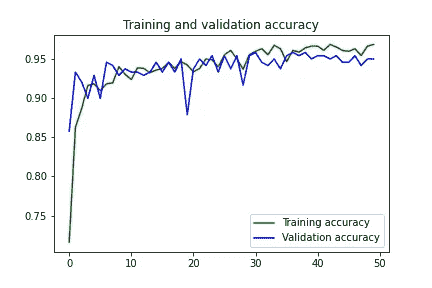

# 基于深度学习和 OpenCV 的早期火灾探测系统

> 原文：<https://towardsdatascience.com/early-fire-detection-system-using-deep-learning-and-opencv-6cb60260d54a?source=collection_archive---------3----------------------->

## 深度学习| OpenCV

## 为室内和室外火灾探测创建定制的 InceptionV3 和 CNN 架构。


伊利亚·安东内尔在 [Unsplash](https://unsplash.com?utm_source=medium&utm_medium=referral) 上的照片

嵌入式处理领域的最新进展已经允许基于视觉的系统在监控期间使用卷积神经网络来检测火灾。在本文中，我们实现了两个定制的 CNN 模型，为监控视频提供了一个经济高效的火灾探测 CNN 架构。第一个模型是受 AlexNet 架构启发定制的基本 CNN 架构。我们将实现并查看它的输出和限制，并创建一个定制的 InceptionV3 模型。为了平衡效率和准确性，考虑到目标问题的性质和射击数据，对模型进行微调。我们将使用三个不同的数据集来训练我们的模型。数据集的链接可以在本文末尾找到。让我们进入编码部分。

# 1.创建定制的 CNN 架构

我们将使用 TensorFlow API Keras 构建我们的模型。让我们首先创建 ImageDataGenerator 来标记我们的数据。[1]和[2]数据集在这里用于训练。最后，我们将有 980 幅图像用于训练，239 幅图像用于验证。我们也将使用数据增强。

```
import tensorflow as tf
import keras_preprocessing
from keras_preprocessing import image
from keras_preprocessing.image import ImageDataGeneratorTRAINING_DIR = "Train"
training_datagen = ImageDataGenerator(rescale = 1./255,
                                  horizontal_flip=True,
                                  rotation_range=30,
                                  height_shift_range=0.2,
                                  fill_mode='nearest')VALIDATION_DIR = "Validation"
validation_datagen = ImageDataGenerator(rescale = 1./255)
train_generator = training_datagen.flow_from_directory(TRAINING_DIR,
                                         target_size=(224,224),
                                         class_mode='categorical',
                                         batch_size = 64)validation_generator = validation_datagen.flow_from_directory(      
                                           VALIDATION_DIR,
                                           target_size=(224,224),
                                           class_mode='categorical',
                                           batch_size= 16)
```

在上面的代码中，应用了 3 种数据扩充技术——水平翻转、旋转和高度移动。

现在，我们将创建我们的 CNN 模型。该模型包含三个 Conv2D-MaxPooling2D 层对，后跟三个密集层。为了克服过度拟合的问题，我们还将增加脱落层。最后一层是 softmax 层，它将给出火灾和非火灾这两个类别的概率分布。*还可以在最后一层使用“sigmoid”激活函数，将类的数量改为 1。*

```
from tensorflow.keras.optimizers import Adam
model = tf.keras.models.Sequential([
tf.keras.layers.Conv2D(96, (11,11), strides=(4,4), activation='relu', input_shape=(224, 224, 3)), tf.keras.layers.MaxPooling2D(pool_size = (3,3), strides=(2,2)),
tf.keras.layers.Conv2D(256, (5,5), activation='relu'),
tf.keras.layers.MaxPooling2D(pool_size = (3,3), strides=(2,2)),
tf.keras.layers.Conv2D(384, (5,5), activation='relu'),
tf.keras.layers.MaxPooling2D(pool_size = (3,3), strides=(2,2)),
tf.keras.layers.Flatten(),
tf.keras.layers.Dropout(0.2),
tf.keras.layers.Dense(2048, activation='relu'),
tf.keras.layers.Dropout(0.25),
tf.keras.layers.Dense(1024, activation='relu'),
tf.keras.layers.Dropout(0.2),
tf.keras.layers.Dense(2, activation='softmax')])model.compile(loss='categorical_crossentropy',
optimizer=Adam(lr=0.0001),
metrics=['acc'])history = model.fit(
train_generator,
steps_per_epoch = 15,
epochs = 50,
validation_data = validation_generator,
validation_steps = 15
)
```

我们将使用 Adam 作为优化器，学习率为 0.0001。经过 50 个周期的训练，我们得到了 96.83 的训练准确率和 94.98 的验证准确率。训练和验证损失分别为 0.09 和 0.13。



我们模型的训练过程

让我们对任何图像测试我们的模型，看看它是否能猜对。为了测试，我选择了 3 张图片，包括一张火的图片，一张非火的图片，还有一张我的图片，包含火一样的颜色和阴影。


在这里，我们可以看到我们上面创建的模型在对我的图像进行分类时犯了一个错误。模型有 52%的把握图像中有火。这是因为它被训练的数据集。在数据集中很少有图像教导关于室内火灾的模型。因此，该模型只知道室外火灾，因此当给定一个室内火灾一样的阴影图像时，它会出错。另一个原因是，我们的模型不是一个可以学习火的复杂特征的复杂模型。

我们接下来要做的是，使用标准的 InceptionV3 模型并对其进行定制。复杂模型能够从图像中学习复杂特征。

# 2.正在创建自定义的 InceptionV3 模型

这次我们将使用一个不同的数据集[3]，这个数据集包含室外和室内的火灾图像。我在这个数据集中训练了我们以前的 CNN 模型，结果是它过度拟合，因为它无法处理这个相对较大的数据集，也无法从图像中学习复杂的特征。

让我们从为我们定制的 InceptionV3 创建 ImageDataGenerator 开始。数据集包含 3 个类，但是对于本文，我们将只使用 2 个类。它包含 1800 幅用于训练的图像和 200 幅用于验证的图像。此外，我添加了我的起居室的 8 张图像，以在数据集中添加一些噪声。

```
import tensorflow as tf
import keras_preprocessing
from keras_preprocessing import image
from keras_preprocessing.image import ImageDataGeneratorTRAINING_DIR = "Train"
training_datagen = ImageDataGenerator(rescale=1./255,
zoom_range=0.15,
horizontal_flip=True,
fill_mode='nearest')VALIDATION_DIR = "/content/FIRE-SMOKE-DATASET/Test"
validation_datagen = ImageDataGenerator(rescale = 1./255)train_generator = training_datagen.flow_from_directory(
TRAINING_DIR,
target_size=(224,224),
shuffle = True,
class_mode='categorical',
batch_size = 128)validation_generator = validation_datagen.flow_from_directory(
VALIDATION_DIR,
target_size=(224,224),
class_mode='categorical',
shuffle = True,
batch_size= 14)
```

为了使训练更加准确，我们可以使用数据增强技术。在上面的代码中，应用了两种数据扩充技术——水平翻转和缩放。

让我们从 Keras API 导入我们的 InceptionV3 模型。我们将在 InceptionV3 模型的顶部添加我们的层，如下所示。我们将添加一个全局空间平均池层，然后是 2 个密集层和 2 个下降层，以确保我们的模型不会过度拟合。最后，我们将为 2 个类添加一个 softmax 激活的密集层。

接下来，我们将首先只训练我们添加并随机初始化的层。这里我们将使用 RMSprop 作为优化器。

```
from tensorflow.keras.applications.inception_v3 import InceptionV3
from tensorflow.keras.preprocessing import image
from tensorflow.keras.models import Model
from tensorflow.keras.layers import Dense, GlobalAveragePooling2D, Input, Dropoutinput_tensor = Input(shape=(224, 224, 3))
base_model = InceptionV3(input_tensor=input_tensor, weights='imagenet', include_top=False)x = base_model.output
x = GlobalAveragePooling2D()(x)
x = Dense(2048, activation='relu')(x)
x = Dropout(0.25)(x)
x = Dense(1024, activation='relu')(x)
x = Dropout(0.2)(x)
predictions = Dense(2, activation='softmax')(x)model = Model(inputs=base_model.input, outputs=predictions)for layer in base_model.layers:
  layer.trainable = Falsemodel.compile(optimizer='rmsprop', loss='categorical_crossentropy', metrics=['acc'])history = model.fit(
train_generator,
steps_per_epoch = 14,
epochs = 20,
validation_data = validation_generator,
validation_steps = 14)
```

在对我们的顶层进行 20 个时期的训练之后，我们将冻结模型的前 249 层，并训练其余的层，即前 2 个先启块。这里，我们将使用 SGD 作为优化器，学习率为 0.0001。

```
#To train the top 2 inception blocks, freeze the first 249 layers and unfreeze the rest.for layer in model.layers[:249]:
  layer.trainable = Falsefor layer in model.layers[249:]:
  layer.trainable = True#Recompile the model for these modifications to take effectfrom tensorflow.keras.optimizers import SGD
model.compile(optimizer=SGD(lr=0.0001, momentum=0.9), loss='categorical_crossentropy', metrics=['acc'])history = model.fit(
train_generator,
steps_per_epoch = 14,
epochs = 10,
validation_data = validation_generator,
validation_steps = 14)
```

经过 10 个历元的训练，我们得到的训练准确率为 98.04，验证准确率为 96.43。训练和验证损失分别为 0.063 和 0.118。


上述 10 个时期的训练过程

让我们对相同的图像测试我们的模型，看看它是否能猜对。


这一次，我们的模型可以让所有三个预测正确。96%确定我的图像不包含任何火。我用于测试的另外两张图像是:


来自下面引用的数据集的非火灾图像

# 实时测试:

现在，我们的模型已经准备好接受真实场景的测试了。下面是使用 OpenCV 访问我们的网络摄像头并预测每一帧是否包含火焰的示例代码。如果一个帧中包含火，我们希望将该帧的颜色更改为 B&W

```
import cv2
import numpy as np
from PIL import Image
import tensorflow as tf
from keras.preprocessing import image#Load the saved model
model = tf.keras.models.load_model('InceptionV3.h5')
video = cv2.VideoCapture(0)while True:
        _, frame = video.read()#Convert the captured frame into RGB
        im = Image.fromarray(frame, 'RGB')#Resizing into 224x224 because we trained the model with this image size.
        im = im.resize((224,224))
        img_array = image.img_to_array(im)
        img_array = np.expand_dims(img_array, axis=0) / 255
        probabilities = model.predict(img_array)[0]
        #Calling the predict method on model to predict 'fire' on the image
        prediction = np.argmax(probabilities)
        #if prediction is 0, which means there is fire in the frame.
        if prediction == 0:
                frame = cv2.cvtColor(frame, cv2.COLOR_RGB2GRAY)
                print(probabilities[prediction])cv2.imshow("Capturing", frame)
        key=cv2.waitKey(1)
        if key == ord('q'):
                break
video.release()
cv2.destroyAllWindows()
```

下面是上面代码的实时输出。


Github 关于这个项目的链接是[这里是](https://github.com/jackfrost1411/fire-detection)。您可以在那里找到数据集和上面的所有代码。您可以从[这里](https://www.linkedin.com/in/dhruvilshah28/)在 LinkedIn 上与我联系。如果有任何疑问，请在这里或我的 LinkedIn 收件箱中回复。


照片由 [Anandaram G](https://unsplash.com/@luvlyanand?utm_source=medium&utm_medium=referral) 在 [Unsplash](https://unsplash.com?utm_source=medium&utm_medium=referral) 上拍摄

# 结论

使用智能摄像机，您可以识别各种可疑事件，如碰撞、医疗急救和火灾。其中，火灾是最危险的异常事件，因为不在早期阶段控制它会导致巨大的灾难，导致人类、生态和经济损失。受 CNN 巨大潜力的启发，我们可以在早期从图像或视频中检测火灾。本文展示了两个火灾探测的定制模型。考虑到 CNN 模型的火灾探测准确性，它可以帮助灾害管理团队及时管理火灾，从而防止巨大的损失。

# 本文使用的数据集:

[](https://www.kaggle.com/atulyakumar98/test-dataset) [## 1.火灾探测数据集

### 标签 1 表示火灾，而 0 表示正常

www.kaggle.com](https://www.kaggle.com/atulyakumar98/test-dataset) [](https://www.kaggle.com/phylake1337/fire-dataset) [## 2.火灾数据集

### 用于计算机视觉任务的室外火灾图像和非火灾图像。

www.kaggle.com](https://www.kaggle.com/phylake1337/fire-dataset) [](https://github.com/DeepQuestAI/Fire-Smoke-Dataset) [## 3.深水/火灾-烟雾-数据集

### 用于训练火和帧检测的图像数据集 AI 火-火焰数据集是收集用于训练的数据集…

github.com](https://github.com/DeepQuestAI/Fire-Smoke-Dataset)