# 从社会地理角度看越南的早婚现象

> 原文：<https://towardsdatascience.com/early-marriage-in-vietnam-from-a-socio-geographic-perspective-a58b1f08d162?source=collection_archive---------36----------------------->

这个分析是我在 IBM 数据科学峰会上工作的一部分。

照片由 [Hisu lee](https://unsplash.com/@lee_hisu?utm_source=unsplash&utm_medium=referral&utm_content=creditCopyText) 在 [Unsplash](https://unsplash.com/s/photos/marriage-vietnam?utm_source=unsplash&utm_medium=referral&utm_content=creditCopyText) 上拍摄

# 1.介绍

在越南，千禧一代正在推迟或推迟他们的婚姻。在过去十年里，初婚的平均年龄从 24.5 岁上升到了 25.5 岁。这一趋势直接加速了人口老龄化，给这个亚洲增长最快的经济体之一带来了巨大的担忧。根据规划投资部的数据，15 至 64 岁的越南人占人口的 68%。与此同时，65 岁及以上的人是增长最快的群体。这个年龄组在 2019 年占人口的 7.7%，高于 2009 年的 6.4%。

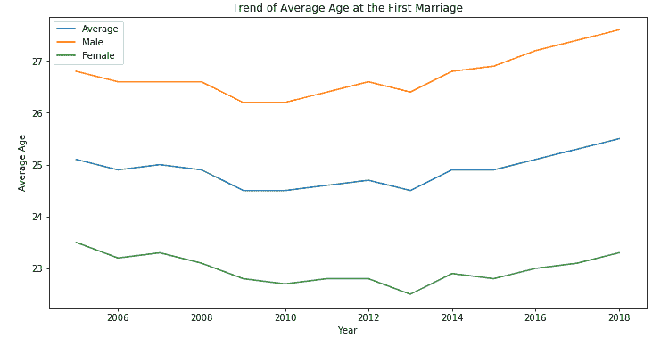

作者图片

由于越南官员担心该国部分地区的低生育率，他们鼓励年轻人在 30 岁之前结婚生子。在政府的最新公告中没有太多关于具体战略、政策或提供给地方当局的指导的信息。在深入研究解决方案之前，以下是此分析的两个主要动机:

*   哪些因素可能推动了越南的晚婚趋势？
*   地理区域之间结婚年龄有统计学差异吗？

回答第一个问题将会对越南的婚姻状况有一个清晰的了解。相比之下，第二个答案将在实现阶段支持较低级别的本地化(如果有)。

# 2.数据

# 2.1.数据理解和收集

以下是本分析中使用的所有资料来源:

*   来自[越南统计总局](https://www.gso.gov.vn/Default_en.aspx?tabid=766)的统计数据，包括三个要素:(1)人口和就业；(2)教育；(3)健康、文化和生活水平(2020 年 5 月 29 日)。
*   从越南[统计总局](http://www.gso.gov.vn/Default_en.aspx?tabid=515)2018 年劳动力调查报告中收集的就业工时数据。
*   [地理空间坐标](https://data.opendevelopmentmekong.net/en/dataset/a-phn-huyn?type=dataset):多边形数据集，包含开放开发湄公河数据库中越南各省政府的地理空间数据。这些 JSON 格式的数据为越南地图的可视化提供了输入。
*   [越南行政区划列表](https://www.gso.gov.vn/dmhc2015/):省级/市级。该信息来自越南统计总局(GSO)(2020 年 5 月 29 日)。

# 2.2.数据清理

由于政府机构获取和组织的所有数据都是结构化的，因此不需要进行大规模的清理和处理。然而，收集的数据不是集中的，而是以不同的形式存在。例如，关于具有四个主要标准的生活水平的统计数据以四种不同的形式分配。因此，在将每个数据集合并到用于分析的主数据集之前，仔细检查每个数据集是非常重要的。完成了一些小的清洁任务，包括:

*   从数据中删除越南口音，以便稍后分类
*   更改省/市名称以匹配地理空间坐标(JSON 格式的多边形数据集)
*   检查了每一列的数据类型
*   删除重复记录

数据清理的输出(前 5 行)如下所示:

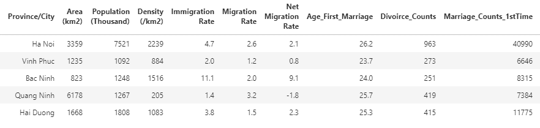

作者图片

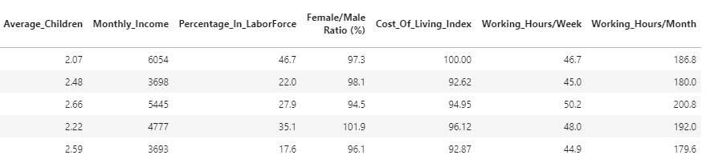

作者图片

# 2.3.解释性数据分析— EDA

[EDA](/exploratory-data-analysis-8fc1cb20fd15) 是指对数据进行初步调查，以发现模式、发现异常、测试假设，并在汇总统计和图形表示的帮助下检查假设。

首先，检查每个因素的数据分布，以确定它们的基本结构:

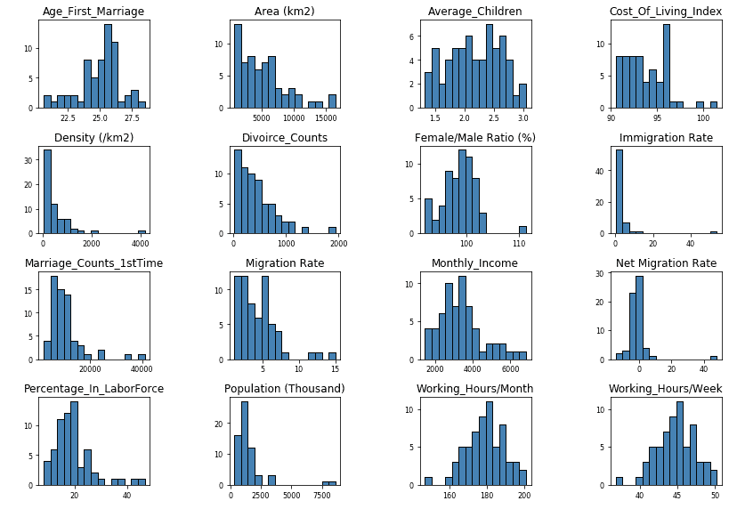

作者图片

接下来，进行散点图可视化以了解更多关于数据集之间的相关性，并为聚类模型选择数据特征。

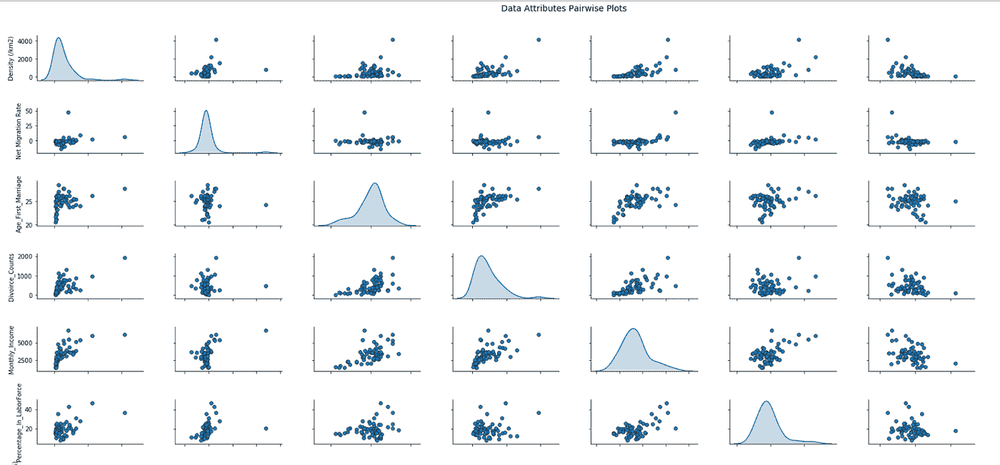

作者图片

这两个步骤导致选择了与聚类建模最相关的八个数据变量，该模型用于进一步的分析。

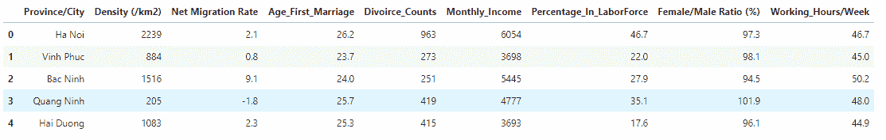

作者图片

散点图验证:在下面的例子中，月收入和初婚年龄之间存在正线性关系。这表明不同地区不同年龄组的月收入存在差异。同时，在分析之前已经考虑到的生活费用指数已经从模型中删除。

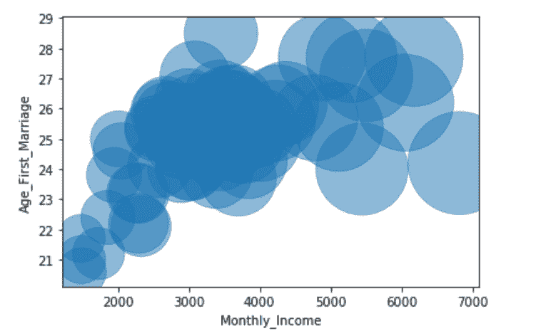

作者图片

# 3.聚类分析

# 3.1.方法学

由于该项目涵盖了无监督的机器学习问题，K-Means 聚类方法被应用于基于经济、社会和统计普查的越南行政省/市概况。K-means 的目标很简单:将相似的数据点组合在一起，发现潜在的模式。为了实现这个目标，K-means 在数据集中寻找固定数量(K)的聚类。聚类是指由于某些相似性而聚集在一起的数据点的集合。

K-means 分析的第一步是通过将数据集中的数值列的值更改为一个通用范围来规范化数据要素，而不会扭曲值范围的差异。这是必需的，因为我们的功能有不同的范围。

接下来，我们通过评估聚类数之间的关系和聚类平方和(WCSS)来确定最佳聚类数。理想的集群数量是 WCSS 的变化开始趋于平稳的地方([肘法](https://bl.ocks.org/rpgove/0060ff3b656618e9136b))。

# 3.2.使聚集

下面是聚类分析中使用的数据变量的结果选择:

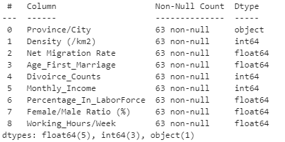

作者图片

使用上面提到的数据探索技术和 Elbow 方法，我们得出了数字 3，这是最佳的集群数量。

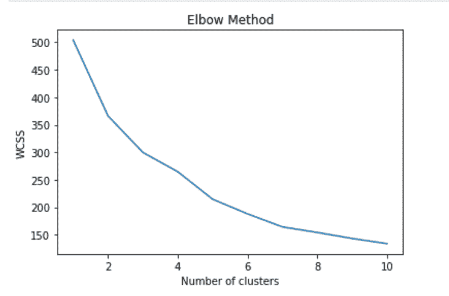

作者图片

使用三个期望的聚类进行聚类分析，我们在越南有三组省/市，它们的位置反映了聚类本身。

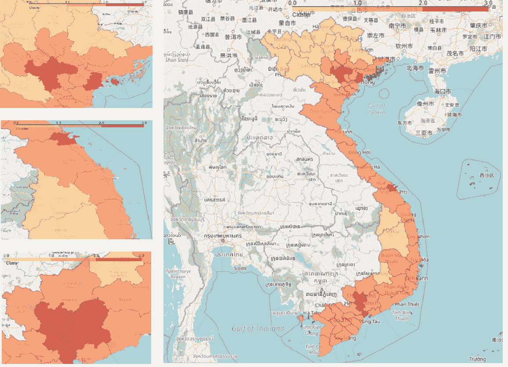

作者图片

从统计角度来看，我们总结了三个集群:

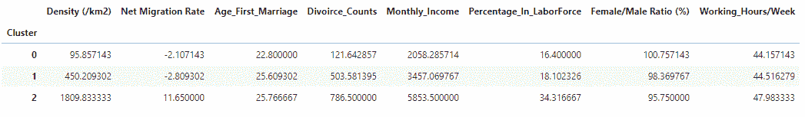

作者图片

为了验证该分析，使用了两个用三种颜色表示的聚类图。第一个反映了三个集群在月收入和结婚年龄方面的区别。第二张图显示了密度上的簇之间的分离。人们倾向于在低密度的省/市早早结婚。

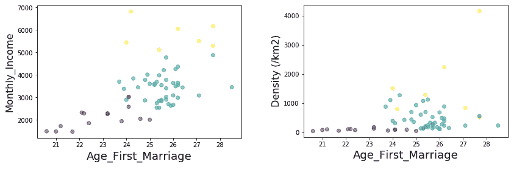

作者图片

# 3.3.洞察力

基于上述聚类分析，我们将三个聚类划分为三组省/市，其相关特征如下:

*   第 1 组(第 0 类):偏远和欠发达地区(平均结婚年龄-22.8 岁)

这组记录了越南最早的婚姻。这些省份位于偏远和人口密度较低的地区，在经济和社会方面都欠发达。与其他地区相比，教育和培训方面的低投资可能会导致劳动力中的人口比例最低。

*   第 2 组(第 1 组):人口适中的发展中地区(平均结婚年龄为 25.6 岁)

这一最大的群体包括 42 个城市/省份，其中许多是区域连接枢纽。这些地区被视为第 3 组(第 2 组)的下一级城市/省份，地理位置优越(湄公河三角洲、红河三角洲、沿海地区)。更多的人有机会接受高等教育，这是进入劳动力市场的关键。

*   第三组(第二组):城市、中心和发展最快的地区(平均结婚年龄为 25.8 岁)

这个群体的平均结婚年龄最高。它包括河内、岘港和胡志明市——越南最大的三个城市。其他城市:海防、北宁、平阳和同奈也是最大的经济和工业中心。这个群体的人月收入最高，而且大部分都在职场。这些城市的移民数量逐年增加。

除此之外，上表总结的聚类分析还有其他一些发现:(1)第 1 组女性/男性比例为 100.8，其中人们结婚早，而第 3 组则下降到 95.8，其中晚婚更受欢迎。(2)就每周工作时间而言，第 3 组比第 1 组高 10%。这个群体的人倾向于优先考虑职业发展，而不是成家立业。(3)月收入与生活成本之间的相关性非常弱。(4)平阳的净迁移率最高，为 47.9，其他地区的平均迁移率为-2.1。

# 4.含义、结论和局限性

基于分析，以下是我的发现的总结，它解决了两个研究问题:(1)哪些因素可能导致了越南的晚婚？(2)不同地理区域之间的结婚年龄有统计学差异吗？

*   收入和婚姻之间存在正相关关系:许多城市居民等待更长时间才能进入婚姻市场，而更多的职业机会来自家庭以外的教育和经济转型。
*   农村和小城镇的早婚比城市多。随着蓬勃发展的经济将更偏远的贫困地区转变为城市地区，社会环境和生活水平发生了变化，人们不太可能结婚。
*   流动性与结婚年龄相关。在流动性和迁移率高的发达地区，人们倾向于晚婚。

总之，鼓励年轻人在 30 岁前结婚对越南官员来说是一个挑战。由于推迟结婚被广泛认为是现代发展中社会的一个不可避免的趋势，解决人口老龄化问题可能需要在国家和省市层面采取长期措施，例如:在贫困地区投资教育和培训，以吸引更多的人加入劳动力队伍，扩大经济中心和网络以减少不必要的移民，或者平衡不同地理区域之间的生活条件。

毕竟，我愿意在未来花更多的时间来发展这种分析，目前这种分析非常简单和幼稚。存在以下一些限制:

获得的数据都来自 2018 年，忽略了不同时期的趋势

社会和经济数据没有考虑性别层面。女性就业人数的增加和女性受教育程度的迅速提高等数字可以解释女性的变化与婚姻减少之间更强的相关性。

一些省/市使用不同的特征来评估其教育、社会和经济发展。这些缺失的数据影响了 Elbow 方法寻找最佳聚类数的有效性。

你可以通过我的 [Github](https://github.com/DexterNgn/Coursera_Capstone/blob/master/Early_Marriage_in_Vietnam.ipynb) 获得我的分析的更多细节。