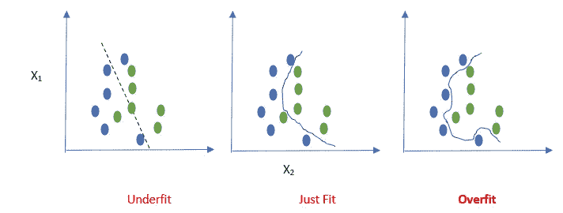
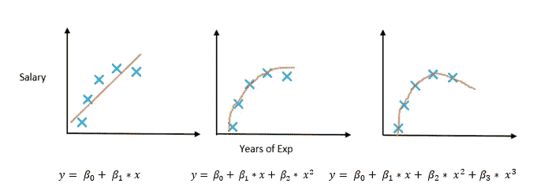
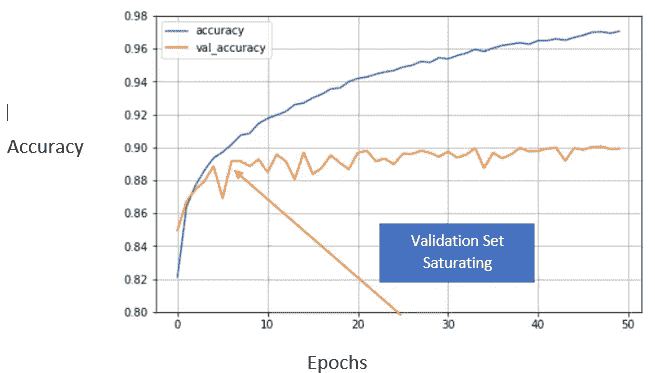
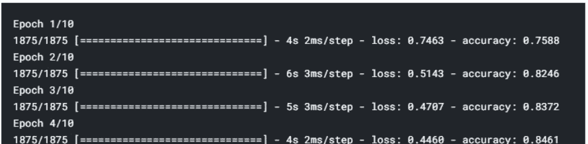

# 早期停止介绍:一种有效的神经网络正则化工具

> 原文：<https://towardsdatascience.com/early-stopping-a-cool-strategy-to-regularize-neural-networks-bfdeca6d722e?source=collection_archive---------13----------------------->

## 为什么以及如何使用提前停车


图片来源:Unsplash

# 过度拟合:

> 对于所有的机器学习和深度学习问题来说，过拟合是一个非常严重的问题。当您的模型在训练数据上表现良好，但无法在测试数据上复制这种表现时，您可以理解这种情况的发生。

如果你不太喜欢阅读博客，并且想开始写代码，请看看 [Kaggle 笔记本](https://www.kaggle.com/saptarsi/regularizing-with-early-stopping)，或者，你也可以看看我们的[视频教程](https://youtu.be/cKVgmpYOdzg)。



图 1:三个模型的决策边界(图片来源:作者)

在上图中，我们看到一个二元分类问题(蓝色类和绿色类)。这三个图表示由三个模型获得的决策边界。第一个模型是做出更简单的假设，第二个模型是做一份体面的工作。

> 然而，真正的罪魁祸首是第三个模型，它试图记住训练数据，拾取训练数据中的微小波动，实际上对于完美的训练集精度来说走得太远了。**模型的这种倾向被称为过拟合**，这些模型没有学到很多东西，因此不能进一步应用它们的知识。(**不能一概而论)**

# 过拟合与模型参数的关系；

这些似乎是模型参数和过拟合之间的关系。让我们再来看看三个可供选择的模型，我们试图根据一个人多年的经验来预测他的工资



图 2:替代回归模型(图片来源:作者)

可以观察到-

*   第一个模型有两个参数，解释了不同年份之间的联系。工资一般。只考虑 x 的线性项
*   第二个模型有三个参数，它很好地解释了数据，并考虑了二次项
*   第三个模型有四个参数，被诊断为过度拟合，它只是跟踪所有的工资。

> 最重要的部分来了，参数数量越多的模型越容易过度拟合，并且**随着神经网络的参数数量越多，它越容易过度拟合。**

# 正规化和提前停止:

对抗**过度拟合**这一诅咒的一般策略集被称为**规则化**，早期停止就是这样一种技术。

想法很简单。该模型试图通过调整参数来疯狂地追逐训练数据上的损失函数。现在，我们保留另一组数据作为验证集，当我们继续训练时，我们保留验证数据的损失函数记录，当我们看到验证集没有改进时，我们停止，而不是遍历所有时期。这种基于验证集性能的提前停止策略称为**提前停止。**下图对此进行了解释。



图 3:提前停止演示(图片来源:作者)

从图 3 中可以观察到

*   在所有的时期，训练集的精确度持续增加
*   然而，验证集精度在 8 到 10 个时期之间饱和。这里是模型可以**停止**训练的地方。

> 因此，早期停止不仅可以防止过度拟合，而且需要相当少的历元数来训练。

代码摘录:下面的代码演示了我们将 20%的训练数据作为验证集。

```
fashion_mnist = keras.datasets.fashion_mnist
(train_images, train_labels), (test_images, test_labels) = fashion_mnist.load_data()trn_images, valid_images, trn_labels, valid_labels = train_test_split(train_images, train_labels,test_size=0.2)
```

一些其他的正则化技术是损失函数正则化、丢失、数据扩充等。如果有兴趣，你可以自担风险，在这个[视频教程中浪费一些时间。](https://youtu.be/Pk1ua4Opcfs)

# 回调 API:

我们现在想到的一个问题是，当模型被训练时，我们如何监控发生了什么，以及如何保持跟踪？这就是我们从 Keras 回调 API 获得帮助的地方。


图 4:回调 API 的窗口模拟(来源:Unsplash)

> 回调 API 就像窗口，在黑盒模型训练过程中，允许我们监控，我们感兴趣的对象。

*   一个**回调**是一个强大的工具，用于定制 Keras 模型在训练、评估或推断过程中的行为
*   它可以让你定期保存你的模型到磁盘
*   您可以在训练期间查看模型的内部状态和统计数据
*   可以有多个回调一个用于保存，一个用于监控
*   回调可以附加**拟合**，**评估**，**预测 Keras 模型**

当然，我们不能在任何时候看到中间值，它可以在训练开始时、训练停止时、时期结束时或一批训练结束时。

我们确实默认使用了一些回调函数，比如我们在模型编译中提到的度量和损失函数。在这种情况下，我们不需要附加任何回调 API 或窗口。这被称为**基础回调 API** 。下图显示了这一点。



图 5:基础回调 API(图片来源:作者)

# 提前停止回调的一些重要参数:

*   **监控**:被监控的数量。默认情况下，它是验证丢失
*   **min_delta:** 符合改善条件的监控量的最小变化
*   **耐心**:没有改善的周期数，在此之后训练将停止。
*   **模式**:为{“自动”、“最小”、“最大”}之一。是最大化问题还是最小化问题，我们最大化精度，最小化损失。
*   **restore_best_weights:** 是使用最佳模型权重还是上一个时期权重

**代码示例:**

突出显示的部分是我们在模型拟合过程中需要做的唯一更改。

```
**callback = tf.keras.callbacks.EarlyStopping(patience=4, restore_best_weights=True)**
history1 = model2.fit(trn_images, trn_labels, epochs=50,validation_data=(valid_images, valid_labels),**callbacks=[callback]**)
```

# 结果:

这是在 Fashion MNSIT 上执行的，这是运行您的实验的一个很好的测试平台。

> 在没有提前停止的情况下，模型运行所有 50 个时期，我们得到 88.8%的验证准确度，而提前停止运行 15 个时期，测试集准确度是 88.1%。
> 
> 这是其中一个种子值，总体而言，它清楚地表明我们实现了相当的结果，减少了 70%的时期。

========================================

谢谢你读到这里。这些是我们在加尔各答大学数据科学实验室创建的一些附加资源

a)用 Python 分类([https://www.youtube.com/playlist?list = plts 7 rwcd 0 do 2 zoo 4 sad 3 jrxnvfyxhd 6 _ S](https://www.youtube.com/playlist?list=PLTS7rWcD0Do2ZoO4Sad3jRxnVFyxHd6_S)

b)用 Python([https://www.youtube.com/playlist?)进行聚类 list = plts 7 rwcd 0 do 3ts 44 xgwgvgxmeohyfi 3pm](https://www.youtube.com/playlist?list=PLTS7rWcD0Do3ts44xgWGVgxMeoHYFi3pM)

参考资料:

[1][https://medium . com/@ upendravijay 2/early-stopping-to-avoid-over-fitting-in-neural-network-keras-b 68 c 96 ed 05d 9](https://medium.com/@upendravijay2/early-stopping-to-avoid-overfitting-in-neural-network-keras-b68c96ed05d9)

[2][https://towards data science . com/a-practical-introduction-to-early-stopping-in-machine-learning-550 AC 88 BC 8 FD](/a-practical-introduction-to-early-stopping-in-machine-learning-550ac88bc8fd)

[https://sebastianraschka.com/books.html](https://sebastianraschka.com/books.html)