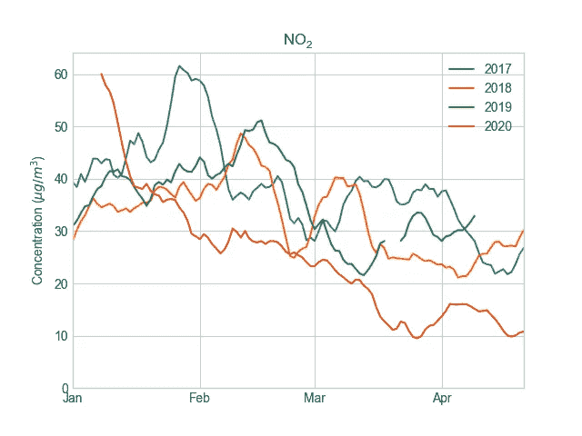

# 地球:“感谢新冠肺炎，我可以更轻松地呼吸了”

> 原文：<https://towardsdatascience.com/earth-thanks-to-covid-19-i-can-breathe-easier-ebc2c11337c5?source=collection_archive---------48----------------------->

## 新冠肺炎封锁期间，我所在城市的空气质量发生了怎样的变化

来源:Pixabay —标清图片

在冠状病毒疫情期间，许多人呆在家里，一些行业已经暂停生产，因为政府已经制定了防止疾病传播的法规。这导致城市交通减少，一些工业暂时没有污染空气。由此可以推测，城市的空气污染有所减少。

为了验证这个假设，我分析了我的家乡斯洛文尼亚卢布尔雅那的污染数据。为了进一步支持这些假设，我采用了意大利贝加莫的污染数据，这是受冠状病毒影响最严重的欧洲城市之一。

在这篇文章中，我比较了世界卫生组织的两种对健康有重大影响的污染物的测量值。[(no₂)](https://en.wikipedia.org/wiki/Nitrogen_dioxide)城市中的二氧化氮主要是由交通产生的。 [PM10](https://en.wikipedia.org/wiki/Particulates) 是直径在 2.5 到 10 微米之间的细小颗粒。世卫组织也提到了 PM2.5(直径小于 2.5 微米的颗粒)，但我无法获得卢布尔雅那 PM2.5 的数据。我从欧洲环境署的数据库中检索了所有数据。

## 卢布尔雅那的空气污染

在下图中，我绘制了卢布尔雅那过去四年 NO₂和 PM10 的日平均浓度。每一年都有不同的颜色。

图表显示了斯洛文尼亚卢布尔雅那过去四年中 NO₂和 PM10 的日平均浓度。

对于 NO₂，我们可以看到上个月(2020 年)的数值低于前几年，但这些图表很难读懂，因为浓度每天都在变化。我使用了移动平均线来得到一个更平滑的图形。

图表显示了斯洛文尼亚卢布尔雅那过去四年的平滑平均日 NO2 和 PM10 浓度。当浓度未被报告或无效时，线路中断。

我们可以看到，在三月中旬之后——我国政府实施了限制——no₂的浓度低于前几年。PM10 的浓度与前一年相似——在三月底的一段时间里，由于风把撒哈拉沙漠带到欧洲，浓度甚至更高。

为什么 NO₂的浓度低于前几年的解释可能是 NO₂的主要来源[是燃烧化石燃料的内燃机——交通](https://en.wikipedia.org/wiki/Nitrogen_dioxide)。另一方面，PM10 来自更多[不同的来源，包括发电厂、工业，还有交通](https://en.wikipedia.org/wiki/Particulates#Sources_of_atmospheric_particulate_matter)，这可能是 PM10 没有改变的原因——燃烧季节仍在继续，许多工业没有停止生产。

## 贝加莫的空气污染

为了确保我们的结果与新冠肺炎封锁相关，我们检查了另一个城市的数据，该城市受到了意大利北部疫情-贝加莫的影响。这是受新冠肺炎影响最严重的城市之一。

图表显示了意大利贝加莫过去四年的日均 NO₂和 PM10 浓度。当浓度未被报告或无效时，线路中断。

对于 Bergamo，我再次在图表上绘制了过去四年的日平均值，因为它们并不完全清楚，我对卢布尔雅那的数据进行了平滑处理。

图表显示了意大利贝加莫市过去四年的平滑日均 NO₂和 PM10 浓度。当浓度未被报告或无效时，线路中断。

我们可以在意大利的 NO₂图表中观察到与卢布尔雅那之前相似的趋势。二月底，意大利在该国北部实施了限制。与此同时，与其他年份相比， [NO₂](https://en.wikipedia.org/wiki/Nitrogen_dioxide) 的浓度开始下降。与其他年份相比，这一差异甚至比卢布尔雅那更为显著——与其他年份相比，浓度减半。
PM10 浓度没有差异。我还分析了佛手柑的 PM2.5 浓度，它们与 PM10 相似，与其他年份相比没有差异。

## 结论

从这个故事中呈现的数据，我们可以得出结论，被观察城市的空气质量有所改善。 [NO₂](https://en.wikipedia.org/wiki/Nitrogen_dioxide) 浓度有巨大变化，这表明交通产生的污染明显减少，而颗粒物(测量为 PM10 和 PM2.5)仍停留在同一水平。根据参考资料，我可以得出结论，这是因为许多颗粒来源持续存在——包括燃烧化石燃料来加热。

新冠肺炎的后果是毁灭性的，将给我们未来的生活带来巨大的变化。然而，我们必须承认也有一些积极的方面。他们中的一个也看到了地球是如何被治愈的。过去几周我们呼吸的更清洁的空气是积极的事情之一，如果我们回到以前的轨道上，这种情况会很快改变。