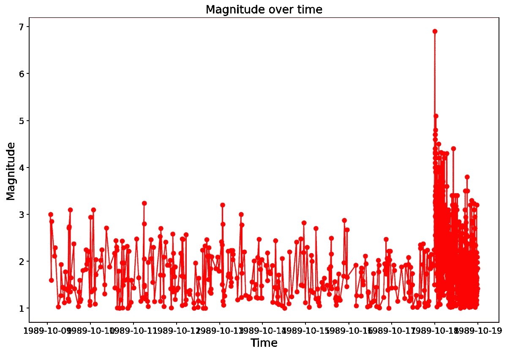
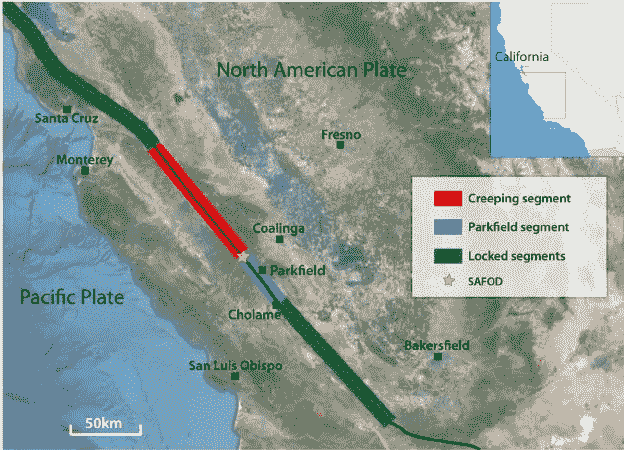
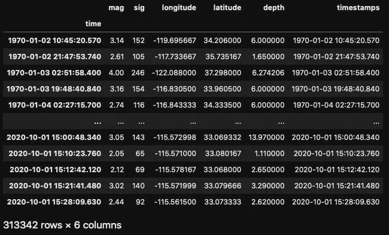
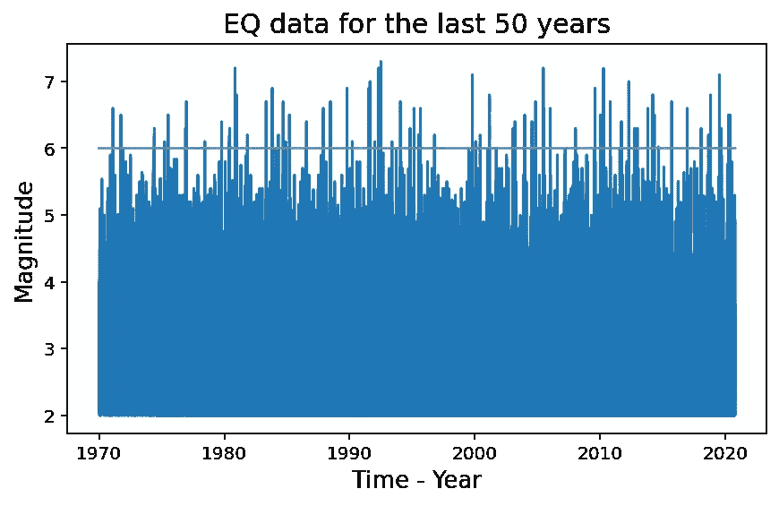
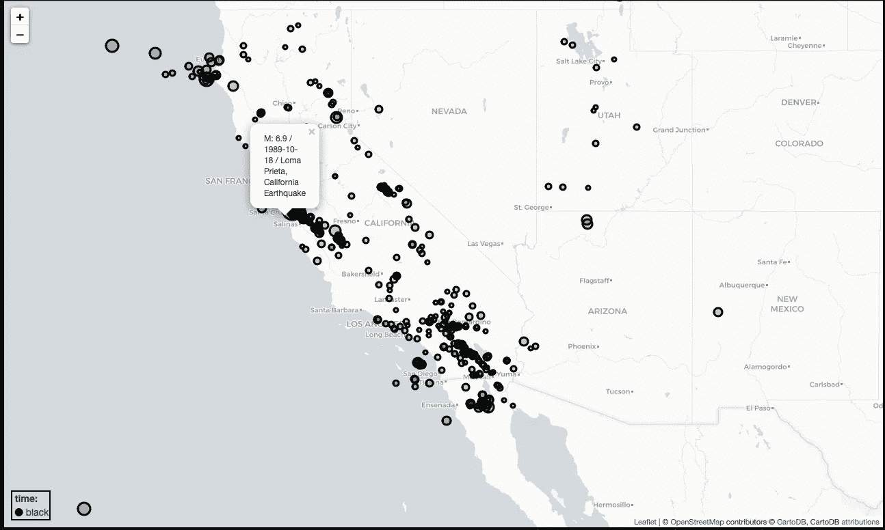
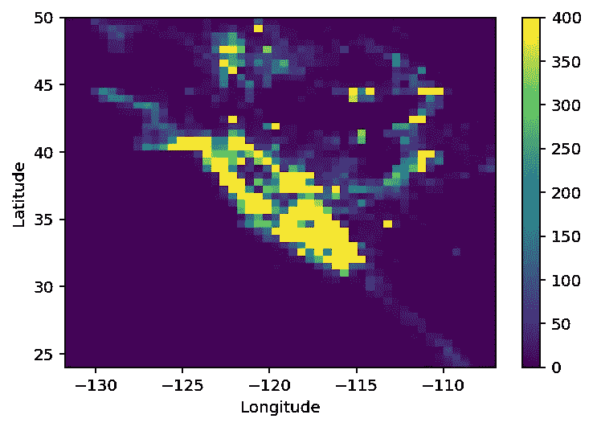
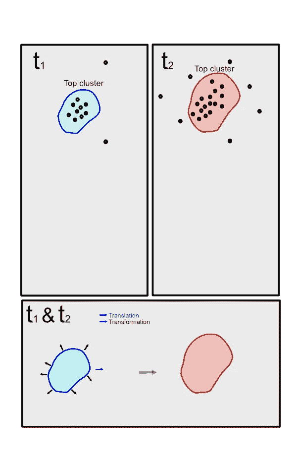
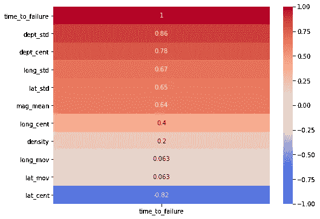

# 使用混合聚类-LSTM 方法的地震时间序列预报——第一部分:EDA

> 原文：<https://towardsdatascience.com/earthquake-time-series-forecasts-using-a-hybrid-clustering-lstm-approach-part-i-eda-6797b22aed8c?source=collection_archive---------35----------------------->

## 在加州过去 50 年的历史地震中测试该方法

`The notorious 1906 San Francisco earthquake hit the bay area on the April 18th 1906, leaving more than 3,000 deaths. Earthquake had a moment magnitude of 7.9 [[Image source](https://en.wikipedia.org/wiki/1906_San_Francisco_earthquake), [license](https://catalog.archives.gov/id/524396)].`

> 这篇博客是描述这一时间序列分析细节的一系列博客中的第一篇

# 0.序

以我们目前有限的技术进步，地震的确定性预测只是一个无法实现的要求。这种限制可能有两个原因:1 —我们对地下断层结构的了解极其有限；2 —记录地震数据的地震仪具有固有的灵敏度限制。由于地震学研究的进步，随着我们对地震的物理理解的胜利，未来看起来是光明的。然而，仍然有一些地震的发生没有被注意到，例如帕克菲尔德(2004 年)地震，该地震预计发生在 1988 年的早些时候。另一种研究地震预报问题的方法是通过使用更先进的统计学和人工智能工具。作为一名数据科学家，我采取了一种不同的方法来对地震现象有更好的统计理解；因此，这里的“预测”一词只是指统计理解，而绝不是指确定性的地震预测。了解了这一点，现在让我们开始分析。

# 1.介绍

仅自上个世纪以来，地震就造成了数百万人死亡(T4)。除了生命威胁之外，随之而来的巨大经济和基础设施破坏可能给文明留下长久的创伤。例如，位于太平洋-北美板块边界附近的加利福尼亚州已经经历了许多毁灭性的地震，其中一些造成了大量的人员伤亡和经济损失(参见我的 GitHub 库文档中的简要列表[。](https://github.com/saiedmighani/SES_project)

这些地震时有发生，但我们有时会忽略全球地震网络( [GSN](https://www.usgs.gov/natural-hazards/earthquake-hazards/gsn-global-seismographic-network?qt-science_support_page_related_con=4#qt-science_support_page_related_con) )持续记录的大量地震数据。地震数据记录了各种各样的地震、断层系统、地理位置和几个传感器，提供了足够多样的数据集来从数据科学的角度研究地震分析*。此外，数据科学中的工具可以在评估如此重要的社会危害问题时投入真正的试验。目前的物理地震模型无法预测一些地震事件。希望数据驱动的地震分析将为地震发生的系统学提供额外的见解。人口密集的住宅区可以真正受益于早期地震预警系统(例如，*检查* [*震动警报*](https://www.shakealert.org) )。尤其是基于强大的人工智能工具的。*

# *2.预测地震时间序列的困难*

**

*图一。1989 年洛马普列塔 6.9 级地震序列。注意没有前兆大事件的主震的发生。*

*图 1 显示了 1989 年洛马普列塔地震( [63 人伤亡，100 亿美元损失](https://sf.curbed.com/2019/10/17/20898956/loma-prieta-earthquake-photos-images-sf-anniversary-quake))期间前震(主震前)、6.9 级主震和余震(主震后)的序列。主震发生时几乎没有任何大的前兆信号。对于更传统的时间序列模型，如自回归模型，这使得地震预测的任务变得复杂。*

# *2.问题陈述:*

*圣安地列斯断层从西北-东南加利福尼亚沿海岸延伸近 700 英里。这个断层导致了臭名昭著的 1906 年旧金山地震，以及后来的洛马普列塔和帕克菲尔德地震。但是，这不是唯一的断层系统，地震发生在许多附近的断层上，这些断层甚至可能以复杂的方式相互作用。这些地震的发生有什么系统性吗？如果有的话，它们能帮助我们辨别小地震是如何发展，导致大地震的吗？这里的分析更多的是基于数据，而不是基于物理。这意味着，任何震级和任何距离的地震对预测大地震都有同样的重要性；而且，没有事先的假设。只是，统计分析决定了地震重要性的权重。*

# *4.模型工作流*

*模型工作流程由以下连续步骤组成: **1 —** 数据收集。 **2 —** 数据清洗。 **3 —** 探索性数据分析(EDA)。 **4 —** 时间序列建模。 **5 —** 建议。对于这个项目的代码的完整访问，我邀请你在我的 [GitHub](https://github.com/saiedmighani/SES_project.git) 个人资料上看到这个库。大部分代码都是在 python 环境中编写的，在这里我使用了 Python 中的 *Pandas、* *scikit-learn 和 TensorFlow* 库。*

# *5.数据收集和清理*

**

*图 2:圣安地列斯断层几何学，臭名昭著的 1906 年旧金山、1989 年洛马普列塔和 2004 年帕克菲尔德地震就发生在这里【图片来自 Richard 等人，2014，[来源](https://agupubs.onlinelibrary.wiley.com/doi/full/10.1002/2014JB011489)，[许可](https://www.agu.org/Publish-with-AGU/Publish/Author-Resources/Policies/Permission-policy)】。*

*我用美国地质调查局的 API 提取了加利福尼亚州附近过去 50 年的地震数据。多亏了美国地质勘探局，这个 API 是公开可用的。为了下载一个足够全面的地震目录，我下载了加利福尼亚州以外的地震，经度和纬度范围分别为(-133，-107)和(24，50)度(远超过加利福尼亚州)。对于这篇博客文章，我主要探索了 6.9 级洛马普列塔(1989 年)地震数据的 EDA 分析。这次地震发生在圣安地列斯断层的锁定段(见图 2)。以下函数用于读取 USGS 地震 API:*

*函数来提取 USGS API 地震数据。查看我的 GitHub 库了解完整的功能。*

*导入的 json 文件嵌套过多；因此，在数据清理期间，我对 json 文件进行了“去嵌套”,将它们转换成数据帧，修复列数据类型，估算 NaN 值，最后将它们连接成一个全局数据帧，这是可行的。关于数据清理的完整描述，请访问我的 [GitHub](https://github.com/saiedmighani/SES_project) 档案。最后，我通过时间戳将数据帧索引为时间序列数据帧:*

**

*这个时间序列是 ***不规则的*** ，意味着时间间隔是不均匀的，正如许多对事件敏感性有限的传感器数据所预期的那样；有些地震数据有 8 毫秒的间隔，有些接近 1 天。这使得时间序列建模变得复杂，我将在以后的博客文章中讨论这个问题。*

# *5.EDA — 50 年的地震数据*

*下载的数据包含丰富的信息，包括事件发生的时间、力矩大小、强度(由人类评估)以及地震的三维位置。出于数据大小的考虑，我们只将矩震级大于 2 的地震视为更重要的地震。*

> *请注意，矩震级是对数标度单位，这意味着一般来说，6 级地震比 5 级地震大 10 倍。*

*对震级的时间演变的初步观察表明，时间序列中有一个突然的峰值，没有太多早期的注意，如图 1 所示。*

****

*图 3:过去 50 年的全部地震数据。总共有 85 次大于 6 级的地震(上图中的灰色线)。力矩大小分布也用直方图表示。震级分布紧密遵循泊松分布(图片由作者提供)。*

*图 3 显示了全部数据(近 313k 下载的地震数据)。震级大于 6 级的地震有 85 次，我认为这是破坏性地震的阈值([大英百科全书](https://www.britannica.com/science/earthquake-geology/Intensity-and-magnitude-of-earthquakes))。地震的破坏性是一个远超过矩量级的更复杂的函数，如震源深度、持续时间和震源机制；然而，在这里，我只是把一个相当简单的 6 级矩作为破坏性的阈值。地震的分布严格遵循著名的古腾堡-里克特幂律分布(log(N) = a-bM，其中 N 和 M 分别是频率和震级。a 和 b 是常数。).由于力矩大小以对数单位表示，图 2 直方图的线性下降表明了这种分布。我不会详细描述这个发行版，因为这超出了这篇博文的范围。重要的一点是，尽管这种分布描述了地震发生的全球分布，但仅依靠这种统计分布进行危险分析是非常不安全的，原因如下:*

> *“假设我们有一个大地震，比如 7 级地震，它不遵循这种分布(如 2004 年帕克菲尔德地震)。它只是一个数据点，不会扰乱幂律分布，因为它只是数千个数据点中的一个！但是，这是一个不容错过的致命数据点！*

*因此，更详细的统计分析将极大地有助于更好地理解地震现象。*

# *洛马普列塔地震前 30 天发生了什么？*

**

*图 4:洛马普列塔主震前 30 天事件的地震图(图由叶图书馆创建)(图片由作者提供)。*

*为了理解是什么导致了主震，我们需要追溯导致主震的事件。如图 4 所示，在主要事件前 30 天有一个大规模的活动。事件倾向于沿西北-东南方向聚集，主要集中在圣安地列斯断层的上部和下部锁定区域(参见图 2)。最后，上部锁定区域导致了 6.9 级地震。有了初步的评估，我们现在可以尝试看看是否有任何位置系统。*

# *位置和震级之间的相关性*

****

*图 5:整个数据集的 2D 直方图。上图:经纬度之间有明显的 NW-SE 向分带。下图:在深度约 10 公里处，似乎有大地震的聚集现象(图片由作者提供)。*

*为了更好地理解数据集，我评估了数据框架中变量之间的相关性。2D 直方图(图 5)显示，大部分地震发生在西北-东南方向，与某种线理大致对齐。此外，震级-深度分布表明，大地震发生在近 10 公里的深度。这表明，我们可以使用聚类技术来提出一些工程特征，并尝试看看它们是否有助于我们解决预测问题。*

# *特征工程:空间聚类*

**

*图 6:随着地震群的发展，随时间的平移和转换。我们可以将这些变化作为地震预报的特征。*

*图 6 显示了开发这些特性的示意性概念。由于该图是自我描述的，所以我将不进行解释。我使用 DBSCAN 算法对从第一个数据点开始的每 20 次连续地震的事件进行聚类。我使用经度、纬度和深度进行三维聚类。作为聚类的结果，我们可以定义三个特征:*

*1-事件密度(或聚类的空间大小)。*

*2-纵横比(簇的 3D 形状)。*

*3 簇质心平移。*

*DBSCAN 的超参数为 eps = 0.2 和 min_samples=5]。*

# *特征重要性*

*为了对已开发的特征进行初步评估，我只过滤了洛马普列塔大地震前的时序数据部分。我对每 20 行的数据进行平均，并将从空间聚类中获得的特征添加到原始 dataframe 列中。*

> *最后，我添加了一个目标标签，作为洛马普列塔主震的时间(time_to_failure)。*

*下面是数据帧结构:*

**

*洛马普列塔地震的数据图表。目标标签是 time_to_failure 列。有关列的完整描述，请参见 GitHub repository。*

*运行单一回归分析以初步评估特征。请注意，这种回归只是为了探索的目的，作为未来的努力，结果需要在其他不同的测试地震数据集上进行交叉验证。下面的相关图(图 7)显示，这些特征实际上是主震时间的强有力指标。*

**

*图 7:特征和目标标签之间的关联(失效时间)。可以看出，这些是故障时间的强有力指标。请参见 GitHub repository 以获得对专栏的完整描述(图片由作者提供)。*

*图 8 中的特性重要性图显示了有趣的含义。dept_std、long_std 和 lat_std 表示群集的纵横比。这意味着离故障越近，集群越倾向于在垂直和纵向上拉长，而在纬度上拉长得越少。这些是最强的特征。此外，密度是负相关的，这意味着集群的大小在故障之前会扩大。另一个有趣的方面是地震的平均震级，这是一个奇怪的例子。对其他几次地震数据集的检查也显示了这一趋势。这意味着在大地震发生之前，地震的平均震级实际上是下降的。换句话说，断层变得更加平静。这是一个奇怪的案例，需要进一步研究。*

**

*图 8:基于洛马普列塔地震线性回归的特征重要性。特征在正文中被讨论。请参阅 GitHub repositopry 以获取列的完整描述(图片由作者提供)。*

# *未来的工作*

*这是我对这个数据集进行时间序列分析之旅的开始。至此，我想用几句话来结束这篇博文，并为以后的帖子留下更详细的描述。在这里，我进行了初步的 EDA 分析，并建议了一些基于空间聚类的工程特性。这些特征似乎描述了主震发生的时间。*

*在以后的文章中，我将使用开发的特性，特别是聚类特性来执行更高级的时间序列分析。基于早期的评估，我发现 LSTM 是适合我的目的的方法。两个方面引起了我对 LSTM 序列分析的兴趣:1——我的时间序列的不规则性。2 —没有明显前兆的地震的类似休克的性质。*

*敬请关注…*

*感谢你阅读我的博文。对更多阅读感兴趣？请查看我的 [LinkedIn](https://www.linkedin.com/in/saiedmighani/) 和 [GitHub](https://github.com/saiedmighani) 简介。*