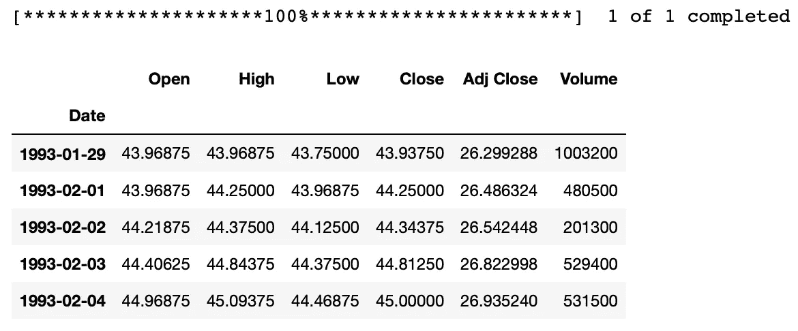
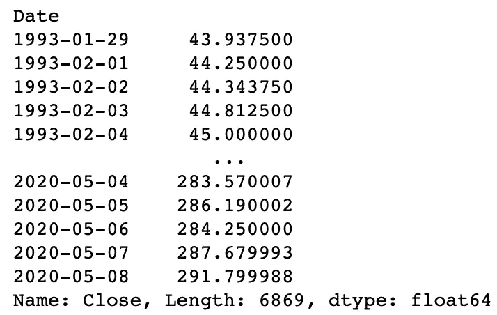
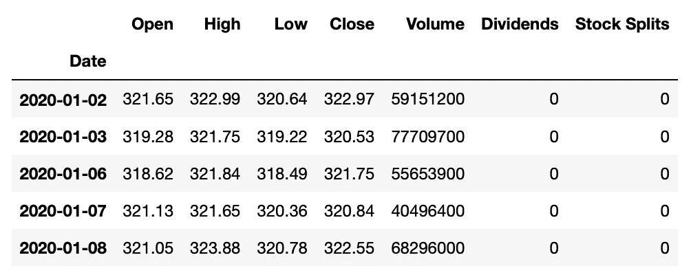
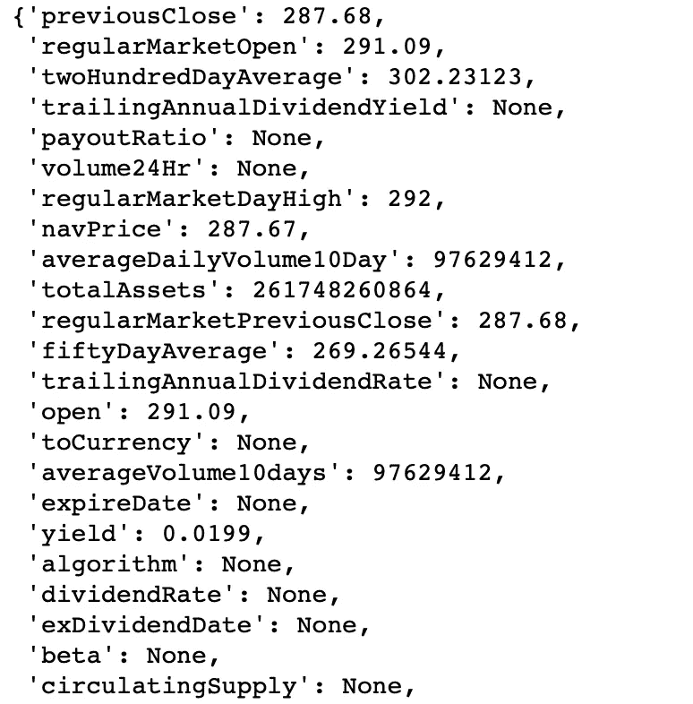
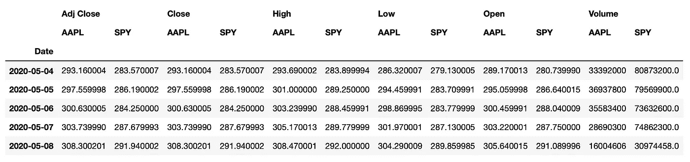
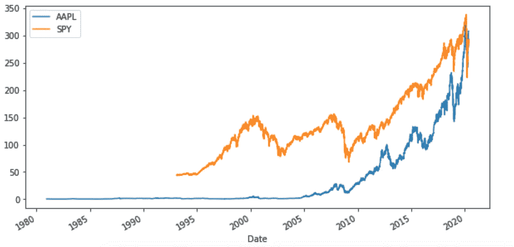

# 使用 Python 获取股票数据的最简单指南

> 原文：<https://towardsdatascience.com/easiest-guide-to-getting-stock-data-with-python-f74b5f75d179?source=collection_archive---------19----------------------->


我最近在大学里完成了一门数据科学的入门课程，对于我的期末项目，我决定我要研究股票市场数据。我想把我的重点放在算法交易上，需要一种快速简单的方法来收集股票数据，这种方法很容易使用。

我偶然发现了一个名为 [**yfinance**](https://pypi.org/project/yfinance/) 的库，它让我的项目变得简单多了！

我强烈建议通读文档。这是一个快速阅读，将有助于你任何涉及股票数据的项目。

在我们开始之前，我们需要安装 **yfinance** 库。为此，只需将以下内容复制到您的命令提示符中:

```
$ pip install yfinance
```

现在我们准备开始分析我们的股票市场数据。对于我的项目，我选择了 SPDR 的 P 500 ETF 信托基金，其股票代码为间谍。您可以使用任何您想要的股票代码，但是在本文中我将使用 SPY。

## 入门指南

幸运的是，yfinance 使得提取我们的数据并快速开始分析它变得极其容易。我们可以从导入 yfinance 开始，使用`.download()`函数下载我们选择的任何股票代码的历史数据。然后，我们可以通过调用`.head()`函数返回前 5 行数据来快速查看我们的数据。

```
import yfinance as yfSPY = yf.download('SPY')
SPY.head()
```



我们的股票数据在 Pandas 数据框架中得到了很好的格式化。例如，如果您只想查看数据集中的收盘价，这就很容易了。

```
SPY['Close']
```



也可以只下载特定日期范围内的数据。这将需要我们使用 yfinance 的 Ticker 模块，它允许我们使用 yfinance 做更多的事情。一旦这样做了，我们就可以使用`.history()`功能来处理所有的股票数据，或者某个时间段内的数据。假设我们想要 2020 年 1 月初至 2020 年 2 月初的数据。

```
SPY = yf.Ticker('SPY')SPY_History = SPY.history(start="2020-01-01", end="2020-02-01")
SPY_History.head()
```



现在我们已经使用了 Ticker 模块，我们可以调用`.info`来查看我们的数据的更详细的摘要。这将返回一个包含 100 个键的字典。

```
SPY.info
```



数据真多啊！我们也可以在字典中查看单个键。例如，如果我们想要查看当前 50 天的平均值，我们可以写:

```
SPY.info['fiftyDayAverage']
```

查看多个股票代码也同样简单。我们可以再次使用`.download()`函数，并用空格分隔每个股票代码。然后，我们可以查看数据中的最后 5 行，以检查它是如何格式化的。

```
data = yf.download('SPY AAPL')
data.tail()
```



为了快速可视化我们的数据，我们可以使用 matplotlib 编写一行程序来比较 SPY 和 AAPL。

```
import matplotlib.pyplot as pltdata['Close'].plot(figsize=(10, 5))
```



对于任何需要快速、轻松地收集股票数据的人来说，[***【yfinance】***](https://pypi.org/project/yfinance/)是一个很好的选择，也是迄今为止使用 Python 获取股票市场数据最简单的方法之一！