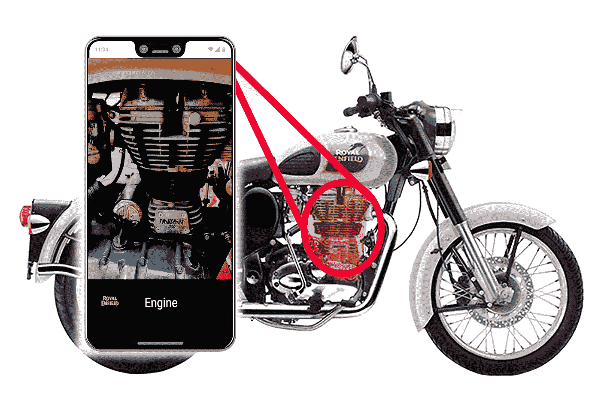
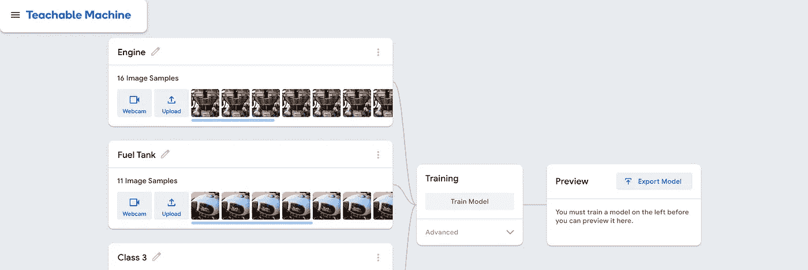
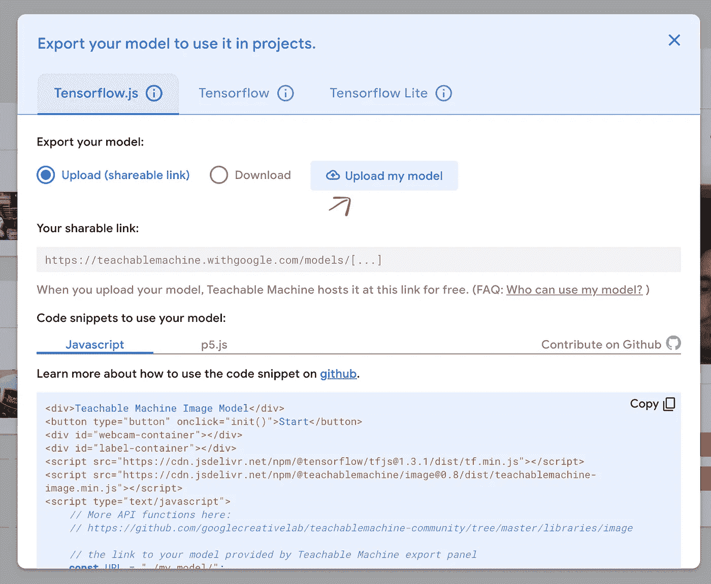
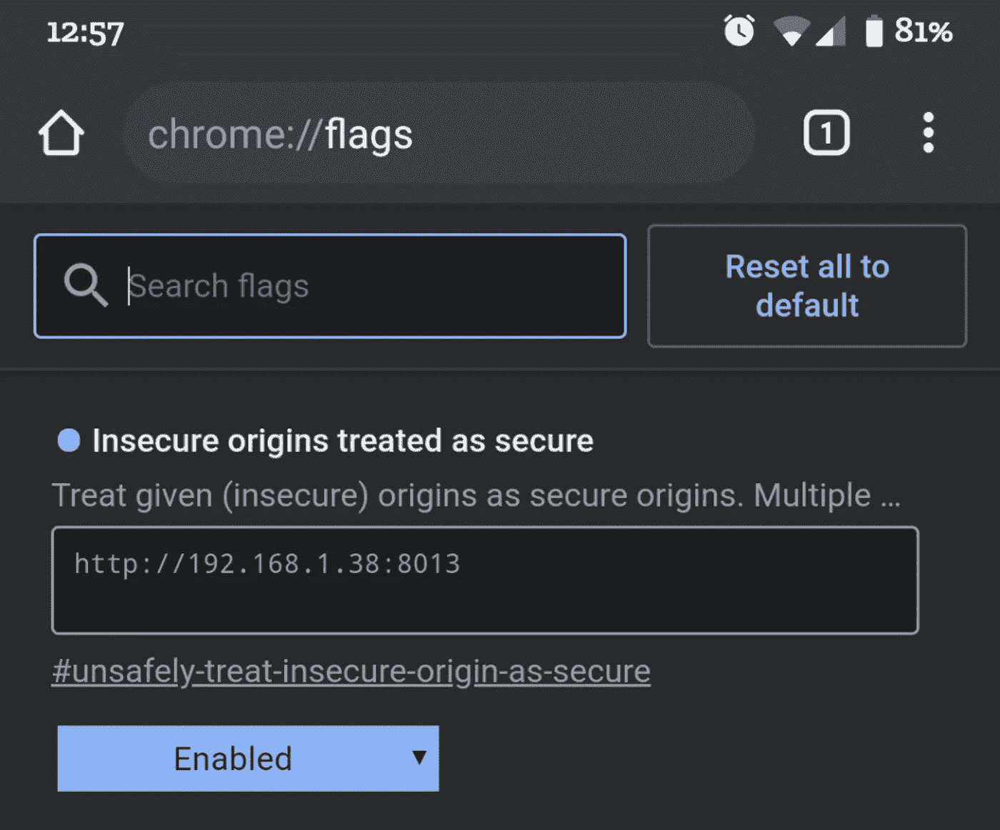

# 轻松为您的手机创建人工智能应用程序—零编码体验

> 原文：<https://towardsdatascience.com/easily-create-an-ai-app-for-your-phone-zero-coding-experience-2d38afd4db14?source=collection_archive---------6----------------------->



图片来自皇家菲尔德网站

我用[可教机器](https://teachablemachine.withgoogle.com/)和 [P5JS](https://p5js.org/) 创建了一个简单的 AI webapp。当我用手机摄像头指向我的摩托车皇家恩菲尔德经典 350 时，这款应用程序显示了它们的每个部件的名称。下面是同样的视频:

Fabin Rasheed 的视频

在网上分享这个视频让许多朋友好奇这是如何工作的，我想我会写一个关于这个的教程。

这可以在 3 个较大的步骤中完成，并且需要非常非常少的编码。事实上，任何人都可以通过笔记本电脑、智能手机和 wifi 连接做到这一点。我将尝试用现有的教程视频解释第一步，并详细解释第二步和最后一步。好的，我们开始吧。

**步骤 1:使用可示教机器(TM)**

[可教机器](https://teachablemachine.withgoogle.com/)是一个漂亮的工具，可以用来进行基于人工智能的实验，如图像分类、声音分类等。你可以用它来分类你的蔬菜，创建一个应用程序来教你的孩子不同的形状等等。

从可教机器开始非常简单直观。不过，以下是可教机器“入门”系列的视频，帮助您入门。(这里就不细说 TM 怎么用了。)

**采集样本:**[**https://youtu.be/DFBbSTvtpy4**](https://youtu.be/DFBbSTvtpy4)

**训练你的模型:**[**https://youtu.be/CO67EQ0ZWgA**](https://youtu.be/CO67EQ0ZWgA)

**出口型号:**[**https://youtu.be/n-zeeRLBgd0**](https://youtu.be/n-zeeRLBgd0)

练习到这里，慢慢适应 TM。然后，我们可以继续创建移动网络应用程序。

**第二步:为应用程序创建数据**

因此，可示教机器目前仅适用于台式机。但是这种实现也将其扩展到了移动电话。第一步是收集图像。

我所做的是:

1.  用我的手机为自行车的每个部分录制了一段视频。
2.  然后使用 Adobe Media Encoder 将视频转换成帧(图像)(你也可以试试[这个](https://www.raymond.cc/blog/extract-video-frames-to-images-using-vlc-media-player/))。每个部分的图像被放在不同的文件夹中。(所以有一个文件夹存放“油箱”图片，另一个文件夹存放“发动机”图片)


每个部分的图片在一个单独的文件夹中(图片由 Fabin Rasheed 提供)

3.这些文件夹随后被用作可示教机器的输入。(点击上传按钮，而不是网络摄像头按钮)



每堂课有将近 700 张图片。例如，此处显示的样本较少。(图片来自可示教机器)

4.然后对模型进行训练。

**第三步:制作 app**

好了，现在开始在智能手机中设置 webapp 的部分:

1.前往 https://github.com/nurecas/visualmanual[点击克隆/下载——下载 Zip。(如果您还没有 Github 帐户，可能需要创建一个)。将其提取到一个文件夹中，最好是在桌面中，将文件夹重命名为 RoyalEnfield。](https://github.com/nurecas/visualmanual)

2.在括号、MS visual studio、记事本等文本编辑器中打开文件夹内的 RoyalEnfield.js。

3.现在打开你的可教机器实验，按“导出模型”。

4.现在在 Tensorflow.js 下，你会发现“上传我的模型”。点击那个。



来自可示教机器的图像

5.上传完成后，复制生成的链接。

6.使用 RoyalEnfield.js 打开文本编辑器。在第 4 行中，替换 URL，即，

变化

```
let imageModelURL = ‘[https://teachablemachine.withgoogle.com/models/s379EsNn/](https://teachablemachine.withgoogle.com/models/s379EsNn/)';
```

随着

```
let imageModelURL = ‘**the URL you just copied**’;
```

7.保存文件。

8.如果您使用的是 Mac，请打开终端(CMD+Space，键入终端)。

如果您在 Windows 中，打开命令提示符(在这种情况下，您可能需要安装 [python](https://www.python.org/downloads/windows/) )

9.使用“cd”命令更改您提取的文件夹的路径。例如，如果您在桌面中，请键入:

```
cd Desktop/RoyalEnfield/
```

10.键入以下命令启动本地服务器(这适用于 MacOS Catalina 或最新的 Windows 版本):

```
python -m http.server 8013
```

如果这不起作用，并且您有较旧的操作系统，请键入以下内容:

```
python -m SimpleHTTPServer 8013
```

如果你能创建一个 HTTPS 服务器而不是 HTTP 服务器，那是强烈推荐的。这里的步骤创建了一个简单的 HTTP 服务器，应该只用于测试/原型/实验>

11.服务器启动后，测试您电脑中的浏览器是否一切正常:

在浏览器的地址栏中输入 **localhost:8013** 并按回车键。如果一切顺利，继续。

12.现在你需要找到你的计算机的本地 IP 地址。这可以通过点击 Mac 顶部的 WiFi 图标并选择“打开网络偏好设置”来找到。你会看到“WiFi 连接* * * IP 地址是 x.y.z.a”。记下这个数字 IP 地址(x.y.z.a)

对于 Windows，检查此[链接](https://www.tp-link.com/us/support/faq/838/)。

13.如果一切正常，那就把你的手机和 Mac 连上同一个 WiFi。

14.打开手机中的 Chrome，输入 **chrome:flags** ，然后按回车键。

15.搜索“**不安全的来源被视为安全的**”。在显示的文本框中输入您的 IP 地址和端口 8013。例如，如果您的 IP 地址是 192.168.23.3，请键入 [http://192.168.23.3:8013](http://192.168.23.3:8013/) 。

我知道这一步听起来令人毛骨悚然，但这一步必须完成，因为我们设置的服务器是 HTTP 服务器，而不是安全的 HTTPS 服务器。如果您通过其他方法创建了 HTTPS 服务器，您可以忽略这一步。>



图片来自谷歌浏览器

16.现在将禁用更改为启用。

*<* ***请务必在玩完实验*** *>* 后将其改回禁用状态

17.按重启键

18.好吧！我们已经走到了尽头。现在，在手机的网络浏览器中键入您的 IP +端口(例如[http://192 . 168 . 23 . 3:8013/](http://192.168.23.3:8013/))，然后按回车键。如果所有步骤都做对了，你就能让它工作了。

如果您看到黑屏，请再次尝试步骤 15–17。

我希望这能帮助你开始并运行一些简单的人工智能实验。如果你遇到任何问题，请随时在我的推特上给我留言:[https://twitter.com/@fabinrasheed](https://twitter.com/@fabinrasheed)

所有的荣誉都归于可教机器和 P5JS 背后的神奇团队。

在 www.nurecas.com 跟随我的作品

谢谢:)

我与皇家恩菲尔德品牌没有关系，也不认可这个品牌。我喜欢这辆自行车，我只是想在这里展示智能手机中人工智能的一个用例。