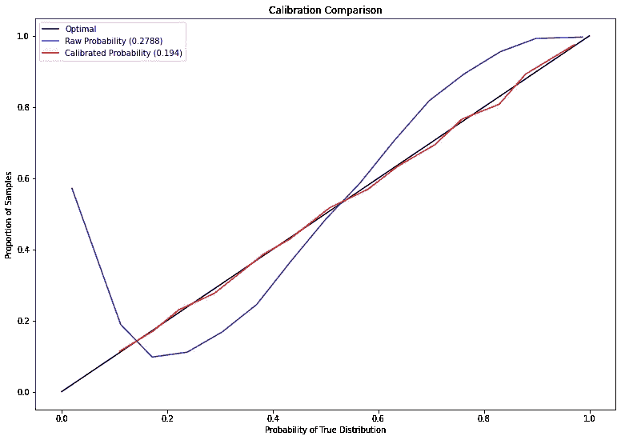

# 使用 Metropolis-Hastings 轻松改进任何 GAN

> 原文：<https://towardsdatascience.com/easily-improve-any-gan-with-metropolis-hastings-bf7a021785f1?source=collection_archive---------36----------------------->

## 无需在 TensorFlow 中进行额外培训即可创建更高保真度的样品

如何才能以尽可能少的工作来改进我们的 GAN？(图片来自 [Pixabay](https://pixabay.com/photos/fox-sleeping-resting-relaxing-red-1284512/) )

从你的 GAN 得到可信的输出有困难吗？在本文中，我们将回顾最近对 GANs 的改进，该改进通过简单易用的 Tensorflow 2 实现来提高输出质量，让您自己的 Metropolis-Hastings GAN 起步！

# 关于报纸

2018 年末，优步工程发布了一篇题为**“Metropolis-Hastings 生成对抗网络”(Turner 等人)的论文，其中作者介绍了一个简单的技巧，在 GAN 的**不增加 GAN 的**训练时间的情况下，提高了 GAN 的输出。如果你对 GANs 不是很熟悉，我建议在继续深入了解我们正在处理的模型之前，先阅读这篇[文章](/understanding-generative-adversarial-networks-gans-cd6e4651a29)。**

****

**来自“Metropolis-Hastings Generative Adversarial Networks”(2018，Turner 等人)的视频，展示了 MH 如何提高渐进式 gan 的输出**

**优步工作的基本前提是，通常在训练后被丢弃的鉴别器包含有价值的信息，用于确定哪些样本类似于真实的数据分布。作者提出了一种新颖的采样方案，其中使用 Metropolis-Hastings 从生成器的潜在空间中抽取样本，由鉴别器选择接受哪个生成的样本。**

****

**图 1:来自优步论文的 Metropolis-Hastings GAN 伪代码**

**这种方法的巧妙之处在于，它适用于任何 GAN 架构或损失函数，因为 MH-GAN 实际上只是一种训练后采样方法。在我们展示如何应用这种采样方法之前，让我们先训练一个 GAN 来使用它！**

# **在 TensorFlow 2 中培训我们的 GAN**

**为了开始我们训练 MH-GAN 的旅程，我们首先要训练最小平方 GAN，因为它的稳定性和易于实现。如果你想了解更多关于 LS-GANs 的知识，我在文章底部提供了一个链接。对于数据，我们将使用 TensorFlow 中包含的时尚 MNIST 数据集，因此这些结果很容易在家中复制！**

**请注意，下面的一些训练代码改编自位于[此处](https://www.tensorflow.org/tutorials/generative/dcgan)的官方 tensor flow DC-甘教程:**

**请注意，我们还使用了`tensorflow-addons`包来实现一些更高级的功能，如 Ranger 优化器和 Mish 激活层，以平滑训练过程。**

## **定义我们的生成器和鉴别器**

**训练我们的网络的下一步是定义我们的生成器和鉴别器对象，以馈入我们的 LS-GAN 类:**

**我们有一个基类来训练一个最小平方 GAN 以及一个生成器和鉴别器，现在是时候开始实现 MH-GAN 了！**

# **大都会-黑斯廷斯算法**

**在实现 MH-GAN 时，我们需要了解的第一件事是 Metropolis-Hastings 算法。MH 是一种马尔可夫链蒙特卡罗方法，用于从难以直接采样的分布中进行采样。在这种情况下，我们试图从鉴别器隐含的真实数据分布中进行采样。**

**我们不会深入探讨 Metropolis-Hastings 背后的理论，但如果你想了解更多，我在本文底部提供了一个链接。**

**一旦我们有了一个经过训练的生成器和鉴别器，我们使用以下步骤来抽取遵循真实数据分布的样本(请随意参考上面的伪代码):**

1.  **用真实的数据样本作为链的种子(作者这样做是为了避免 Metropolis-Hastings 带来的漫长磨合期)**
2.  **对于 K 次迭代，我们从生成器中抽取一个随机样本，并从鉴别器中计算得分**
3.  **在每次迭代中，如果以下表达式大于范围[0，1]中的随机数，则接受新样本并与下一次迭代进行比较:**

****

**图 2:MH-GAN 中接受新样品的条件(摘自优步 MH-GAN 论文)**

**本质上，该规则所做的是比较建议样本的鉴别器分数与当前样本分数的比率，以确定我们是否应该“接受”新样本。通过足够的迭代，我们的独立链将近似我们的鉴别器输出所暗示的真实数据分布！**

**如果我们在一定次数的迭代后无法接受任何样本，作者建议从合成样本重新开始链以保证收敛，尽管速度较慢。**

****然而这并不是故事的结尾**，因为我们的鉴频器的输出还有一个悬而未决的问题，我们将在下一节解决这个问题。**

# **校准我们的鉴别器**

**在应用 Metropolis-Hastings 时所做的一个假设是，我们的鉴别器的概率是校准好的。这意味着鉴别器输出必须被解释为置信水平。不幸的是，神经网络分类器的原始输出几乎从未被很好地校准过，这意味着我们必须应用额外的步骤来校准输出。**即使我们在最后一层使用 sigmoid 或 softmax 激活，也是如此！****

**Scikit-Learn 文档中有很大一部分是关于校准的[这里是](https://scikit-learn.org/stable/modules/calibration.html)，但是论文作者推荐的是使用一种称为保序回归的技术将网络输出转换为校准的概率，作为后处理步骤。不幸的是，这需要在一个固定的集合中完成，这意味着我们必须将我们的时尚 MNIST 分成一个训练和验证集合(幸运的是 Tensorflow 为我们做到了这一点！)**

**下面是一个校准曲线(一个说明模型校准的诊断工具，**45 度线代表完美的校准**)，显示了我们的等张预测如何满足 Metropolis-Hastings 条件。另一方面，我们的原始输出显然没有校准好。**

****

**图 3:校准曲线显示对鉴频器输出应用保序回归后的改善**

**一旦我们校准了鉴别器，我们就可以使用校准的概率来确定我们上面概述的独立 MCMC 链中新样本的接受概率！**

# **编码我们的 MH-GAN**

**现在，终于到了用我们上面编码的 LS-GAN 的子类进行校准和 Metropolis-Hastings 采样的时候了。请注意，我们可以很容易地将这个子类应用于遵循我们上面概述的 API 的任何其他种类的 GAN，甚至可以使它适应现有的 GAN 包。**

**请注意，这里有几件事情要做，首先我们需要实现一种方法来训练我们的校准器以及一种校准的评分方法。**

**为了训练校准器，我们只需拿出一组样本，从生成器中生成相同数量的样本。接下来，我们训练 Scikit-Learn 中的 IsotonicRegression 类，将鉴别器分数转换成真实概率。**

**最后，我们有我们的`generate_mh_samples()`方法，它生成指定数量的接受样本，给出一个真实的例子来播种 MCMC 链。你能在这里看到一个共同的主题吗？校准后的评分和 MH 样品生成方法与 LS-GAN 的`score_samples()`和`generate_samples()`方法完全相同！**

**是时候使用时尚 MNIST 的数据来体验这个新的课程了！**

# **比较结果**

**为了开始使用我们闪亮的新 MH-GAN 类，我们必须做的第一件事是加载我们的时尚 MNIST 数据，并将其分成我们的训练和验证集，以及归一化像素。好在 tf.keras 让这个超级容易！**

**既然我们已经有了训练集和测试集，我们要做的就是用上面声明的生成器和鉴别器初始化我们的`MHGAN`对象，以及生成器和优化器学习率的噪声维度。然后，我们将训练 50 个历元(这是相当随意的，通常这需要对 GANs 进行更多的考虑)，最后校准我们的鉴别器。我们的面向对象方法允许我们用 3 行代码就可以做到这一点！**

**训练完成后，我们可以通过使用正常的朴素 GAN 采样或优步论文中的 Metropolis-Hastings 算法，从我们训练的 MH-GAN 中提取样本。**

**让我们来看看使用 LS-GAN、MH-GAN 生成的 15 幅图像，以及一些真实图像进行比较:**

****

**图 4:LS-GAN 和 MH-GAN 输出与时尚 MNIST 数据集真实样本的比较**

****哇！**我们可以肯定地看到，MH-GAN 几乎完全避免了样品明显造假的问题！这一发现与优步团队的发现一致，他们在 CelebA 数据集上报告说，他们的方法大大减少了低保真度图像的数量。我们可以看到来自 LS-GAN 的样本实例看起来就像不明确的斑点，而这在我们的 MH-GAN 中发生的频率要低得多。**

**该团队还认为，它解决了模式崩溃问题，但在我对他们的方法的试验中，我并没有真正看到这种情况发生，但 MNIST 和时尚-MNIST 并不总是算法性能的最佳指标，这不是一个问题。**

# **结论**

**如果你对我们在本文中展示的 GAN 的快速改进感兴趣，**我强烈推荐**阅读下面链接的 MH-GAN 原文！此外，我们已经展示了 TensorFlow 2 使应用这种技术变得极其容易，只需要很少的额外代码！**

**关于基于鉴频器的 GAN 采样，还有许多其他有趣的论文，如 Azadi 等人的[“鉴频器抑制采样”](https://arxiv.org/abs/1810.06758)和 Che 等人的[“您的 GAN 实际上是一个基于能量的模型，您应该使用鉴频器驱动的潜在采样”](https://arxiv.org/abs/2003.06060)，显示了该领域的前景。毫无疑问，看看未来几年这种趋势会变得有趣。**

**如果你对这篇文章有任何问题或意见，请不吝发表在下面！**

# **参考资料和资源**

**链接到优步最初的 MH-GAN 论文:**

 **[## Metropolis-Hastings 生成对抗网络

### 我们介绍了 Metropolis-Hastings 生成对抗网络(MH-GAN ),它结合了马尔可夫链的各个方面

arxiv.org](https://arxiv.org/abs/1811.11357)** 

**优步工程公司关于 MH-GANS 的原始网站文章:**

** [## 如何免费获得更好的 GAN:介绍大都会-黑斯廷斯 GAN

### 生成对抗网络在真实感图像生成和图像修复方面取得了令人瞩目的成就

eng.uber.com](https://eng.uber.com/mh-gan/) 

一篇关于最小二乘 GAN 的有用文章

 [## 最小平方甘

### 感谢 F-GAN，它建立了 GAN 训练的一般框架，最近我们看到了 GAN 的修改…

wiseodd.github.io](https://wiseodd.github.io/techblog/2017/03/02/least-squares-gan/) 

Metropolis-Hastings 采样快速指南:

 [## 从零开始:贝叶斯推理，马尔可夫链蒙特卡罗和大都会黑斯廷斯，用 python 编写

### 0-我的第一篇文章

towardsdatascience.com](/from-scratch-bayesian-inference-markov-chain-monte-carlo-and-metropolis-hastings-in-python-ef21a29e25a)**