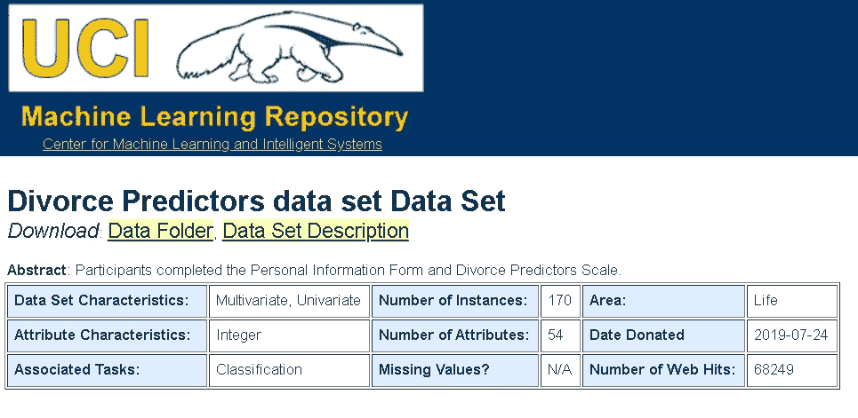

# 轻松可视化 Scikit-learn 模型的决策界限

> 原文：<https://towardsdatascience.com/easily-visualize-scikit-learn-models-decision-boundaries-dd0fb3747508?source=collection_archive---------10----------------------->

## 一个简单的效用函数来可视化 Scikit-learn 机器学习模型/估计器的决策边界。

图片来源: [Pixabay(免费授权)](https://pixabay.com/photos/tennis-sand-sport-space-3524072/)

# 介绍

Scikit-learn 是一个令人惊叹的 Python 库，用于工作和试验[过多的监督和非监督机器学习(ML)算法和相关工具](https://scikit-learn.org/stable/modules/classes.html)。

它的构建考虑到了健壮性和[速度](https://scikit-learn.org/stable/developers/performance.html)——尽可能多地使用 NumPy 和 [SciPy](https://www.scipy.org/) 方法和[内存优化技术](https://scipy-lectures.org/advanced/optimizing/index.html)。最重要的是，该库为所有类型的 ML 估计器提供了一个简单而直观的 API(T10)——拟合数据、预测和检查模型参数。

图像:Scikit-learn 估计器图示

对于监督最大似然领域中的许多分类问题，**我们可能希望超越数值预测(类别或概率)并可视化类别之间的实际决策边界**。当然，这尤其适用于二元分类问题和一对要素，可视化显示在二维(2D)平面上。

例如，这是来自 Scikit-learn 官方文档的支持向量机(SVM)教程的决策边界的可视化。

图片来源: [Scikit-learn SVM](https://scikit-learn.org/stable/modules/svm.html)

虽然 Scikit-learn 没有提供现成的、可访问的方法来实现这种可视化，但在本文中，我们将研究一段简单的 Python 代码来实现这一点。

# 一个简单的 Python 函数

[**完整代码在我的 Python 机器学习上的 Github Repo 这里给出**](https://github.com/tirthajyoti/Machine-Learning-with-Python/blob/master/Utilities/ML-Python-utils.py) 。当然也欢迎你到[探索整个库](https://github.com/tirthajyoti/Machine-Learning-with-Python)寻找其他有用的 ML 教程。

这里，我们展示了 docstring 来说明如何使用它，

实用函数的文档字符串

您可以将模型类和模型参数(对于每个模型类是特定且唯一的)以及要素和标签数据(作为 NumPy 数组)传递给函数。

这里的**模型类表示精确的** [**Scikit-learn 估计器类**](https://scikit-learn.org/stable/developers/develop.html) **，您在**中调用它来实例化您的 ML 估计器对象。请注意，您不必传递您正在使用的特定 ML 估计器。只有类名就足够了。**该函数将在内部拟合数据并预测**以创建适当的决策边界(考虑您传递的模型参数)。

目前，**函数仅使用前两列数据来拟合**模型，因为我们需要找到网格样式散点图中每个点的预测值。

主代码部分

# 一些说明性结果

代码很无聊，而结果(和情节)很刺激，不是吗？

为了演示，我们使用了离婚分类数据集。这个数据集是关于完成个人信息表和离婚预测量表的参与者。该数据是在 [UCI 门户](https://archive.ics.uci.edu/ml/datasets/Divorce+Predictors+data+set)上公开的数据的修改版本(在注入一些噪声之后)。有 170 个参与者和 54 个属性(或预测变量)都是实值。

[UCI 离婚预测数据集](https://archive.ics.uci.edu/ml/datasets/Divorce+Predictors+data+set)

我们在同一个数据集上比较了多个最大似然估计的性能，

*   朴素贝叶斯
*   逻辑回归
*   k-最近邻(KNN)

因为这个特定数据集的二进制类是相当容易分离的，所以所有的 ML 算法表现几乎一样好。然而，**它们各自的决策边界看起来彼此不同，这就是我们感兴趣的通过这个效用函数**可视化。

图片:离婚预测数据集的类别可分性

## 朴素贝叶斯决策边界

来自朴素贝叶斯算法的决策边界**是平滑的，并且略微非线性**。而且，只有四行代码！

## 逻辑回归决策边界

正如预期的那样，来自逻辑回归估计器的决策边界被可视化为线性分隔符。

## k-最近邻(KNN)决策边界

k-最近邻是一种基于特征超平面上数据分布的局部几何(以及它们的相对距离度量)的算法。因此，决策边界表现为**非线性和不平滑的**。

## 你甚至可以通过神经网络分类器

该函数适用于任何 Scikit-learn 估计器，甚至神经网络。这里是 Scikit-learn 的`MLPClassifier`估计器的决策边界，它[模拟一个密集连接的神经网络](https://scikit-learn.org/stable/modules/generated/sklearn.neural_network.MLPClassifier.html)(具有用户可配置的参数)。注意，在代码中，我们传递了隐藏层设置、学习率和优化器([随机梯度下降](/stochastic-gradient-descent-clearly-explained-53d239905d31)或 SGD)。

## 检查模型参数的影响

如前所述，**我们可以将我们想要的任何模型参数传递给效用函数**。在 KNN 分类器的情况下，随着我们增加相邻数据点的数量，决策边界变得更加平滑。使用我们的效用函数，可以很容易地看到这一点。注意，在下面的代码中，我们如何在一个循环中将变量`k`传递给`n_neighbors`模型参数。

# 摘要

我们展示了如何编写一个简单的效用函数来接受任何 Scikit-learn ML 估计器(具有用户希望传递给模型的任何模型参数),用于二进制分类任务，并使用几行代码可视化正类和负类之间的判定边界。

该函数可与任何 Scikit-learn 估计器配合使用，并且可扩展和配置，以便在将来包含更多的类和多绘图功能。

再次说明，我在 Python 机器学习上的 Github Repo 里这里给出了 [**完整代码**](https://github.com/tirthajyoti/Machine-Learning-with-Python/blob/master/Utilities/ML-Python-utils.py) 。将根据需要添加更新。

如果您有任何问题或想法要分享，请联系作者在[**tirthajyoti【AT】Gmail . com**](mailto:tirthajyoti@gmail.com)。此外，您可以查看作者的 [**GitHub**](https://github.com/tirthajyoti?tab=repositories) **资源库**中的代码、想法和机器学习和数据科学方面的资源。如果你和我一样，对人工智能/机器学习/数据科学充满热情，请随时[在 LinkedIn 上添加我](https://www.linkedin.com/in/tirthajyoti-sarkar-2127aa7/)或[在 Twitter 上关注我](https://twitter.com/tirthajyotiS)。

 [## Tirthajyoti Sarkar - Sr .首席工程师-半导体、人工智能、机器学习- ON…

### 通过写作使数据科学/ML 概念易于理解:https://medium.com/@tirthajyoti 开源和有趣…

www.linkedin.com](https://www.linkedin.com/in/tirthajyoti-sarkar-2127aa7/)