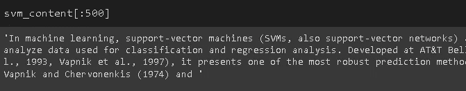
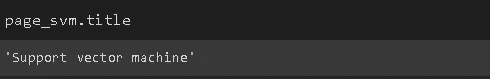
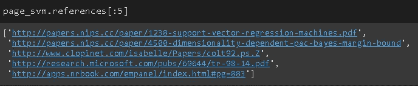
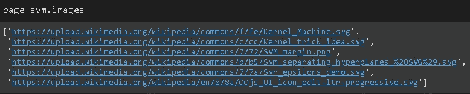
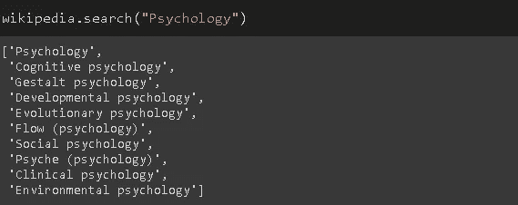
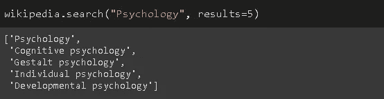

# 轻松访问世界上最大的数据源

> 原文：<https://towardsdatascience.com/easy-access-to-the-worlds-largest-data-source-62a646d201d5?source=collection_archive---------45----------------------->

Python 的维基百科 API


[粘土银行](https://unsplash.com/@claybanks?utm_source=unsplash&utm_medium=referral&utm_content=creditCopyText)在 [Unsplash](https://unsplash.com/s/photos/encyclopedia?utm_source=unsplash&utm_medium=referral&utm_content=creditCopyText) 拍摄的照片

数据的重要性远高于在数据科学中构建最先进的算法。如果没有合适的大量数据，我们就无法很好地训练模型，以获得令人满意的结果。

作为世界上最大的百科全书，维基百科可以作为许多项目的巨大数据源。有许多网络抓取工具和框架允许从维基百科获取数据。然而，Python 的 Wikipedia API 可能是最简单易用的。

在本帖中，我们将看到如何使用维基百科 API 来:

*   访问特定页面的内容
*   搜索页面

您可以轻松地安装和导入它。我将使用谷歌 Colab，所以这里是它是如何在 Colab 中完成的:

```
pip install wikipedia
import wikipedia
```

页面的内容可以用 page 方法提取。页面的标题作为参数传递。以下代码将支持向量机页面作为 WikipediaPage 对象返回。

```
page_svm = wikipedia.page("Support vector machine")type(page_svm)
wikipedia.wikipedia.WikipediaPage
```

这个对象保存了可以通过 url 方法访问的页面的 URL。

```
page_svm.url[https://en.wikipedia.org/wiki/Support_vector_machine](https://en.wikipedia.org/wiki/Support_vector_machine)
```

我们可以用 content 方法访问页面的内容。

```
svm_content = page_svm.contenttype(svm_content)
str
```

内容以字符串形式返回。以下是 svm_content 字符串的前 1000 个字符。



返回的内容是一个字符串，这不是分析的最佳格式。我们可以处理这个原始字符串来推断有意义的结果。有一些高效的自然语言处理(NLP)库可以处理文本数据，比如 NLTK、BERT 等等。

我们不会详细讨论 NLP 任务，但让我们做一个简单的操作。我们可以将内容字符串转换成 python 列表，该列表将单词作为单独的元素包含在内。然后我们可以计算一个特定单词出现的次数。

```
content_lst = svm_content.split(" ")len(content_lst)
57779content_lst.count("supervised")
4
```

title 方法用于访问页面的标题。



references 方法返回页面上使用的引用列表。本页的前 5 个参考如下:



同样，我们也可以提取页面上图像的链接:



我们心里并不总是有一个确切的标题。假设我们正在寻找标题中包含“心理学”一词的页面。这可以通过搜索方法来完成。



在某些情况下，返回的列表太长，所以我们可能希望限制返回的项目。只需将所需的项目数传递给结果参数。



> 注:除非另有说明，所有图片均由作者创作。

**编辑**:感谢[尼克·韦伯](https://medium.com/u/9d1f49b86f92?source=post_page-----62a646d201d5--------------------------------)指出这一点。Wikipedia API 的创建者明确声明“这个库是为了易用性和简单性而设计的，而不是为了高级用途。如果您计划执行重要的抓取或自动请求，请使用 Pywikipediabot(或其他更高级的 Python MediaWiki API 包装器之一)，它具有更大的 API、速率限制和其他功能，因此我们可以考虑 MediaWiki 基础架构。”

# **结论**

维基百科是一个非常有价值的数据来源。它提供了对许多主题的结构化信息的访问，并作为机器学习和深度学习任务的数据源。例如，这些数据可以用来训练复杂的 NLP 模型。

维基百科 API 使得访问和使用这个巨大的数据源变得非常容易和简单。

感谢您的阅读。如果您有任何反馈，请告诉我。