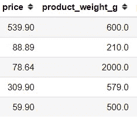
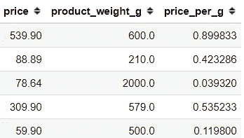
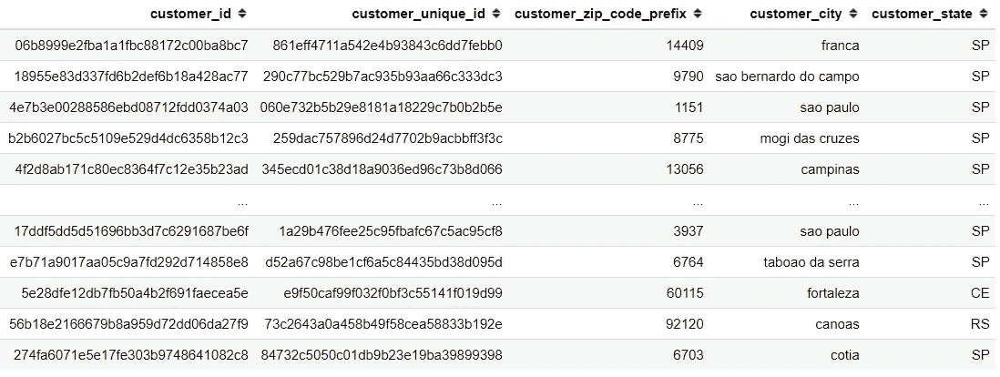
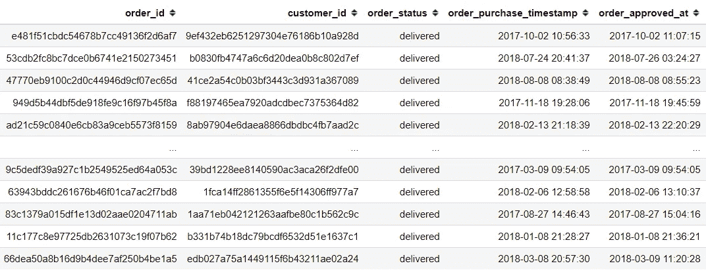
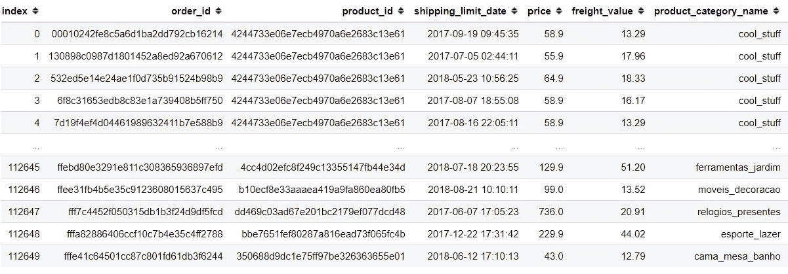
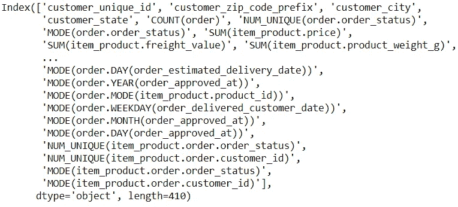

# 用于机器学习模型的简单自动化特征工程

> 原文：<https://towardsdatascience.com/easy-automated-feature-engineering-for-machine-learning-model-ea00c5059dd6?source=collection_archive---------24----------------------->

## 自动化模型开发的痛苦部分


照片由 [Goh Rhy Yan](https://unsplash.com/@gohrhyyan?utm_source=medium&utm_medium=referral) 在 [Unsplash](https://unsplash.com?utm_source=medium&utm_medium=referral) 上拍摄

作为一名数据科学家，我们知道处理数据是我们的日常活动。从拉数据，分析数据，创建一个有用的机器学习模型。

虽然许多人认为创建机器学习模型很容易，但事实并非如此。人们可能认为我们只需要输入一些编码语言，瞧！机器学习模型做好了。

它可能是这样工作的，但是这个模型有用吗，对业务问题有什么影响吗？大部分时间可能不是。这是因为现实生活中的数据是杂乱的，如果没有适当的测量，它将导致一个有缺陷的模型。

提高机器学习模型性能的一种行之有效的方法是从现有特征或**特征工程**中创建新特征。

特征工程的概念很容易理解，因为这个想法是关于从现有的特征中创建新的特征。例如，我们有产品价格及其重量的数据。



从这两个特性中，我们可以创建一个新的特性。比方说每克的产品价格。在这种情况下，我们需要将价格除以产品重量。



就这样，我们得到了一个新的特性。这就是特征工程的概念。

机器学习模型的核心是数据，提高性能的方法是通过特征工程，尽管掌握特征工程需要很多技能。我们需要有创造力，了解商业领域。这肯定要花很多时间。

为了解决特征工程问题的局部部分，我们可以自动化时间任务特征工程过程。

# 自动化特征工程

用于执行自动化特征工程的主要开源库之一是 **Featuretools** 。它是一个库，旨在通过自动化过程来加快特征生成过程。

在 Featuretools 中，有三个我们应该知道的包的主要组件。它们是:

*   实体
*   深度特征综合(DFS)
*   特征基元

解释在下面的文章中。

*   **实体**是 Featuretools 中熊猫数据框的表示。多个实体被称为一个**实体集**。
*   **深度特征合成** (DFS)是 Featuretools 中的一种特征工程方法。这是用于从单个和多个数据框创建新要素的方法。
*   DFS 通过将**特征原语**应用于 EntitySet 中的实体关系来创建特征。特征基元是我们称之为手动生成特征的方法，例如，基元平均值是聚合级别的变量的平均值。

这是足够的理论；我们可能会直接跳到工具的实际用途。为了做好准备，我们需要先安装库。

```
pip install featuretools
```

现在，Featuretools 最适合用于具有许多关系的多个数据集。在这种情况下，我会使用来自 [Kaggle](https://www.kaggle.com/olistbr/brazilian-ecommerce) 的 Olist Brazallian 电子商务数据集。

数据在 CSV 文件中，由许多数据组成。在这种情况下，我会选择一些数据作为例子。

```
olist_items = pd.read_csv('olist_order_items_dataset.csv')
olist_product = pd.read_csv('olist_products_dataset.csv')
olist_customer = pd.read_csv('olist_customers_dataset.csv')
olist_order = pd.read_csv('olist_orders_dataset.csv')
```

我们简单看一下数据。首先，我们来看看 olist_customer 数据。



我们可以看到数据包含一个唯一的变量作为标识，名为“customer_id”。当我们想使用 Featuretools 时，这个变量是必要的，因为特征工程的实体将使用这个唯一的变量作为分组指示符。

让我们看看 olist_order 数据。



我们可以看到，olist_order 数据包含“order_id”变量作为标识，还包含“customer_id”变量来指示是谁下的订单。

对于最后一个，我需要产品的数据和商品的订单号，但是因为它分散在两个数据集中，所以我将它合并成一个。我还会删除一些我们不需要的功能，并为标识重置索引。

```
olist_item_product = pd.merge(olist_items, olist_product, on = 'product_id')olist_item_product.drop(['order_item_id', 'seller_id'], axis =1, inplace = True)olist_item_product.reset_index(inplace = True)
```



现在我们有了所有需要的数据集。让我们尝试使用 Featuretools 来实现特征工程的自动化。

首先，我们需要准备的是执行 DFS 的实体。那么，我们到底需要在实体中准备些什么呢？正如我之前提到的，实体是一种数据框表示。在实体的情况下，我们将准备一个包含实体名称和带有标识的数据帧的字典。

实体的例子解释如下。

```
#We prepare the dictionary with the specification is
#'name of the entity' : (dataframe, identification)entities = {
    "customer" : (olist_customer, 'customer_id'),
    "order": (olist_order, 'order_id'),
    'item_product':(olist_item_product, 'index')
}
```

接下来，我们需要指定实体之间的关系。当两个实体存在一对多关系时，我们称“一”实体为“父实体”，“多”实体为“子实体”。父子关系是这样定义的。

```
#The relationship are defined by the entitiy name and the variable identification
(parent_entity, parent_variable, child_entity, child_variable)#Example
relationships = [
('customer', 'customer_id', 'order', 'customer_id'), 
('order', 'order_id', 'item_product', 'order_id')
]
```

在上面的例子中，我用“customer_id”变量定义了“customer”实体和“order”实体之间的关系，这两个变量存在于两个数据集中。

现在是自动化特征工程的时候了。这很容易做到；你只需要按照下面的线。请注意，这个过程需要一些时间，因为数据集非常大。

```
import featuretools as ftfeature_matrix_customers, features_defs = ft.dfs(
entities=entities,                                                 relationships=relationships,
target_entity="customer")
```

从上面的代码，我会解释一下。正如我之前解释的，创建自动化的方法是 DFS。在这种情况下，DFS 方法主要接受三个参数。它们是:

*   实体
*   人际关系
*   实体目标

前两个参数是我们之前创建的，最后一个“实体目标”是聚合的分组。在下面的例子中，假设我们想要基于**客户**级别的特征工程。

流程完成后，我们可以看到，我们最终获得了许多基于客户聚合的新特性。

```
feature_matrix_customers.columns
```



正如我们在上面的图片中看到的，由于自动化特征工程，我们现在有 410 个特征。

如果你对如何阅读一些列名感到好奇，我可以解释一下。以 SUM(item_product.price)为例。此列表示它是 item_product 实体的价格与客户聚合级别的总和。所以，用一个更人性化的术语来说，就是顾客所购买的商品的总价。

下一步，当然是用我们刚刚产生的数据开发机器学习模型。虽然我们已经创建了这个功能，但它是否有用还需要更多的实验。重要的是，我们成功地自动化了模型开发的耗时方面。

# 结论

特征工程是开发机器学习模型的一个重要方面，因为它正在影响我们的机器学习模型。然而，这个过程可能需要很长时间。

在这种情况下，我们可以使用名为 Featuretools 的开源库来自动化我们的功能工程过程。

Featuretools 中我们需要记住的三个术语是实体、深度特征合成、特征基元。

如果你想了解更多关于 Featuretools 的信息，你可以访问主页[这里](https://www.featuretools.com/)。

希望有帮助！

# 如果你喜欢我的内容，并想获得更多关于数据或作为数据科学家的日常生活的深入知识，请考虑在这里订阅我的[时事通讯。](https://cornellius.substack.com/welcome)

> 如果您没有订阅为中等会员，请考虑通过[我的推荐](https://cornelliusyudhawijaya.medium.com/membership)订阅。