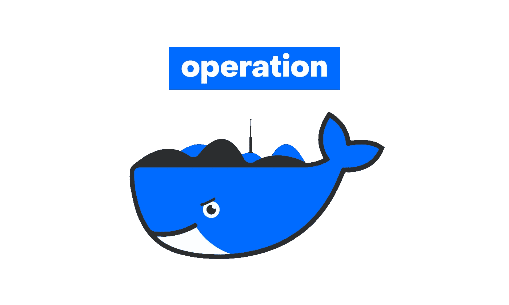
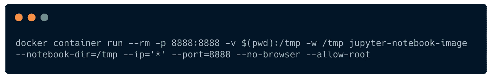
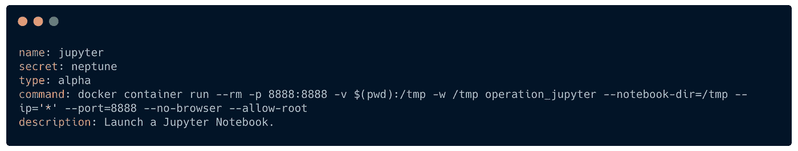

# 易于操作的开发环境

> 原文：<https://towardsdatascience.com/easy-development-environments-with-operation-6b352e72c0eb?source=collection_archive---------54----------------------->

像越来越多的工程师一样，数据科学家正在向码头工人 T2 转移。这个框架将资源和应用程序从全球系统中分离出来，有助于更好的可复制性，从而解决了软件安装和部署过程中的一些问题。

虽然它主要用于部署独立的应用程序，但是我们可以通过一种稍微派生的方式来利用这种技术来构建轻量级和可移植的开发环境。

随着越来越多不同的工具和库，有时很难知道我们的工作站中安装了什么，以及如何轻松地管理所有这些东西。每个人都遇到过仅仅为了安装一个特定的 Python 库或 Bash 实用程序而进行几个小时的调试。

> *如果你想了解更多关于 Docker 技术的细节，在 Medium* *这里已经有很多好的资源* [*。*](https://medium.com/@kelvin_sp/docker-introduction-what-you-need-to-know-to-start-creating-containers-8ffaf064930a)

# 带码头的移动实验室

当我收到最后一台笔记本电脑时，我没有在全局系统安装上安装任何库或代码实用程序。相反，我将许多日常工作转移到 Docker 容器中。

这种工作流程有很多优点:

*   您可以安装和测试库，而不用担心会破坏您的全局系统。全部隔离在容器中。
*   由于 Dockerfiles(在 Git 中跟踪),您可以跟踪不同的工作区以及它们是如何发展的。
*   您可以在任何计算机上运行您的任何工作区。只需要安装 Docker(这非常简单)。
*   您可以共享工作区。您的任何项目都可以在朋友的电脑上运行。

好的，听起来不错。安装或升级库时，我们将不再害怕。在任何地方运行项目的可能性是非常令人兴奋的，由于 Git，获得所有历史变更将节省时间。

尽管如此，还是有一点缺点:您必须编写很长的命令才能启动这些容器

在 Docker 容器中运行 Jupyter 记事本的 Docker 命令示例。

# 我们总是想要快捷简单的工具

为了解决这个问题，我首先想到了 [docker-compose](https://github.com/docker/compose) 。这个工具对于定义和运行多容器 Docker 应用程序非常有用。它可以将复杂的运行操作恢复成简单的`docker-compose up`命令。

然而，这不是我们在我们的环境中使用的工具，至少有两个原因:

首先，您必须在包含`docker-compose.yml`的文件夹中运行 docker-compose 命令，或者提供相当长的完整 docker 文件路径。这并不像我们习惯的那样，仅仅在你的控制台中输入`jupyter-notebook`或者启动 Rstudio 应用程序那么简单。

其次，你得安装 docker-compose。好了，这还不是最难的。但是在安装工作空间时，您仍然需要添加这个层。

所以我问自己，在大多数 Unix 系统上，默认的工具是什么？简单回答:Bash。

[行动](https://github.com/Ben8t/operation)诞生了。

# 操作:Docker 环境支持 Bash。

这个工具非常简单。事实上，它只是 docker 容器运行命令到 shell 脚本中简单表达式的映射。

环境——或“操作”——由一个**docker 文件**和一个**配置文件**定义。后者用于指定容器运行命令和所有需要的参数，如卷、环境变量等

Jupyter 笔记本操作后面的[配置文件](https://github.com/Ben8t/operation/blob/master/operation/src/jupyter/config.yml)。

映射被解释成一个简单的 [shell 脚本](https://github.com/Ben8t/operation/blob/master/operation.sh)。我们可以用一个简单的`operation briefing`构建所有的 Docker 图像。

然后，不用运行长 Docker 命令来运行 Jupyter 笔记本，只需键入`operation jupyter`。

操作被设计得非常简单，它不是一个革命性的工具，只是一个小的附带项目。目标是能够运行单个应用程序或开发工具，而不用担心系统依赖性和安装。

当在一个更复杂的项目中工作时，我更喜欢在项目中建立 docker 文件甚至 docker-compose 文件，而不是在操作中构建它。这对项目的可重复性更好。

由于我主要使用 Python 和 R，我开始构建像 IPython 或浏览器内 Rstudio 环境这样的“操作”。我还利用这个解决方案设置了一些任务，虽然我不是每天都做，但是这些任务非常有用，比如 CSV 文件转换、图像旋转或日期时间操作。

这些小工具可以安装在我的全球系统上。它们不需要太多的依赖。尽管如此，我还是希望能够使用它们而完全不用担心我的系统配置，并且当我换到另一个工作站时能够快速找到它们。

有了手术，我手头就有了。

# 背后的故事

这个想法并不新鲜。[杰西·弗雷泽勒](https://twitter.com/jessfraz)，前 Docker-Google-微软工程师已经有了一个[完整的 Docker 文件库](https://github.com/jessfraz/dockerfiles)来运行独立的桌面应用。我鼓励你去看[相应的博文](https://blog.jessfraz.com/post/docker-containers-on-the-desktop/)。

读了汤姆·克兰西的书后，我想到了“手术”这个名字。像[军事行动](https://en.wikipedia.org/wiki/List_of_military_operations)一样，Docker 容器被定义、操作，然后分类。为了实现这个想法，我甚至添加了“秘密”行动的别名。例如，您可以启动运行`operation ipython`或`operation rattlesnake`的 IPython 控制台。

这个锁定也让我学习了一些关于 3D 建模和 Blender 渲染的知识。围绕码头鲸创作了一些艺术品。[了解有关具体行为项目的更多信息](https://www.behance.net/gallery/95156933/Operation)。

https://www.behance.net/gallery/95156933/Operation

# 未来的发展

我利用锁定开始这个小项目，并提高我的 Bash 技能。由于我们过去面对许多新的工具和环境，它可能会定期更新。可以进行许多改进，例如:

*   优化图像定义并遵循 Docker 的良好实践。
*   更好的安装过程(apt-获得支持？).
*   潜在的卷“安全性”和授权违规。
*   改进文档。
*   添加操作“优先级”以快速构建特定的 Docker 映像。
*   比 Bash 更好的 CLI，无需使用任何其他工具。

目前每个操作都非常接近我的个人喜好。如果你想添加你自己的操作:添加你的 Dockerfile 并填充一个`config.yml`文件，你就准备好了。

你有改进的想法吗？认为应该创造一些新的环境？你可以在 Github 上找到[这个库。不要犹豫，添加问题或创建合并请求，在下面添加评论，或](https://github.com/Ben8t/operation)[在 Twitter 上与我联系](https://twitter.com/Ben8t)。我将很高兴收到你的来信。