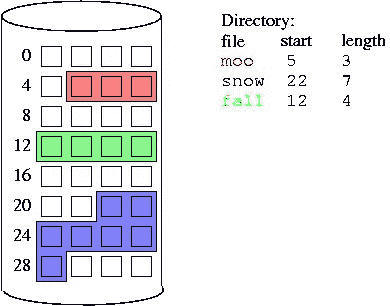

# 红移性能的简单修复

> 原文：<https://towardsdatascience.com/easy-fixes-for-redshift-performance-3fb66743b8c?source=collection_archive---------25----------------------->

由 [Ricardo Gomez Angel](https://unsplash.com/@ripato?utm_source=unsplash&utm_medium=referral&utm_content=creditCopyText) 在 [Unsplash](https://unsplash.com/s/photos/red?utm_source=unsplash&utm_medium=referral&utm_content=creditCopyText) 拍摄的照片

## 或者如何将自己从分布式数据库的糟糕查询中解救出来

edshift 很棒，直到它不再是那样。通常，当这种情况发生时，并不是红移的错。使用红移的人面临的最常见的问题之一是查询性能差和查询执行时间长。这可能很难理解，但大多数红移问题是显而易见的，因为人们只是习惯于查询关系数据库。虽然传统的 ACID 兼容关系数据库和 MPP 分布式关系数据库的外观是一样的，但是存储分布的基本原则完全改变了游戏。

与兼容 ACID 的关系数据库(如 MySQL、PostgreSQL 等)相比，红移的两个主要特点改变了一切。

*   **底层存储** —列存储而不是基于行的存储
*   **大规模并行处理架构**——尽管在 MySQL、PostgreSQL 等中也是可能的。这也是红移的默认设置

现在，我们将列出一些快速修复方法和开始使用红移工作负载时需要记住的事项。如果你不了解红移，阅读下面的文档会很有帮助。

 [## 影响查询性能的因素

### 许多因素都会影响查询性能。数据、集群和数据库操作的以下方面…

docs.aws.amazon.com](https://docs.aws.amazon.com/redshift/latest/dg/c-query-performance.html) 

# 记住——红移中没有索引

与关系数据库不同，Redshift 不支持索引。不要编写与 MySQL 或 PostgreSQL 等关系数据库相同的查询。红移旨在当您选择您绝对**最肯定**需要查询的列时执行最佳——与您应该在基于行的数据库中`SELECT`记录的方式相同，您需要在基于列的数据库中选择列。

# 没有索引？那么，如何有效地连接表呢？

关系数据库中的联接使用索引。正如我们刚刚确定的，红移中没有索引，那么您将使用什么？您将使用一个类似的探测结构来连接表。这种构造被称为**分布键**——一列数据基于它分布在红移星团的不同节点上。数据的分布方式由为给定表选择的分布样式定义。

 [## 分发示例

### AWS 文档中描述的 AWS 服务或功能可能因地区而异。要查看适用于…的差异

docs.amazonaws.cn](https://docs.amazonaws.cn/en_us/redshift/latest/dg/c_Distribution_examples.html) 

# 统计的重要性

类似于任何其他数据库，如 MySQL，PostgreSQL 等。，Redshift 的查询规划器也使用关于表的统计信息。基于这些统计信息，当选择许多计划中的一个来执行查询时，查询计划决定采用哪种方法。这就是为什么时不时地去牌桌是个好习惯。没有一个好的频率来运行这个适合所有人。请注意`ANALYZE`可能是一项耗时的活动。在决定频率之前，做一个快速的成本效益分析。

有一篇很棒的文章提到了我在这里谈到的一些事情。更多细节请参考。

 [## 亚马逊红移性能优化的 14 个最佳实践

### Amazon Redshift 是一个数据仓库，可以快速、简单且经济高效地分析数 Pb 的数据…

www.intermix.io](https://www.intermix.io/blog/top-14-performance-tuning-techniques-for-amazon-redshift/#use_change_data_capture_cdc) 

# 为您的列选择合适的压缩方式

列数据库的一个优点是可以实现高级别的压缩，因为大量同类数据是连续存储的，这意味着磁盘上的许多块包含相同数据类型的数据。这样不是更容易压缩吗！

> *对于基于行的数据库，一行中的所有数据都是连续存储的。这就是为什么减少扫描的行数更好。*

因此，在基于行的数据库中很难进行压缩，因为一行可能包含不同数据类型的数据，这意味着磁盘上的相邻块可能具有不同的数据类型。

相同颜色的磁盘/内存块是连续的。图片来自[维基共享资源](https://commons.wikimedia.org/wiki/File:Diskblocks-contig.jpg)(标记为重复使用)

 [## 压缩编码

### 压缩编码指定在添加行时应用于数据值列的压缩类型…

docs.aws.amazon.com](https://docs.aws.amazon.com/redshift/latest/dg/c_Compression_encodings.html) 

# 照顾好磁盘空间

管理磁盘空间通常是所有数据库的一个问题，尤其是当您处理分析负载时，因为分析师、数据工程师会创建大量的表以供进一步分析。即使事实并非如此，减少的可用空间也会严重影响查询性能，因为这会使查询执行引擎难以通过引发大量交换来在磁盘上创建临时内容。

如果您对磁盘空间没有任何控制，那么 Spectrum 中更灵活的选项更好—在这里，您实际上是将所有数据移动到 S3，它可以根据您的需要进行扩展，而不会因为增加磁盘空间而停机。

这些是你应该记住的一些基本的东西。你可以在 AWS 的文档中找到更多关于红移的想法。文档并不总是有用的。那时，你可以参考一些通过这篇文章分享的链接和下面的参考资料部分。

# 参考

如果你正在寻找红移的深入实用指南，没有什么比 Periscope 的这个更好的了。

 [## 红移性能的低挂果实| Hudl 博客

### 这篇文章是一个案例研究，关于我们如何修复一些红移性能问题，我们开始运行，因为我们有更多的…

www.hudl.com](https://www.hudl.com/bits/the-low-hanging-fruit-of-redshift-performance)  [## 亚马逊红移|亚马逊网络服务的十大性能调优技术

### 客户使用 Amazon Redshift 做各种事情，从加速现有的数据库环境，到摄取网络日志…

aws.amazon.com](https://aws.amazon.com/blogs/big-data/top-10-performance-tuning-techniques-for-amazon-redshift/)  [## 查询 86.6 亿条记录 Starburst Presto 和…

### 如果您是应用程序所有者，迟早您会需要分析大量数据。好消息是什么？无论如何…

www.concurrencylabs.com](https://www.concurrencylabs.com/blog/starburst-presto-vs-aws-redshift/)  [## 提高查询性能

### 以下是一些影响查询性能的常见问题，以及诊断和解决这些问题的方法说明…

docs.aws.amazon.com](https://docs.aws.amazon.com/redshift/latest/dg/query-performance-improvement-opportunities.html) 

两个视频—

托尼·吉布斯的亚马逊红移最佳实践

通过真实使用案例对红移进行深入的回顾