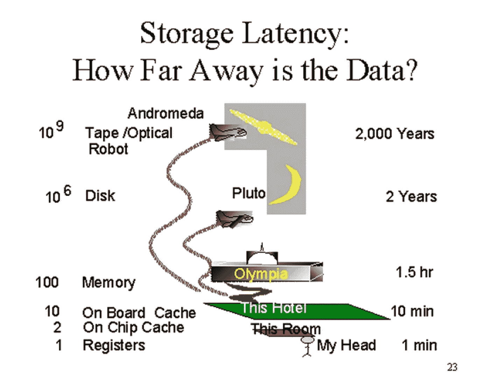

# SparkSQL 性能的简单修复

> 原文：<https://towardsdatascience.com/easy-fixes-for-sparksql-performance-ad4166792e6e?source=collection_archive---------34----------------------->

Emile Perron 在 Unsplash 上拍摄的照片

## 数据工程

## 针对 performant SparkSQL & PySpark 的快速简单的修复、最佳实践和检查

S park 是当今最流行的数据分析和工程工具之一。它拥有广泛的覆盖面和采用率，这促使主要的云提供商提供基于它的服务。有 Azure Databricks、AWS Glue 和 Google data proc——所有这些服务都在底层运行 Spark。Spark 受欢迎的原因之一是它同时支持 SQL 和 Python。对于独特的 RDD 特性，第一个 Spark 产品之后是 DataFrames API 和 SparkSQL API。从那以后，它统治了市场。

很多人在第一次尝试 Spark 时，都说 Spark 非常慢。这显然非常慢，因为他们不了解 Spark 的内部以最佳方式(甚至是足够好的方式)使用它。我写这篇文章是为了指出几个针对 SparkSQL 的快速修复方法，您可以在不深入 SparkSQL 内部的情况下使用它们。话虽如此，解决这个问题的最好方法是深入内部。但是在这里，我们将只讨论非性能 SparkSQL 问题的低挂果实。

 [## SQL 查询的简单修复

### 查询任何传统关系数据库的经验法则

towardsdatascience.com](/easy-fixes-for-sql-queries-ff9d8867a617) 

这是我的早期文章之一[的延续，在那里我谈到了对任何关系数据库的 SQL 查询的快速和简单的修复](https://linktr.ee/kovid)。在某种程度上，许多相同的概念也适用于 SparkSQL 尽早过滤数据、正确过滤数据、高效分发数据、减少不对称等等。让我们继续讨论这些常见问题。

# 1.广播(广播加入)

就像数据库一样，Spark 的数据存储也有小文件和大文件。就像在传统的分布式数据仓库系统中一样，我们将维度表推送到集群的所有节点以避免混乱，我们在这里通过使用 SparkSQL 的广播特性来做同样的事情。Broadcast 做的完全一样——它提前将一个小表的所有数据复制到 worker 节点，以减少执行者之间的混乱。

> 减少执行人之间的推诿

我们可以指定提示来指示 Spark 在执行一个关系(表/文件)到另一个关系的操作时做什么。虽然这并不普遍，但普遍认为 Spark 工作中的更多阶段会导致更多的执行者之间的洗牌。让我们谈谈那个。

# 2.减少阶段的数量

我不断回想起 Jim Gray 的这个伟大类比，他谈到了从磁盘读取和从内存读取的延迟之间的巨大差异。在这种情况下，如果可以避免的话，从磁盘获取数据几乎是犯罪行为。

 [## 词与词之间的无限空间

### 计算机性能有点像骗局。你总是在等待四样东西之一:磁盘 CPU 内存网络…

blog.codinghorror.com](https://blog.codinghorror.com/the-infinite-space-between-words/) 

正如我在介绍中提到的，像 Redshift、Snowflake、Spark、Hadoop 等分布式系统。面临这个常见的问题，即在作业运行的网络上共享数据。这个共享数据是从磁盘中获取的。正如 Jim Gray 所展示的那样，磁盘 I/O 的成本非常高。显然，不仅仅是获取数据——这些数据的开销工作(如 serde)使情况变得更糟。

吉姆·格雷的存储延迟类比

减少给定 Spark 作业的阶段数量肯定有助于减轻您面临的一些性能问题。使用丰富的 Spark UI 来确定 Spark 作业的每个阶段有多少数据被打乱。

阅读关于洗牌的 Spark UI 的一个积极的副作用是，你可以了解除了*级数*之外的问题，比如你的数据的偏斜度。

# 3.分区修剪

过滤、下推谓词、分区修剪——本质上都是同一构造的实现。查询执行引擎希望您尽可能多地丢弃数据，以降低查询成本。在传统的数据库中，这是通过索引和分区来完成的。

分区是对数据进行分组，以便查询执行引擎查找查询所需的数据。修剪是一种能够拒绝查询不需要的整个分区的技术。您也可以使用查询提示在`SELECT`语句中指定分区。

分区的替代方法是分桶。从概念上讲，它试图实现相同的性能优势，但分桶不是为每个分区创建一个目录，而是使用桶值的散列将数据分布到一组预定义的桶中。

# 4.小心缓存

首先要明白的是，和 Spark 中所有的转换一样，`cache()`操作也是懒洋洋求值的。它不像动作那样调用驱动程序的数据移动。`cache()`应该只在你确定缓存的 RDD 将被用于进一步的转换时使用。

不要因为 RDD 很小就进行缓存。不要仅仅因为它是维度表就缓存它(而是广播它)。缓存必须从数据血统的角度来看，即转换的 DAG。

理解缓存和广播之间的区别——前者将缓存数据的副本发送/广播到执行者的内存(和/或存储器)中。

请记住，过多的缓存会给 LRU 算法带来开销，因为它会不断驱逐被缓存的内容，并引入新的内容来替换它们。这个循环将会继续。

您可以继续查看 Spark UI 中缓存的数据量(百分比)。观察 UI 一定会让你的人生更早。

## 结论

这些是识别和修复 SparkSQL 性能问题的一些最快捷、最简单的方法。我会再写一篇关于修复 SparkSQL 查询的具体用例的帖子！