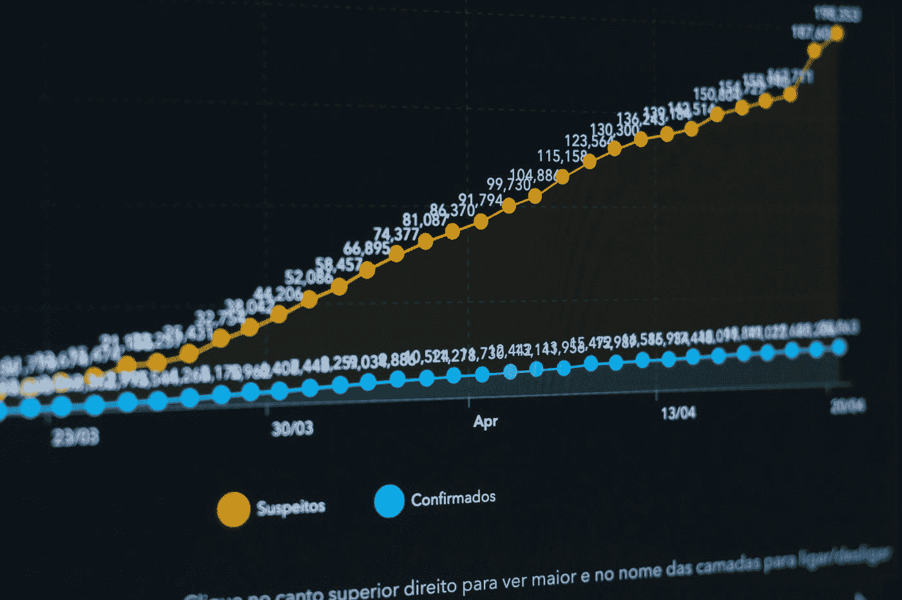
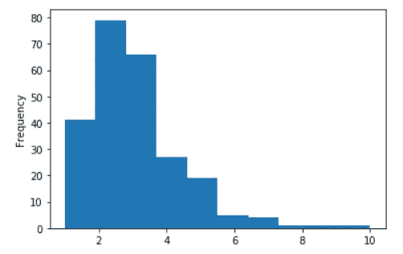
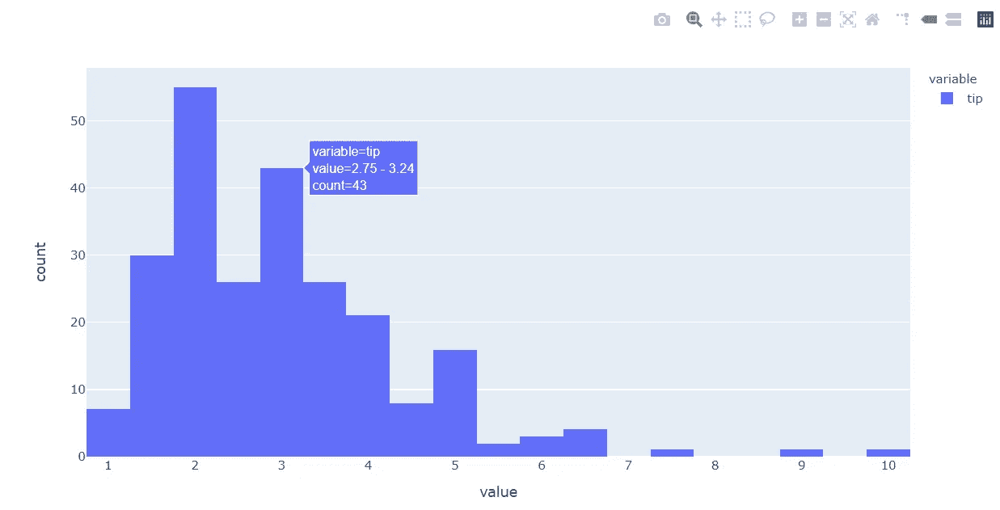
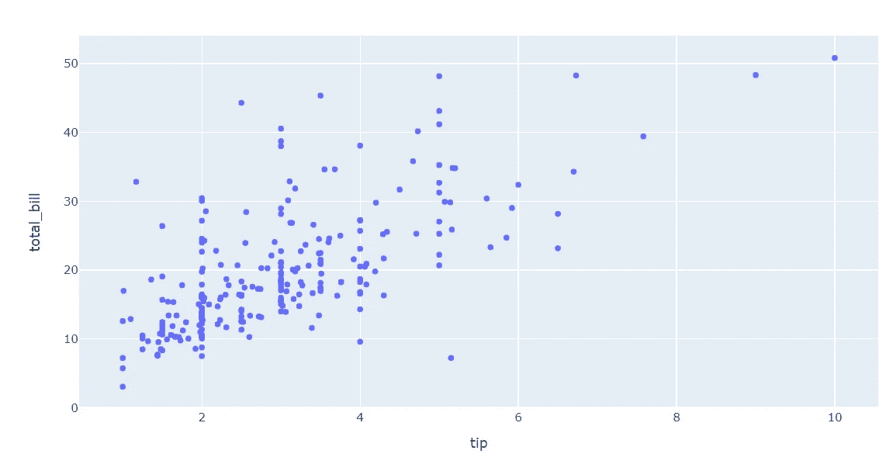
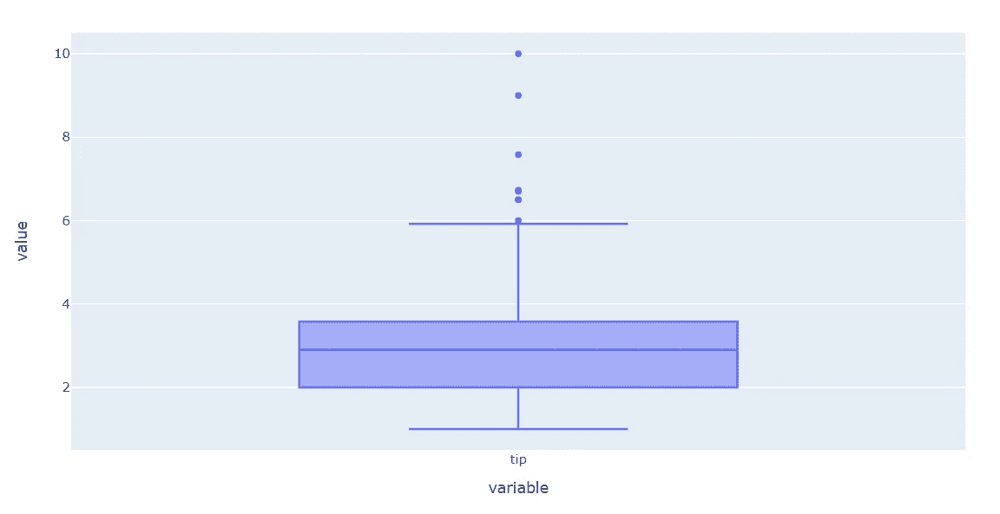
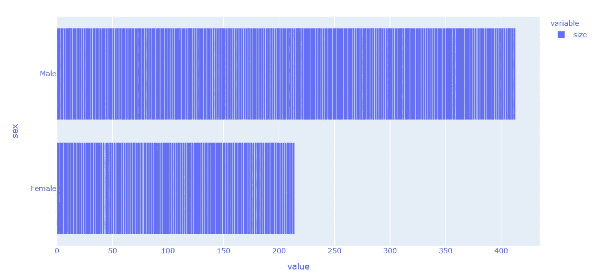
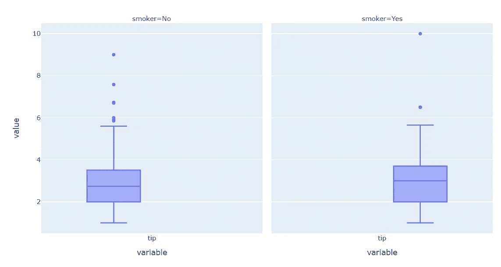

# 轻松互动剧情——熊猫剧情后端

> 原文：<https://towardsdatascience.com/easy-interactive-plot-pandas-plotly-backend-6c9772059515?source=collection_archive---------31----------------------->

## 熊猫系列和数据框架中的一行交互式情节



由 [KOBU 机构](https://unsplash.com/@kobuagency?utm_source=medium&utm_medium=referral)在 [Unsplash](https://unsplash.com?utm_source=medium&utm_medium=referral) 拍摄的照片

熊猫提供了一种探索数据的简单方法(EDA)。一个例子是，我们如何在不导入任何可视化模块的情况下，仅从 Pandas 系列或数据框中创建绘图。我在下面的案例中展示给你看。

```
#I only use seaborn to import sample dataset
import pandas as pd, seaborn as snstips = sns.load_dataset('tips')
tips['tip'].plot(kind = 'hist')
```



仅仅通过使用`.plot`属性，我们就可以默认生成一个 matplotlib 图。不过，在这篇文章中，我要展示的是我们如何用上面类似的线条创建一个交互式的 [plotly](https://plotly.com/) plot。示例结果如下所示。



如果你想了解更多关于熊猫的 EDA，这里有一篇由 [Pararawendy Indarjo](https://medium.com/u/cf29bfb08abb?source=post_page-----6c9772059515--------------------------------) [撰写的文章](/exploratory-data-analysis-eda-visualization-using-pandas-ca5a04271607)很好地涵盖了你可以用熊猫做什么，但在这篇文章中，我将只专注于创建一个互动的情节。

# Plotly

Plotly 是一个模块，可以改善任何可视化，变得更加互动。2020 年 5 月 26 日，Plotly 发布了支持熊猫绘图的 4.8.0 版本。这是一个我个人很兴奋使用的新功能。后端是由 plotly-express 驱动的，这是 plotly 中的另一个包，用于创建快速、交互式的情节。以下是数据分析期间 plotly express 用法的示例。

```
import plotly.express as px
fig = px.histogram(tips['tip'])
fig.show()
```


现在，Plotly 4 . 8 . 0 版提供了一个后端来在 Pandas 系列或数据框中使用它，而不是导入 plotly.express。要实现这一点，您需要首先安装 Plotly 模块。

```
#If you never install Plotly
pip install plotly#If you have install Plotly previously
pip install -U plotly
```

安装了 Plotly 模块后，我们需要首先使用以下代码设置环境。

```
pd.options.plotting.backend = "plotly"
```

这样，我们已经将 pandas plot 后端从默认的 matplotlib 更改为 plotly 模块。让我们尝试我们能创造的各种各样的情节。

*   **散点图**

```
tips.plot.scatter(x = 'tip', y='total_bill')
```



*   **箱线图**

```
tips['tip'].plot.box()
```



*   **水平条形图**

```
#The y axis in the Plotly bar plot is the index, that is why I set up another column as the indextips.set_index('sex')['size'].plot.barh()
```



*   **刻面图**

```
tips[['tip', 'smoker']].plot.box(facet_col = 'smoker')
```



这是通过熊猫 Plotly 后端支持的几个情节。准确的说，目前只有`scatter`、`line`、`area`、`bar`、`barh`、`hist`、`box`剧情可用。如果你想了解更多，你可以参考文档[这里](https://plotly.com/python/pandas-backend/)。

# 结论

在这篇文章中，我只是展示了如何使用 Plotly 从熊猫系列和数据框创建一个简单的互动情节。这个特性在本文创作时还是全新的，但是我相信在将来，这个功能会实现更多我们可以使用的情节。

# 如果您喜欢我的内容，并希望获得更多关于数据或数据科学家日常生活的深入知识，请考虑在此订阅我的[简讯。](https://cornellius.substack.com/welcome)

> 如果您没有订阅为中等会员，请考虑通过[我的推荐](https://cornelliusyudhawijaya.medium.com/membership)订阅。