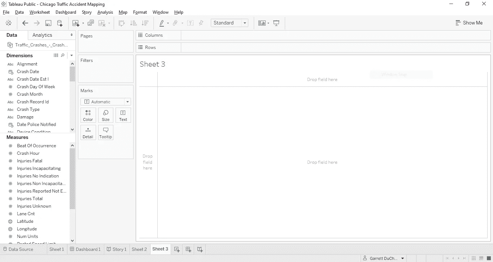
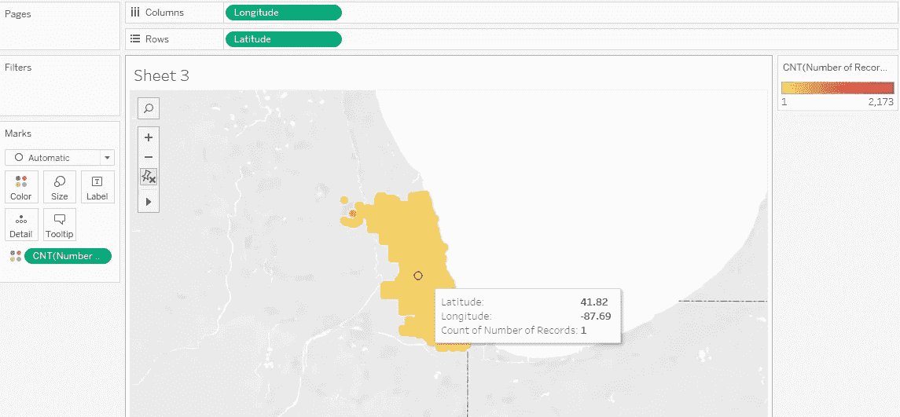
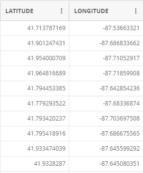
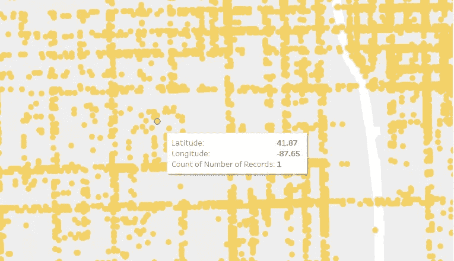
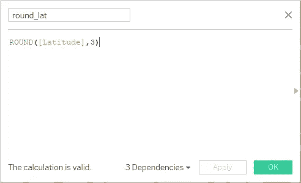
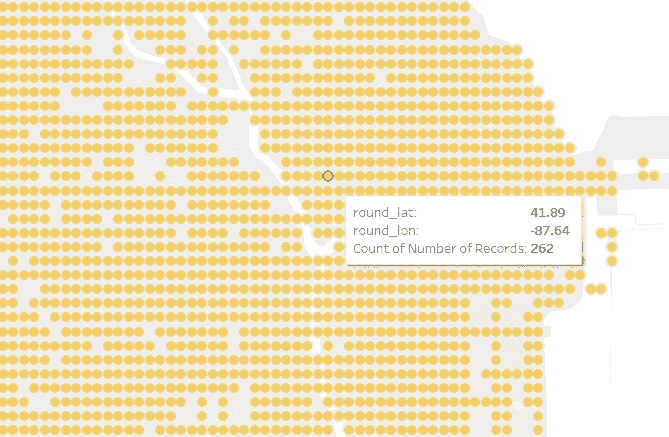
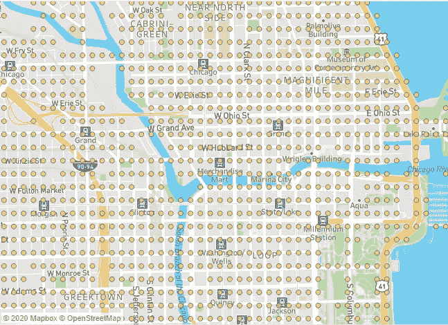
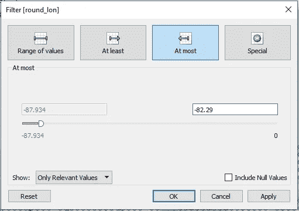
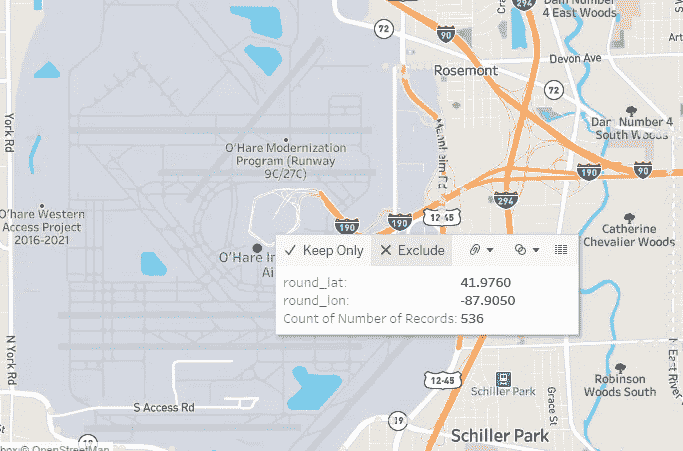
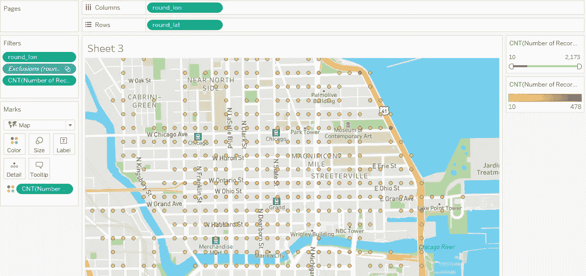

# 用 Tableau 映射芝加哥的交通事故

> 原文：<https://towardsdatascience.com/easy-maps-with-tableau-4f56a8dcff0d?source=collection_archive---------31----------------------->

## 让 Tableau 做繁重的工作。

当探索带有地理标记的数据时，地图是发现重要趋势的最有力的工具之一。Tableau 是创建地图的理想选择，因为它只需几次点击就能提供高质量的描述性可视化效果。在这篇博文中，我将通过使用 Tableau 调查过去几年芝加哥的交通事故来展示它的威力。

## 问题陈述

让我们想象一个假设的场景，芝加哥市已经获得了一项计划的资金，该计划旨在使该市的驾驶条件更加安全。部分预算将用于重新设计事故多发的十字路口和街道。作为参与该项目的数据科学家，您的首要任务是使用城市交通数据来确定哪些区域最需要关注。

## 数据

[芝加哥公共数据门户](https://data.cityofchicago.org/)包含了关于过去几年报道的所有[交通事故](https://data.cityofchicago.org/Transportation/Traffic-Crashes-Crashes/85ca-t3if)的地点和细节的综合数据集。对于每个单独的事故，人们可以找到关于张贴的速度限制、受伤人数、照明条件、天气条件等信息。对我们来说最重要的是，每个事故的位置都以经度和纬度的形式报告。

## 使用 Tableau 查看数据

我们首先需要用 Tableau 读入数据。因为我使用的是 Tableau Public，所以我只是下载了数据并直接连接到 csv 文件。如果您继续操作，在打开一个空白工作表后，您应该会看到下面的屏幕。

包含芝加哥交通事故数据的空白 Tableau 工作表

我们首先简单地分别用经度和纬度填充列和行。因为我们想要每个地点的事故数量，我们可以拿起*记录数量*药丸，并把它放在带有计数测量的标记下。在这个例子中，我还把我的标记改成了金红色，但是这一步是可选的。现在，我们应该有一张地图了！当鼠标悬停在不同的点上时，我们会得到每个位置发生了多少起车祸的信息。

一张简单的地图，标明某一地点的事故数量

太好了！只需点击几下，我们就可以制作地图，现在我们可以开始调查了！对吗？

**错了！**

我们刚做的地图有个大问题。如果您一直在查看芝加哥数据门户上的数据，或者使用 Python 等其他工具，您可能会注意到经度和纬度坐标精确到小数点后 9 位。对于我们要完成的任务来说，这实在是太精确了。

交通事故的原始经度和纬度数据

当你放大并将鼠标放在地图上的不同坐标上时，你会注意到有许多地点发生了事故，但 Tableau 只报告了小数点后 2 位的经度和纬度。

在地图上放大，表明太精确的问题

为了解决这个问题，我们需要使用 Tableau 将我们自己的纬度和经度四舍五入到小数点后三位。如果您以前从未这样做过，请右键单击纬度测量，然后转到创建->计算字段。然后，键入以下内容:

创建四舍五入的纬度测量

一定要对经度做同样的事情。现在，我们可以用我们的新度量取代原来的经纬度药丸，并将其转换为维度。现在，当我们将鼠标放在不同的位置上时，我们将开始看到事故数量的汇总。

地图的放大图，显示了更多的事故总数

## 清理东西

我们现在拥有的地图比我们开始时的地图信息量更大，但它还可以做得更好。首先，它在视觉上不是很吸引人。为了补救这一点，我们可以采取以下措施:

1.)在屏幕顶部的工具栏上，选择地图->背景地图->街道。

2.)在标记下的下拉列表中选择地图选项。你可能也想玩一下大小设置。

更好看的地图

现在，这开始看起来更像一个实际的地图！尽管如此，还是有一些小问题。原来，这个数据集实际上包含了两个被错误标记为经度 0 的点。我们将通过右键单击我们的 *round_lon* 度量并选择 filter 来过滤掉它们。然后，只需将值设置为最接近芝加哥的经度和纬度值。确切的数字并不重要——它只需要不接近 0。

过滤掉经度异常值

接下来，你可能也注意到了在奥黑尔国际机场有大量的事故。如果你曾经在这个机场的上下车区开过车，这可能不会让你感到惊讶。对我们来说，问题是似乎没有任何关于事故可能发生在这个地区的细节。由于我们主要对城市的主要部分感兴趣，我们将从地图中排除这些点。为此，选择奥黑尔中间的点，然后点击“排除”

排除奥黑尔国际机场不需要的点

既然我们已经处理了异常值，我们就快完成了！让我们回到最初的问题陈述。请记住，我们感兴趣的是车祸发生率高的地区。这意味着我们可能不想让我们的视野被所有只有一两个事故的点所遮蔽。为了更容易地查看我们的地图，我们可以引入一个滑动过滤器，允许我们隐藏事故数量低于给定阈值的任何点。通过右键单击事故数量的标记，我们可以选择“显示过滤器”您现在应该在右侧有一个滑动条，这将允许您将地图限制为仅显示在所提供的范围内具有事故数量的点。

带有事故数量过滤器的最终地图

## 摘要

暂时就这样吧！总的来说，Tableau 允许我们通过将经度和纬度拖动到列和行中，几乎立即获得地图的工作版本。通过限制经度和纬度测量的精度，我们能够在统计交通事故数量时执行更具描述性的聚合。最后，我们使用 Tableau 的过滤和排除功能来消除异常值，使事情变得更加动态。

您可以在此处找到本教程[中制作的完整表单。仍然有很多有趣的问题，我们可以通过引入更多的功能来回答这个地图。例如，如果我们想知道不同地点的事故数量每年是如何变化的呢？给定年份内的逐月情况如何？由于特定的天气条件，某些地区会造成更多的事故吗？我鼓励你摆弄这张地图，试着回答这些问题以及你自己的问题！](https://public.tableau.com/profile/garrett.ducharme#!/vizhome/ChicagoTrafficAccidentMapping/Sheet3)