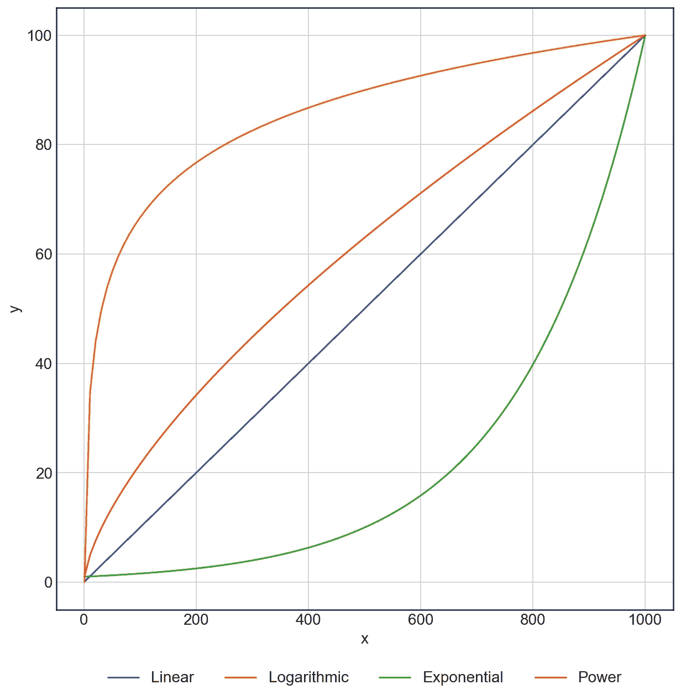
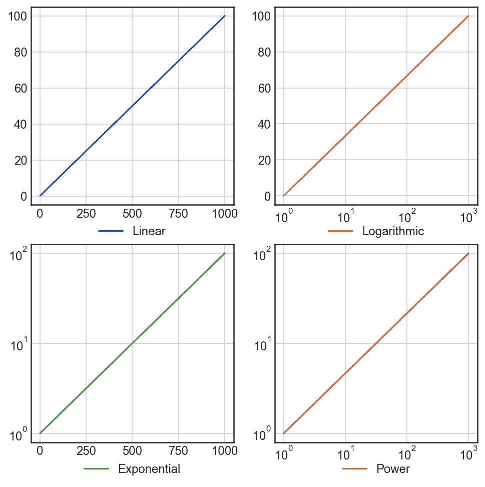
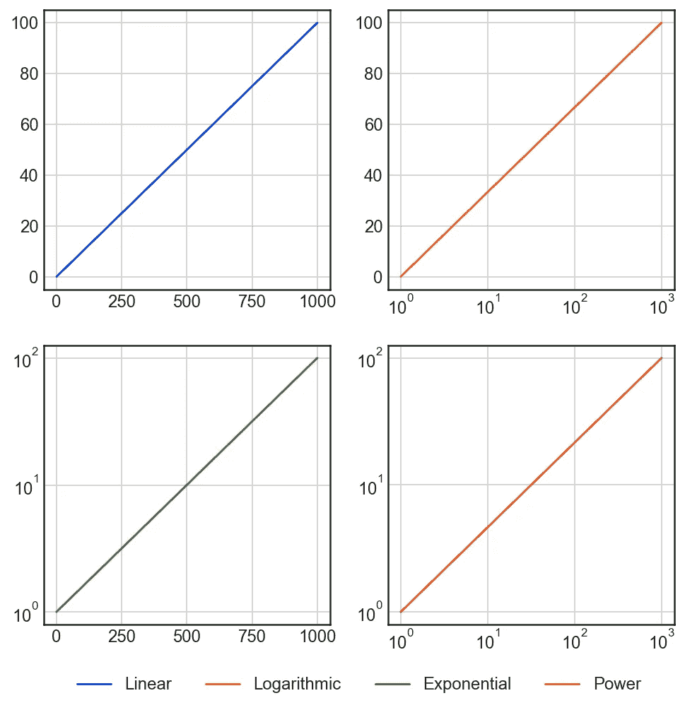

# 带有函数式编程的简易 Matplotlib 图例

> 原文：<https://towardsdatascience.com/easy-matplotlib-legends-with-functional-programming-64615b529118?source=collection_archive---------32----------------------->

## 使用多轴绘图时简化构建 matplotlib 图例的过程

# 介绍

Matplotlib 是标准的 Python 绘图库。它几乎可以完成您可能需要的任何事情，并生成出版物质量的图形。然而，它确实有点冗长。一个例子是，当一个图包含多个轴时，构建一个完整图例所需的代码量。

幸运的是，Python 标准库`itertools`可用于开发一个简单的函数，收集所有轴上的所有标签，将它们组合成一个图例。

# 案例示例

我们来举例说明。考虑以下四个不同函数的数据—线性函数、对数函数、指数函数和幂函数。因为我们将每个函数的截距强制为零(或者指数函数和幂函数的截距为 1)，所以我们可以很容易地计算出每个函数的斜率，即每个函数的斜率值为 *f* ( *x* =1000) = 100。让我们首先导入`numpy`和`matplotlib`并评估我们的函数:

然后我们可以绘制这些图进行比较:

我们四种不同功能的比较

很简单，对吧？但是，如果我们要线性化每一个函数呢？我们可以通过使用对数轴的各种组合来实现这一点。这意味着我们需要将每个函数绘制在它自己的轴上:

每个轴都有自己的图例

好了，我们已经线性化了每个函数…但是我们现在对每个图都有一个图例，而不是一个单独的图例！解决这个问题的标准方法是将每个对`plot()`的调用分配给一个变量，然后在我们调用`plt.legend()`时组合这些变量:

手动累积所有控点和标签会产生所需的图例样式

这是可行的——但是，有几个问题。首先，正如我们在介绍中提到的，它非常冗长。随着我们的情节变得越来越复杂，我们必须分配许多临时变量。其次，我们必须按照图例的正确顺序提供这些。第三，我们必须在对图例的调用中写出标签，而不是在相关行的实际情节调用中保留它们。

# ``chain`功能

那么我们能做什么呢？理想情况下，我们能够以编程方式获得每个轴的序列`handles`和`labels`，组合它们，并将它们传递给`plt.legend()`。`matplotlib`确实有获得`handles`和`labels`的功能！我们可以叫`ax.get_legend_handles_labels()`。不幸的是，我们必须为每个轴调用这个函数，这意味着我们仍然需要编写一个`for`循环，并将`handle`和`label`追加到一个列表中。这意味着我们也需要一种自动获取所有轴的方法…否则，我们只是将手动输入每一行替换为手动输入每一个轴！

幸运的是，`plt.Figure`类确实包含一个`axes`属性，它是轴的序列。但是我们仍然没有解决迭代每个轴的需要。解决方案在于采用函数式编程方法。在命令式编程中，我们编写一个控制结构来循环遍历某个值序列，我们可以使用函数式编程概念来将 [***映射*** 一个函数到那个序列](https://en.wikipedia.org/wiki/Map_(higher-order_function))。`itertools`是这类技术的最佳选择。

`itertools`是一个标准的 Python 库，包含了多个有用的函数。我们将使用`[chain()](https://docs.python.org/2/library/itertools.html#itertools.chain)`，它将多个`Iterable`有效地“组合”成一个`Iterable`(例如，像一个链中的链接)。虽然`chain()`对任意长度的参数序列进行操作，但是如果我们只有一个`Iterable`的`Iterable`呢？那样的话，我们还有另外一个功能，`chain.from_iterable()`。这里有一个简单的例子来说明这些是如何工作的:

我们需要的另一个函数是`zip()`。这个函数接受一个序列`Iterable`并返回一个`Iterable`的`Iterable`，其中第一个`Iterable`是每个参数的第一项，第二个是每个参数的第二项，依此类推。没有`zip.from_iterable()`，但是我们可以使用`*`操作符简单地“拍打”一下`Iterable`。让我们也来举例说明一下:

Python 中的列表理解(在实践中)与`map`相同，所以我们将使用该语言的习语来编写我们的函数。首先，我们得到句柄和标签，这给了我们`[[handle_1, handle_2, ...], [label_1, label_2, ...]]`。

接下来，我们`zip()`将轴 1 的句柄与轴 2、轴 3 等的句柄组合起来。，变成自己的`Iterable`。对于标签也是如此。我们得到类似于`([[handle_1, handle_2, ...], [handle_4, handle_5, ...]], [[label_1, label_2, ...], [label_4, label_5, ...]])`的东西。

最后，我们使用`chain()`将所有句柄组合成一个`Iterable`，将所有`labels`组合成一个`Iterable`，并返回一个`Tuple[handles, labels]`。然后在作业中解包。

如果在函数调用中传递的是一系列轴，而不是一个数字，我们只需添加一个`chain()`来组合`fig`参数和剩余的`args`参数。

让我们把它编码起来:

我们在类型注释中看到，这个函数可以接受*`plt.Figure`或`plt.Axes`的序列。最简单的就是通过数字。然而，如果我们想改变图例中手柄的顺序，我们可以手动传递轴。该函数返回一个字典，然后我们可以使用 splat 操作符(**)将它作为关键字参数解包到`plt.legend()`。让我们使用我们的新功能:*

**

*和以前一样，但是更容易！*

*我们做到了！不管我们创建了多少个轴，我们的函数总是会将每一行添加到我们的图例中。更好的是，我们可以通过在绘制线条时是否提供`label`参数来轻松控制将哪些线条添加到图例中。这大大简化了多轴复杂地块的构建。当我们绘制每条线时，我们可以控制我们所需要的，不需要手动跟踪额外的变量及其顺序。*