# 使用脸书的 DETR 轻松检测物体

> 原文：<https://towardsdatascience.com/easy-object-detection-with-facebooks-detr-d0bd9e4e53a4?source=collection_archive---------40----------------------->

面对宇宙的人。[格雷格·拉科齐](https://unsplash.com/photos/oMpAz-DN-9I)

## 用真实世界的例子简要介绍 DETR

在我之前的一篇[文章](https://medium.com/@mastafa.foufa/why-sweden-could-lose-many-lives-e0babb883bd6)，[昆汀](https://medium.com/u/19d410e584d4?source=post_page-----d0bd9e4e53a4--------------------------------)中，我和我试图从网上废弃的低质量图像中检测出人。为此，我们使用了 Yolo，一个流行的对象检测工具。我们的目标是从摄像机镜头中发现人。不幸的是，正如你在下面的图片中看到的，由于我们图像的质量，我们会错过很多人。

Yolo 在斯德哥尔摩关键区域从[摄像机镜头](http://83.140.123.184/ImageHarvester/Images/copyright!-stureplan_1_live.jpg)中检索一帧并自动检测人员后的输出。我们注意到算法漏掉了一些人。

最近，我看到了脸书研究所的一篇有趣的论文。他们公开提供了 [DETR](https://github.com/facebookresearch/detr) ，代表**检测转换器**，这是一种使用 Pytorch 非常简单的对象检测算法。作为一个 python 迷，Pytorch 里的任何东西都让我开心！🤗

在本文中，我们将快速尝试 DETR 对一些高质量和低质量的图像。

> ***在去 1000 个追随者的路上。*** *保证你跟着我在 AI 空间学习。我将在我的个人旅程中免费分享我所有的学习***。**

## *DETR 概况*

*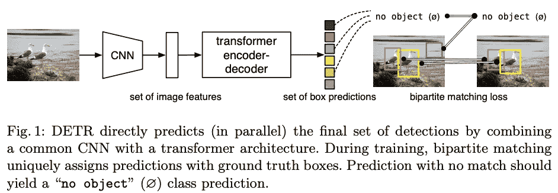*

*[原文第一节图 1 中的 DETR 建筑。](https://scontent-mrs2-1.xx.fbcdn.net/v/t39.8562-6/101177000_245125840263462_1160672288488554496_n.pdf?_nc_cat=104&_nc_sid=ae5e01&_nc_oc=AQk3kU8uNnPtK3avPZa_YIrjOGjQ4DN7Q9e5BoKPI4jN8g3fodtV1OKhc86b5Btzx3K6B6rdr-nQxp8ZIns22jgL&_nc_ht=scontent-mrs2-1.xx&oh=0fbb23957b0b25a8361c3b770d195f9f&oe=5F1A8EC7)*

*DETR 可以检测从人员检测到牙刷检测的 91 类。作者提供的 [colab](https://colab.research.google.com/github/facebookresearch/detr/blob/colab/notebooks/detr_demo.ipynb#scrollTo=IcjUk7RTA3Mu) 中提供了详尽的列表。然而，在这篇文章中，我们将主要关注人物检测，就像我们之前关于瑞典社交距离的[文章](https://medium.com/@mastafa.foufa/why-sweden-could-lose-many-lives-e0babb883bd6)一样。*

*让我们通过一个简单的图像来快速了解 DETR 的力量。我们在 GPU 上遵循以下步骤:*

1.  *实例化 DETR 模型并将其推送到 GPU。*
2.  *定义 DETR 可以检测的类别。*
3.  *加载您的图像并使其正常化。这里要小心，需要是一个形状(800，600)的 RGB 图像。*
4.  *使用 cuda 支持将您的图像推送到 GPU。*
5.  *通过模型转发您的图像，并获得预测:i/预测框，带有检测到的对象在图像中的位置，ii/检测到的 100 个图像中每一个的预测概率。对于后者，我们对于每个检测到的图像，都有对应于每个类别的值的分布。例如，在使用 softwax 函数对其进行归一化之后，我们为每个图像获得大小为(1，N_CLASSES)的向量，其中 N_CLASSES = 91，以及每个类别的概率。输出形状:(100，91)*
6.  *然后我们对前面输出的每一行应用 argmax 来获得类的索引，最大化对象从其中一个类中被提取的概率。请注意，之前使用 Softmax 进行规范化是不必要的，因为我们只对 argmax 感兴趣，即我们的概率向量中关于类的最大概率的索引。输出形状:(100，1)*
7.  *现在我们有了图像中检测到的每个对象的预测类，我们可以在图像上画一个方框来显示该对象及其相关的类。在步骤 5 中，从 DETR 的输出之一中找到这种盒子的坐标。*

*DETR 的作者提供了一个[可乐杯](https://colab.research.google.com/github/facebookresearch/detr/blob/colab/notebooks/detr_demo.ipynb)来展示它的易用性。" DETR 使用标准 ImageNet 规范化，并以[𝑥center，𝑦center，𝑤，ℎ]格式输出相对图像坐标中的框，其中[𝑥center，𝑦center]是边界框的预测中心，而ℎ𝑤是其宽度和高度。因为坐标是相对于图像维度的，并且位于[0，1]之间，所以为了可视化的目的，我们将预测转换为绝对图像坐标和[𝑥0，𝑦0，𝑥1，𝑦1]格式*

## *DETR 在良好和低质量图像上的性能*

*我们修改了 [colab](https://colab.research.google.com/github/facebookresearch/detr/blob/colab/notebooks/detr_demo.ipynb) 中提供的源代码，让一切都可以在 GPU 上工作。你可以看看我们的[可乐布](https://github.com/MastafaF/DETR/blob/main/medium_detr_human_detection.ipynb)并玩玩它。在本节中，我们首先分析 DETR 在高质量图像上的输出。*

*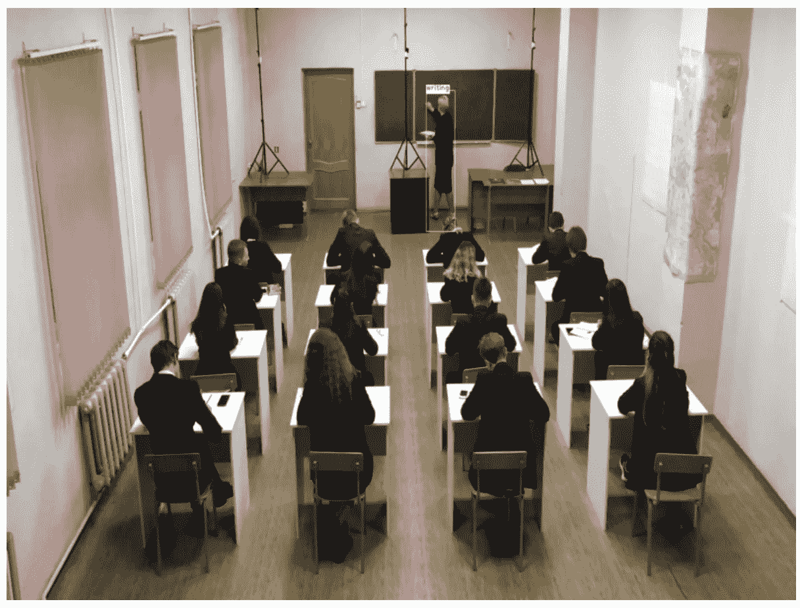*

*原始图像与几个学生和一名教师写作。*

*应用步骤 1 到 7，我们可以用 DETR 检测图像中的物体。*

*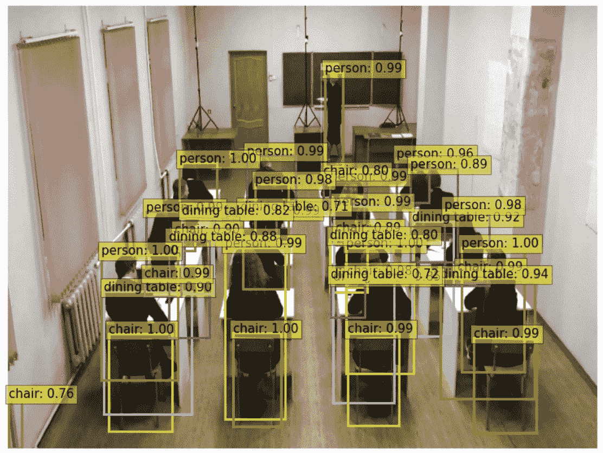*

*检测原始图像中所有 100 个对象时的 DETR 输出。在矩形框的顶部，我们有被检测物体的概率。这个值越接近 1，我们的模型对它的预测就越有信心。*

*现在，人们可以根据目标过滤掉对象。我们的目标是主要关注人物检测。因此，除了前面列出的步骤 1 到 7 之外，我们只需要绘制与标签“person”相对应的方框。*

*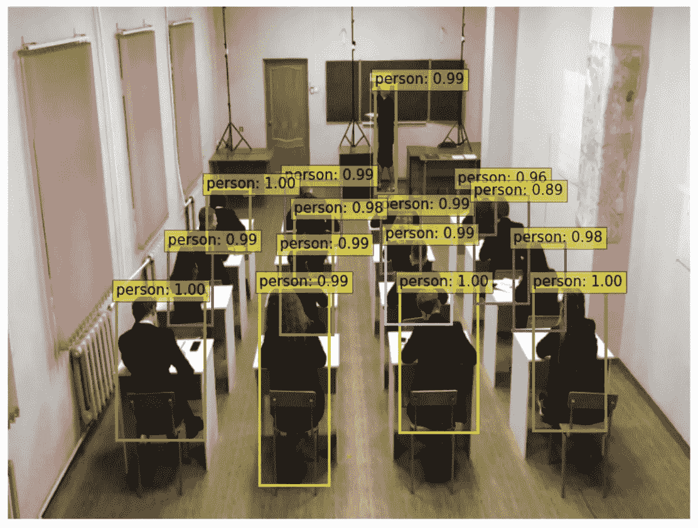*

*DETR 只在原始图像中检测人物时输出。在矩形框的顶部，我们有被检测物体的概率。这个值越接近 1，我们的模型对它的预测就越有信心。我们注意到这个模型对它的预测非常有信心。*

*现在让我们看看 DETR 是如何在摄像机镜头中表现的，这通常对应于低质量的图像。我们决定用两个来自瑞典哥德堡的摄像机镜头的例子来玩。我们从一个例子开始，我可以检测到大约 17 个人。**你自己察觉到有多少人？**🤗*

*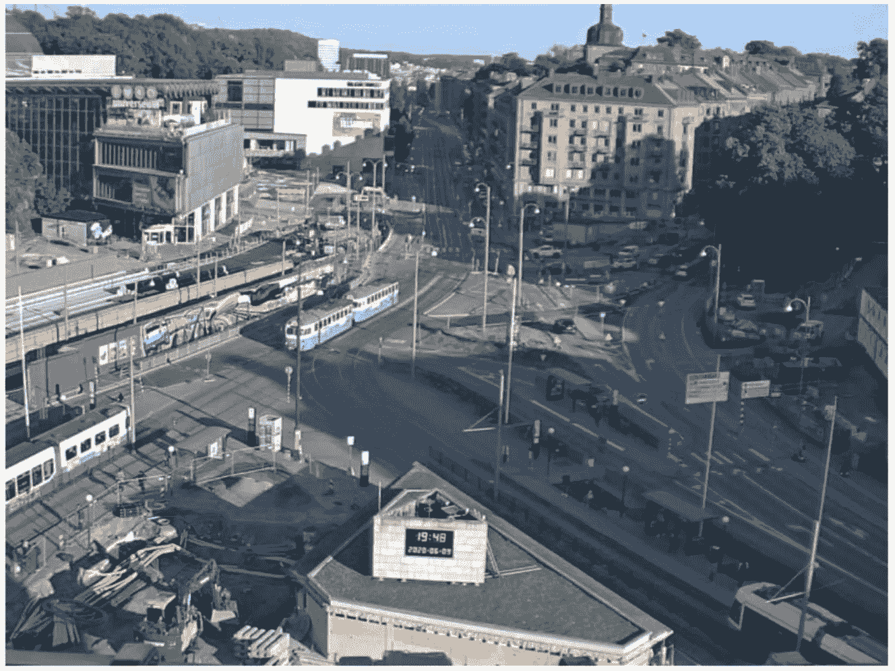*

*瑞典哥德堡的摄像机镜头。我们可以在这个图像中检测到大约 17 个人。*

*我们可以手动检测这类人，如下图所示。然而，在实践中，这将需要大量的时间和努力。因此，像 DETR 这样的工具对于自动人体检测是有用的。*

*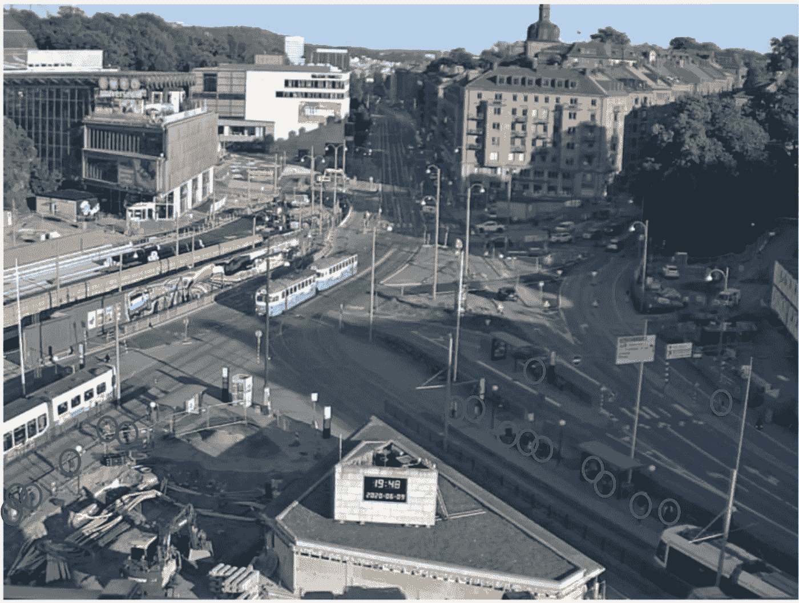*

*瑞典哥德堡摄像机镜头的人工检测。我们可以在这个图像中检测到大约 17 个人。*

*现在，我们想知道我们的模型以足够的信心预测了多少人。可以将这个置信水平作为超参数进行调整(参见我们的 [colab](https://github.com/MastafaF/DETR/blob/main/medium_detr_human_detection.ipynb) 中函数 ***detect*** 中的参数 ***confidence_level*** )。下面，我们展示了 DETR 的两个输出，第一个对应于设置为 70%的置信度。*

*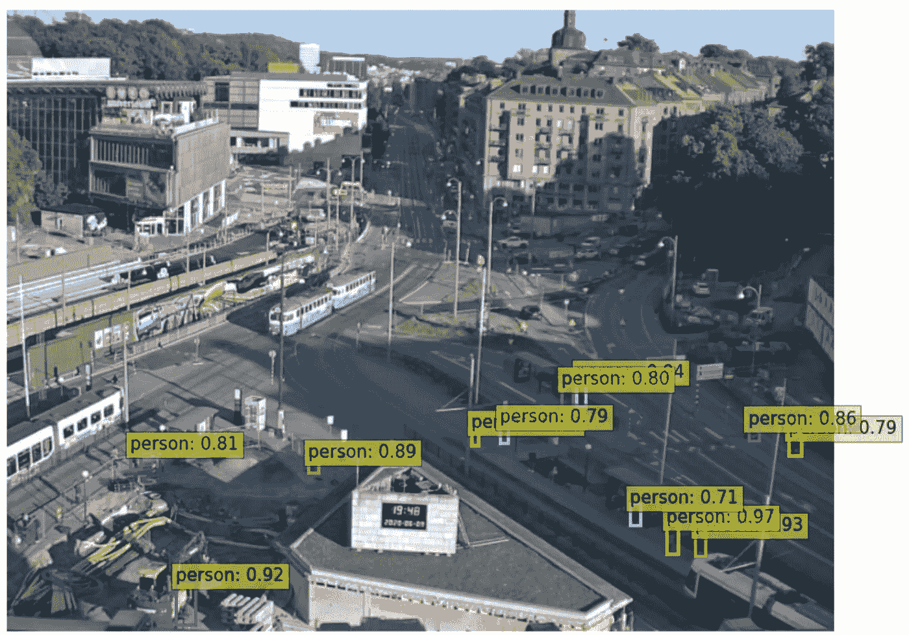*

*我们在哥德堡拍摄的第一个镜头中 DETR 的输出。它检测到 12 个人的置信度高于 0.70。*

*第二输出对应于设置为 10%的较低置信水平。在这种情况下，模型实际上不确定预测，因为它预测对象类的概率至少为 0.10。*

*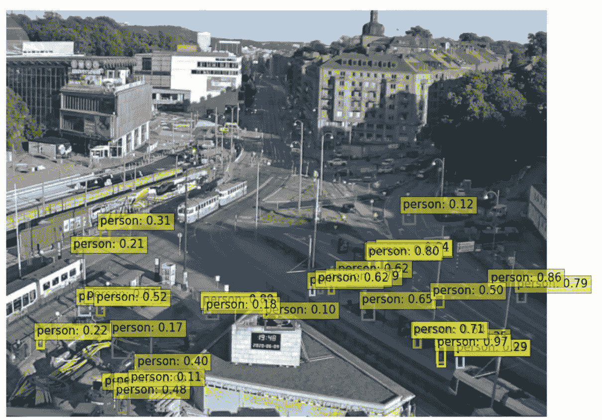*

*我们在哥德堡拍摄的第一个镜头中 DETR 的输出。它检测到了 36 个置信度高于 0.10 的人。*

*我们可以注意到，置信水平，或者对于给定对象检测到某个类别的概率，是一个关键的超参数。事实上，一些错过的人被 DETR 正确地检测到，但是概率低于 0.70。让我们试着看看当我们将置信度设置为 0.60 而不是第一个实验中的 0.70 时的输出。*

*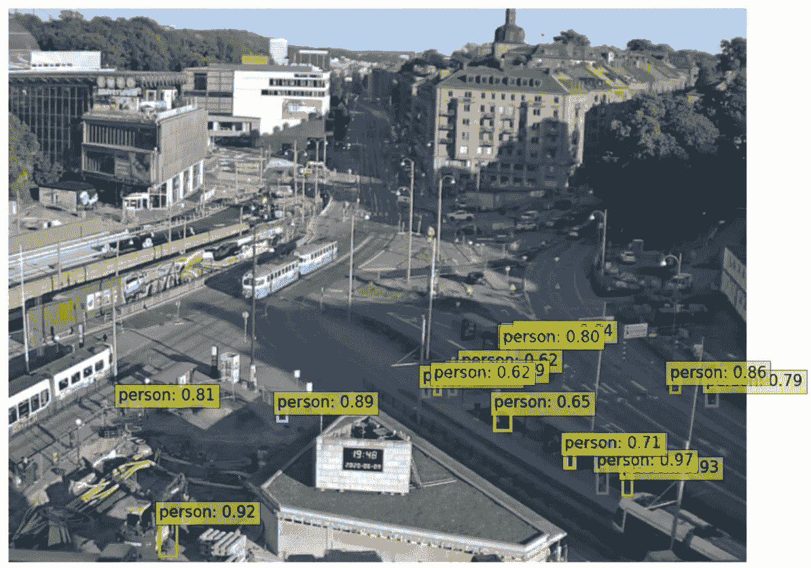*

*我们在哥德堡拍摄的第一个镜头中 DETR 的输出。它检测到了 18 个置信度高于 0.60 的人。*

*我们仍然可以看到，我们的模型预测中存在一些不匹配。让我们用高于 0.70 的置信水平圈出模型没有检测到的对象(人)，并用红叉标出假阳性。*

*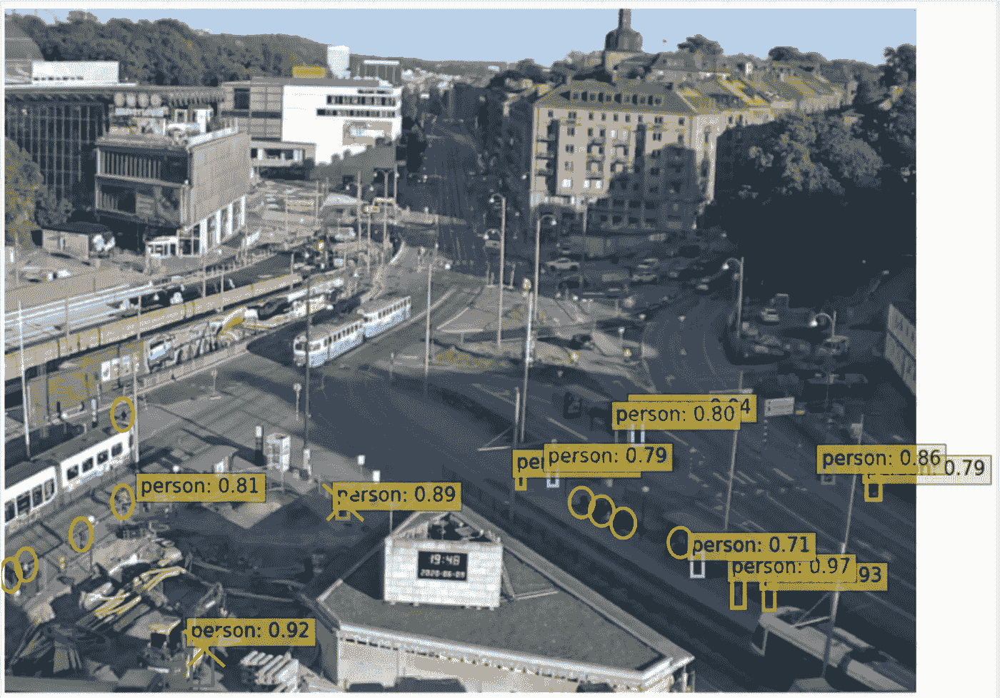*

*我们在哥德堡拍摄的第一个镜头中 DETR 的输出。它检测到 12 个人的置信度高于 0.70。我们手动**圈出**遗漏的人，**红叉出**误报。*

## ***约罗和 DETR 的简单比较***

*正如引言中提到的，在之前的[文章](https://medium.com/@mastafa.foufa/why-sweden-could-lose-many-lives-e0babb883bd6)中，我们与 Yolo 合作，以便在从摄像机镜头中检索的帧中检测人类。正如我们看到的，在人体检测并不困难的帧中，有几个人被遗漏了。因此，现在有必要快速了解一下约罗与 DETR 相比如何。我们决定这样做是基于从摄像机镜头中随机截取的两个画面。*

*这一次，我们将使用 Yolo 的 [Pytorch 实现](https://github.com/ultralytics/yolov3)。我们复制了在他们的实现中提出的对象检测，在这种情况下，我们进行一般的对象检测，而不过滤‘person’类。*

*对于 DETR，我们遵循之前在**DETR 概述**一节中列出的步骤 1-7。*

*首先，我们从在瑞典斯德哥尔摩拍摄的摄像机镜头中检索帧。下面我们可以看到一个低质量的图像，即使对一个人来说，也很难正确地检测到人。*

*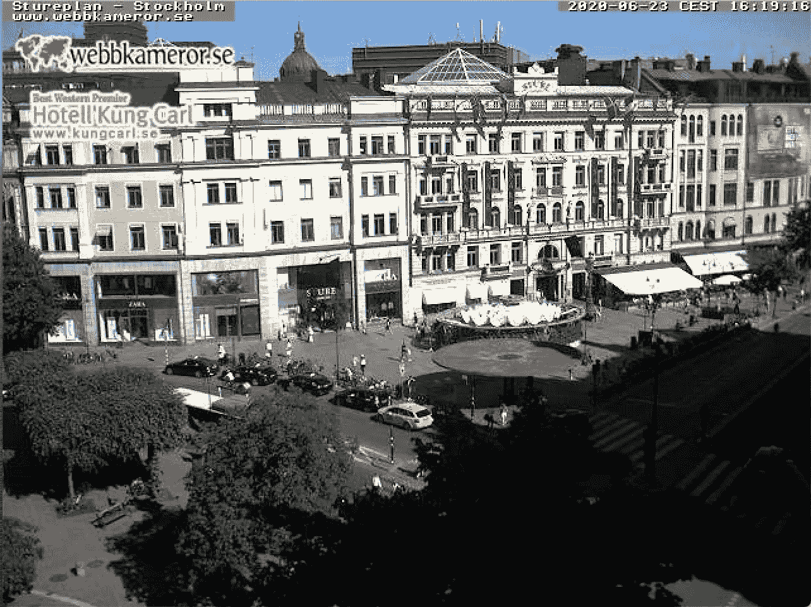*

*原始帧 1。来自斯德哥尔摩的一段录像。*

*我们从使用 [**Yolo**](https://github.com/ultralytics/yolov3) 检测任何物体开始。令人惊讶的是，该算法没有检测到任何人。由于源代码不够清晰，我保持检测原样。如果您在建议的代码中发现任何明显的问题，请告诉我！🤗*

*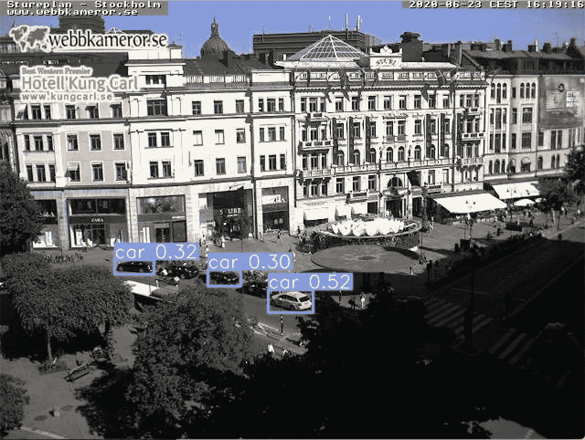*

*框架 1。在斯德哥尔摩用 Yolo 进行物体探测的镜头。*

*现在，让我们使用 **DETR** 进行‘人体检测’。这一次，非常容易，人们可以立即看到如下所示的结果，最低置信度设置为 0.70。*

*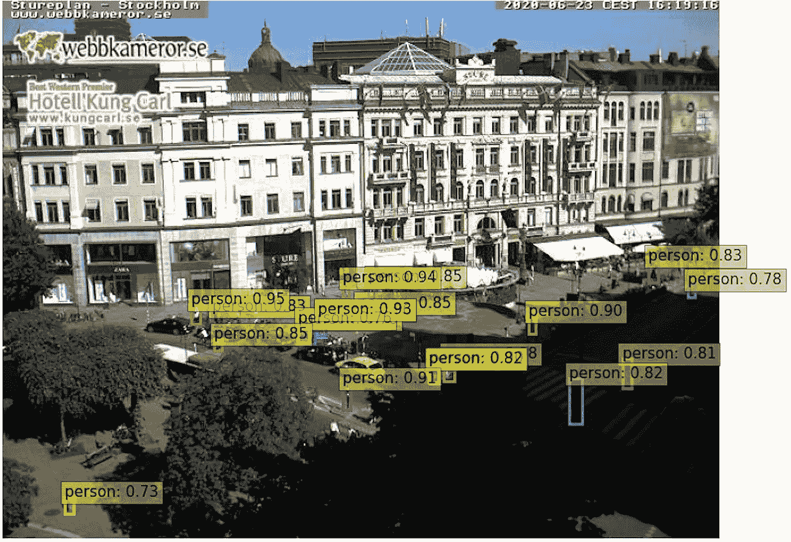*

*框架 1。在斯德哥尔摩用 Yolo 进行人体探测的镜头。*

*我们用如下所示的另一个框架来重现相同的实验。*

*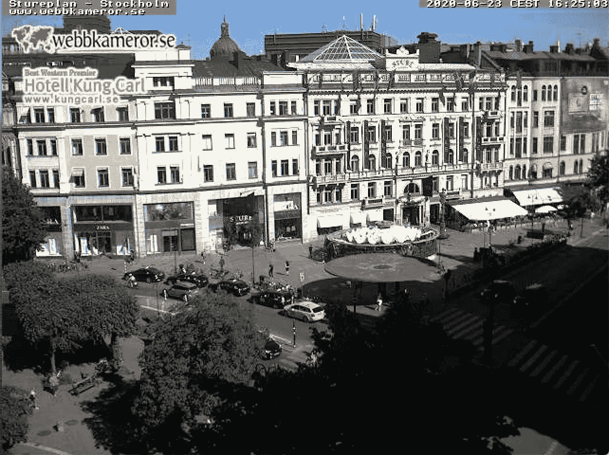*

*原始帧 2。来自斯德哥尔摩的一段录像。*

*这次 Yolo 检测到一个人的概率是 0.32。我们并不确切知道为什么在这样的帧中没有检测到额外的物体。我们还可以注意到，检测到的人是不匹配的。基于此，应该使用具有不同权重参数的不同架构。在以后的文章中，我们可能会考虑此类任务的其他参数。*

*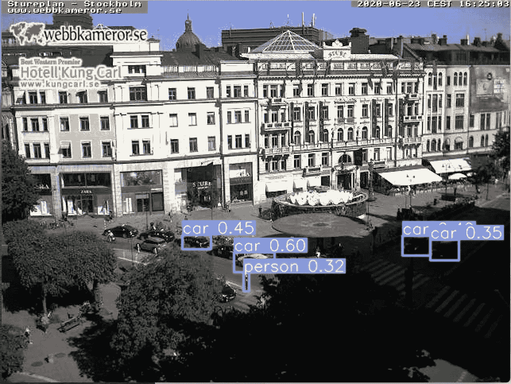*

*框架 2。在斯德哥尔摩用 Yolo 进行物体探测的镜头。*

*另一方面，如下图所示，DETR 在人体检测任务中表现出色。*

*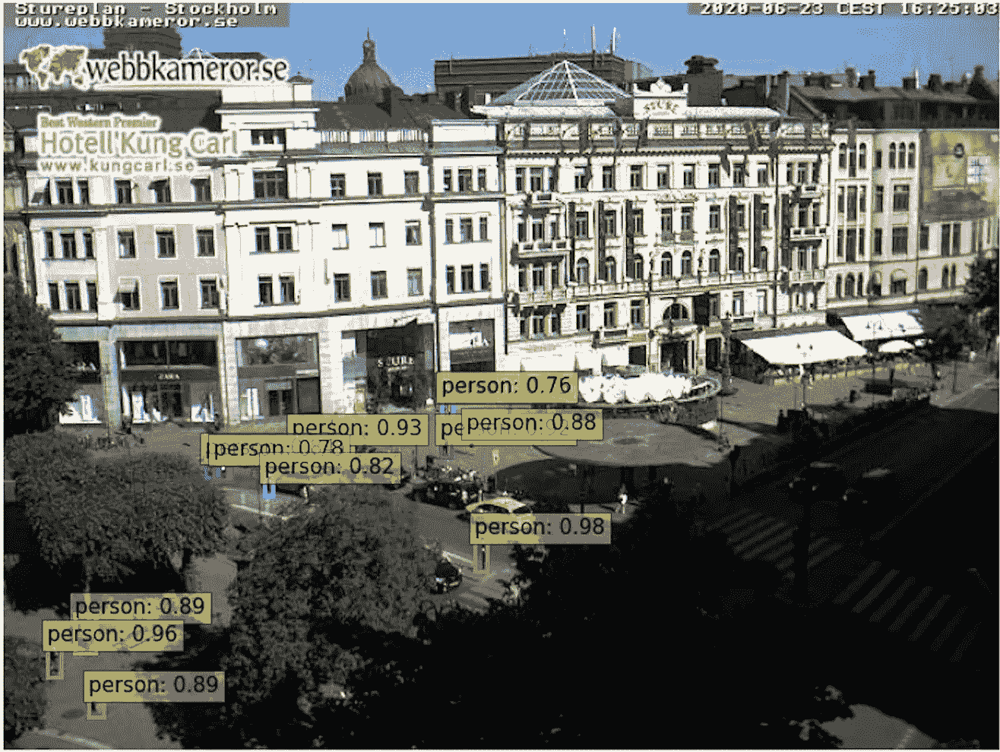*

*框架 2。在斯德哥尔摩用 Yolo 进行物体探测的镜头。*

*显然，这样的实验不够严谨。人们应该建立一个更大的标记图像数据集，并在其上比较这两种架构。脸书的研究人员做了更彻底的分析。下面，我们报告他们论文中的一个比较表，其中我们可以看到 DETR 与更快的 R-CNN、ResNet-50 和 ResNet-101 的性能比较。*

*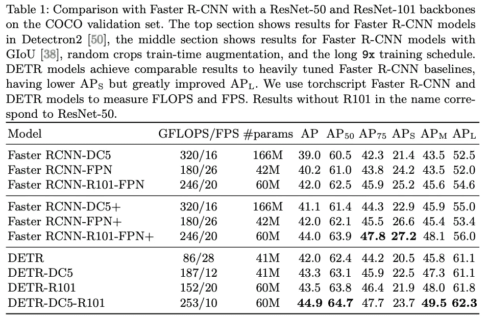*

*[论文](https://scontent-mrs2-1.xx.fbcdn.net/v/t39.8562-6/101177000_245125840263462_1160672288488554496_n.pdf?_nc_cat=104&_nc_sid=ae5e01&_nc_oc=AQk3kU8uNnPtK3avPZa_YIrjOGjQ4DN7Q9e5BoKPI4jN8g3fodtV1OKhc86b5Btzx3K6B6rdr-nQxp8ZIns22jgL&_nc_ht=scontent-mrs2-1.xx&oh=0fbb23957b0b25a8361c3b770d195f9f&oe=5F1A8EC7)第 4 节中的表 1:“使用变压器的端到端对象检测”。*

## *结论*

*在本文中，我们快速介绍了 DETR，这是一种非常容易使用的人体检测算法。然后，我们看到了它在好的和低质量的图像上的整体表现。最后，我们比较了 DETR 和一个叫做 Yolo 的流行算法。*

*总的来说，这篇文章只是对 DETR 的一个粗浅的介绍。关于算法的更多信息可以通过阅读[研究论文](https://scontent-mrs2-1.xx.fbcdn.net/v/t39.8562-6/101177000_245125840263462_1160672288488554496_n.pdf?_nc_cat=104&_nc_sid=ae5e01&_nc_oc=AQk3kU8uNnPtK3avPZa_YIrjOGjQ4DN7Q9e5BoKPI4jN8g3fodtV1OKhc86b5Btzx3K6B6rdr-nQxp8ZIns22jgL&_nc_ht=scontent-mrs2-1.xx&oh=0fbb23957b0b25a8361c3b770d195f9f&oe=5F1A8EC7)和访问 [github repo](https://github.com/facebookresearch/detr) 找到。看看最初的 [colab](https://colab.research.google.com/github/facebookresearch/detr/blob/colab/notebooks/detr_demo.ipynb#scrollTo=bawoKsBC7oBh) 和我们为这篇文章改编的 [one](https://github.com/MastafaF/DETR/blob/main/medium_detr_human_detection.ipynb) 。*