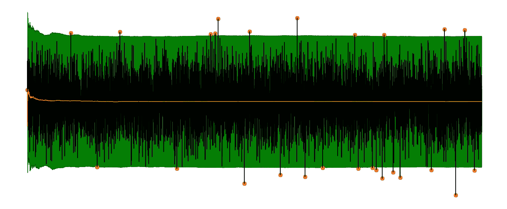
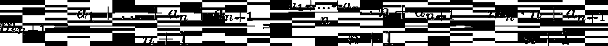
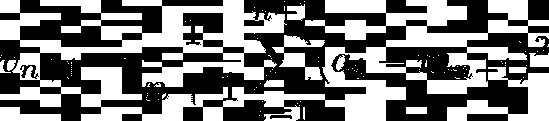
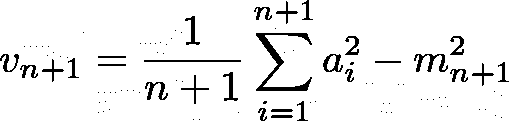
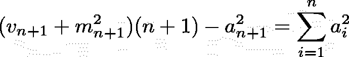
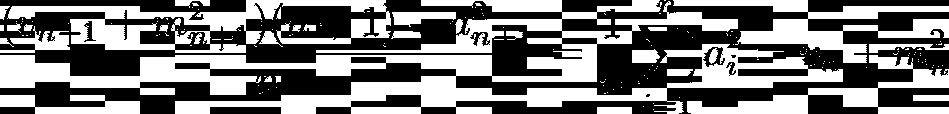
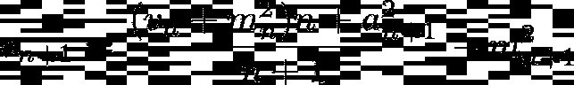
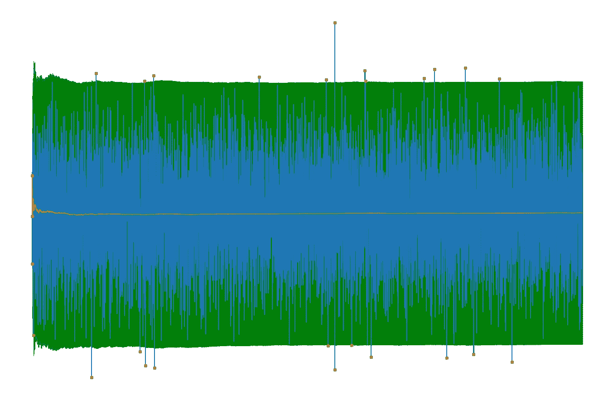
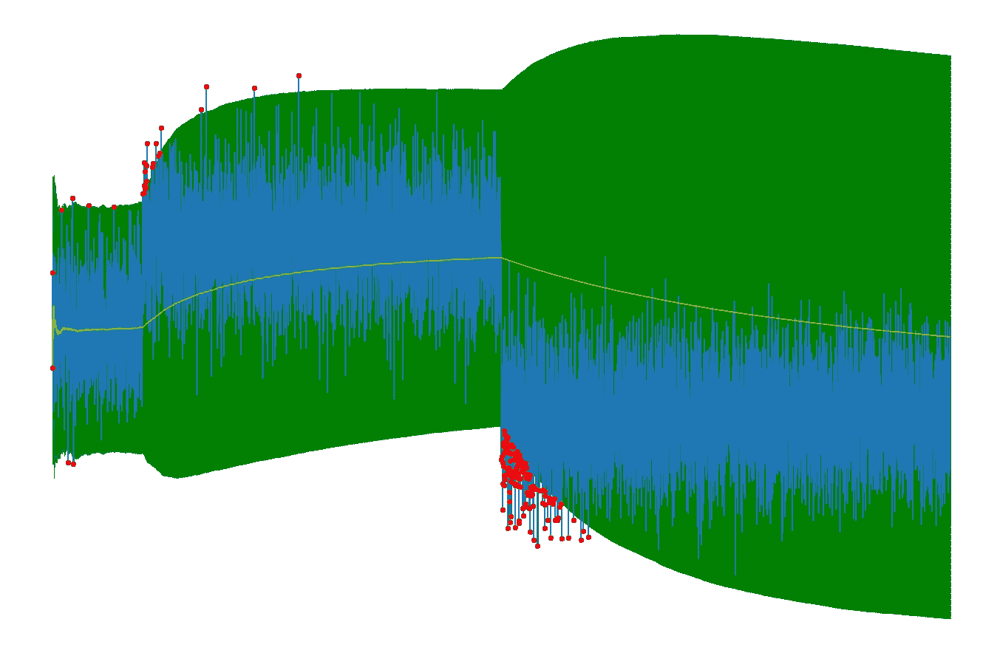

# 数据流中的简单异常检测

> 原文：<https://towardsdatascience.com/easy-outlier-detection-in-data-streams-3089bfefe528?source=collection_archive---------15----------------------->

## 一种在数据流中寻找异常值的简单方法及其 Python 实现



在我的上一篇文章中，我已经解释了[流算法](/introduction-to-streaming-algorithms-b71808de6d29)的概念，并给出了许多如何应用它们的例子。其中之一是计算数据流的滚动平均值，而不保存数据流中的元素。现在，我想扩展这个例子，并向您展示在*异常值检测*环境中的另一个流算法用例。

当我们监控机器的功耗以检测任何异常行为时，就会出现这样的问题。如果我们看到异常值增加(不寻常的观察)，这可能是这台机器的一个默认指标，可能值得检查。

# 定义和示例

离群值可以用多种方式定义。在本文中，我们将使用以下定义:

> 如果一个数字数据流中的一个元素不在目前所见元素平均值的 3 个标准偏差之内，则该元素被视为异常值。

这需要举一个小例子。让我们假设我们按这个顺序得到数据 3，2，4，3，5，3，2，10，2，3，1。让我们进一步假设我们**从零**的均值和方差(以及标准偏差)开始，即如果不等于零，第一个元素将总是被视为异常值。

所以， **3 被认为是离群值**，因为 *3 > 0+3*0。*现在我们根据目前看到的元素更新均值和方差，只有数字 3。因此**新均值为 3，方差为 0** 。

然后我们看到一个 2。我们有 *2 > 3+3*0，*所以 **2 也被认为是异常值**。这是有道理的，因为到目前为止我们只看到了一个 3，所以任何其他数字都不符合该模式。**平均值更新为*(3+2)/2 = 2.5****，方差更新为*((3–2.5)+(2–2.5))/2 = 0.25*，这意味着**标准差为 0.5** 。*

*现在我们看到一个 4。由于 2.5–3 * 0.5≤4≤2.5+3 * 0.5，因此该数字**不是异常值**(即*正常值*)。**平均值更新为(3+2+4)/3=3** ，方差更新为((3–3)+(2–3)+(4–3))/3 = 2/3**，**，因此**标准偏差约为 0.81** 。*

*以下数字 3、5、3 和 2 被认为是正常的*。凭直觉，我们会认为下面的数字 10 又是一个异常值。让我们看看算法是做什么的。此时的平均值约为 3.1，标准偏差约为 1。因为 *10 > 3.1+3*1* ，10 被认为是一个异常值，正如我们所希望的。**

*如果你继续最后 3 个元素，你会看到它们都是正常的。*

***问题:**要计算均值和标准差，我们得把目前看到的所有元素都背下来。如果我们有一个每天输出成千上万个元素的系统，这不是一个选项。*

# ***拯救流媒体算法***

*解决这个问题的一种方法是使用流算法，该算法在数据流的每个扫描元素之后更新其内部状态。内部状态由迄今为止在任何点看到的所有元素的均值和方差组成，在看到任何元素之前，从均值和方差为零开始。准确的说，让 *mₙ* 为均值 *vₙ* 为看到数据流的第 *n* 个元素后的方差，附加定义 *m₀=v₀=0* 。*

## *计算平均值*

*在我关于[流算法](/introduction-to-streaming-algorithms-b71808de6d29)的文章中，我们已经看到了如何仅使用旧的平均值、正在扫描的最新元素以及迄今为止看到的元素数量来更新平均值。这意味着我们在任何时候都只需要用这种方法存储**两个**数字，而不是像简单方法那样存储 *n 个*。让我再展示一次，将数据流的第 *i* 个输入元素表示为 *aᵢ:**

**

*这个公式不难开发，对吗？有了它，我们就有了预期元素大小的基线。现在，我们只需要标准偏差，我们可以将平均值分为异常值和正常数据点。我们通过计算方差，然后求它的平方根来得到标准差。*

## *计算方差*

*在这种情况下，我们也可以毫不费力地找到一个递归公式。首先，看到 *n* 个元素后的方差如下所示*

**

*让我们试着用 *n* 、 *vₙ、*和最新的元素再写一遍。因为方差取决于平均值，我们也想包括 mₙ.在我们开始之前，让我们重新安排一下这个公式，让事情变得简单一些:*

**

*现在，我们的目标是把 vₙ放进去。一种方法是从下面的简单重排开始，分离平方和，直到索引 *n* ，它也作为术语出现在 *vₙ* 中:*

**

*这相当于*

**

*这反过来导致*

**

*现在，我们有了公式，让我们看看它在 Python 中是如何工作的！*

# *用 Python 实现*

*我们可以通过以下方式实现上述解释:*

```
*class StreamingMeanAndVariance:
    def __init__(self):
        self.mean = 0
        self.variance = 0
        self.n_elements = 0

    def update(self, element):
        self.variance = ((self.variance + self.mean ** 2) * self.n_elements + element ** 2) / (self.n_elements + 1)
        self.mean = ((self.mean * self.n_elements) + element) / (self.n_elements + 1)
        self.variance = self.variance - self.mean ** 2
        self.n_elements += 1*
```

*注意:`update`方法的第一行计算方差，但是**没有减去当前的均方值。**第二行，计算当前平均值。在第三行中，从方差中减去它，因为它在第一行中仍然缺失。*

*为了使用它，我们做到了*

```
*import numpy as np

m = StreamingMeanAndVariance()
n = 10000

for i, s in enumerate(np.random.randn(n)):
    if not - 3 <= (s - m.mean) / np.sqrt(m.variance) <= 3:
        print(i, s)
    m.update(s)*
```

*这将扫描数据流，该数据流在本例中由 10000 个正态分布的数字组成(我们将其表示为 ***N* (0，1)** )，并在异常值出现时打印出来。*

*如果您将正常点的间隔与平均值(黄色)一起绘制，您将得到下图:*

**

*用蓝色，你可以看到测量结果。绿色区域包含正常点，其外的测量值(以红色表示)被视为异常值。在黄色部分，您可以看到期望值(平均值)。*

# *讨论*

*算法做了我们期待的事情！然而，到目前为止，我们没有看到它是如何处理分布的变化的，而只是在任何时候都是标准的正态分布的数字。*

*让我们测试算法在执行以下操作时的表现:*

*   *经过 10%的观察，我们将分布从 *N* (0，1)转移到 *N* (2，1)*
*   *在另一个 40%之后，我们将分布从 *N* (2，1)转移到 *N* (-2，1)*

*结果看起来像这样:*

**

*一切都在慢慢适应新数据。*

## *好人*

*这看起来很有希望！一切都会自动适应新数据。当数据的均值从 0 转移到 2 时，我们可以看到许多异常值，这是有意义的。新平均值 2 的观测值越多，检测到的异常值就越少，因为大约 2 *是新的常态*。*

*当将平均值从 2 改为-2 时，我们可以看到更多的异常值，因为变化要严重得多。到目前为止，一切顺利。*

## *坏事*

*如果你看图的右半部分，你可以看到对新数据的适应相当缓慢。一段时间后，平均值和标准差将再次达到正确水平，正如您所看到的，因为黄线(平均值)下降，绿色区域也再次变窄。但是直到它变平，没有异常值被检测到。*

*为了解决这个问题，我们只能使用最后的 *k 个*样本来计算平均值和标准偏差，因为这打破了第一次测量的影响。如果我们将 k 设为无穷大，我们就可以得到之前的算法。*

*我们设定的 *k* 越低，算法适应新数据的速度就越快。然而，将 *k* 设置得过小可能会导致丢弃异常值，因为算法认为新数据*就像这个*。在设置 *k=1 的极端情况下，*没有元素被认为是异常值，因为只考虑最新的元素。*

*根据不同的使用情况，也许几百或几千应该没问题。*

# *结论*

*在本文中，我们看到了如何为数据流构建一个非常简单的异常检测机制。我们的算法不需要存储所有的测量值，这使得它非常容易应用，也可以在极其有限的硬件上应用，并且只需要恒定的存储。该算法甚至可以适应数据的变化，因此无需手动更新。*

*唯一需要调整的是适应率，我们在本文中没有涉及到，但这是一件容易的事情。*

*我希望你今天学到了新的、有趣的、有用的东西。感谢阅读！*

***作为最后一点，如果你***

1.  ***想支持我多写点机器学习和***
2.  ***无论如何都计划获得一个中等订阅，***

***为什么不做** [**通过这个环节**](https://dr-robert-kuebler.medium.com/membership) **？这将对我帮助很大！😊***

**说白了，给你的价格不变，但大约一半的订阅费直接归我。**

*非常感谢，如果你考虑支持我的话！*

> **如有问题，在*[*LinkedIn*](https://www.linkedin.com/in/dr-robert-k%C3%BCbler-983859150/)*上写我！**