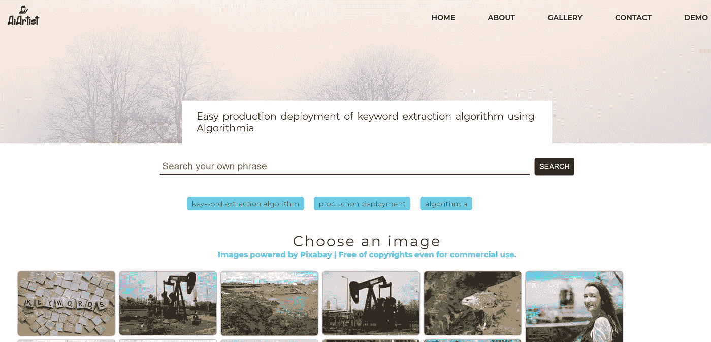
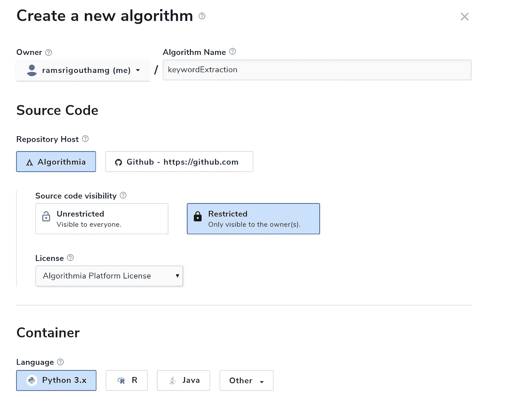
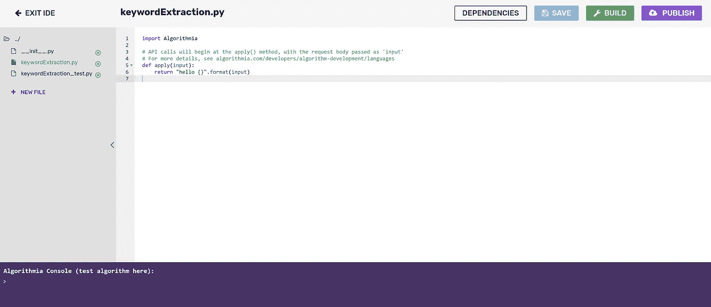
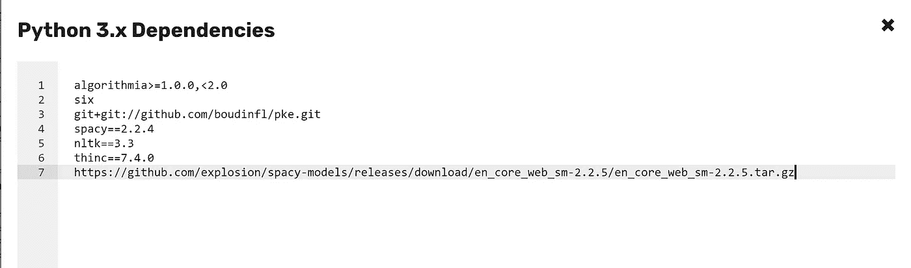
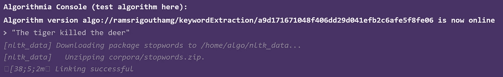
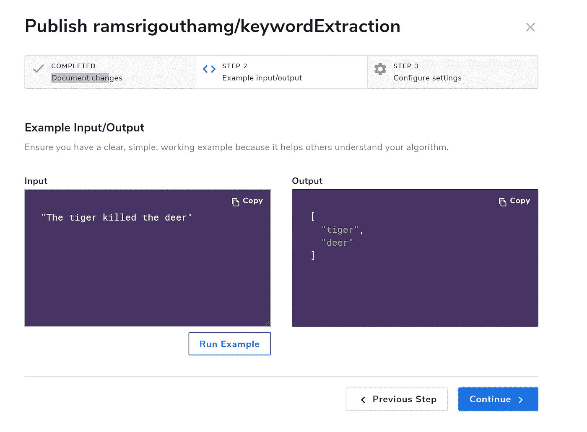
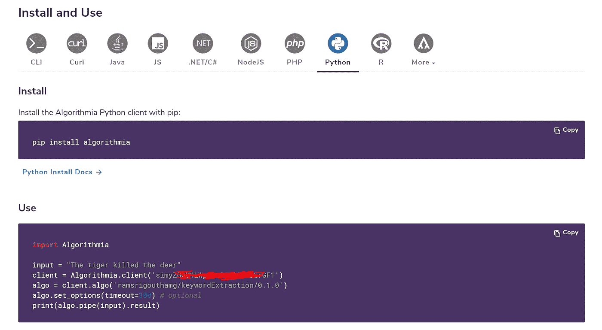
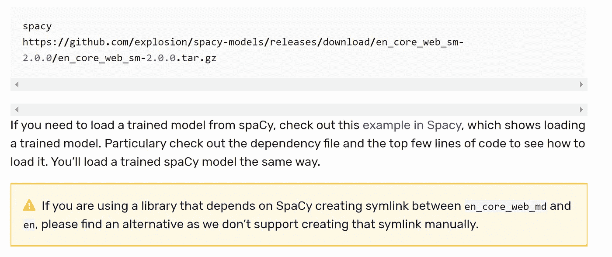

# 使用 Algorithmia 轻松实现关键字提取算法的生产部署

> 原文：<https://towardsdatascience.com/easy-production-deployment-of-keyword-extraction-algorithm-using-algorithmia-f5dfc231832a?source=collection_archive---------42----------------------->

## 基于 Algorithmia 的关键词抽取 NLP 模型的无服务器生产部署


图片来自 [Pixabay](https://pixabay.com/) 并由[艺术 Chrome 插件](https://chrome.google.com/webstore/detail/aiartist/odfcplkplkaoehpnclejafhhodpmjjmk)风格化

最近，我发布了我的副业项目 [AiArtist](https://chrome.google.com/webstore/detail/aiartist/odfcplkplkaoehpnclejafhhodpmjjmk) ，这是一个 chrome 扩展，可以自动为任何给定的故事或文章建议无版权的图片。构建广告的一个关键部分是从任何文本中提取关键字并将其部署到产品中。

今天我们将看到我如何使用 [Python 关键短语提取库](https://github.com/boudinfl/pke)，Spacy 来开发一个关键词提取算法，并使用 [Algorithmia](https://algorithmia.com/) 以无服务器方式将其部署到生产中。



自动建议图像

这篇文章的主要图片是由 AiArtist 通过给出文章的标题**自动建议的。**

让我们开始吧:

## 投入

算法的输入将是一些我们从中提取关键字的文本。例如:

```
Ahead of its mid-2020 world premiere, the first set of images of the updated Fortuner has surfaced online. While the Fortuner facelift's India launch is still some time away, these images give us a clear idea of what to expect from the mid-cycle update of Toyota's popular SUV.With this update, the Toyota Fortuner gets cosmetic restyling at the front, with a bumper and grille design that's now in line with newer Toyota SUVs like the RAV4 and Raize. The grille is a lot slimmer and has glossy black bits instead of the chrome trim, and the bumper is more pronounced with triangle-shaped faux air intakes on each corner. Also, the headlight shape seems to be mildly altered with new inserts that make the refreshed Fortuner look sharper than the pre-facelift version. The gloss-black finish on the skid plate completes the visual update for the SUV. The Fortuner facelift is also expected to get styling tweaks to the rear, including a mildly restyled bumper and tail-lamp inserts. There is no news on the interior upgrades for the updated Fortuner but it is safe to expect a better infotainment system and some minor changes. As far as engines go, Toyota sells the Fortuner with multiple petrol and diesel options globally, and the list includes 2.7 and 4.0-litre petrol engines, and diesel engines with 2.4, 2.8- and 3.0-litre displacements, depending on the market.
```

## 输出

输出将是文章中的关键字列表:

```
[ "fortuner",   "bumper",   "toyota",   "update",   "grille design",   "toyota suvs" ]
```

## 在 Algorithmia 上部署

登录 [Algorithmia](https://algorithmia.com/) 并点击仪表板中的**创建新算法>算法**。输入一个算法名，例如:**关键字提取，**保留所有默认设置，点击**创建新算法。**



Algorithmia 仪表板

一旦创建了算法，点击**源代码**选项卡。您将被带到如下所示的 IDE



源代码集成开发环境

在自动创建的关键字 Extraction.py 中输入下面的代码。

单击依赖项选项卡，输入以下内容，然后单击保存依赖项—

```
algorithmia>=1.0.0,<2.0
six
git+git://github.com/boudinfl/pke.git
spacy==2.2.4
nltk==3.3
thinc==7.4.0
[https://github.com/explosion/spacy-models/releases/download/en_core_web_sm-2.2.5/en_core_web_sm-2.2.5.tar.gz](https://github.com/explosion/spacy-models/releases/download/en_core_web_sm-2.2.5/en_core_web_sm-2.2.5.tar.gz)
```



在 IDE 的主控制台中点击**保存**，并点击**构建**。你会看到算法版本 XXXXX 现在在线。现在输入任何示例文本，例如:**“老虎杀死了鹿”**，并查看关键字 **[“老虎”、“鹿”]** 的输出



现在你的算法可以工作了，可以发布了。点击**发布。**

在发布工作流程中输入所有细节，如输入/输出，然后最后点击**发布版本 x.x.x** 。



现在你的算法已经可以使用了。您可以在双引号之间输入任何文本，并点击**运行示例**查看输出。

你可以使用任何编程语言并通过 API 调用算法，如**安装和使用**部分所示-



您已经正式将一种高效的关键字提取算法以无服务器的方式部署到生产环境中。恭喜你！

## 注意事项:

1.  我只从文章中提取名词关键词。您可以相应地更改代码来提取其他词类关键字。
2.  PKE 图书馆使用 spacy.load('en ')在内部加载 spacy 英语模型。但是 Algorithmia 并不像他们博客中提到的那样支持它。

如果您使用的库依赖于在`en_core_web_md`和`en`之间创建符号链接的空间，请找到一个替代库，因为我们不支持手动创建该符号链接



但是我们通过在 Spacy 代码中动态链接" **en_core_web_sm** "到" **en** "巧妙地解决了这个问题。

```
# Link spacy code
import spacy
model_name = "en_core_web_sm"
from spacy.cli import link
from spacy.util import get_package_path
package_path = get_package_path(model_name)
# print (package_path)
link(model_name, "en", force=True, model_path=package_path)
```

# 使用自然语言处理的问题生成——教程

我推出了一个非常有趣的 Udemy 课程，名为“使用 NLP 生成问题”,扩展了这篇博文中讨论的一些技术。如果你想看一看，这里是[链接](https://www.udemy.com/course/question-generation-using-natural-language-processing/?referralCode=C8EA86A28F5398CBF763)。