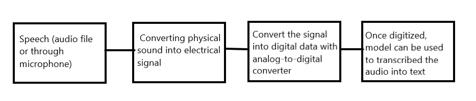

# 使用 Python 实现简单的语音到文本转换

> 原文：<https://towardsdatascience.com/easy-speech-to-text-with-python-3df0d973b426?source=collection_archive---------1----------------------->

## 语音转文本

亚历山大·佩莱斯在 [Unsplash](https://unsplash.com/s/photos/speech?utm_source=unsplash&utm_medium=referral&utm_content=creditCopyText) 上拍摄的照片

语音是最常见的交流方式，世界上大多数人依靠语音相互交流。语音识别系统基本上将口头语言翻译成文本。有各种语音识别系统的实际例子。例如，苹果 SIRI 可以识别语音并将其截断为文本。

# 语音识别是如何工作的？

语音识别过程

隐马尔可夫模型(HMM)，深度神经网络模型用于将音频转换成文本。完整详细的过程超出了本博客的范围。在这篇博客中，我演示了如何使用 Python 将语音转换成文本。这可以借助“ ***语音识别”*** API 和“ ***PyAudio*** ”库来完成。

语音识别 API 支持几个 API，在这篇博客中我使用了谷歌语音识别 API。更多详情，请查看[本](https://pypi.org/project/SpeechRecognition/)。它有助于将语音转换成文本。

## Python 库

# 将音频文件转换成文本

## 步骤:

1.  导入语音识别库
2.  初始化识别器类以识别语音。我们正在使用谷歌语音识别。
3.  语音识别支持的音频文件: *wav，AIFF，AIFF-C，FLAC* 。我在这个例子中使用了' *wav'* 文件
4.  我用过“拍摄”的电影音频剪辑，上面写着*“我不知道你是谁，我不知道你想要什么，如果你想要赎金，我可以告诉你我没有钱”*
5.  默认情况下，谷歌识别器读取英语。它支持不同的语言，更多细节请查看这个[文档](https://cloud.google.com/speech-to-text/docs/languages)。

## 密码

## 输出

## 如何转换不同的音频语言？

例如，如果我们想读取一个法语语言的音频文件，那么需要在 recogonize_google 中添加语言选项。其余代码保持不变。请参考更多关于[文档](https://cloud.google.com/speech-to-text/docs/languages)

## 输出

# 麦克风语音转换成文本

## 步骤:

1.  我们需要安装 PyAudio 库，用于通过麦克风和扬声器接收音频输入和输出。基本上，它有助于让我们的声音通过麦克风。

2.代替音频文件源，我们必须使用麦克风类。其余步骤相同。

## 密码

我只是说“你好吗？”

## 输出

## 用不同的语言交谈怎么样？

同样，我们需要在 recognize_google()中添加所需的语言选项。我说的是泰米尔语，印度语，并在语言选项中添加“ta-IN”。

我只是用泰米尔语说“你好吗”,它就会准确地用泰米尔语打印文本。

## 输出

# 注意:

谷歌语音识别 API 是一种将语音转换为文本的简单方法，但它需要互联网连接才能运行。

在这篇博客中，我们看到了如何使用 Google 语音识别 API 将语音转换成文本。这对 NLP 项目非常有帮助，尤其是处理音频文本数据。如果你有什么要补充的，欢迎随时留言评论！

感谢阅读。请继续学习，并关注更多内容！

你也可以在 [KDnuggets 上阅读这篇文章。](https://www.kdnuggets.com/2020/06/easy-speech-text-python.html)