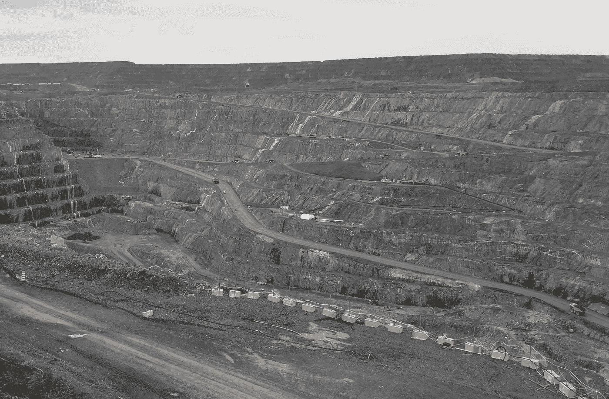
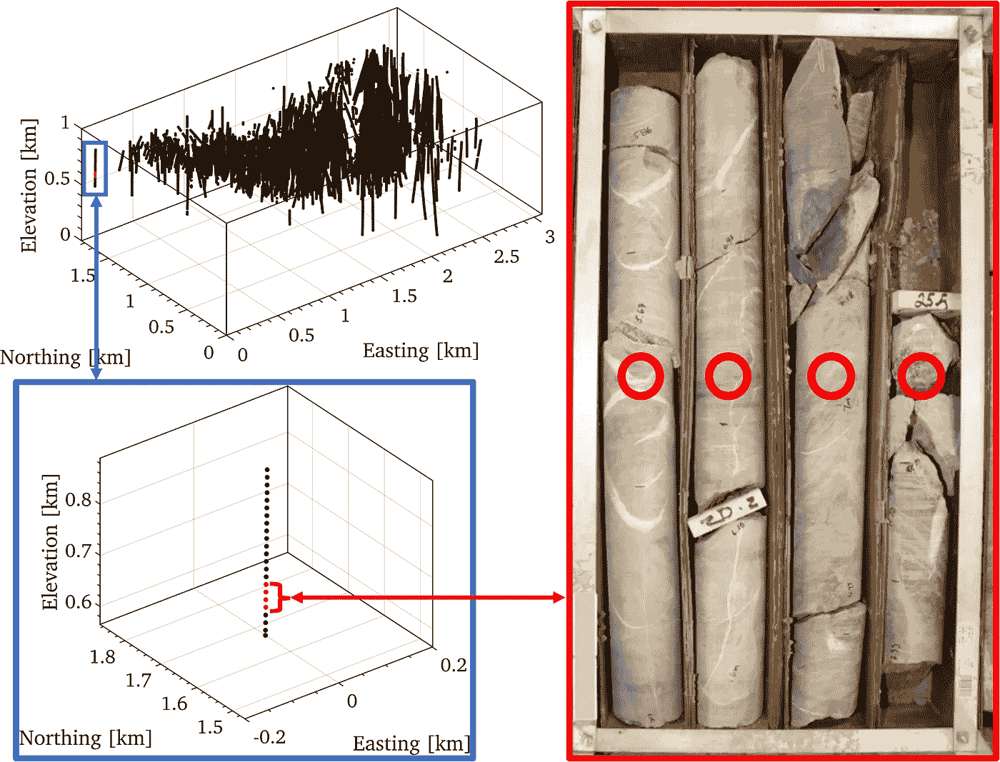
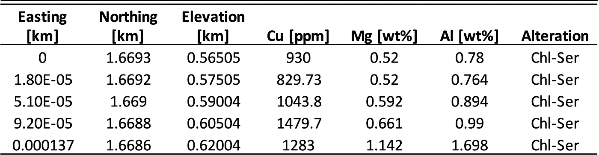
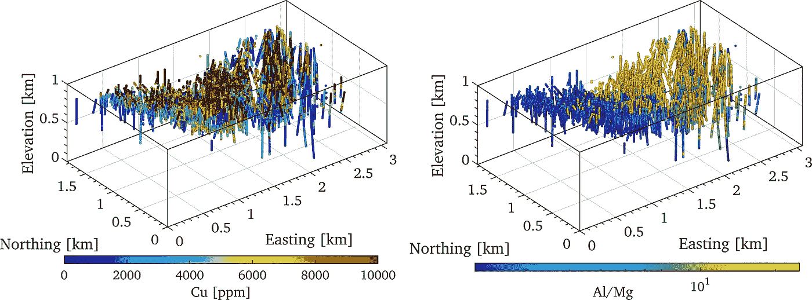
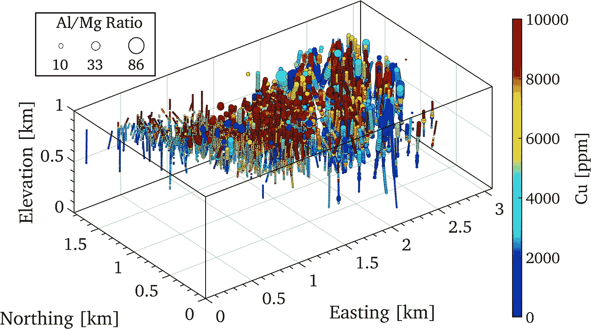
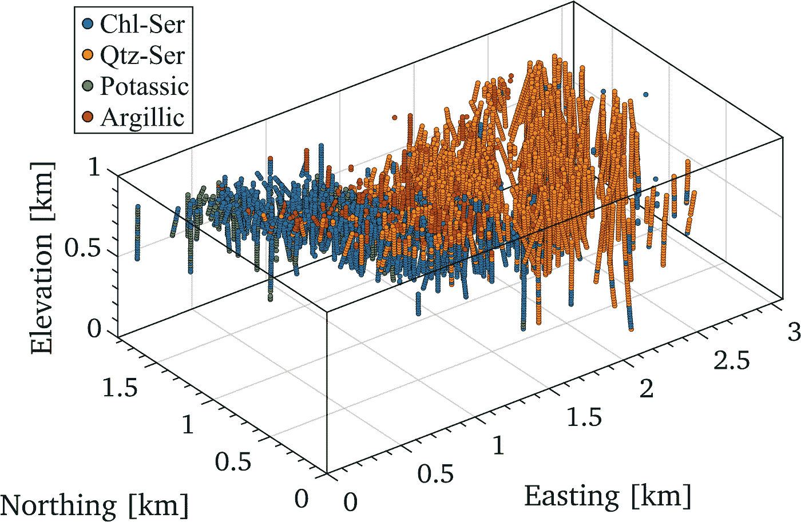
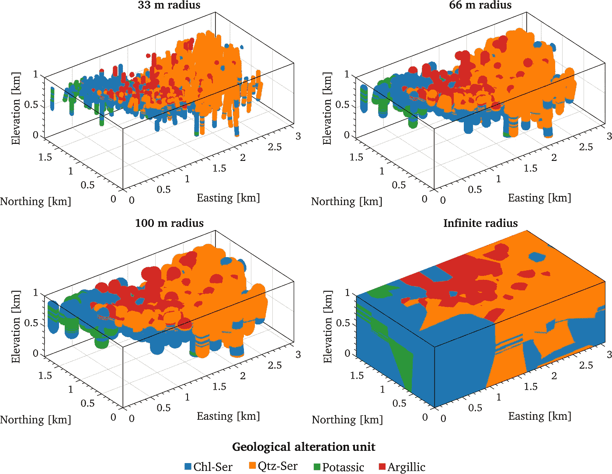
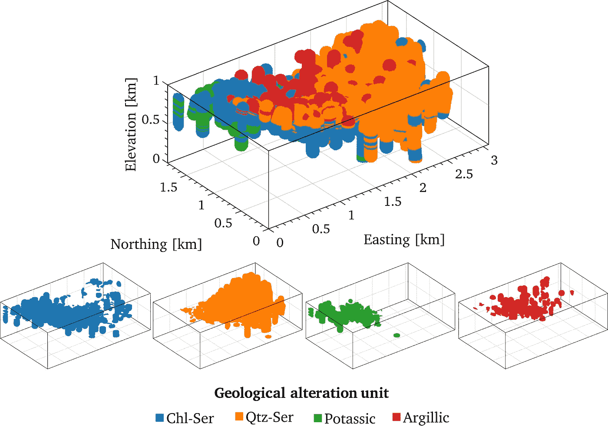

# 可视化 3D 地下钻孔数据的简单技术

> 原文：<https://towardsdatascience.com/easy-techniques-for-visualizing-3d-subsurface-borehole-data-b497de12b651?source=collection_archive---------28----------------------->

## [实践教程](https://towardsdatascience.com/tagged/hands-on-tutorials)

## 绘制分散在 3D 坐标系中的连续和分类地理空间数据，使用 Matlab 应用于挖掘数据集



加拿大马拉其露天煤矿(作者摄影)

地下钻孔数据是通过钻探和提取岩石或土壤岩心收集的，由分散在三维空间中的样本组成，这些样本测量不同的连续变量或分类变量。每个样本记录:(1)由东、北和高程表示的 3D 空间坐标，(2)连续变量，例如元素浓度、污染物、矿石品位或温度等，以及(3)分类变量，例如岩性、蚀变或矿化单位。



左上图显示了钻孔样本在 3D 散点图中的位置，左下图放大显示了单个钻孔内的样本，右边的图像是显示物理岩石样本外观的带方框的岩心记录(作者拍摄的照片)

钻孔数据或类似的 3D 地理空间数据集用于地球科学和自然资源行业，以获得对地下的了解，用于各种不同的应用，例如采矿中的矿体建模、石油和天然气中的储层测绘、水文地质学中的污染物跟踪以及用于建筑或地质灾害目的的岩石或土壤稳定性描绘。除了传播和分析目的之外，可视化 3D 地理空间信息通常也是任何后续地质建模、工作流或探索性数据分析的第一步。

尽管可视化钻孔数据很重要，但一些地球科学家经常依赖昂贵的软件来绘制他们的 3D 数据，因为大多数从事岩石和土壤工作的人通常缺乏丰富的编程经验。绘制 3D 钻孔数据实际上非常容易，可以用任何编程语言完成，如 Python(使用 numpy 和 matplotlib)、R、Octave 或 Matlab。以下是一个用 Matlab 编写的简单教程，用于可视化应用于一个主要铜矿床的真实采矿数据集的钻孔数据。

挖掘数据集采用以下格式。



正在使用的挖掘数据集的标题行和前五行数据

虽然本教程是在采矿环境中介绍的，但可视化技能也适用于石油和岩土工程行业以及建筑、地质灾害和水文地质等领域中使用的相同类型的 3D 地理空间数据集。

首先，我们导入将在演示中使用的挖掘数据集和所有相关变量。数据集包含 16，258 个样本，分布在东距约 3 km、北距约 2 km、海拔约 1 km 的矩形区域内，每个样本测量连续的地球化学元素浓度以及分类地质蚀变单元。

```
data = importdata('Dataset.txt');%Spatial coordinates
x = data(:,1); %Easting coordinates in km
y = data(:,2); %Northing coordinates in km
z = data(:,3); %Elevation coordinates in km%Continuous variables
Cu = data(:,4); %Copper grade in ppm
Mg = data(:,5); %Magnesium grade in wt%
Al = data(:,6); %Aluminum grade in wt%%Categorical variable
Alte = data(:,7); %Geological alteration unit
```

在绘制任何变量之前，使用`scatter3`功能，地理坐标将用于显示所有样本的位置。轴的比例应始终相等，除非夸大高程可能会暴露由于数据在其他两个主要方向上的空间范围而遗漏的要素。在 Matlab 中使用`axis equal`命令可以很容易地缩放轴。以下示例比较了三维散点图与未缩放轴和缩放轴。


使用地理坐标显示的样本位置，左侧未按比例绘制，右侧按比例绘制

现在我们已经正确地缩放了轴，我们可以使用颜色来绘制变量，以表示它们在空间中的值。我们还可以使用对数色条或不同的颜色来更好地可视化某些变量或变量比率。下面展示了几个使用不同色条和色标的例子。



左侧为铜品位的 3D 散点图，带有线性色标，右侧为铝/镁比率的 3D 散点图，带有对数色标，均显示了整个体积内绘制变量的空间分布

还可以通过改变标绘点的大小或形状来引入额外的维度，这可以作为空间数据的多维探索性分析的额外工具。在下面的示例中，点的大小设置为等于铝镁比(Al/Mg ),颜色用于显示铜的品位。



多维散点图，使用位置在 3D 空间定位样品，使用大小显示铝/镁比率，使用颜色表示铜品位

多维图强调了在 Al/Mg 的中间值时如何发现更高等级的铜，因为更大和更小的点通常具有更小的铜浓度。

# 使用地质区块模型更好地可视化不同数量的分类数据

我们希望将采矿数据集中的四个不同分类变量可视化，这些变量由以下地质蚀变单元组成:绿泥石-绢云母、石英-绢云母、钾质和泥质。绘制此分类数据的一种方法是创建一个 3D 散点图，并根据其分类值为每个点着色，就像我们对连续变量所做的那样，如下例所示。



散点图显示了样品位置和四个地质蚀变单元:绿泥石-绢云母(Chl-Ser)、石英-绢云母(Qtz-Ser)、钾质和泥质

当处理分类数据时，当将分类单元或域可视化为块模型中的体积而不是分散在 3D 空间中的点时，我们获得了更多可操作的信息。通过以下方式生成块模型:( 1)创建贯穿整个体积的规则间隔点的网格，以及(2)基于来自数据的最近相邻样本的类别为每个点分配类别。对于更具代表性的块模型，应过滤这些点，以仅包括来自实际数据样本的设定搜索半径内的点。

这很容易编程和可视化，因为在大多数编程语言中有几个最近邻库可用，下面显示了一个在 Matlab 中编码的例子。

```
%Step size and radius inputs
SS = 0.01; % Step size in km
r = 0.01; % Search radius in kmxp=0:SS:max(x); yp=0:SS:max(y); zp=0:SS:max(z);
[X,Y,Z] = meshgrid(xp,yp,zp); % Create grid of points
Xp = X(:); Yp = Y(:); Zp = Z(:);Data_xyz = [x y z]; % Spatial coordinates in matrix
Block_xyz = [Xp Yp Zp]; % Block model coordinates in matrix[Idx D] = knnsearch(Data_xyz,Block_xyz); % Nearest neighbor search
Block_xyz(:,4) = alte(Idx); % Assign block values an alteration unit to nearest sampleBlock_xyz = Block_xyz.*(D<=r); %Filter to search radius %visualize Block_xyz with scatter3
```

应该使用足够小的步长来填充体积，同时保持合理的总点数，以便于处理和可视化。适当的步长将取决于所考虑的总体积，较大体积的步长成比例地较大，较小体积的步长较短。

对于正在使用的挖掘数据集，步长设置为 10 米，因此在所有三个方向上每 10 米有一个点。应测试不同的搜索半径，以确定哪一个能充分显示体积。根据以下示例，66 米到 100 米之间的搜索半径对于该数据集来说就足够了。



具有不同搜索半径的地质区块模型，显示了四个蚀变单元的空间分布

最后，可以在总体积内分别绘制每个区域的块段模型，以便更好地显示每个区域的空间分布，如下例所示。



使用 75 米搜索半径的蚀变单元的最终地质区块模型。组合块段模型显示在每个单独绘制的蚀变单元上方，突出显示每个单元在总体积内的空间分布位置和方式

块段模型使总结每个地质蚀变单元的位置变得更加容易:

*   绿泥石-绢云母单元自西向东由高到低逐渐倾斜
*   石英-绢云母单元更密集地聚集在该体积的东侧
*   含钾单位集中在该体积的西北角的顶部
*   在高海拔地区，粘土单位分布在东西和南北两个方向

## 结论

可视化钻孔数据在地球科学和自然资源行业中至关重要，许多地球科学家目前依赖昂贵的商业软件包来实现。使用任何标准编程语言绘制 3D 地理空间数据实际上都非常简单，本文展示了一些在 3D 空间环境中可视化连续、分类和多维变量的技术。

尽管此处介绍的教程使用了采矿数据集，但 3D 可视化技术也可应用于各种其他应用，例如绘制地下水污染物、土壤强度参数、岩石强度和稳定性、石油和天然气体积以及地下地热温度等。

## 作者说明

我希望这篇教程对所有读者都有用，尤其是对从事地球科学或自然资源行业的目标读者。我想鼓励所有在工业界和学术界使用地下钻孔数据或类似的 3D 地理空间数据集的人尝试编写自己的可视化脚本，而不是仅仅依赖商业软件。

随着我从学术界进入工业界，我目前正在寻找与自然资源或环境相关的地理空间数据分析项目。如果你想在这个领域合作或建立新的联系，请随时通过电子邮件或 LinkedIn 联系我！