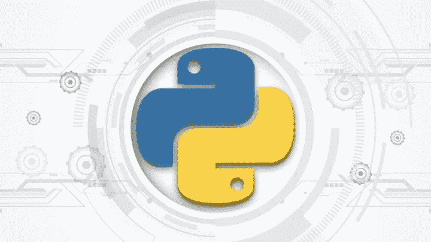

# 在您的服务器上实现 Python 模型训练自动化的简单工具

> 原文：<https://towardsdatascience.com/easy-tools-for-python-model-train-automation-on-your-server-f035d96ba28?source=collection_archive---------43----------------------->

## 我用来自动化我的 API 的工具



(src = http://python.org)

eb 自动化是未来的概念，但是非常复杂和难以设置。自动化解决方案通常涉及许多相互依赖的移动部件，并且容易发生故障。通常，这一过程包括三个步骤:

> 生成数据
> 
> 自动化再培训
> 
> 部署 API

这些步骤在理论上听起来很简单，但在实践中会创建一个相互依赖的文件和应用程序的复杂网络。通常，在这些情况下，正确的工具非常需要用于正确的工作，但是了解您的选项以及您可用的工具是战斗的一个重要部分。从获取数据到部署 API，这个难题的每一部分都需要紧密集成，从获取数据开始。

# 生成数据


(src = "http://python.org ")

“生成”可能是一个错误的术语，但创建可用于培训的数据是一项巨大的挑战。目前最好的工具是 Python。运行 Python 脚本来填充数据库当然是可行的，而且这可以用 RDS 很容易地完成。不过，在常规的 Linux VPS 端，我建议将 Python 与 CronJob 结合使用。


(src = "http://cronjob.com ")

CronJob 将在接下来的步骤中多次出现，这是有充分理由的。CronJob 允许您调度任务在分配的时间运行，这对于服务器自动化特别有用。这是通过使用由分钟、小时、月、星期几等组成的循环“Cron”时间戳来完成的。根据您的使用情况，CronJobs 也可以在更短或更长的时间范围内进行调度。如果有一个有价值的工具我会考虑在 Linux 领域内学习，CronJob 很可能是其中之一。在 Unix 系统上，您可以使用 CronJob 做很多不同的事情，了解如何使用 CronJob 无疑可以为您的服务器管理和部署增加很多功能。

通常，Python 和 CronJob 的协同工作足以让您的工作正常运行，并让 SQL 数据库或本地存储的数据文件不断填充新数据。通常，这些数据将使用 Python 从 API 中提取出来，并被推送到 JSON 或 CSV 格式，或者更理想的是推送到 SQL 数据库。

# 自动化再培训

自动化再培训是 CronJob 真正展示其能力的地方。虽然你当然可以在烧瓶路线上进行训练——但这肯定不理想。首先，关于路线的训练将会增加 CPU 和 RAM 的使用量，使得系统对于大量的请求非常不可用，并且会拒绝其中的许多请求。此外，根据您的模型，可能需要 10 分钟以上的训练时间，这对于 GET 请求来说一点也不理想。

所以通常情况下，解决方案是使用 CronJob 或 AWS Lambda 解决方案。在这两者中，克朗乔布最有可能

*   更便宜，
*   更具可扩展性
*   更多便利
*   更简单。

每当我部署一个 API 时，可伸缩性总是我最关心的问题。考虑到这一点，很难证明随着使用而增加费用的解决方案是合理的。在 VPS 上运行 CronJob 肯定是一个很好的方法，因为 AWS Lambda 的所有问题都可以完全避免，同时增加很少的问题。因此，通常情况下，CronJob 和您选择的语言的组合也是您的致命武器。

# 部署

在列出的所有步骤中，部署无疑是最简单的，但也是最复杂的。部署还涉及到更多的步骤，需要前面讨论的所有内容完全一致。不幸的是，这可能相当伤脑筋，因为一次中断可能会使您的整个系统变得无关紧要。

首先你需要一个网络服务器，我总是使用 Nginx。通常，另一个选择是 Apache，但是我选择 Nginx 有几个主要原因:

*   开放源码
*   背后是 10 年的发展
*   出色的表现
*   简单的配置

通常情况下，在 Nginx web 服务器上进行部署会涉及到编辑/etc/nginx/conf.d 中的文本文件，如果您想了解更多相关信息，我已经编写了完整的教程，您可以在这里找到:

[](/deploying-flask-with-gunicorn-3-9eaacd0f6eea) [## 用 Gunicorn 3 展开烧瓶

### 应用程序部署通常会带来意想不到的后果和错误。部署可以是制定或…

towardsdatascience.com](/deploying-flask-with-gunicorn-3-9eaacd0f6eea) 

本文还涵盖了 Supervisor，这将是部署难题的下一个重要部分。Supervisor 允许专用工作组内部的人工用户在后台运行命令。主管将持有运行我们网络服务器的命令，可以是 Django、Genie 或 Flask。Supervisor 配置也相对简单，在/etc/supervisor/conf.d 中有一个非常相似的配置文件，很容易编辑和访问。

Flask 是一个很好的部署选项，它既轻便又简单，非常适合在 web 服务器上返回 GET 请求的预测。使用 Flask API，通过 get 或 POST 请求输入和输出数据通常就像预测和返回一样简单。

拼图的最后一块将会是古尼康。Gunicorn 是运行 Flask 应用程序的客户端服务器。你可以通过 Pip 和一些包管理器来安装 Gunicorn(它在 Apt 中，而不是 Dnf 中)

```
sudo apt-get install gunicorn3
```

这是将从 supervisor 配置文件中运行的命令。然后用简单的

```
service supervisor reload
```

你将完全部署完毕，准备出发！

在 2020 年，有了所有这些有价值的工具，你可以在你的服务器上创建一些非常酷的模型和一些非常棒的自动化。拥有一个根据实时数据不断重新训练的模型将是非常有价值和非常可扩展的，这样做的解决方案肯定是最佳的！