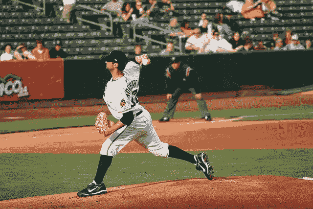
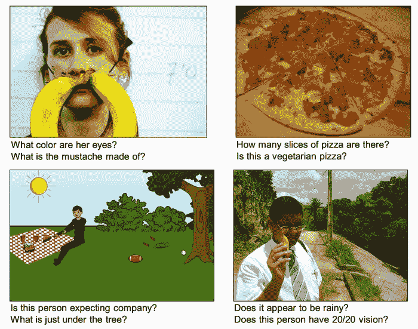
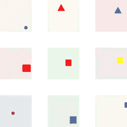
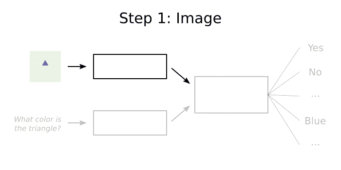
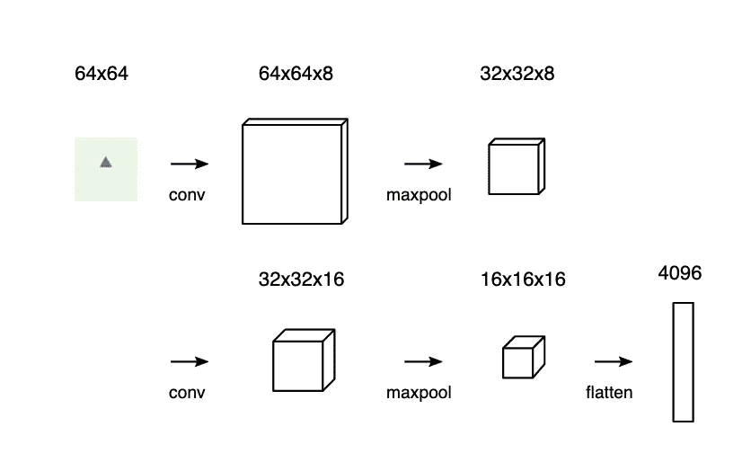
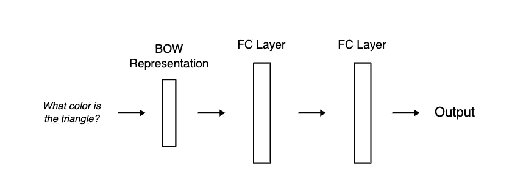

# 简单的视觉问答

> 原文：<https://towardsdatascience.com/easy-visual-question-answering-victorzhou-com-637efa38b55c?source=collection_archive---------28----------------------->

## 使用神经网络的视觉问题回答(VQA)的温和介绍。

快速回答——这张图片描述了什么运动？



图片来自 CloudCV VQA 演示

你可能马上就知道答案:**棒球**。很简单，对吧？

现在想象你是一台电脑。给你同样的图像和文字“*在这个图像中描绘了什么运动？*”并要求出示答案。不再那么容易了，是吗？

这个问题被称为**视觉问答(VQA)** :回答关于图像的开放式问题。VQA 很有趣，因为它需要结合视觉和语言理解。解决这一任务的模型展示了对图像的更一般的理解:它必须能够回答关于图像的完全不同的问题，有时甚至解决图像的不同部分。

起初，这似乎是一个很难解决的问题，但实际上它可能比你想象的更容易解决。在本帖中，我们将**探索执行 VQA 的基本方法，并用 Python 构建我们自己的简单实现**。下面是这篇文章最终产品的[演示](https://easy-vqa-demo.victorzhou.com):

 [## 简易 VQA 演示

### 在易 VQA 数据集上训练的可视化问答模型的 Javascript 演示。

easy-vqa-demo.victorzhou.com](https://easy-vqa-demo.victorzhou.com) 

警告:**这篇文章假设了卷积神经网络(CNN)**的基本知识。我的[CNN 简介](https://victorzhou.com/blog/intro-to-cnns-part-1/)涵盖了你需要知道的一切，所以如果有必要就从这里开始吧。

我们还将使用 [Keras](https://keras.io/) ，一个 Python 的深度学习库，来为我们的模型提供动力，所以如果你以前从未看过 Keras 代码，我建议你回顾一下我的[Keras 神经网络简介](https://victorzhou.com/blog/keras-neural-network-tutorial/)。

这个前言说够了。我们开始吧！

> *只是找源代码/结果？跳到* [*结果*](https://victorzhou.com/blog/easy-vqa/#8-the-results) *。*
> 
> 这篇文章最好在 victorzhou.com 浏览

# 1.数据集

在 visualqa.org 的[可以找到 VQA 最著名的数据集，它包含 20 万多张图像和超过一百万个关于这些图像的问题(带答案)。这里有一些来自最初的](https://visualqa.org) [VQA 论文](https://arxiv.org/pdf/1505.00468.pdf)的例子:



印象深刻吧。不幸的是，这种程度的 VQA 超出了这篇博文的范围。我们将使用专门为这篇博文创建的自定义数据集: [easy-VQA](https://github.com/vzhou842/easy-VQA) 。

易 VQA 数据集中的图像要简单得多:



问题也简单多了:

*   图像中是什么形状？
*   三角形是什么颜色的？
*   图像中是否有绿色形状？
*   图像包含一个圆吗？

总的来说，easy-VQA 包含 5000 幅图像和大约 50000 个问题，分为训练集(80%)和测试集(20%)。这些问题有 13 个可能的答案:

*   **是/否**:是，否
*   **形状**:圆形、长方形、三角形
*   **颜色**:红色、绿色、蓝色、黑色、灰色、蓝绿色、棕色、黄色

# 2.方法

执行 VQA 的标准方法如下所示:

1.  处理图像。
2.  处理问题。
3.  结合步骤 1/2 中的功能。
4.  给每个可能的答案分配概率。



请注意，我们正在使用一个**固定答案集**,其中保证可能的答案中只有一个是正确的。这让我们的生活变得容易多了，因为我们不必*得出*正确答案，我们只需回答实际上是一个**选择题**。大多数尖端的 VQA 系统有 1000 个可能的答案，但在这篇文章中，我们只允许包含在 [easy-VQA](https://github.com/vzhou842/easy-VQA) 中的 13 个可能的答案。

步骤 1 和 2 通常分别使用来自[计算机视觉](https://victorzhou.com/tag/computer-vision/)和[自然语言处理](https://victorzhou.com/tag/natural-language-processing/)的方法，将原始图像/文本输入转化为经过处理的数据向量。然后，这两种输出表示可以一起用于分析，以最终选择最可能的答案。

## 一个例子

这里有一个非常简单的例子，说明 VQA 系统如何回答问题*“三角形是什么颜色的？”*关于上面可视化中的图像:

1.  在图像中寻找**形状**和**颜色**。一个简单的 [CNN](https://victorzhou.com/blog/intro-to-cnns-part-1/) 可以被训练识别出我们的图像包含一个蓝色的**三角形**。
2.  了解**题型**。由于问题以*“什么颜色”*开头，很容易意识到答案应该是一种颜色。
3.  对于每个可能的答案选项，根据前两步的信息确定其“强度”。答案“蓝色”将具有高强度，因为:(1)我们知道图像具有蓝色形状，并且(2)我们知道答案应该是颜色。
4.  使用类似于 [Softmax](https://victorzhou.com/blog/softmax) 的东西将每个答案的“强度”转换成概率。答案“蓝色”将有接近 100%的概率。

在接下来的几节中，我们将为 easy-VQA 数据集详细介绍实现这 4 个步骤的细节。

## 代码设置

如果你想跟随这篇文章，而不是从零开始，克隆[易-VQA-克拉斯](https://github.com/vzhou842/easy-VQA-keras)回购:

```
git clone [https://github.com/vzhou842/easy-VQA-keras.git](https://github.com/vzhou842/easy-VQA-keras.git)
cd easy-VQA-keras
pip install -r requirements.txt
```

否则，如果您想从头开始安装，请确保您使用的是 Python 3 并安装了几个包:

```
pip install easy-vqa keras tensorflow Pillow
```

我们需要 [tensorflow](https://pypi.org/project/tensorflow/) 为 Keras 供电，我们将使用 [Pillow](https://pypi.org/project/Pillow/) 进行图像处理。我们还将使用 [easy-vqa](https://github.com/vzhou842/easy-VQA) Python 包，这使得访问 easy-vqa 数据集变得简单。稍后会有更多相关信息——现在，让我们开始吧。

# 3.图像模型

首先:我们的形象模型。正如我们之前提到的，我们将构建一个[卷积神经网络](https://victorzhou.com/blog/intro-to-cnns-part-1/) (CNN)来从图像输入中提取信息。为此，我们将使用 [Keras](https://keras.io/) ，这是一个初学者友好但功能强大的 Python 深度学习库。我已经写了一篇关于使用 Keras 实现 CNN 的指南——在继续之前，在一个新的标签中打开它或者浏览它可能会有帮助。

我们的图像数据集并不复杂，所以我们可以用一个相对简单的 CNN 来处理它:



1.  从数据集中的 64x64 图像开始。
2.  通过使用“相同”填充的八个 3x3 滤镜的 conv 层，产生 64x64x8 的音量。
3.  使用标准的最大池层将体积切割为 32x32x8。
4.  通过另一个 conv 层，这一次有 16 个过滤器，产生一个 32x32x16 的体积。
5.  再次使用最大池，切割到 16x16x16。
6.  展平体积，这会产生一个具有 16 = 4096 个节点的层。

> *迷茫？以上所有概念都在我的*[*CNN 简介*](https://victorzhou.com/blog/intro-to-cnns-part-1/) *中有所涉及。*

代码如下:

这段代码使用了 Keras 的[模型](https://keras.io/models/model/)(功能)API。我们没有使用 Keras 的[顺序](https://keras.io/models/sequential/)模型 API，因为我们稍后需要将我们的图像模型和问题模型结合起来(你会看到，继续阅读)。

# 4.问题模型

接下来:我们的问题模型。大多数 VQA 模型会使用某种[递归神经网络](https://victorzhou.com/blog/intro-to-rnns/) (RNN)来处理问题输入，但这对我们的用例来说有点大材小用。易 VQA 数据集中的问题简短、简单，来自一组固定的问题模板，因此与你在现实世界中可能看到的问题相比，它们更容易理解。

我们将采用一种更简单的方法，而不是复杂的 RNN 架构:

1.  使用一个[单词包](https://victorzhou.com/blog/bag-of-words/) (BOW)表示法将每个问题转化为一个**向量**。
2.  使用该向量作为[标准(前馈)神经网络](https://victorzhou.com/blog/intro-to-neural-networks/)的输入。

如果你不完全明白那是什么意思，不要担心。我们将在下面完成这两个步骤。

## 单词袋(蝴蝶结)

BOW 表示通过计算每个单词在文本中出现的次数，将任何文本字符串转换为固定长度的向量。我已经写了一篇简短的、初学者友好的关于单词袋模型的介绍——如果你对它们不熟悉，我建议你现在就去读！从现在开始，我假设你对弓模型有一个基本的了解。

我们将利用 Keras 的[记号赋予器](https://keras.io/preprocessing/text/#tokenizer)类来实现 BOW:

注意，我们从`easy-vqa`包中读取问题数据。如果你想了解这些 API 的细节，请参考 [easy-vqa 文档](https://github.com/vzhou842/easy-VQA)。

## 神经网络时间！

如前所述，我们的问题数据集相对简单，因此我们的问题模型不需要太花哨的东西。我们将把我们的弓向量表示传递到 2 个**全连接** (FC)神经网络层:



> *提醒:全连接层的每个节点都连接到前一层的每个输出。如果你需要复习，我们在我的* [*神经网络介绍*](https://victorzhou.com/blog/intro-to-neural-networks/) *中使用了全连接层。*

下面是我们的实现，它也使用了 Keras 的模型(函数)API:

`vocab_size`变量是我们 BOW 向量表示的长度，它是我们问题模型的输入。

# 5.合并

我们将使用一个非常简单的方法来合并我们的图像和问题向量:**逐元素乘法**。用 Keras 的[多重合并层](https://keras.io/layers/merge/#multiply)实现这个是一行程序:

`out`向量现在包含了从*图像和问题*中得到的信息。

## 一个例子

为了说明这是如何有用的，考虑这个(有点做作的)例子:

*   当图像包含蓝色形状时，图像向量中的第一个元素为高电平**，否则为低电平**。****
*   ****当问题包含单词“blue”时，问题向量中的第一个元素是**高**，否则是**低**。****

****那么`out`向量中的第一个元素只有在*图像和问题都与蓝色相关时才会为高。这个结果对于回答类似*“图像中有蓝色的形状吗？”******

****实际上，我们的模型不太可能准确地学习*这种行为。记住，模型是通过[在它的层](https://victorzhou.com/blog/intro-to-neural-networks/#4-training-a-neural-network-part-2)中传播渐变来学习的，这不太可能产生如此简单的结果。相反，关注直觉:*****

*   ****图像和问题向量中都嵌入了颜色信息。****
*   ****乘法运算后，结果的某些部分可以用来回答关于颜色的问题。****

****实际上，我们可以用任何可微的方法来合并这两个向量。Keras 的[合并图层](https://keras.io/layers/merge/)部分中列出的其他合并方法包括`Add`、`Subtract`、`Concatenate`和`Average`，所有这些方法都做您认为它们做的事情。对于我们简单的数据集来说，大多数方法可能都和`Multiply`一样好用——你可以自己尝试一下！****

# ****6.输出****

****最后，是我们的 VQA 系统给出答案的时候了。回想一下，我们正在使用一个**固定答案集**:我们知道所有可能的答案，并且只有一个保证是正确的。****

****对于这一步，我们将使用 [Softmax](https://victorzhou.com/blog/softmax) 将我们的输出值转化为*概率*，这样我们就可以量化我们对每个可能答案的确信程度。如果你不熟悉 Softmax，我强烈建议在继续之前阅读我对 Softmax 的[解释。](https://victorzhou.com/blog/softmax)****

****首先，我们将加入一个全连接层，然后使用 Keras 内置的 Softmax 实现:****

****就是这样！剩下的工作就是构建和编译模型:****

> *****如果你需要复习，我在我的 CNN 系列中解释了* [*交叉熵损失*](https://victorzhou.com/blog/intro-to-cnns-part-1/#52-cross-entropy-loss) *。*****

# ****7.数据处理****

****既然我们已经弄清楚了我们的模型，我们只需要多一点代码来准备好所有的数据。对于这一部分，**我建议在单独的标签**中打开[**easy-VQA**](https://github.com/vzhou842/easy-VQA)**文档以供参考。为了简洁起见，我将省略对我们从`easy-vqa`开始使用的方法的解释。******

****首先，我们将从`easy-vqa`中提取一些数据:****

****接下来，我们将读取并预处理我们的图像:****

****然后，我们将创建用于训练模型的实际输入和预期输出:****

****Keras 的[to _ categorial](https://keras.io/utils/#to_categorical)是一种从索引中生成 [one-hot](https://en.wikipedia.org/wiki/One-hot) 向量的简便方法。我们需要一个热点矢量来匹配我们的输出 Softmax 层的尺寸。****

****作为一个可选步骤，我们将设置一个 Keras [ModelCheckpoint](https://keras.io/callbacks/#modelcheckpoint) 以在每个时期后保存我们的最佳模型:****

****终于，我们准备好训练了！****

# ****8.结果呢****

****为了节省空间，我不会在这篇文章中包含完整的代码，但你可以在 GithubT5[上找到它。将这些行复制并粘贴到您的终端中，亲自训练模型:](https://github.com/vzhou842/easy-VQA-keras)****

```
**git clone https://github.com/vzhou842/easy-VQA-keras.git
cd easy-VQA-keras
pip install -r requirements.txt
python train.py**
```

****运行代码会得到如下结果:****

```
**Epoch 1/8
loss: 0.8887 - accuracy: 0.6480 - val_loss: 0.7504 - val_accuracy: 0.6838
Epoch 2/8
loss: 0.7443 - accuracy: 0.6864 - val_loss: 0.7118 - val_accuracy: 0.7095
Epoch 3/8
loss: 0.6419 - accuracy: 0.7468 - val_loss: 0.5659 - val_accuracy: 0.7780
Epoch 4/8
loss: 0.5140 - accuracy: 0.7981 - val_loss: 0.4720 - val_accuracy: 0.8138
Epoch 5/8
loss: 0.4155 - accuracy: 0.8320 - val_loss: 0.3938 - val_accuracy: 0.8392
Epoch 6/8
loss: 0.3078 - accuracy: 0.8775 - val_loss: 0.3139 - val_accuracy: 0.8762
Epoch 7/8
loss: 0.1982 - accuracy: 0.9286 - val_loss: 0.2202 - val_accuracy: 0.9212
Epoch 8/8
loss: 0.1157 - accuracy: 0.9627 - val_loss: 0.1883 - val_accuracy: 0.9378**
```

****对于这样一个简单的模型来说，8 个时代一点也不差:****

*   ****我们达到了 **93.8%** 的验证准确率****
*   ****我们清楚地看到了培训的进展(损失减少，准确性提高)****
*   ****该模型还没有过度拟合得太糟糕(训练/验证损失和精确度足够接近)****

****如果您愿意，您可以自己对代码进行试验，以获得更好的结果。我的带 Keras 的 CNN 简介[中的](https://victorzhou.com/blog/keras-cnn-tutorial/)[扩展](https://victorzhou.com/blog/keras-cnn-tutorial/#8-extensions)部分是一个很好的起点。考虑到这个问题相对简单，您应该能够非常容易地通过 99%的验证准确率。供参考:官方的 [easy-VQA 演示](https://easy-vqa-demo.victorzhou.com/)使用了一个模型，该模型实现了 99.5%的验证准确性，参数仅略有不同。****

# ****9.结束了****

****您现在已经实现了一个工作的 VQA 模型！然而，这篇文章只是一个温和的介绍。您还可以做更多的事情:****

*   ****了解[递归神经网络](https://victorzhou.com/blog/intro-to-rnns/) (RNNs)，它可以比我们使用的简单的基于 BOW 的问题模型更强大。****
*   ****以原始的 [VQA](https://visualqa.org/) 数据集为例，它包含更难的图像和问题。****
*   ****查看 VQA 的调查[,了解艺术模特使用的更复杂的方法。](https://arxiv.org/pdf/1607.05910.pdf)****
*   ****试试 [CloudCV VQA 演示](https://vqa.cloudcv.org/)(印象相当深刻！).****

****感谢阅读！****

> ****注意:这篇文章用了第一人称(“我”、“我的”)，读起来好像是我(Victor Zhou)在说话。然而，正如最上面指出的，这篇文章是由我的好朋友[*Phillip Wang*](https://phillipkwang.com/)*共同撰写的，他是最近从 CMU 毕业的计算机科学毕业生，也是 ML 的一员。谢谢菲利普。*****

*****最初发表于*[*https://victorzhou.com*](https://victorzhou.com/blog/easy-vqa/)*。*****