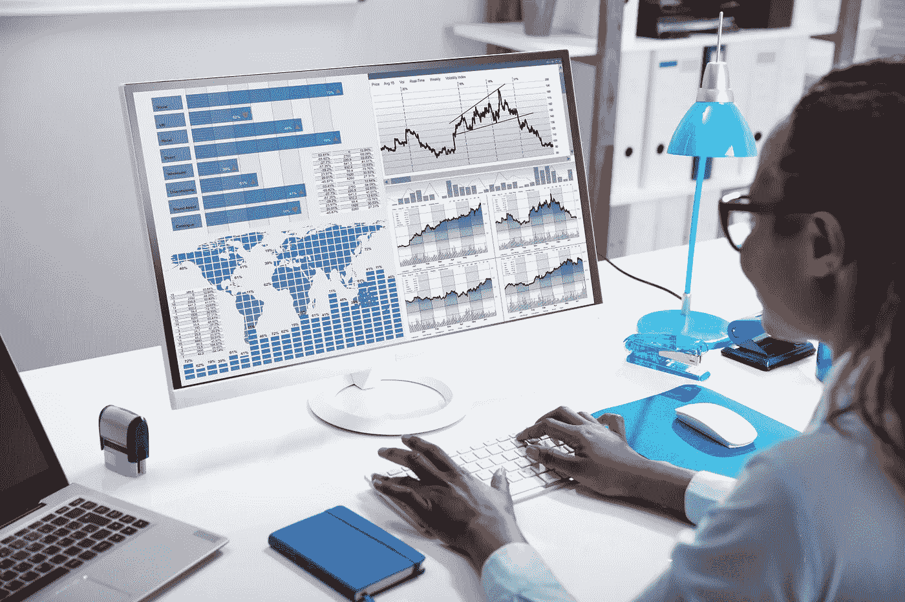
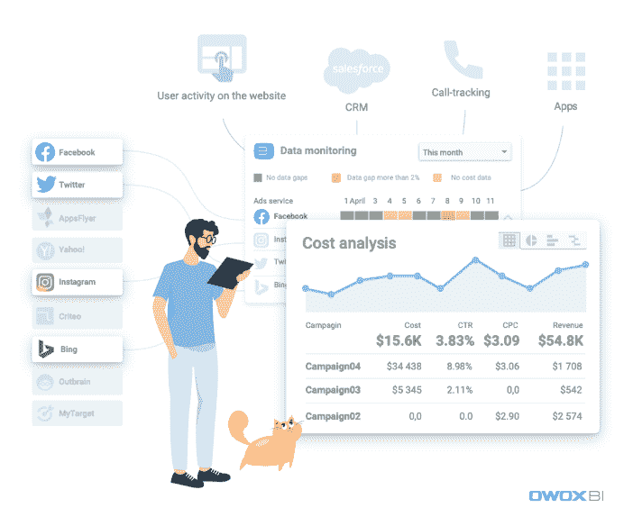
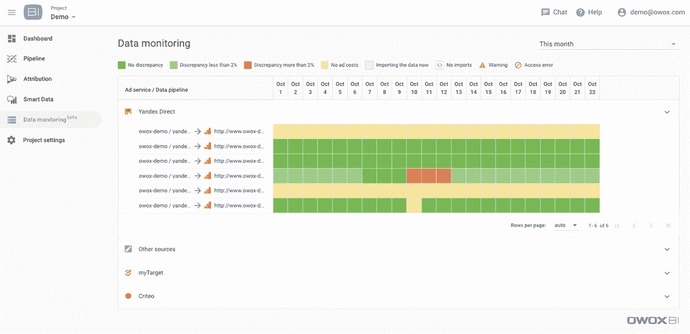
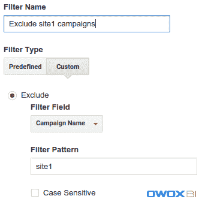
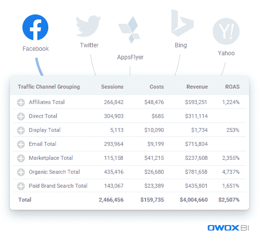

# 从广告服务向 Google Analytics 导入成本数据的简单方法

> 原文：<https://towardsdatascience.com/easy-way-to-import-cost-data-from-advertising-services-to-google-analytics-e706d1626931?source=collection_archive---------68----------------------->

来源:[沉积照片](https://ru.depositphotos.com/273771348/stock-photo-close-businesswoman-hand-analyzing-graph.html)

## 为什么需要将成本数据导入 Google Analytics，以及如何做。

当你与许多广告服务打交道时，你最终会遇到这样一种情况:你需要衡量和比较它们的有效性。但问题是，非谷歌服务(如 Instagram、脸书广告、Bing、LinkedIn 广告等)没有与谷歌分析进行原生集成。因此，如果你想控制你的广告成本并评估广告活动的成功，你必须收集不同广告服务的活动数据，然后设法分析它们。

事实上，为了成功地工作并对任何营销变化做出快速反应，你需要获得关于活动效率的数据**并存储在一个地方**。由于谷歌分析仍然是最受欢迎和最方便的服务，让我们看看我们可以做些什么来建立基于任何广告服务的完整数据的报告。

所以这并不简单——你需要的只是数据，你广告服务的所有成本数据。您可以手动完成(例如，使用 CSV。文件)，或者您可以设置自动数据导入，节省您的时间、金钱和精力。

我们建议使用 [OWOX BI 连接器](https://www.owox.com/superstart/?code=PRM_superstart)来自动收集和合并所有广告数据。这项服务是 Supermetrics 或 Funnel.io 等昂贵工具的免费替代品，免费到 2020 年底。

# OWOX BI 数据导入的独特优势

这项服务是根据分析师和营销人员的要求创建的，这就是为什么它有许多独特的好处。

1.  **成本数据格式同**。处理数据时最常见的错误是广告服务和谷歌分析视图中的货币不同。但是，OWOX BI 会自动转换货币，并在必要时扣除增值税。
2.  **数据的准确性和质量**。OWOX BI 处理动态参数，检查您活动中的现有 UTM 标签，并借助 [OWOX BI 数据监控工具](https://support.owox.com/hc/en-us/articles/360037233574?_ga=2.207026579.1256392871.1592768327-1907167021.1551689878)报告可能的错误。
3.  **更新和历史数据**。如果广告服务中的数据发生变化，OWOX 会在 21 天内自动更新数据。此外，您可以从广告服务下载过去 2-6 个月的广告，并评估您过去的活动。

图片由作者提供

简而言之，OWOX BI 服务可帮助您避免基于完全未采样数据制作营销报告的持续人工工作。

我们挑选了 7 个关于该服务的最受欢迎的问题，以便您可以看到它已准备好迎接任何挑战。

# OWOX BI 向 Google Analytics 上传了哪些数据

[OWOX BI Pipeline](https://www.owox.com/products/bi/pipeline/) 从广告服务中导出这些数据:

*   来源(必需)
*   中等(必需)
*   adCost(必需)
*   运动
*   Google Ads 活动 ID(与您广告帐户中的活动 ID 完全匹配)
*   广告位置
*   关键字
*   广告内容
*   广告点击
*   印象

可选数据取决于您的谷歌分析数据集的配置。

# OWOX BI 数据监控

有时，由于系统故障，广告服务 API 不提供下载的费用数据。结果就是你的 ROI 计算错误，甚至看不出成本数据的导入没有发生。

然而，在[数据监控工具](https://support.owox.com/hc/en-us/articles/360037233574?_ga=2.207026579.1256392871.1592768327-1907167021.1551689878)的帮助下，你可以确定从脸书、Twitter、Criteo 等广告服务导出到谷歌分析的成本数据。您可以在一个页面上使用 OWOX BI 项目中成本数据的每日统计数据，并获取所选日期的数据状态:

图片由作者提供

# 历史数据更新

广告服务中的信息可以更改，因为这些服务可以删除不正确的数据，如机器人活动、虚假点击等。因此，上传到您的 Google Analytics 个人资料的信息可能不准确。但是，OWOX BI 会自动[检查 21 天](https://support.owox.com/hc/en-us/articles/360018795914-Historical-data-updates)的追溯数据，并根据需要进行更新。

也就是说，您的 Google Analytics 个人资料或 BigQuery 表格中的数据将与您的广告服务帐户中显示的数据完全相同。

# 谷歌分析何时提供这些数据

这些数据在 36 小时内可在谷歌分析[中获得。一旦数据在广告平台上可用，使用 OWOX BI 服务导入和处理数据需要 12 个小时。处理完成后，可能需要](https://support.owox.com/hc/en-us/articles/219386448-When-the-data-will-be-available-in-Google-Analytics-)[24 小时](https://support.google.com/analytics/answer/6015078#processing_time_and_status)才能在报告中获得数据。

# 在 Google Analytics 的什么地方可以看到导入的成本数据

采集/活动/ [**成本分析报告**](https://www.owox.com/blog/articles/cost-analysis-google-analytics) 是您可以找到所有导入的成本数据的地方。此外，您可以使用以下工具通过 API 访问数据:

*   [谷歌分析查询浏览器](http://ga-dev-tools.appspot.com/explorer/)
*   [谷歌分析插件](https://chrome.google.com/webstore/detail/google-analytics/fefimfimnhjjkomigakinmjileehfopp)

# 可以通过广告服务中的自定义活动过滤成本数据吗

您不能通过自定义活动过滤导入的成本数据，但可以对导入的 UTM 标签值使用 Google Analytics 过滤器。

例如，您可以按 utm_campaign 参数中的特定值筛选数据，以排除特定的成本。

图片由作者提供

我们建议将不同网站的活动划分到不同的帐户，以避免广告服务对每个活动的 API 调用次数的限制。

# 货币兑换是如何发生的

OWOX BI 使用一个开放的 [API Yahoo Finance](http://finance.yahoo.com/currency-converter/) 来获取货币汇率。货币根据广告显示时的相关汇率进行转换。

换句话说，如果广告服务和 GA 视图的货币没有差异，数据就没有变化。当货币变化时，使用[开放汇率 API](https://openexchangerates.org/) 将成本数据转换为 GA 视图的货币。

请注意[一些广告服务传输成本数据不含增值税](https://support.owox.com/hc/en-us/articles/219783367-Why-to-exclude-VAT-in-cost-data-import-)(不像谷歌广告或脸书)。如果你不指定计算增值税的百分比，你最终会高估你的活动成本。使用 OWOX BI，您可以随时在数据管道的设置中更改增值税百分比。

图片由作者提供

觉得有意思？让我们看看如何开始使用 OWOX BI 导入成本数据。

*OWOX BI 服务具有完全的透明性和安全性:只有* [*您可以控制对您的数据的访问级别*](https://www.owox.com/blog/articles/how-secure-and-control-access-to-data-in-google-cloud-platform/) *。*

如您所见，您不必害怕提供对您个人资料的访问，OWOX BI 服务不会对您的数据进行任何更改。

# 使用 OWOX BI 从广告服务开始导入成本数据的 5 个步骤

1.  使用[您的促销代码](https://www.owox.com/superstart/?code=PRM_superstart)并使用您的 Google 帐户登录。
2.  选择要从中导入数据的广告服务。
3.  提供对谷歌分析中选择的广告服务和数据集的访问。
4.  定义设置(开始日期、增值税和货币)。
5.  等待长达 36 小时，以获取您的谷歌分析个人资料中的所有数据。

如你所见，用 [OWOX BI](https://www.owox.com/) 导入成本数据很容易！放下服务中的日常工作，专注于真正重要的事情:

*   发现你广告的真正价值；
*   更多地了解你的客户；
*   有效管理你的广告预算。