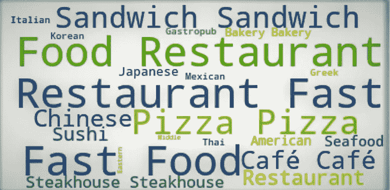
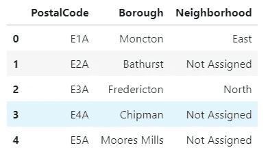
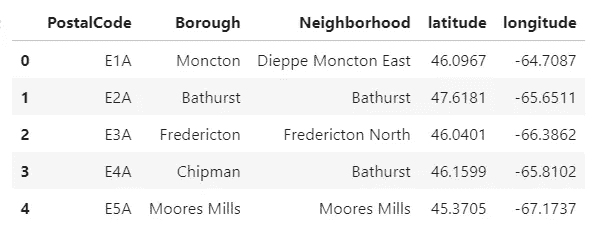
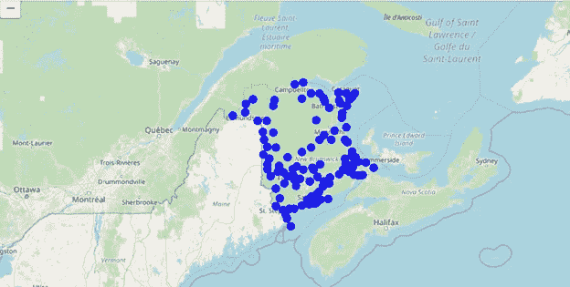
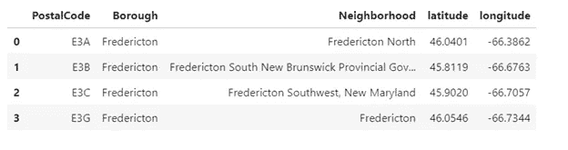
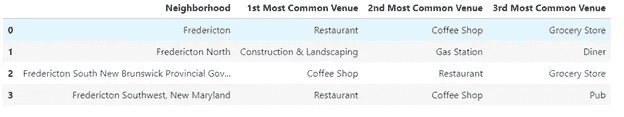
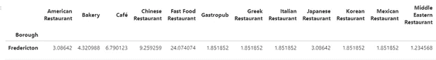
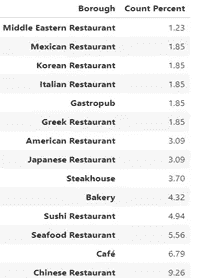
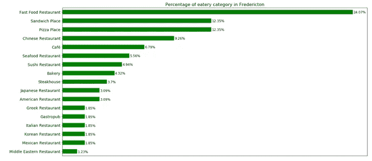

# 弗雷德里克顿餐馆数据分析

> 原文：<https://towardsdatascience.com/eatery-data-analysis-of-fredericton-930e416036f5?source=collection_archive---------54----------------------->

## 在 Python 中探索、操作和分析数据

数据分析，21 世纪最热门、最繁荣的领域之一。不断增长的数据和对智能系统的旺盛需求要求对数据进行积极的分析。无论你使用 Siri 或 Alexa 之类的虚拟助手，还是在网飞或亚马逊之类的媒体服务提供商上获得内容推荐；数据分析是每个智能系统的基础。它已经在世界各地生根发芽，无论是支持企业发展的决策，还是成为我们生活方式的一部分。

在我们开始之前，让我们使用数据分析来探索加拿大的一个城市。这篇文章将带领你探索弗雷德里克顿的餐馆和附近的场地。使用数据科学方法论的术语，我们将推动它从描述问题到用可能的答案来总结它。

# **简介:**

*   **背景**

弗雷德里克顿是加拿大新不伦瑞克省的首府，人口约 6 万。新不伦瑞克的主要城市中心之一，是该省第三大城市。

作为省会，它的经济与公共部门紧密相连；然而，这座城市也包含了一个成长中的 IT 和商业部门。该市拥有全省最高的大专以上学历居民比例，也是新不伦瑞克省人均收入最高的城市[1]。

作为这座城市的居民，我决定探索弗雷德里克顿的场馆。这座城市是完全多样化的，有很多社区，它正变得越来越密集，因为它吸引了全球更多的人。事实上，这里不能否认食物多样性的重要性。

*   **问题**

该项目的目的是探索弗雷德里克顿的场馆。由于弗雷德里克顿的居民区并不密集，人数也较少，所以我们希望找出弗雷德里顿市的餐馆类别及其在食物多样性中所占的份额。

*   **利息**

这个项目将有助于了解这个城市的不同菜系。任何政府官员或食品行业专家都可以利用这一分析结果来了解城市中的食品多样性。计划建立他们的餐馆或食品经销店的供应商可以利用这种分析来帮助他们做出决定。

# **数据:**

以下数据来源是本次分析的一部分:

*   **维基百科**

加拿大邮政编码列表:E [2]

这一页有新不伦瑞克 FSAs(前分拣区)的邮政编码列表。上传页面数据，使用 Python 包抓取邮政编码表。这个数据包含所有街区的邮政编码，我们可以使用这个数据来获得弗雷德里克顿街区的空间坐标。

*   **Foursquare API**

Foursquare 是一家建立了大量位置数据数据集的科技公司。目前，它的位置数据是最全面和相当准确的。它为苹果地图、优步和 Twitter 等许多流行服务提供位置数据。

使用 API [3],我得到了弗雷德里克顿社区的场馆数据。API 在 JSON 中提供了响应，并检索了场馆及其类别和其他详细信息。我用这些数据探索了这个城市的食物多样性。

# **方法:**

*   **废弃维基页面，获得邻居**

为了探索城市，首先我们需要城市数据。那是从维基百科页面上检索到的；我用 Python 的 BeautifulSoup 包抓取了页面数据。wiki 页面中的表格被转换为下面的 pandas 数据框。

新不伦瑞克邮政编码

*   **获取空间坐标**

为了在地图上表示邻近区域，并从 foursquare API 获取场地，需要空间坐标。为了获得邻域的空间坐标，我使用了 Python 的地理编码库。

使用地理编码，我能够得到我们在上一步中搜索到的所有街区的经度和纬度。因此，创建了以下数据帧:

新不伦瑞克与自治市相协调

数据框的形状为(111，5)，这意味着新不伦瑞克有 111 个邻域。未分配的邮政编码已从数据框中清除。

以上数据框包括新不伦瑞克省的所有行政区。可以使用叶库在地图上可视化；下面的图片是使用*叶子*库在顶部叠加了邻居的新不伦瑞克的表示。

叠加在新不伦瑞克地图上的街区

因为我们希望只探索弗雷德里克顿社区，所以我在一个新的数据框中分离出了“弗雷德里克顿”区的数据。

弗雷德里克顿街区

*   **从 Foursquare 获取场地:**

调用 Foursquare API 需要客户端 ID 和 Secret，可以在 Foursquare 开发者网站注册生成。Foursquare 为 API 端点提供了不同的过滤器选项。我首先试图为弗雷德里克顿的整个社区找到场地。弗雷德里克顿社区并不密集，所以我保持半径为 10000 米，限制为 100 米。从 Foursquare 收到 JSON 数据后，它被解释并转换成以下数据帧:

弗雷德里克顿社区活动场所

# **探索性数据分析:**

合并后的数据框包含所有邻近地点的信息。让我们做一个热门的场馆编码。我将场地类别转换为新数据框的列，并在其中添加了邻居列。

数据框的形状是(4，53 ),表示有 52 个独特的场馆类别。使用此数据框，我们可以找到弗雷德里克顿社区最常见的活动场所。我尝试获得前三个公共场地，结果如下:

弗雷德里克顿最常见的地方

结果告诉我们弗雷德里克顿社区的三个最常见的场所。正如我们所见，最常见的场所包括三个社区的餐厅。然而，北弗雷德里克顿是唯一一个在公共场所没有餐厅的社区。与弗雷德里克顿的其他地区相比，北弗雷德里克顿的人口很少。因此，它的网点数量相对较少。

弗雷德里克顿只有四个街区。因此，在这里聚集邻域不是一个好的选择。因此，我们将对餐馆类别做进一步分析，以了解弗雷德里克顿的口味。

我再次使用 Foursquare API，但这次传递了类别 id，只获取食物类别的地点。JSON 响应以与我们之前相同的方式被解释，并被传输到数据帧中。有 22 个独特的食物类别，也包含一般类别，如就餐者，食物和美食广场。我列了一个一般类别的列表，并从数据框中删除了这些场馆。

由于我们希望探索弗雷德里克顿市的餐馆类别，因此我在数据框中为行政区添加了一列，并将值插入为弗雷德里克顿。

为了使数据更加结构化，我将场地类别作为列，并用类别的平均值乘以 100 对“区”进行分组。它给了我弗雷德里克顿市每一类的百分比值。具有类别平均值的数据框如下所示:

弗雷德里克顿市食品类别

为了可视化上述数据，我从上述数据框中获得转置数据，将百分比小数四舍五入为 2 点，并将数据框转换如下:

转置数据帧

上面的数据框现在很容易想象。一个水平条形图将是一个很好的选择形象化，并显示在弗雷德里克顿餐馆类别的百分比。

# **结果:**

让我们使用 Matplot 和 Seaborn 库在上面创建一个条形图。以下是该数据的水平条形图:

条形图

该条形图显示了弗雷德里克顿各类餐馆的百分比。每个条形的百分比与其自身一起显示。图表清楚地显示，快餐店以大约 25%的份额领先。比萨和三明治店也领先于这个城市的任何一种特色美食。在弗雷德里克顿丰富多样的食物中，中国餐馆占有一席之地。在这座城市里，还有其他的美食可以提升弗雷德里克顿的品味。

# **结论:**

在考虑了结果之后，可以说快餐店正在主宰弗雷德里克顿的食品市场。结果显示了城市中的食物多样性，考虑到城市的人口，这是相当活跃的。此外，不可否认的是，城市人口的增长将促进城市对更多美食的需求。因此，这将为打算投资食品行业的商家带来更多的机会。

此外，如果我们看到弗雷德里克顿的街区，餐馆类别可能不会出现在北弗雷德里克顿最常见的场所，但建筑在上面；它进一步抓住了利益相关者的注意力。

通过获取人口数字、社区主导位置及其利益的数据，可以进一步扩展这种分析的范围，以了解城市的确切需求；这可能是供应商做出决定的决定性因素。

# **参考文献:**

【https://en.wikipedia.org/wiki/Fredericton】

****【2】**[https://en . Wikipedia . org/wiki/List _ of _ postal _ codes _ of _ Canada:_ E](https://en.wikipedia.org/wiki/List_of_postal_codes_of_Canada:_E)**

****【3】**[https://developer.foursquare.com/](https://developer.foursquare.com/)**

**感谢您阅读文章！如果你喜欢，请在评论区分享你的想法。**

**Jupyter 笔记本和详细报告可从 [GitHub](https://github.com/menditarun/Fredericton-Data-Analysis) 获取。**