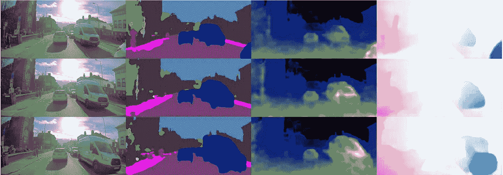
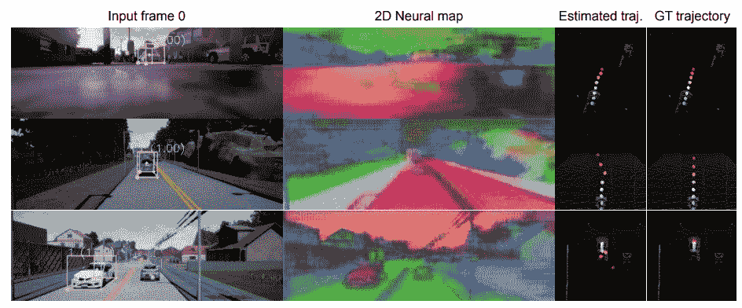
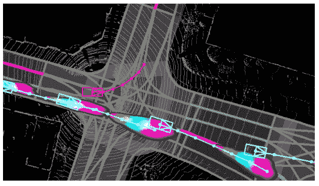
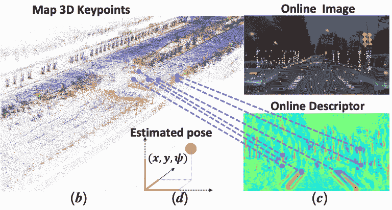
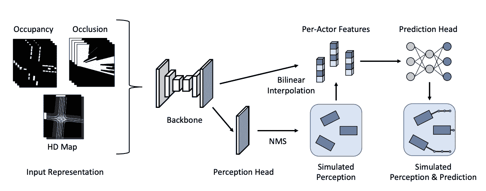
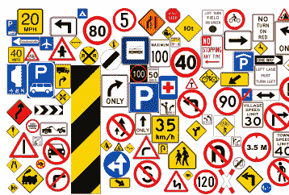

# ECCV 2020 文摘

> 原文：<https://towardsdatascience.com/eccv-2020-digest-d1244737e68?source=collection_archive---------27----------------------->

来自[的图像用于视频场景理解的概率未来预测](http://www.ecva.net/papers/eccv_2020/papers_ECCV/papers/123610749.pdf)

## 专家最有趣的自驾研究。

两周前，数千名计算机视觉研究人员聚集在 ECCV[欧洲计算机视觉会议](https://eccv2020.eu/)展示他们的最新成果。想看一眼最新的自动驾驶技术吗？这份文摘是给你的。

除了下面的论文，还可以查看我帮助组织的[*【g】*](https://sites.google.com/view/pad2020/)*[*标杆轨迹预测模型*](https://sites.google.com/view/btfm2020)*[*5 级行业网络研讨会*](https://vimeo.com/451293003) *和* [Kaggle ML 竞赛](https://www.kaggle.com/c/lyft-motion-prediction-autonomous-vehicles/)。**

# **感觉**

****

**来自[跟踪的图像通过环视静态场景出现，具有神经 3D 映射](https://www.ecva.net/papers/eccv_2020/papers_ECCV/papers/123710596.pdf)**

## **[**基于柱子的自动驾驶物体检测**](http://www.ecva.net/papers/eccv_2020/papers_ECCV/papers/123670018.pdf)**

****麻省理工和谷歌** *的论文——作者提出了一个完全基于支柱的无锚点物体检测模型。这项工作将圆柱投影纳入多视图特征学习，预测每个支柱的边界框参数，而不是每个点或每个锚，这简化了 3D 对象检测，同时显著改善了最先进的技术。***

## **[**用于自监督三维物体检测的单目可微分渲染**](https://www.ecva.net/papers/eccv_2020/papers_ECCV/papers/123660511.pdf)**

****来自丰田研究所的论文** — *从图像中获取 3D 地面真实标签是一项艰巨而昂贵的任务。本文提出了一种自我监督的替代方案，该方案使用预训练的单目深度估计网络、差分渲染和定制的自我监督物镜来精确预测帧中所有对象的 3D 位置和网格。***

## **[**雷达网:利用雷达对动态物体进行鲁棒感知**](https://www.ecva.net/papers/eccv_2020/papers_ECCV/papers/123630477.pdf)**

****来自 ATG 优步的论文** — *一种联合使用激光雷达和雷达传感器进行目标探测和速度估计的方法。他们提出的 DNN 可以分为 2 个步骤:首先，基于体素的激光雷达和雷达数据的表示由主干和检测网络进行融合和处理。然后，执行另一次后期融合，并通过注意机制，通过与雷达数据融合来细化对象的径向速度。***

## **[**重新思考伪激光雷达表示**](http://www.ecva.net/papers/eccv_2020/papers_ECCV/papers/123580307.pdf)**

****来自 SenseTime 的论文—** *对于 2D 探测任务，通常使用中间表示和任务来提高性能:其中一种方法使用伪激光雷达表示，即通过深度估计将 2D 输入转换为类似激光雷达的输入，然后由针对激光雷达输入的 3D 探测而定制的网络对其进行处理。在这项工作中，作者研究了这一点的惊人用途，但得出的结论是，激光雷达表示对任务没有帮助:在这里，他们提出了图像空间的变换和相应任务的网络，并表明这产生了可比的结果。***

## **[**跟踪通过环视静态场景，用神经 3D 映射出现**](https://www.ecva.net/papers/eccv_2020/papers_ECCV/papers/123710596.pdf)**

****来自 CMU** *的论文——一种新的无监督 3D 对象跟踪方法，通过利用静态点的多视图数据训练 3D 映射网络，然后可以使用这些数据来产生可用于搜索和对应 3D 对象的特征。***

## **[**朝向流感知**](http://www.ecva.net/papers/eccv_2020/papers_ECCV/papers/123470460.pdf)**

****来自宾夕法尼亚大学的论文** — *在这项工作中，作者批评了视觉社区对“离线”方法的主要关注，并提出了一种结合多任务延迟和准确性的新评估设置:核心思想是将输入和输出(例如，对象检测任务)解释为流，并在评估期间将每个地面真实值与最近的预测进行比较。***

## **[**福根:看到雨夜**](https://www.ecva.net/papers/eccv_2020/papers_ECCV/papers/123480154.pdf)**

****来自 CMU 和阿尔戈艾的论文—** *众所周知，数据偏差会极大地降低算法性能。为了解决这一问题，作者提出了一种新的基于 GAN 的图像到图像翻译架构，该架构解耦了域不变和域特定内容。提出的 ForkGAN 通过首先将夜间获取的图像转换为白天的图像，显著提高了在白天图像上训练的网络的性能。***

## **[**用变形金刚进行端到端的物体检测**](https://www.ecva.net/papers/eccv_2020/papers_ECCV/papers/123460205.pdf)**

****来自脸书的论文—** *一种新的物体检测方法，不再需要许多手工制作的组件。主干用变换器编码器-解码器结构代替，整个任务作为直接集预测问题来计算成本。性能显示了这种新方法如何能够以少得多的操作和手动调整的参数产生与当前技术水平相似的性能。***

# **预测和规划**

****

**图片来自 [DSDNet:深度结构化自驾网络](https://www.ecva.net/papers/eccv_2020/papers_ECCV/papers/123660154.pdf)**

## **[**DSDNet:深度结构化自驾网络**](https://www.ecva.net/papers/eccv_2020/papers_ECCV/papers/123660154.pdf)**

****论文来自优步 ATG *—*** *深度神经网络，用于联合学习自动驾驶的感知、预测和规划。基于激光雷达和地图输入，CNN 中枢学习探测物体。随后是预测层，它使用能量公式来推理多个智能体的社会似是而非的轨迹，最后是规划层，它将此考虑在内来规划安全轨迹。***

## **[**PiP:自主驾驶的规划告知轨迹预测**](https://www.ecva.net/papers/eccv_2020/papers_ECCV/papers/123660596.pdf)**

****来自香港大学的论文-** *作者提出了一种管道，该管道不仅使用历史数据和当前位置，还将计划的自我轨迹考虑在内，从而引入了一种端到端的架构，该架构由交互的计划和预测模块组成。***

## **[**学习车道图表示法进行运动预测**](http://www.ecva.net/papers/eccv_2020/papers_ECCV/papers/123470528.pdf)**

****来自优步 ATG 的论文—** *一种图形神经网络变体，可以比传统的光栅化地图图像更简洁地编码地图信息。然后，他们使用融合网络将来自 LaneGCN 的地图信息与从当前和以前的位置信息中提取的演员特征相结合，以做出最先进的多模态轨迹预测。***

## **[**从观察和交互中学习预测模型**](http://www.ecva.net/papers/eccv_2020/papers_ECCV/papers/123650698.pdf)**

****来自 UPenn、Berkeley 和 Stanford 的论文—** *注入无监督的观察数据，例如来自车辆仪表板摄像头的数据，可以显著提高模型的准确性。为了克服无监督的性质以及领域差异，他们提出了一个图形模型，该模型根据交互作用以及分布先验上的观察数据来推断作为潜在变量的真实行为。***

## **[**用于视频场景理解的概率未来预测**](http://www.ecva.net/papers/eccv_2020/papers_ECCV/papers/123610749.pdf)**

****来自 Wayve 的论文—** *作者从 RGB 视频中学习一种概率潜在表示，可用于对似是而非的未来进行采样。该框架首次联合预测自我轨迹、未来场景语义和几何以及其他智能体的动态。通过条件变分自动编码器方法学习潜在表示，该方法根据观察到的未来来调节所有可能的未来***

# **猛击**

****

**图片来自 [DA4AD:面向自动驾驶的端到端深度注意力视觉定位](https://www.ecva.net/papers/eccv_2020/papers_ECCV/papers/123730273.pdf)**

## **[**DA4AD:基于端到端深度注意力的自动驾驶视觉定位**](https://www.ecva.net/papers/eccv_2020/papers_ECCV/papers/123730273.pdf)**

****来自百度的论文** — *这项工作展示了单目视觉里程计的最新技术水平。这是通过将 VO 流水线的三个关键元素公式化为 ML 问题并采用神经网络对每个元素建模来实现的。***

## **[**NeRF:神经辐射场**](https://www.ecva.net/papers/eccv_2020/papers_ECCV/papers/123460392.pdf)**

**来自加州大学伯克利分校 *的论文——在今年最具标志性的简历论文之一中，作者训练了一个网络来构建 3D 模型，并从现有的图片集中推断出现实主义的小说观点。结果明显优于以前的结构从运动和 ML 渲染方法。***

## **[**深度 SFM:通过深度束调整从运动中构造**](http://www.ecva.net/papers/eccv_2020/papers_ECCV/papers/123460222.pdf)**

****复旦大学和 Nuro 的论文** — *提出了一种新的基于深度光束法平差的运动结构(SFM)方法。通过引入分别用于深度和姿态估计的两个成本体，照片一致性和几何一致性在训练期间被共同加强，这提高了深度和姿态估计的性能，并具有优越的鲁棒性。***

# **模拟和安全**

****

**图片来自[通过模拟感知和预测测试自动驾驶车辆的安全性](http://www.ecva.net/papers/eccv_2020/papers_ECCV/papers/123710307.pdf)**

## **[**交通事故因果关系认定基准**](http://www.ecva.net/papers/eccv_2020/papers_ECCV/papers/123520528.pdf)**

****首尔国立大学的论文** — *本文提出了一个新的数据集，分析交通事故视频流中的因果关系。作者抓取 Youtube 以获得交通事故的剪辑，然后在时间上但也在语义上标记事故的影响和原因。基于此，不同的基准算法基于它们的分类性能被评估。***

## **[**通过模拟感知和预测测试自动驾驶车辆的安全性**](http://www.ecva.net/papers/eccv_2020/papers_ECCV/papers/123710307.pdf)**

****来自 ATG 优步的论文** — *作者从模拟数据开始模拟感知-预测堆栈输出。虽然模拟整个堆栈需要像 CARLA 这样的 3D 模拟器，但这种方法完全跳过了原始数据模拟(激光雷达、相机)，只专注于模拟鸟瞰栅格。这大大减少了从模拟到现实世界的测试时间。***

# **数据集**

****

**图像来自[mapi pile 交通标志数据集，用于在全球范围内进行检测和分类](https://www.ecva.net/papers/eccv_2020/papers_ECCV/papers/123680069.pdf)**

## ****对全球范围内的交通标志数据集进行检测和分类****

******来自 Mapillary 的数据集** — *在这项工作中，作者收集了可用于交通标志检测(where)和分类(what)的最大数据集。该数据集涵盖多个国家，包括来自 300 多个不同标志类别的 52k 完全注释图像。*****