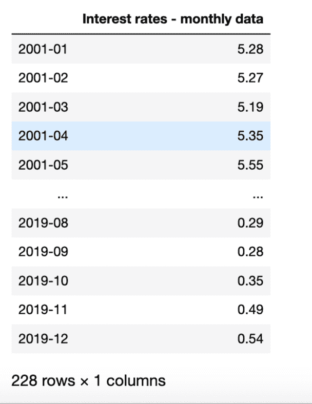
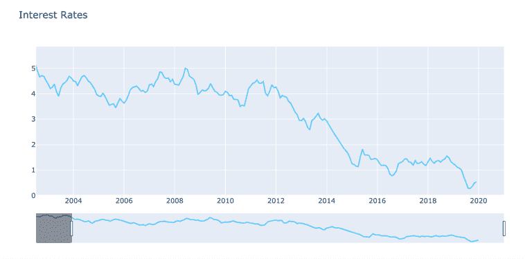
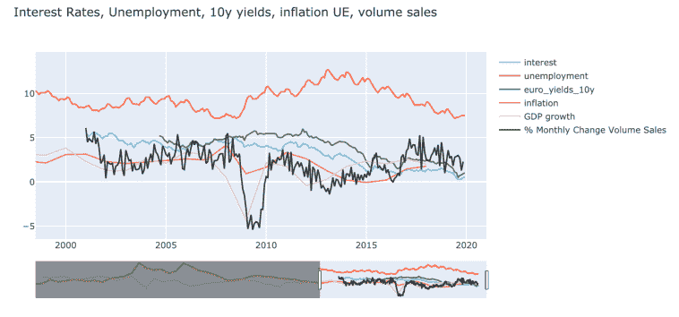

# 使用 Python 的经济指标

> 原文：<https://towardsdatascience.com/economic-indicators-with-python-befb8b35af4d?source=collection_archive---------17----------------------->

## 使用 Python 和 Plotly 检索和绘制经济指标

经济指标经常被经济学家和金融分析师用来预测经济周期。在做投资决策之前，这个分析是非常重要的。

在本文中，我们将使用 Python 自动提取**经济指标数据。我们需要的只是蟒蛇和熊猫。我们将为欧盟分析数据。**


[来自 Unsplash 的保罗·费德勒的照片](https://unsplash.com/photos/q1QPK60bv1g)

# 经济指标-类别

首先，让我们从一点理论开始。我想在这篇文章中介绍三大类经济指标。**滞后**指标，**重合**指标，**超前**指标。

*   **滞后指标**是那些在新一轮经济周期开始后发生变化的指标。
*   **重合指标**确实与周期峰值同时变化
*   领先指标确实能预测变化，因为它们发生在经济周期变化之前。

这些指标有不同的衡量标准，由不同的来源发布，如 *OECD* 和 *Conference Board* 。通过查看[会议委员会](https://www.conference-board.org/data/bci/index.cfm?id=2160)的网站，我们可以很容易地找到以下三类经济指标:

在**领先指标**中，我们*发现制造业的平均周工作时间、建筑许可、股票价格和领先信贷指数*等等。

在**重合的** **指标**内，我们发现*工业生产和制造业、*贸易销售额等。

最后，在**滞后指标中，**我们发现*平均失业持续时间**商业和工业贷款*、消费者服务价格指数*和库存与销售比率*。

你可以在[会议板网站](https://www.conference-board.org/data/bci/index.cfm?id=2160)中找到这些指标的定义。

让我们用 Python 获取其中的几个来分析一下欧盟目前的经济形势。使用[数据库经济学](https://db.nomics.world/)中的免费 API 提取所有指标。

我们用 Python 检索的经济指标有:****利息、GDP 增长、失业率******零售贸易变化和 10 年期欧元收益率曲线*** 。好了，我们转到编码部分！*

# *检索经济指标的 Python 脚本*

*首先是导入我们将使用的所有必需的库。即*熊猫*、 *Json* 、*请求*和*剧情*。*

*我们将使用 *Json* 和*请求*从 API 中检索数据。然后，我们将使用*熊猫*来处理数据。最后， *Plotly* 创建我们的图形。*

```
*import pandas as pd 
import requests 
import json 
import plotly.graph_objects as go*
```

*一旦我们导入了所有需要的库，我们就可以开始检索经济指标了。因为我们将提取多个指标，所以我们将构建一个可以重用的函数来提取所有指标。我将这个函数命名为 *checkindicator* :*

```
*def checkindicator(url):
    r= requests.get(url)
    r = r.json()
    periods = r['series']['docs'][0]['period']
    values = r['series']['docs'][0]['value']
    dataset = r['series']['docs'][0]['dataset_name'] indicators = pd.DataFrame(values,index=periods)
    indicators.columns = [dataset]
    return indicators*
```

*我们的函数向将返回经济数据的 API url 发出请求。url 提取自[数据库经济学](https://db.nomics.world/)。简单地说，我们进入 DBnomics 网站，搜索指标，选择它并复制 API 链接。*

*然后，我们传递 API 链接作为我们的 *checkindicator* 函数的一个参数，如下所示，以获取欧盟的选定指标。在我们的第一个例子中，我们将提取*利率*。*

*因为我们的 API 响应返回一个大的 json 对象，所以我们解析它以提取句点和值，如上面的代码所示。然后，我们创建一个包含日期和利率值的 Pandas 数据框架。*

```
*interest = checkindicator('https://api.db.nomics.world/v22/series/Eurostat/ei_mfir_m/M.NSA.NAP.MF-LTGBY-RT.EU28?observations=1')*
```

*运行代码后，我们的*清单*函数将返回一个包含每月利息信息的熊猫数据帧。如下图所示:*

**

*现在，我们准备提取所有其他指标。我们将以熊猫数据帧的形式将它们存储在变量中。既然我们已经提取了经济指标，我们可以将它们绘制在一起。*

```
*euro_yields_10y = checkindicator('[https://api.db.nomics.world/v22/series/Eurostat/irt_euryld_m/M.EA.INS_FWD.CGB_EA.Y10?observations=1'](https://api.db.nomics.world/v22/series/Eurostat/irt_euryld_m/M.EA.INS_FWD.CGB_EA.Y10?observations=1'))unemployment = checkindicator('[https://api.db.nomics.world/v22/series/Eurostat/une_rt_m/M.NSA.TOTAL.PC_ACT.T.EA19?observations=1'](https://api.db.nomics.world/v22/series/Eurostat/une_rt_m/M.NSA.TOTAL.PC_ACT.T.EA19?observations=1'))interest = checkindicator('[https://api.db.nomics.world/v22/series/Eurostat/ei_mfir_m/M.NSA.NAP.MF-LTGBY-RT.EU28?observations=1'](https://api.db.nomics.world/v22/series/Eurostat/ei_mfir_m/M.NSA.NAP.MF-LTGBY-RT.EU28?observations=1'))inflation = checkindicator('[https://api.db.nomics.world/v22/series/WB/WDI/FP.CPI.TOTL.ZG-EU?observations=1'](https://api.db.nomics.world/v22/series/WB/WDI/FP.CPI.TOTL.ZG-EU?observations=1'))GDPgrowth = checkindicator('[https://api.db.nomics.world/v22/series/WB/WDI/NY.GDP.MKTP.KD.ZG-EU?observations=1'](https://api.db.nomics.world/v22/series/WB/WDI/NY.GDP.MKTP.KD.ZG-EU?observations=1'))monthly_change_retail_trade = checkindicator('[https://api.db.nomics.world/v22/series/Eurostat/sts_trtu_m/M.TOVT.G47.CA.PCH_SM.EA19?observations=1'](https://api.db.nomics.world/v22/series/Eurostat/sts_trtu_m/M.TOVT.G47.CA.PCH_SM.EA19?observations=1'))*
```

# *用 Python 绘制经济指标*

*为了用 Python 绘制我们的经济指标，我们将使用一个名为 [Plotly](https://plot.ly/python/) 的库。*

*首先，我们需要导入它。接下来，我们需要创建一个 ***图*** 对象，我们将在其中添加痕迹。在我们的例子中，一个 ***迹线*** 将代表一个经济指标。因此，我们将拥有尽可能多的想要包含在图表中的指标。*

*为了简单起见，现在让我们只画出*利率* *利率*。在我们的 ***add_trace*** 对象中，我们指定 ***x*** 作为我们的 DataFrame 的索引(即索引代表日期)。而 **y** 将代表我们的值(即与每个日期相关的利率)。*

*然后，我们使用**fig*updated _ layout***来使图形看起来更好看，并包含一个*日期滑块*和一个*标题*:*

```
*import plotly.graph_objects as gofig = go.Figure()
fig.add_trace(go.Scatter(
                x=interest.index,
                y=interest['Interest rates - monthly data'],
                name="interest",
                line_color='deepskyblue',
                opacity=0.8))fig.update_layout(xaxis_range=['2003-07-01','2020-12-31'],
                  title_text="Interest Rates, Unemployment, 10y    yields, inflation UE, volume sales",xaxis_rangeslider_visible=True)fig.show()*
```

*如果我们现在运行我们的代码，我们将得到下图，其中包含欧盟超过 15 年的 ***利率***:*

**

*用 Python 和 Plotly 实现经济指标*

*到目前为止一切顺利。现在让我们加上所有其他经济指标，如失业率、GDP 增长等。到我们的 Python 图。*

*我们可以简单地通过添加新的轨迹来实现。见下面的代码，以绘制我们所有的宏观经济指标在一起。如上所述，每个轨迹代表不同指示器。我们为每个轨迹更改了*名称*和 l *线条颜色*:*

```
*fig = go.Figure()fig.add_trace(go.Scatter(
                x=interest.index,
                y=interest['Interest rates - monthly data'],
                name="interest",
                line_color='deepskyblue',
                opacity=0.8))
fig.add_trace(go.Scatter(
                x=unemployment.index,
                y=unemployment['Unemployment by sex and age - monthly average'],
                name="unemployment",
                line_color='red',
                opacity=0.8))
fig.add_trace(go.Scatter(
                x=euro_yields_10y.index,
                y=euro_yields_10y['Euro yield curves - monthly data'],
                name="euro_yields_10y",
                line_color='green',
                opacity=0.8))
fig.add_trace(go.Scatter(
                x=inflation.index,
                y=inflation['World Development Indicators'],
                name="inflation",
                line_color='orange',
                opacity=0.8))fig.add_trace(go.Scatter(
                x=GDPgrowth.index,
                y=GDPgrowth['World Development Indicators'],
                name="GDP growth",
                line_color='pink',
                opacity=0.8))fig.add_trace(go.Scatter(
                x=monthly_change_retail_trade.index,
                y=monthly_change_retail_trade['Turnover and volume of sales in wholesale and retail trade - monthly data'],
                name="% Monthly Change Volume Sales",
                line_color='black',
                opacity=0.8))fig.update_layout(xaxis_range=['2003-07-01','2020-12-31'],
                  title_text="Interest Rates, Unemployment, 10y yields, inflation UE, volume sales",xaxis_rangeslider_visible=True)fig.show()*
```

**

*使用 Python 的宏观经济指标*

*不错！我们可以使用图表区域下方的滑块来动态更改图表的日期。*

# *包扎*

*我们用 Python 创建了一个检索**经济指标的脚本。然后，我们用 Plotly 将它们绘制在一起。***

*您可以根据想要分析的经济领域来更改或添加新的指标。可以对不同的国家进行类似的分析。我们已经为这个职位选择了欧元区。但是您可以通过修改 url 参数来轻松地更改它。*

*作为参考，请看下面用 Python 和 Plotly 构建一个显示**经济指标的图表的最终代码。***

*如果你理解代码有困难，我在 Youtube 上有一个视频，一步一步地讲解代码和 API:*

*面向金融的 Python-使用 Python 绘制经济指标*

```
*import pandas as pd
import requests
import json
import plotly.graph_objects as godef checkindicator(url):
    r= requests.get(url)
    r = r.json()
    periods = r['series']['docs'][0]['period']
    values = r['series']['docs'][0]['value']
    dataset = r['series']['docs'][0]['dataset_name'] indicators = pd.DataFrame(values,index=periods)    
    indicators.columns = [dataset]
    return indicators   

euro_yields_10y = checkindicator('[https://api.db.nomics.world/v22/series/Eurostat/irt_euryld_m/M.EA.INS_FWD.CGB_EA.Y10?observations=1'](https://api.db.nomics.world/v22/series/Eurostat/irt_euryld_m/M.EA.INS_FWD.CGB_EA.Y10?observations=1'))unemployment = checkindicator('[https://api.db.nomics.world/v22/series/Eurostat/une_rt_m/M.NSA.TOTAL.PC_ACT.T.EA19?observations=1'](https://api.db.nomics.world/v22/series/Eurostat/une_rt_m/M.NSA.TOTAL.PC_ACT.T.EA19?observations=1'))interest = checkindicator('[https://api.db.nomics.world/v22/series/Eurostat/ei_mfir_m/M.NSA.NAP.MF-LTGBY-RT.EU28?observations=1'](https://api.db.nomics.world/v22/series/Eurostat/ei_mfir_m/M.NSA.NAP.MF-LTGBY-RT.EU28?observations=1'))inflation = checkindicator('[https://api.db.nomics.world/v22/series/WB/WDI/FP.CPI.TOTL.ZG-EU?observations=1'](https://api.db.nomics.world/v22/series/WB/WDI/FP.CPI.TOTL.ZG-EU?observations=1'))#inflation.columnsGDPgrowth = checkindicator('[https://api.db.nomics.world/v22/series/WB/WDI/NY.GDP.MKTP.KD.ZG-EU?observations=1'](https://api.db.nomics.world/v22/series/WB/WDI/NY.GDP.MKTP.KD.ZG-EU?observations=1'))monthly_change_retail_trade = checkindicator('[https://api.db.nomics.world/v22/series/Eurostat/sts_trtu_m/M.TOVT.G47.CA.PCH_SM.EA19?observations=1'](https://api.db.nomics.world/v22/series/Eurostat/sts_trtu_m/M.TOVT.G47.CA.PCH_SM.EA19?observations=1'))monthly_change_retail_trade.columnsimport plotly.graph_objects as gofig = go.Figure()fig.add_trace(go.Scatter(
                x=interest.index,
                y=interest['Interest rates - monthly data'],
                name="interest",
                line_color='deepskyblue',
                opacity=0.8))fig.add_trace(go.Scatter(
                x=unemployment.index,
                y=unemployment['Unemployment by sex and age - monthly average'],
                name="unemployment",
                line_color='red',
                opacity=0.8))fig.add_trace(go.Scatter(
                x=euro_yields_10y.index,
                y=euro_yields_10y['Euro yield curves - monthly data'],
                name="euro_yields_10y",
                line_color='green',
                opacity=0.8))fig.add_trace(go.Scatter(
                x=inflation.index,
                y=inflation['World Development Indicators'],
                name="inflation",
                line_color='orange',
                opacity=0.8))fig.add_trace(go.Scatter(
                x=GDPgrowth.index,
                y=GDPgrowth['World Development Indicators'],
                name="GDP growth",
                line_color='pink',
                opacity=0.8))fig.add_trace(go.Scatter(
                x=monthly_change_retail_trade.index,
                y=monthly_change_retail_trade['Turnover and volume of sales in wholesale and retail trade - monthly data'],
                name="% Monthly Change Volume Sales",
                line_color='black',
                opacity=0.8))# Use date string to set xaxis range
fig.update_layout(xaxis_range=['2003-07-01','2020-12-31'],
                  title_text="Interest Rates, Unemployment, 10y yields, inflation UE, volume sales",xaxis_rangeslider_visible=True)fig.show()*
```

**原载于 2020 年 2 月 1 日 https://codingandfun.com**[*。*](https://codingandfun.com/economic-indicators-with-python/)**