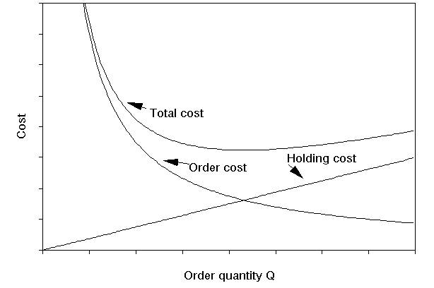
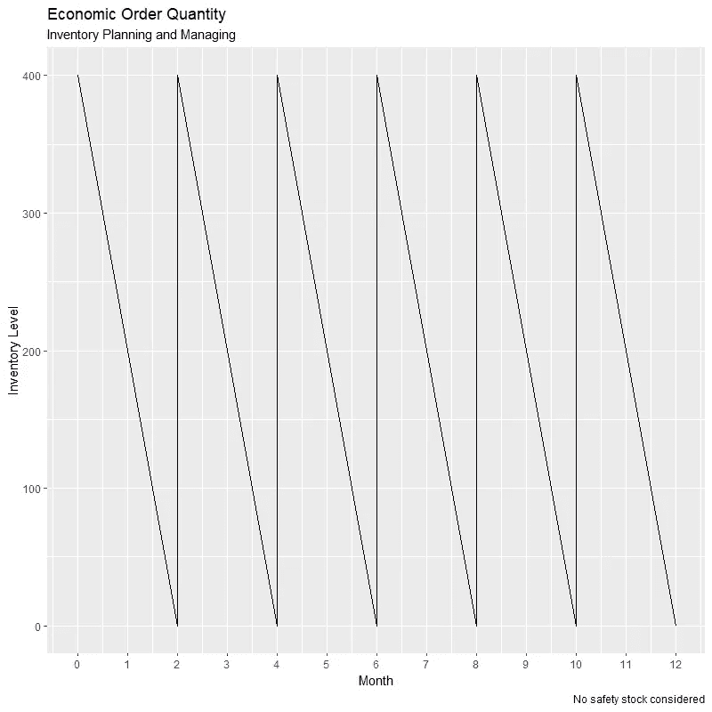
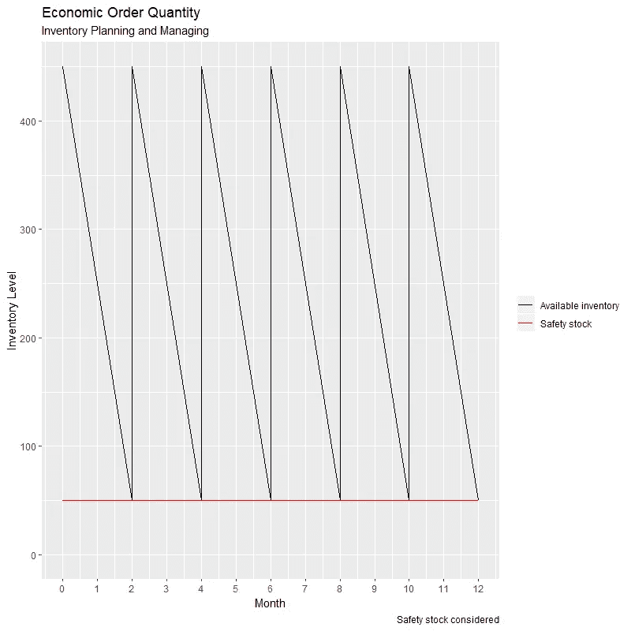

# 带 R 的经济订货批量

> 原文：<https://towardsdatascience.com/economic-order-quantity-with-r-f511bfeec400?source=collection_archive---------24----------------------->

## r 代表工业工程师

## 探索“sc perf”R 包

图片由 Tabakfabrik Linz 提供，可在 [Unsplash](https://unsplash.com/photos/nT4k2JDtwTQ)

# **经济订货量**

经济订货量( *EOQ* )是企业和组织内部的运营、供应链和物流部门使用的库存计划和管理方法。它表示每个订单要采购的最佳数量，以最小化组合订购和持有成本。它有助于确定满足给定年度需求所需的订单频率。

## **变量**

*   *Q* :最佳订货量
*   *D* :年需求量
*   *S* :订购成本(固定成本)
*   *H* :单位持有成本(可变成本)
*   *一*:持有成本(利率)
*   *C* :单位成本(变动成本)
*   *b* :单位短缺罚款成本(可变成本)*
*   *ss:* 安全库存 ***

**可能考虑也可能不考虑。*

## **假设**

*   需求率是恒定的，并且在一年中均匀分布
*   年度总需求是预先知道的(即确定性的)
*   立即下库存补充订单
*   存货的单价是不变的
*   订购成本是不变的

## **持有成本对订购成本**

持有成本对订购成本曲线

上图显示了总成本曲线的行为，它是订单成本曲线和持有成本线的函数。由于规模经济采购，订单成本曲线随着订单量的增加而下降。另一方面，持有成本线随着库存水平的增长而线性增长。订单成本曲线和持有成本线的交点代表 *EOQ* 。

## 相关概念和公式

*   **经济订货量( *Q* ):** 代表每份订单的最佳项目数量，这将导致最低的年度总成本。它的公式可以表示为:

*   **订单总数:**代表每年补货订单的数量。它的公式可以表示为:

*   **年度订货成本:**表示补货订单对应的年度成本。它的公式可以表示为:

*   **年度持有成本:**代表在仓库或存储中持有存货的年度成本。这也被认为是投资于存货(可能存在多种风险)而非其他资产的年度机会成本。它的公式可以表示为:

*   **年度总成本:**表示年度库存管理成本(即年度订货成本和年度持有成本之和)。它的公式可以表示为:

来自 R 的 [*SCperf*](https://cran.r-project.org/web/packages/SCperf/SCperf.pdf) 包包含多个用于多种库存计划和管理方法的函数。对于下面的例子，让我们分别考虑一下 *EOQ* 模型变量的这些值: *D* = 2400 个单位， *S* =每订单 10 美元， *H* =每年每单位 0.3 美元， *ss* = 0 个单位。

让我们看看 R 代码！

**结果**:

既然我们已经获得了关于供应链分析师必须如何适当地计划和管理库存的相关信息，让我们建立一个图表来跟踪库存在一年中的可用性，并确定补货时间。

不考虑安全库存的库存图

上图证实了之前获得的结果。供应链分析师必须在一年中的第 0、2、4、6、8 和 10 个月下 6 个补货订单，每个订单 400 件，因为库存正好需要 2 个月的时间才能用完。

另一方面，如果我们假设安全库存为 50 件( *ss =* 50)，库存图表将如下所示:

如上图所示，该图与原始库存图之间的唯一区别是 *y* 轴上移，对应于安全库存。每个订单的单位数量( *Q* )、需求率和订单总数分别保持不变。

# **总结思路**

在当今竞争激烈的世界中，库存规划和管理是每个组织和企业的一项关键任务，应将其作为一种竞争优势，以尽可能低的成本实现最佳生产水平。

sc perf R 包包括多个功能，这些功能只需几行代码就可以为供应链分析师提供相关信息，使他们能够适当地计划和管理库存水平。

虽然有其他库存计划和管理软件可用，但 R 代表了一个获取简单库存计划和管理任务相关信息的伟大工具。在你的个人代码库中存储一个库存计划和管理 R 代码，只需输入相应的 *EOQ* 变量的值，就可以节省你大量的时间。

*— —*

*如果你觉得这篇文章有用，欢迎在* [*GitHub*](https://github.com/rsalaza4/R-for-Industrial-Engineering/blob/master/Inventory%20Planning%20and%20Managing/Economic%20Order%20Quantity.R) *上下载我的个人代码。你也可以直接在 rsalaza4@binghamton.edu 给我发邮件，在*[*LinkedIn*](https://www.linkedin.com/in/roberto-salazar-reyna/)*上找到我。有兴趣了解工程领域的数据分析、数据科学和机器学习应用的更多信息吗？通过访问我的媒体* [*个人资料*](https://robertosalazarr.medium.com/) *来探索我以前的文章。感谢阅读。*

罗伯特