# 技术人员的经济学——需求(上)

> 原文：<https://towardsdatascience.com/economics-for-tech-people-demand-part-1-44a9eb9a576a?source=collection_archive---------35----------------------->

## *使用 R 和 ggplot2* 了解需求经济学


照片由[乔治·特罗瓦托](https://unsplash.com/@giorgiotrovato?utm_source=medium&utm_medium=referral)在 [Unsplash](https://unsplash.com?utm_source=medium&utm_medium=referral) 上拍摄

这个项目之所以存在，是因为我注意到，对于“需求”这个词在经济背景下的实际含义，尤其是在技术领域，存在着大量的误解。

谁要求东西？什么是曲线？需求曲线为什么会变化？为什么说价格的变化意味着需求的变化是错误的？需求和需求量的区别是什么？弹性到底是什么意思？怎么才能算出最大总收入？

# 介绍

在这篇文章中，我们要做的是使用 R 编程来分析和可视化我在 Excel 文件中创建的一些真实数据，探索需求中的概念。

从结构上来说，我们将使用 10 家假设的公司来分析对我们假设的新软件即服务(SaaS)应用程序的需求，该应用程序对每个许可证收取月费。这里有各种各样的公司，从小型到大型，他们愿意为多少许可证支付多少价格。

然后，我们将检查市场需求，并打破需求弹性的概念，试图找到我们最大化总收入的地方。

这是通过基于项目的工作在技术背景下解释经济学的多部分系列的第一部分。

在这项工作中，我在 Mac 电脑上使用 RStudio，带有 R Markdown (RMD)文件。

所有文件都可以从我的 GitHub 这里下载。

注意:如果您使用的是 Mac，请不要打开带有数字的文件。它会自动改变文件的编码，R 会不高兴的。如果发生这种情况，请删除该文件并下载一份新的 Excel 文件。

我还假设您可以设法在本地机器上设置一个 R 环境。最好是把你所有的文件放在一个文件夹里，无论你在哪里捣鼓按钮。

我们开始吧！

# 设置

## 导入数据

有时候用 r 导入 Excel 文件会有点棘手。

我认为使用 RStudio 最简单、最不容易混淆的方法是创建一个文件夹，用作您机器上的工作目录，然后单击“文件”选项卡，如下所示:

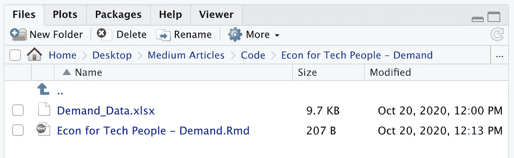

Mac 上 RStudio 中“文件”标签的屏幕截图

从那里，点击右边的三个点(…)。您可以导航到机器上数据和 R 文件所在的文件夹。

接下来，点击带有下拉菜单的“更多”按钮，然后点击“设置为工作目录”。这将有助于简化数据导入，并且是一个好习惯，因为它简化了 RStudio 中的代码和文件管理[1]。看起来是这样的:


Mac 上 RStudio 中的更多下拉菜单

完成后，继续点击“Demand_Data.xlsx”的实际文本，使用“Import Dataset…”选项将其导入，如下所示:

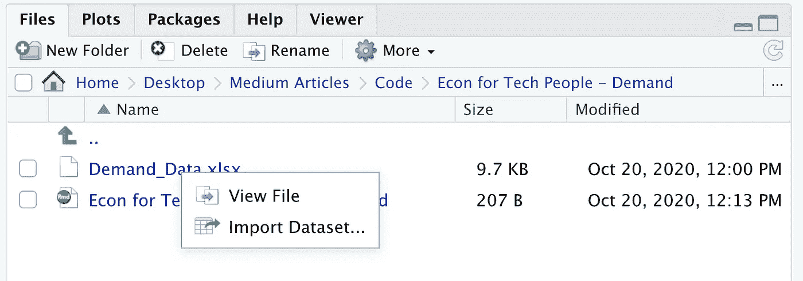

Mac 上 RStudio 中导入数据集…选项的屏幕截图

这将弹出 readxl 数据导入窗口，如下所示:


Mac 上 RStudio 中“导入 Excel 数据”窗口的屏幕截图

它应该自动工作，但仔细检查数据看起来不错。确保选中“第一行作为名称”框，以避免不必要的代码来正确地将它们放在一起。如果您想将数据集重命名为“Demand_Data”以外的名称，现在是这样做的好时机，这样可以避免不必要的代码。然而，您应该让它独自跟随这里。

完成后，让我们开始捣碎一些按钮！

# 代码

## 加载库

我们将需要这个项目的 readxl 和 tidyverse 库。如果您的 R 环境中没有安装它们，只需删除代码[1]中“ *install.packages…* ”行前的“ *#* ”符号。一旦安装了它们，您就不需要在您的机器上再次安装它们。

代码如下:

```
# If you do not have readxl or tidyverse installed, uncomment the following lines
# install.packages("readxl")
# install.packages("tidyverse")# Load Libraries
require(readxl)
require(tidyverse)
```

## 检查数据导入

让我们检查一下数据是否正常。我的代码显示了用代码而不是点击按钮来读取 Excel 文件的方法。确保您的工作目录设置在正确的位置，这样您就不必寻找整个文件路径。

我们将使用 *head()* 函数来检查前几行是否好看。

代码如下:

```
# Import data
Demand_Data <- read_excel("Demand_Data.xlsx")# Check data import
head(Demand_Data)
```

以下是输出结果:

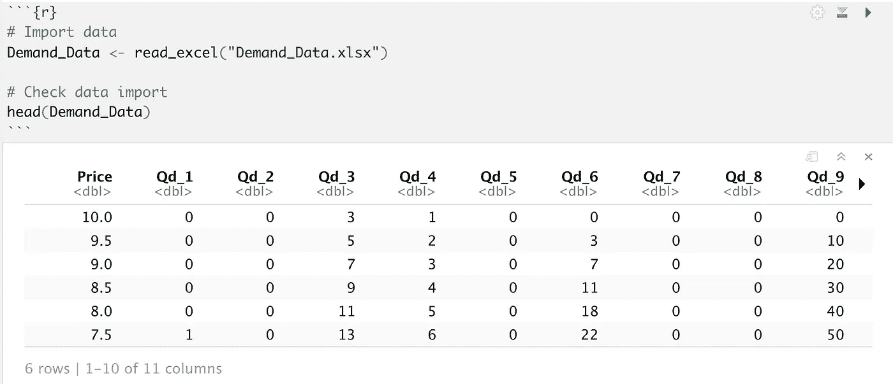

Mac 上 RStudio 中需求数据前六行的屏幕截图

## 快速测试图

当处理经济数据时，做一个快速的图表总是一个好主意，只是为了确保没有什么奇怪的事情发生。记住，需求曲线，除了极少数例外，都是向右下方发展的[2]。让我们随机选择一列数量来绘制，并确保它通过这里的气味测试。

代码如下:

```
# Test plot
plot(Demand_Data$Qd_6, Demand_Data$Price, type = "l", main = "Test Plot", xlab = "Quantity", ylab = "Price")
```

以下是输出结果:

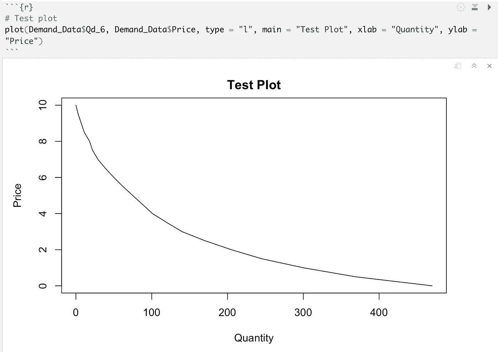

快速绘制其中一个数量列与价格的关系图，以便在 Mac 上检查 RStudio 中的数据

我知道，这不是你见过的最漂亮的图表。关键是，我们的数据通常向右下方倾斜，这正是我们想要看到的！谢谢需求定律[2]！

## 绘制所有个人需求曲线

看到一个图很好，但是同时看到我们所有的 10 条个人需求曲线会怎么样呢？我们将使用 ggplot 的魔力来实现这一点。

如果说随着时间的推移，我对 ggplot 有所了解的话，那就是整个软件包都是喜怒无常的，只以一种非常特定的方式喜欢数据。我们需要以一种与 ggplot 做事方式相适应的方式来组织我们的数据，而不是试图与系统对抗。

因此，我们将使用 *stack()* 函数来完成一项非常巧妙的工作，将我们的数据从 10 个不同列中的当前形式转换为一个更小、更适合 ggplot 的形式，其中价格和数量数据由 Qd_#标记在两个 glory 小列中。

在此过程中，我们将继续将其与价格数据合并到一个数据框中，以生成第三列，自动将正确的价格数据与正确的数量和标签数据放在一起。

最后，我们将更改由 *stack()* 函数生成的列名，使它们更适合我们的项目。

代码如下:

```
# Wrangle the data into a ggplot friendly structure
Wrangled_Data <- data.frame(Price = Demand_Data$Price, stack(Demand_Data[2:11]))
names(Wrangled_Data)[2] <- "Quantity"
names(Wrangled_Data)[3] <- "Qd_num"# Check the data
head(Wrangled_Data)
```

以下是输出结果:

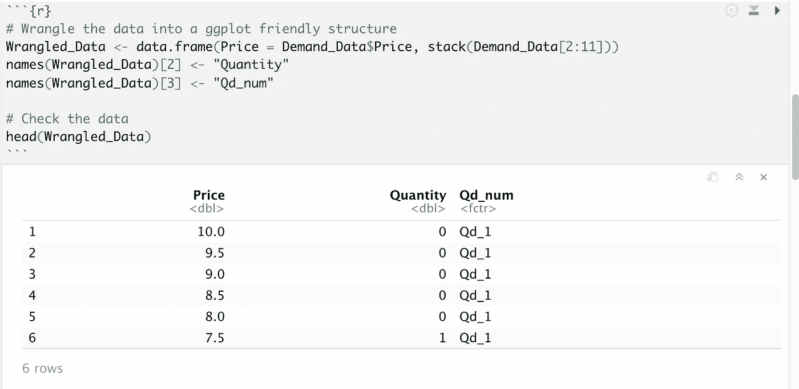

在 Mac 上的 RStudio 中，ggplot 友好结构中的前六行争论和标记的需求数据

完成后，我们可以更容易地使用带有一些样式参数的 [*facet_wrap()*](https://ggplot2.tidyverse.org/reference/facet_wrap.html) 函数来优雅地显示所有的个人需求曲线。

代码如下:

```
# Plot the individual demand curves
ggplot(data = Wrangled_Data, aes(x = Quantity, y = Price)) +
  geom_line(color = "steelblue", size = 1) +
  geom_point(color = "steelblue") +
  facet_wrap(. ~ Qd_num)
```

以下是输出结果:

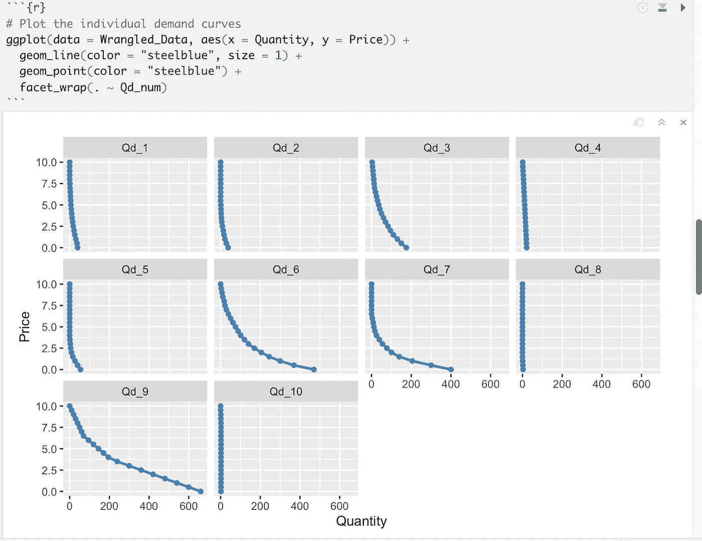

Mac 上 RStudio 数据集中所有单个需求曲线的绘图屏幕截图

这里有很多东西要打开！让我们思考一下，在销售 SaaS 许可订阅的项目中，这 10 个个人需求图对我们意味着什么。

我注意到的一个现象是，许多公司并没有真正购买超过 5-6 美元的股票。随着价格降低，大多数公司开始购买更多的许可证。有些人不管价格如何都不会真的购买很多许可证，比如公司 4、8 和 10。

其他公司如公司 6、7 和 9 购买了大量许可证，并且随着价格的下降购买了更多的许可证。

其中一个基本概念是，个体企业有个体需求[2]。一些组织只是比其他组织更看重我们的 SaaS 应用程序，降低我们的价格可能不会对他们的购买决策产生太大影响[2]。

作为每月许可证的销售者，我们需要担心市场需求。让我们看看那个。

## 市场需求

市场需求最简单的定义是，它是所有个体企业需求曲线的总和[2]。这意味着，如果我们的市场上有 10 家公司，把所有的需求量和每个价格加起来，就会得到市场需求曲线[2]。

让我们来看看如何组装它。

代码如下:

```
# Create market demand
Market_Demand <- data.frame(Price = Demand_Data$Price, Market_Demand = rowSums(Demand_Data[2:11]))# Check the data
head(Market_Demand)
```

以下是输出结果:

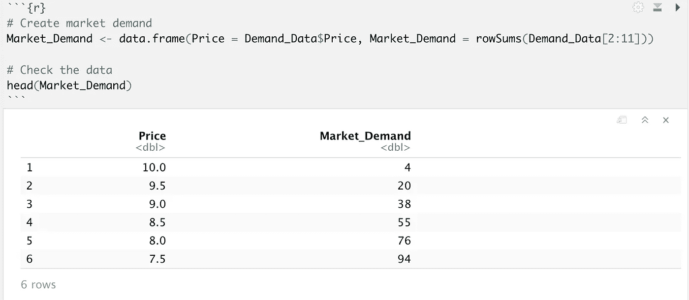

Mac 上 RStudio 的市场需求截图

## 策划市场需求

在 *ggplot()* 的一点帮助下，只需绘制出每种价格下我们的需求总量，就可以实现数据的可视化。

代码如下:

```
# Plot market demand
ggplot(data = Market_Demand, aes(x = Market_Demand, y = Price)) +
  geom_line(color = "steelblue", size = 1) +
  geom_point(color = "steelblue") +
  geom_vline(xintercept = 0) +
  geom_hline(yintercept = 0)
```

以下是输出结果:

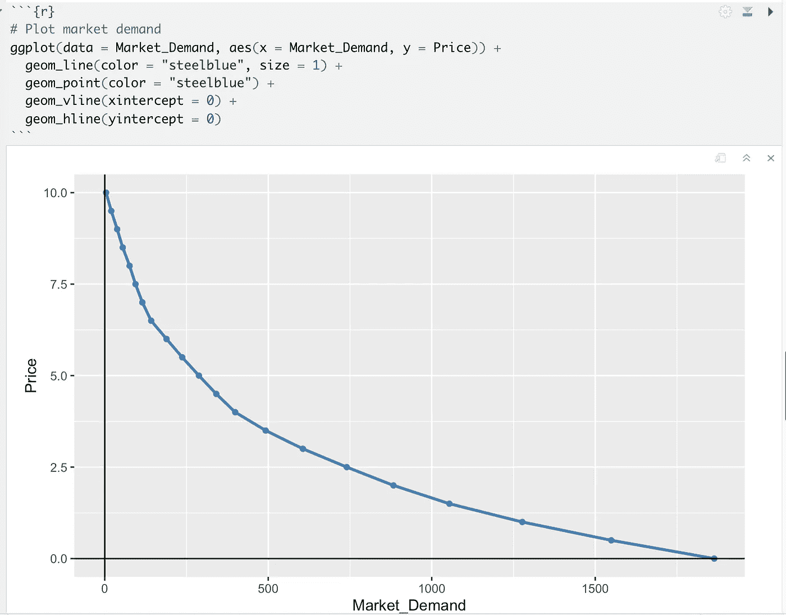

Mac 上 RStudio 的市场需求图截图

当我看到这一点时，我立即注意到，在这条市场需求曲线的某些范围内，价格的变化不会在曲线上的每一点产生市场需求数量的相同变化，因为它不是线性的[2]。

目测一下，我看到四个不同的区域有相似的斜率。接下来让我们来看看，并介绍弹性的概念。

## 弹性

需求弹性是简单地观察价格和数量的组合如何在曲线上的两点之间变化的概念。在数学上，它可以表述为数量的百分比变化除以价格的百分比变化。

简单地说，我们正在寻找两点之间的*斜率*，就像我们使用高中代数课上的经典公式 *y = mx + b* 一样，具体来说就是查看那个 *m* 值。

从我们的角度来看，商业问题是:

> 价格每改变一个单位，需求量会改变多少？

我用来说明这一点的是不同弹性区的价格范围。这可能不是世界上最正式的方式，但你真的可以看到市场需求曲线的不同区域在不同的范围内有不同的斜率。

代码如下:

```
# Add Elasticity zones
# 10-6.5 zone 1
# 6-4 zone 2
# 3.5-2 zone 3
# 1.5-0 zone 4
Market_Demand$Elasticity_Zone <- as.character(c(1,1,1,1,1,1,1,1,2,2,2,2,2,3,3,3,3,4,4,4,4))
Market_Demand
```

以下是输出结果:

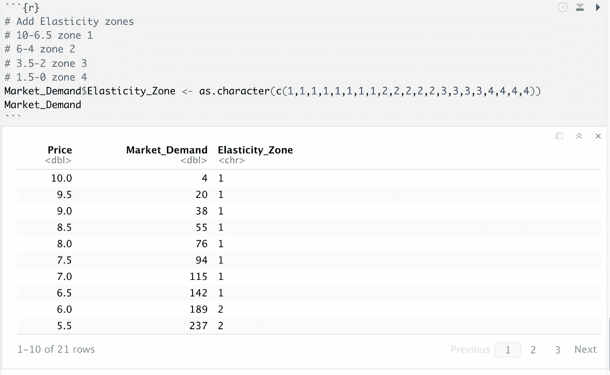

Mac 上 RStudio 中弹性区域的市场需求截图

从使用 ggplot 进行 R 编程的角度来看，将数字向量放入函数 *as.character()* 中非常重要，这样 ggplot 将自动知道这些是分类值，而不是用于数学运算的数字[1]。我们将在下一个情节中看到这一点。

## 用弹性区域划分市场需求

虽然 ggplot 有时会令人沮丧，但它确实提供了一些很棒的特性。我们将通过在 *aes()* 函数中添加 *color = Elasticity_Zone* 来增加之前的市场需求代码，以便 ggplot 知道为每个区域分配不同的颜色[1]。

我们还将添加带有 *method = "lm"* 参数的 *geom_smooth()* 函数，使其为每个弹性区域建立线性模型【1】。稍后我们将制作一些专门的模型来更深入地研究这个问题。目前，这清楚地表明，需求曲线的不同部分可以有非常不同的斜率和弹性数字。

代码如下:

```
# Plot market demand with elasticity
ggplot(data = Market_Demand, aes(x = Market_Demand, y = Price, color = Elasticity_Zone)) +
  geom_line(size = 1) +
  geom_point() +
  geom_smooth(method = "lm") +
  geom_vline(xintercept = 0) +
  geom_hline(yintercept = 0) +
  ggtitle("Market Demand with Elasticity Zones") +
  theme(plot.title = element_text(hjust = 0.5))
```

以下是输出结果:

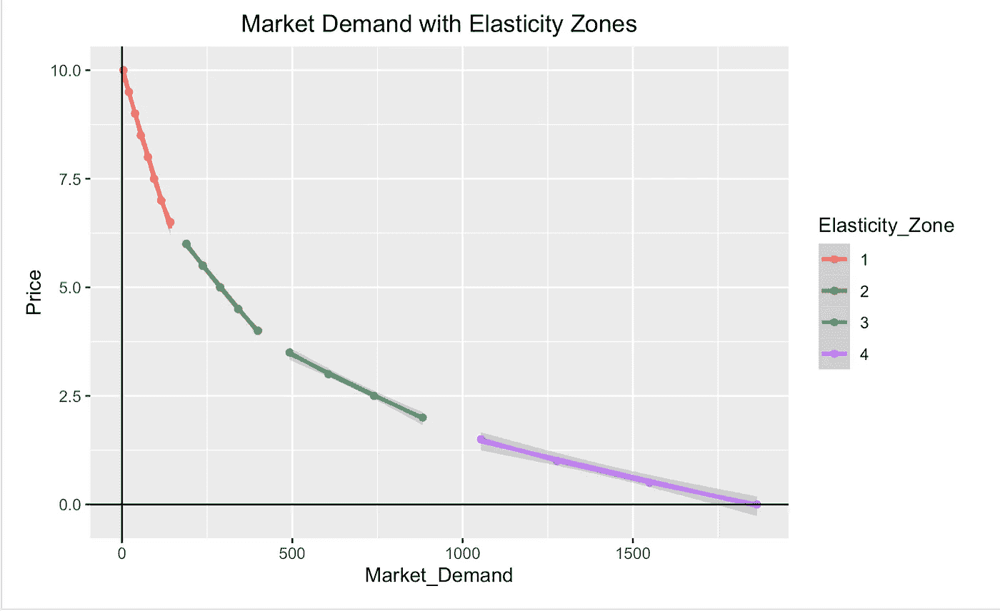

Mac 上 RStudio 中市场需求的弹性区域截图

## 更深的弹性潜水

虽然在 ggplot 中使用线性模型非常有利于可视化，但我们需要制作一些专用模型来获得精确的斜率，以便以有意义的方式比较每个部分的弹性。

为此，我们将使用 *lm()* 函数来创建线性模型。有许多方法可以做到这一点并过滤数据，但这里的目标是尽可能清晰易读。

我们将做同样的基本过程四次

代码如下:

```
### Create Linear Models #### Filter Data
Zone_1_lm_data <- Market_Demand %>%
  filter(Elasticity_Zone == 1)# Create linear model
Zone_1_lm <- lm(Market_Demand ~ Price, data = Zone_1_lm_data)# Create and print summary
summary(Zone_1_lm)
```

以下是输出结果:

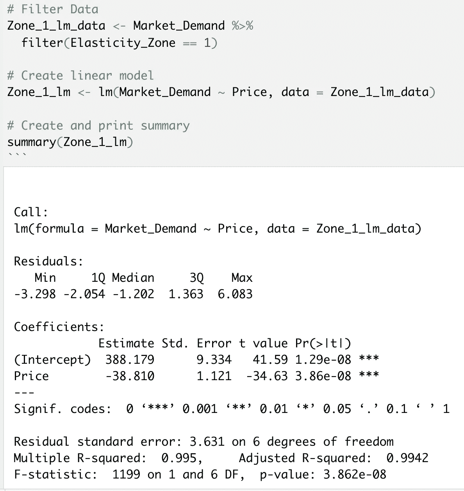

Mac 上 RStudio 中弹性区域 1 的线性模型的汇总统计屏幕截图

代码如下:

```
# Filter Data
Zone_2_lm_data <- Market_Demand %>%
  filter(Elasticity_Zone == 2)# Create linear model
Zone_2_lm <- lm(Market_Demand ~ Price, data = Zone_2_lm_data)# Create and print summary
summary(Zone_2_lm)
```

以下是输出结果:

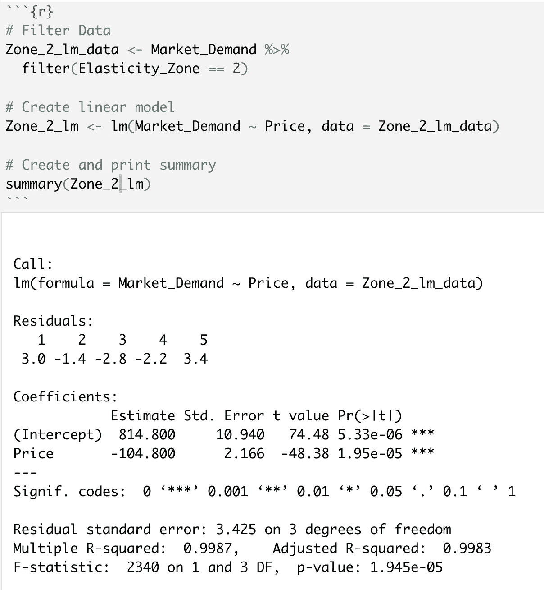

Mac 上 RStudio 中弹性区域 2 的线性模型的汇总统计屏幕截图

代码如下:

```
# Filter Data
Zone_3_lm_data <- Market_Demand %>%
  filter(Elasticity_Zone == 3)# Create linear model
Zone_3_lm <- lm(Market_Demand ~ Price, data = Zone_3_lm_data)# Create and print summary
summary(Zone_3_lm)
```

以下是输出结果:

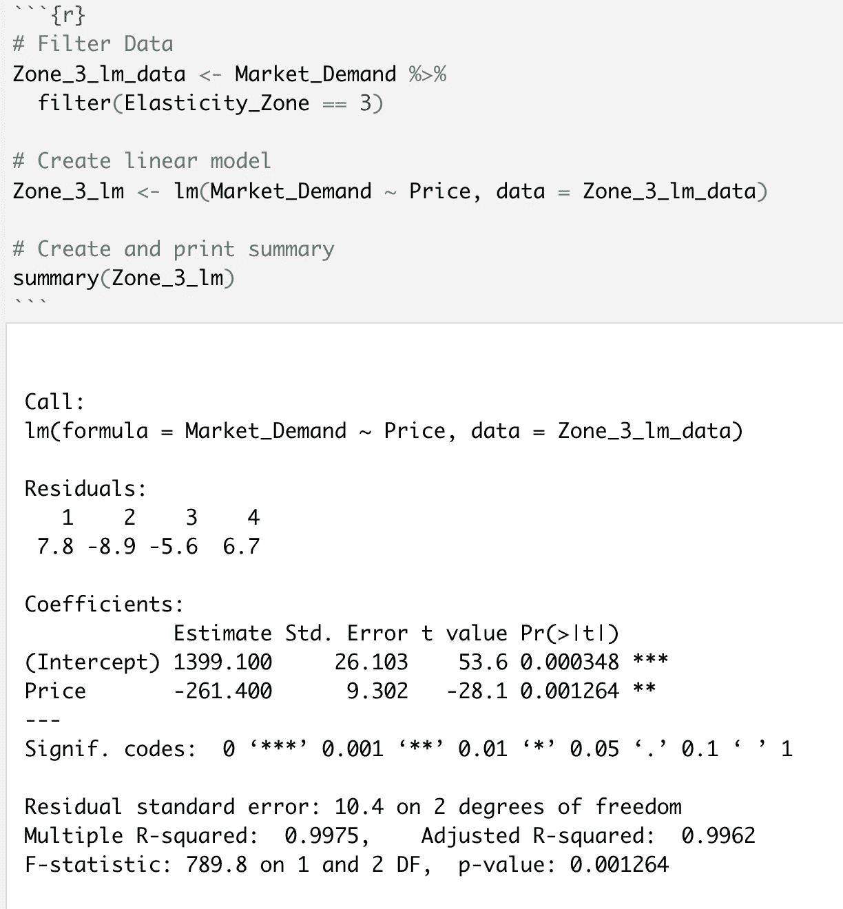

Mac 上 RStudio 中弹性区域 3 的线性模型的汇总统计屏幕截图

代码如下:

```
# Filter Data
Zone_4_lm_data <- Market_Demand %>%
  filter(Elasticity_Zone == 4)# Create linear model
Zone_4_lm <- lm(Market_Demand ~ Price, data = Zone_4_lm_data)# Create and print summary
summary(Zone_4_lm)
```

以下是输出结果:

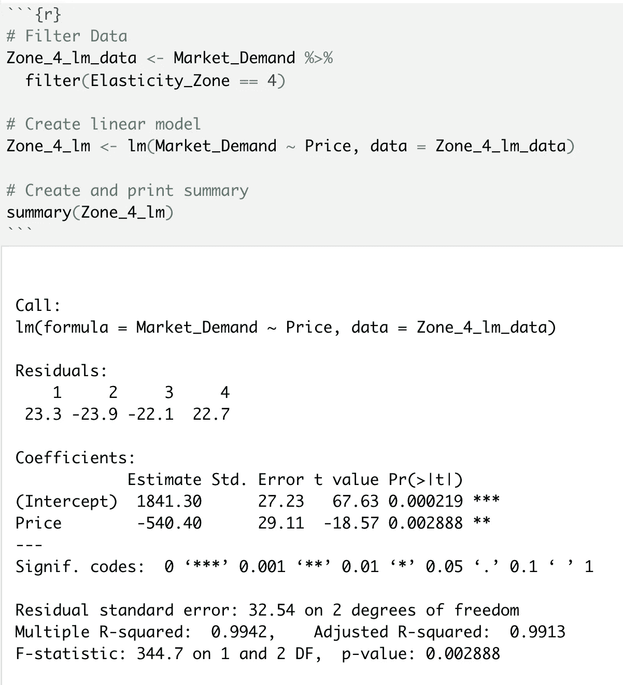

Mac 上 RStudio 中弹性区域 4 的线性模型的汇总统计屏幕截图

现在我们有了每个弹性区域的线性模型的一些详细的汇总统计数据，我们需要在项目的背景下解释这些结果。

就像任何线性模型一样，我们希望检查我们的模型是否有足够高的质量来做出可靠的解释。这意味着检查所有的 p 值是否具有统计学意义，以及 R 平方值是否尽可能接近 1[1]。

当我们查看每个模型输出的*系数*部分和*“Pr(>| t |)”*列时，我们看到价格系数在所有四个模型中都是一个小于 0.05 的数字。这意味着我们可以至少 95%确定我们的结果不是偶然的[1]。事实上，我们至少可以 99%确定价格和数量需求之间的关系不是偶然的，因为这一列中的所有 p 值都小于 0.01 [1]。

取决于你问的是谁，无论是倍数还是调整后的 R 平方，0.7 或更高都是非常好的[1]。R-squared 衡量模型中自变量对因变量的解释程度[1]。在所有四种情况下，我们看到我们解释了 99%以上的因变量[1]。

考虑到这一点，我们想看看*列中的*【Price】*行的斜率值[1]。虽然从技术上来说，把价格和数量调换一下会更合适，但这样更容易理解，而且无论如何都会让我们出于商业目的回到同一个地方[3]。*

*让我们来看看 4 区的最后一个模型。你应该这样理解:*

> *价格每降低 1 个单位，需求量就会增加 540.4 个单位。*

*这符合需求法则，因为我们降低价格，就会有更多的需求。*

*一旦我们知道一切都是有意义的，并很好地解释了结果，让我们根据确凿的证据对结果进行比较。*

## *比较结果*

*最简单的方法是创建一个小表，从汇总统计数据中提取斜率系数。*

*为此，我们将制作一个带有标记列的数据框，并以表格形式查看汇总统计数据的输出。模型的*…系数[2，1]…* 部分在输出中导航，以获得汇总统计输出的第二行和第一列，即斜率值[1]。最后，为了我们的理智和一般可读性，我们将结果四舍五入到小数点后两位。*

*代码如下:*

```
*# Create table of slope coefficients for each zone
slopes <- data.frame(Zone_1_slope = round(summary(Zone_1_lm)$coefficients[2,1], 2),
                     Zone_2_slope = round(summary(Zone_2_lm)$coefficients[2,1], 2),
                     Zone_3_slope = round(summary(Zone_3_lm)$coefficients[2,1], 2),
                     Zone_4_slope = round(summary(Zone_4_lm)$coefficients[2,1], 2))
slopes*
```

*以下是输出结果:*

*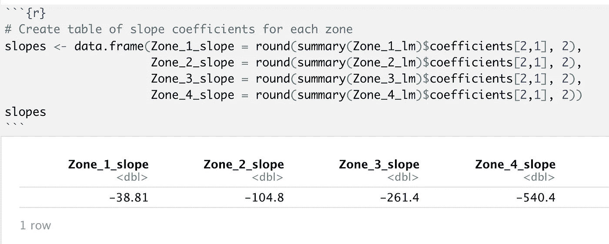*

*Mac 上 RStudio 中每个弹性区域的所有四个线性模型的斜率截屏*

*同样，是的，我知道从纯数学意义上讲，这不是一堆斜率[3]。它实际上是每单位价格变化时需求数量的变化[3]。这样更容易理解这个想法。*

## *更新市场需求图*

*现在是时候通过标注单位价格需求量的变化来快速更新之前的市场需求图了，这样就可以清楚地看到发生了什么。我们需要将一些文本和数字粘贴在一起，适当地放置文本，并使用 *abs()* 函数来获得数字的绝对值，这样它们是正数，更容易阅读。*

*代码如下:*

```
*# Plot market demand with elasticity
ggplot(data = Market_Demand, aes(x = Market_Demand, y = Price, color = Elasticity_Zone)) +
  geom_line(size = 1) +
  geom_point() +
  geom_smooth(method = "lm") +
  geom_vline(xintercept = 0) +
  geom_hline(yintercept = 0) +
  ggtitle("Market Demand with Elasticity Zones") +
  theme(plot.title = element_text(hjust = 0.5)) +
  annotate("text", label = paste("Qd change / P change:", abs(slopes$Zone_1_slope)), x = 430, y = 7, size = 3, color = "black") +
  annotate("text", label = paste("Qd change / P change:", abs(slopes$Zone_2_slope)), x = 680, y = 4.5, size = 3, color = "black") +
  annotate("text", label = paste("Qd change / P change:", abs(slopes$Zone_3_slope)), x = 1150, y = 2.5, size = 3, color = "black") +
  annotate("text", label = paste("Qd change / P change:", abs(slopes$Zone_4_slope)), x = 1600, y = 1.5, size = 3, color = "black")*
```

*以下是输出结果:*

*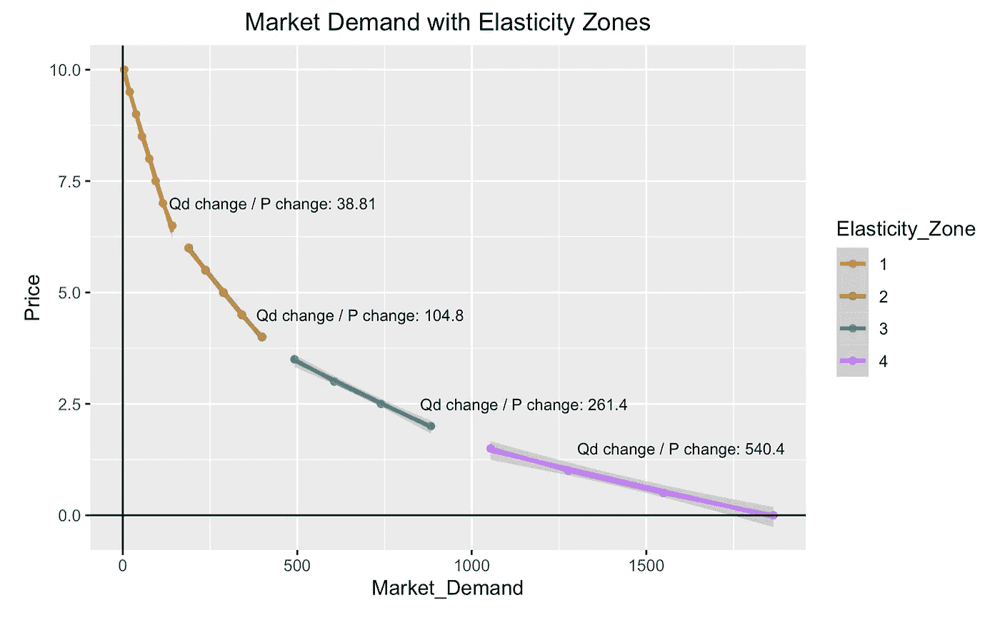*

*Mac 上 RStudio 中带有单位价格数量变化标签的市场需求图截图*

*那么这一切到底意味着什么呢？*

*价格高的时候，市场相对来说比价格低的时候更缺乏 T4 弹性。当价格从 10 美元涨到 9 美元时，我们得到的订阅需求数量的影响比从 2 美元涨到 1 美元时要小得多，因为从 2 美元涨到 1 美元时，曲线相对更有弹性。事实上，从区域 1 中的某一点到区域 2 中的某一点，所需的订阅数量相差近 14 倍。*

*我们需要问的真正问题是:*

> *这如何帮助我们找到最大化总收入的地方？*

*好问题！让我们快速了解一下。*

## *最高总收入*

*首先，我们需要为我们的市场数据创建一个列，简单地将价格乘以需求数量来获得总收入[2]。*

*代码如下:*

```
*# Maximize Total Revenue
Market_Demand$Total_Revenue = Market_Demand$Price * Market_Demand$Market_Demand# Check the data
Market_Demand*
```

*以下是输出结果:*

*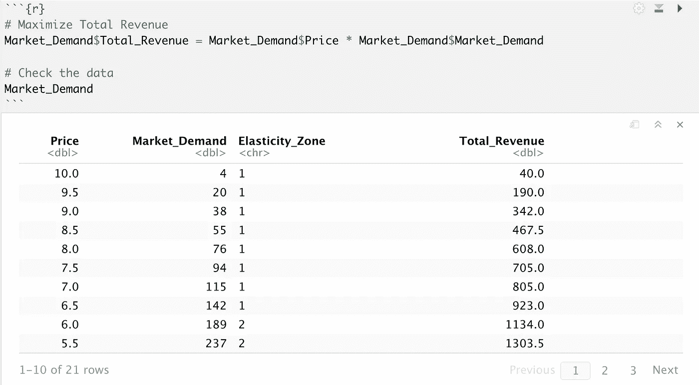*

*Mac 上 RStudio 中市场需求数据的总收入屏幕截图*

## *绘制数据*

*让我们画一张图，看看哪里的总收入最大化。*

*代码如下:*

```
*# Plot market demand with elasticity
ggplot(data = Market_Demand, aes(x = Price, y = Total_Revenue, color = Elasticity_Zone)) +
  geom_line(size = 1) +
  geom_point() +
  geom_vline(xintercept = 0) +
  geom_hline(yintercept = 0) +
  ggtitle("Total Revenue Curve for Market Demand with Elasticity Zones") +
  theme(plot.title = element_text(hjust = 0.5))*
```

*以下是输出结果:*

*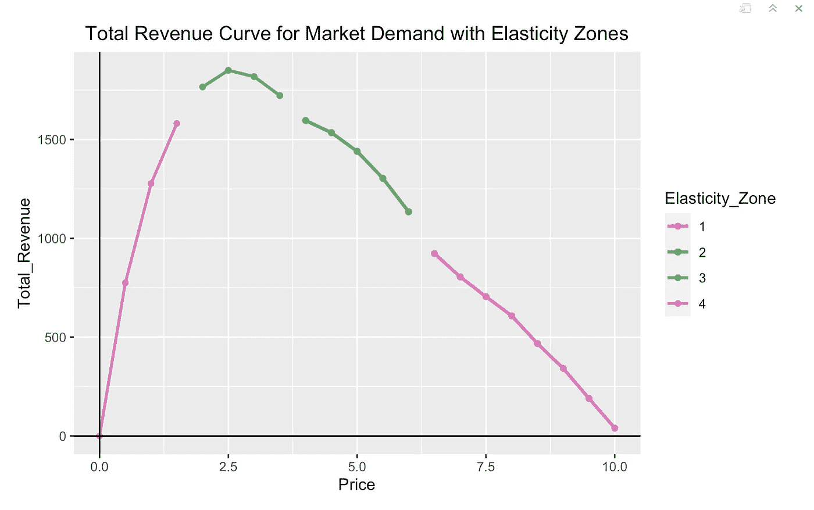*

*Mac 上 RStudio 中市场数据的总收入曲线截图*

*查看图表，我们可以看到，在给定市场需求数据的情况下，2.50 美元的价格是总收入最高的价格，这是第三个弹性区域。这意味着，当我们把价格从免费提高到 2 美元时，我们的收入也在不断增加。我们以 2.50 美元的价格最大化总收入，总收入为 1，850 美元[2]。随着我们继续将价格从 3 美元提高到 3 美元以上，我们的收入实际上减少了！*

# *结论*

*这个故事的结果是，了解市场是有好处的。我们开始为我们的 SaaS 订阅收集市场上个别公司的数据。在每个价格下他们愿意买什么？然后我们将这些数据整合到市场数据中。有趣的是发现需求曲线并不总是直线。在曲线的不同范围内，微小的价格变化会对需求量产生一系列的影响，正如我们在最后看到的，会影响总收入的最大值。*

*正如我在本文开头提到的，这是许多部分中的第一部分，以一种易于理解的方式专门为技术人员解释经济概念。*

*我希望你喜欢这篇文章。请让我知道你对未来工作的任何反馈或建议！*

# *参考*

*[1] R. Kabacoff， *R 在行动(第二版。)* (2015)，纽约州谢尔特岛:曼宁出版公司。*

*[2] F .米什金，*《货币经济学》，银行业，&《金融市场》(第 9 版。)* (2010)，马萨诸塞州波士顿:培生教育有限公司。*

*[3] P .阿加瓦尔，*需求的价格弹性(PED)，*[https://www . intelligent economist . com/Price-elastic-of-Demand/](https://www.intelligenteconomist.com/price-elasticity-of-demand/)*